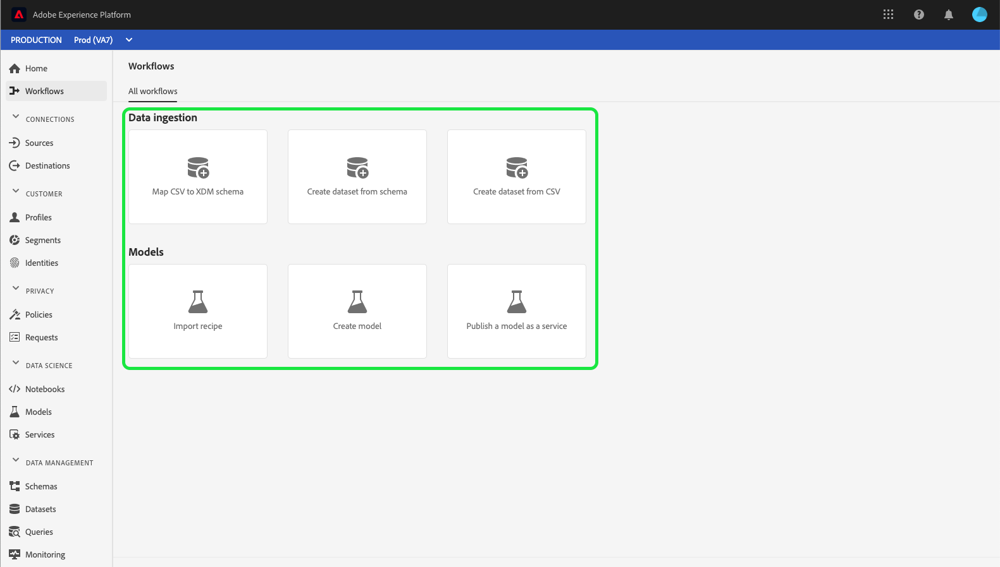

# [!UICONTROL 工作流] UI指南

此 **[!UICONTROL 工作流]** Adobe Experience Platform用户界面中的部分显示了用于在Platform中执行操作的多步骤工作流列表。 这些工作流涵盖多个领域，包括数据摄取和数据科学。

## [!UICONTROL 数据摄取]

此 **[!UICONTROL 将CSV映射到XDM架构]** 通过工作流，可上传CSV文件并将其转换为体验数据模型(XDM)架构。 有关此工作流的更多信息，请参阅上的教程 [将CSV文件映射到XDM架构](../ingestion/tutorials/map-csv/overview.md).

此 **[!UICONTROL 从架构创建数据集]** 工作流允许您从现有XDM架构创建新数据集。 有关此工作流的更多信息，请参阅 [数据集用户指南](../catalog/datasets/user-guide.md#schema).

此 **[!UICONTROL 从CSV创建数据集]** 工作流允许您通过上传CSV文件来创建新数据集。 有关此工作流的更多信息，请参阅 [数据集用户指南](../catalog/datasets/user-guide.md#csv).

## [!UICONTROL 模型]

此 **[!UICONTROL 导入方法]** 工作流允许您导入和配置配方。 有关此工作流的更多信息，请参阅上的教程 [导入包装的配方](../data-science-workspace/models-recipes/import-packaged-recipe-ui.md).

此 **[!UICONTROL 创建模型]** 工作流可让您创建机器学习模型。 有关此工作流的更多信息，请参阅 [模型训练和评估教程](../data-science-workspace/models-recipes/train-evaluate-model-ui.md).

此 **[!UICONTROL 将模型发布为服务]** 通过工作流，您可以将创建的模型作为可评分的服务发布。 有关此工作流的更多信息，请参阅上的教程 [将模型发布为服务](../data-science-workspace/models-recipes/publish-model-service-ui.md).

## 后续步骤

通过阅读本指南，您已了解 [!UICONTROL 工作流] 在Experience Platform用户界面中提供。 有关Platform UI特性和功能的更多信息，请阅读 [Adobe Experience Platform UI指南](ui-guide.md).
