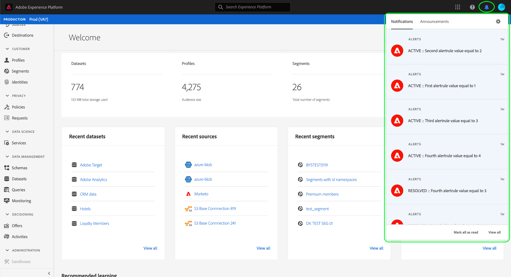

# 警报概述

>[!NOTE]
>
>由于警报在生产沙盒和开发沙盒中均受支持，因此您可以在任意沙盒中订阅警报。 重置沙盒时，也将重置所有订阅警报；删除沙盒时，将删除所有订阅警报。

Adobe Experience Platform 允许您订阅关于 Adobe Experience Platform 活动的基于事件的警报。通过警报可以减少或消除轮询 [[!DNL Observability Insights] API](../api/overview.md) 的需要，用于检查任务是否已完成，或者是否已达到工作流中的某个里程碑，或者是否发生任何错误。

当您的Experience Platform操作达到一组特定条件时（例如系统违反阈值时可能会出现问题），Experience Platform可以向您组织中订阅这些条件的任意用户发送警报消息。 这些消息可在预定义的时间间隔内重复出现，直到警报得到解决为止。

本文档概述了Adobe Experience Platform中的警报，包括有关如何定义警报规则的结构。

## 一次性警报与重复警报

Experience Platform警报可以发送一次，也可以按预定义的间隔重复发送，直到得到解决为止。 其中每个选项的用例旨在以下方面有所不同：

| 一次性警报 | 重复警报 |
| --- | --- |
| 并不一定表示存在问题。 | 指示可能不受欢迎的状态。 |
| 不重复。 | 如果异常情况持续存在，可能会重复此操作。 |
| 示例包括：<ul><li>数据摄取已成功完成。</li><li>查询执行已完成。</li><li>已删除数据。</li></ul> | 示例包括：<ul><li>摄取持续时间超过服务级别协议(SLA)。</li><li>在过去24小时内未发生每日摄取。</li><li>流处理器的错误率高于配置的阈值。</li><li>配置文件总数超过授权。</li></ul> |

{style="table-layout:auto"}

## 警报剖析

警报可以划分为以下组件：

| 组件 | 描述 |
| --- | --- |
| **指标** | 其值触发警报的可观察性[量度](../api/metrics.md#available-metrics)，例如失败的批次摄取事件数(`timeseries.ingestion.dataset.batchfailed.count`)。 |
| **条件** | 与度量相关的条件，在警报解析为true时会触发该警报，例如，计数度量超过特定数字。 此条件可以与预定义的时间窗口相关联。 |
| **窗口** | （可选）警报的条件可以限制在预定义的时间范围内。 例如，根据过去五分钟中失败的批次数量，可能会触发警报。 |
| **操作** | 触发警报时，将执行操作。 具体而言，消息通过投放渠道(如预配置的webhook或Experience Platform UI)发送给适用的收件人。 |
| **频率** | （可选）可以将警报配置为在定义的间隔内重复其操作（如果该警报的条件为true或未解析）。 |

{style="table-layout:auto"}

## 接收和管理警报

可通过两个渠道接收和管理警报：

* [Adobe I/O Events](#events)
* [EXPERIENCE PLATFORM UI](#ui)

### I/O 事件 {#events}

可以将警报发送到经过配置的网络钩子，促进有效地自动化对活动的监控。要通过webhook接收警报，您必须在Adobe Developer Console中为Experience Platform警报注册webhook 。 有关具体步骤，请参阅[订阅Adobe I/O事件通知](./subscribe.md)指南。

### EXPERIENCE PLATFORM UI {#ui}

Experience Platform UI允许您查看收到的警报和管理警报规则。 以下视频介绍了这些功能。

>[!VIDEO](https://video.tv.adobe.com/v/336218?quality=12&learn=on)

要在Experience Platform UI中使用警报，您必须通过Adobe Admin Console启用以下访问控制权限：

| 权限 | 描述 |
| --- | --- |
| 查看警报 | 用于查看已接收的警报消息。 |
| 查看警报历史记录* | 允许您通过[!UICONTROL Alerts]选项卡查看已接收警报的历史记录。 |
| 管理警报* | 允许您通过[!UICONTROL Alerts]选项卡启用和禁用警报规则。 |
| 解决警报* | 允许您通过[!UICONTROL Alerts]选项卡解决触发的警报。 |

{style="table-layout:auto"}

**要访问[!UICONTROL Alerts]选项卡，还必须同时授予您查看警报权限和其他权限之一。*

>[!NOTE]
>
>有关如何在Experience Platform中管理权限的更多信息，请参阅[访问控制文档](../../access-control/ui/overview.md)。

如果具有“查看警报”权限，则可以通过选择右上角的铃铛图标（）查看收到的警报。

>[!NOTE]
>
> 选择警报以导航到相关仪表板，了解有关触发警报原因的更多详细信息。

此外，UI中的[!UICONTROL Alerts]选项卡允许个人用户订阅特定的警报类型，并允许管理员完全启用或禁用警报规则。 有关管理警报的更多信息，请参阅[UI指南](./ui.md)。

## 后续步骤

通过阅读本文档，我们已向您介绍Experience Platform警报及其在Experience Platform生态系统中的作用。 请参阅本概述中链接的流程文档，以了解如何接收和管理警报。
