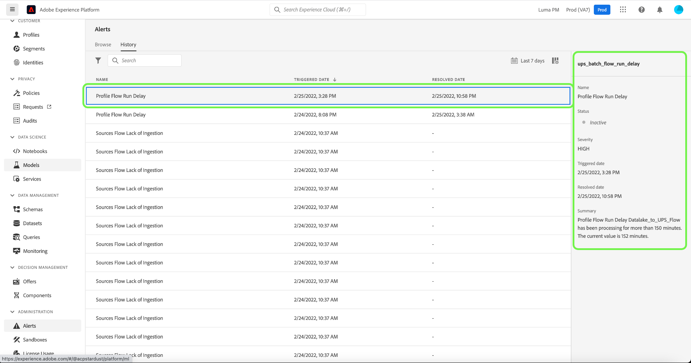

# 警报UI指南

Adobe Experience Platform用户界面允许您根据Adobe Experience Platform可观察性分析显示的指标查看已接收警报的历史记录。 用户界面还允许您查看、启用、禁用和订阅可用的警报规则。

>[!NOTE]
>
>有关Experience Platform中警报的介绍，请参阅[警报概述](./overview.md)。

若要开始，请在左侧导航中选择&#x200B;**[!UICONTROL 警报]**。

在左侧导航中突出显示[!UICONTROL 警报]的

## 管理警报规则 {#manage-rules}

**[!UICONTROL 浏览]**&#x200B;选项卡列出了可能触发警报的可用规则。

![可用警报列表显示在[!UICONTROL 浏览]选项卡中。](../images/alerts/ui/rules.png)

从列表中选择规则以在右边栏中查看其说明及其配置参数，包括阈值和严重性。

选择规则名称旁边的省略号(**...**)，下拉菜单会显示用于启用或禁用警报（取决于其当前状态）以及订阅或取消订阅警报的电子邮件通知的控件。

## 管理警报订阅者 {#manage-subscribers}

>[!NOTE]
>
> 要将警报分配给Adobe用户ID、外部电子邮件地址或电子邮件群组列表，您必须是管理员。

**[!UICONTROL 浏览]**&#x200B;选项卡列出了可能触发警报的可用规则。

![[!UICONTROL 浏览]选项卡中显示的可用警报规则列表。](../images/alerts/ui/rules.png)

选择规则名称旁边的省略号(**...**)，下拉菜单会显示控件。 选择&#x200B;**[!UICONTROL 管理警报订阅者]**。

![选择省略号以显示下拉菜单。 [!UICONTROL 管理警报订阅者]选项已突出显示。](../images/alerts/ui/manage-alert-subscribers.png)

此时会显示[!UICONTROL 管理警报订阅者]页。 要向特定用户分配通知，请输入其Adobe用户ID、外部电子邮件地址或电子邮件组列表，然后按Enter。

>[!NOTE]
>
>要同时将此通知发送给多个用户，请提供用户ID的列表或以逗号分隔的电子邮件地址。

电子邮件地址会显示在列出的当前订阅者列表中。 选择&#x200B;**[!UICONTROL 更新]**。

![管理警报订阅者页面突出显示订阅者和[!UICONTROL 更新]。](../images/alerts/ui/manage-alert-subscribers-added-email.png)

您已将用户成功添加到警报通知列表。 提交的用户现在将收到此警报的电子邮件通知，如下图所示。

## 启用电子邮件警报 {#enable-email}

警报通知可以直接发送到您的电子邮件。

选择位于右上角功能区的铃铛图标（）以显示通知和公告。 在出现的下拉菜单中，选择齿轮图标（）以访问Experience Cloud首选项页面。

显示&#x200B;**配置文件**&#x200B;页面。 选择左侧导航栏中的&#x200B;**[!UICONTROL 通知]**&#x200B;以访问电子邮件警报首选项。

![在左侧导航中突出显示[!UICONTROL 通知]的个人资料页面。](../images/alerts/ui/profile.png)

滚动到页面底部的&#x200B;**电子邮件**&#x200B;部分，然后选择&#x200B;**[!UICONTROL 即时通知]**

现在，您订阅的任何警报都将发送到连接到您的Adobe ID帐户的电子邮件地址。

## 自定义警报阈值 {#alert-threshold}

可以为以下警报类型自定义警报阈值：

| 提醒类型 | 自定义参数 |
|---|---|
| 区段作业延迟 | 延迟阈值 |
| 区段导出延迟 | 延迟阈值 |
| 目标流运行延迟 | 延迟阈值 |
| 身份标识服务流量运行延迟 | 延迟阈值 |
| 轮廓流量运行延迟 | 延迟阈值 |
| 源流量运行延迟 | 延迟阈值 |
| 查询运行延迟 | 延迟阈值 |
| 激活跳过率超出范围 | 错误阈值 |
| 源引入错误率超出范围 | 错误阈值 |

选择规则名称旁边的省略号(**...**)，下拉菜单会显示控件。 选择&#x200B;**[!UICONTROL 编辑]**。

![选定规则的[!UICONTROL 编辑]选项已突出显示。](../images/alerts/ui/threshold-edit.png)

出现&#x200B;**[!UICONTROL 自定义警报]**&#x200B;页面。 将阈值更新为所需分钟数，然后选择&#x200B;**[!UICONTROL 确认]**。

![自定义警报页面突出显示[!UICONTROL 阈值]和[!UICONTROL 确认]选项。](../images/alerts/ui/threshold-update.png)

您返回到&#x200B;**[!UICONTROL 警报]**&#x200B;页面。 要查看警报的阈值设置，请从列表中选择规则。 您可以在右边栏中看到警报的阈值设置，包括状态和严重性等详细信息。

![突出显示的警报在右边栏中显示详细信息，并突出显示[!UICONTROL 阈值]。](../images/alerts/ui/threshold-view.png)

## 查看警报历史记录 {#alert-history}

**[!UICONTROL History]**&#x200B;选项卡显示贵组织收到警报的历史记录，包括触发警报、触发日期和解决日期（如果适用）的规则。

![在[!UICONTROL 历史记录]选项卡中显示已接收警报的列表。](../images/alerts/ui/history.png)

选择一个列出的警报，右侧边栏中会显示更多详细信息，包括触发警报的事件的简短摘要。

## 后续步骤

本文档概述了如何在Experience Platform UI中查看和管理警报。 有关服务功能的更多信息，请参阅[可观察性分析](../home.md)的概述。
