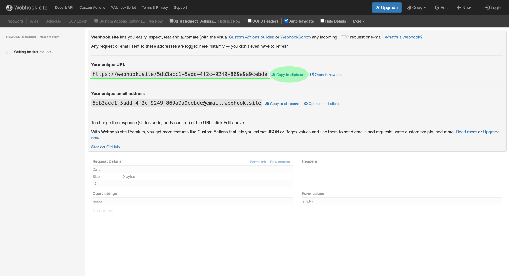
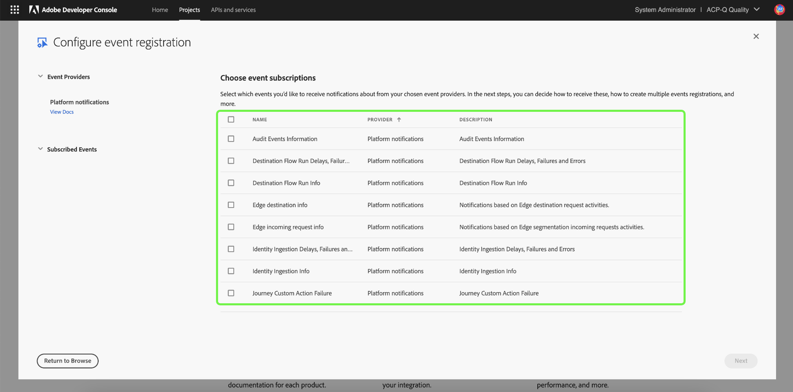
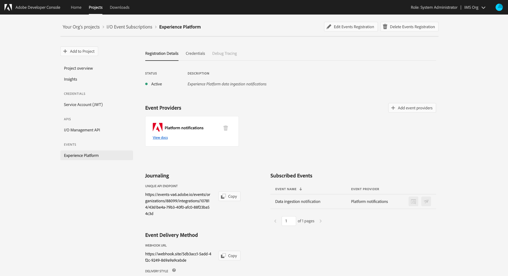

# 订阅AdobeI/O事件通知

[!DNL Observability Insights] 允许您订阅有关Adobe Experience PlatformAdobe的活动I/O事件通知。 这些事件被发送到配置的网络挂接，以促进活动监控的高效自动化。

本文档提供如何订阅Adobe Experience Platform服务的AdobeI/O事件通知的步骤。 还提供了有关可用事件类型的参考信息，以及指向进一步文档的链接，说明如何解释每个适用服务返回的事件 [!DNL Platform] 数据。

## 入门指南

此文档需要了解webhook以及如何将webhook从一个应用程序连接到另一个应用程序。 有关Webhooks的 [[!DNL I/O Events] 介绍](https://www.adobe.io/apis/experienceplatform/events/docs.html#!adobedocs/adobeio-events/master/intro/webhook_docs_intro.md) ，请参阅文档。

## 创建网络挂接

要接收通知， [!DNL I/O Event] 您必须通过指定唯一的Webhook URL来注册Webhook，作为事件注册详细信息的一部分。

您可以使用您选择的客户端配置网络挂接。 要获得用于本教程的临时Webhook地址，请 [访问Webhook](https://webhook.site/) .site并复制提供的唯一URL。

在初始验证过程中， [!DNL I/O Events] 将查询 `challenge` 请求中的GET参数发送到webhook。 必须配置Webhook以在响应有效负荷中返回此参数的值。 如果您使用的是Webhook.site，请 **[!DNL Edit]** 在右上角选择，然后在 `$request.query.challenge$` 选择 **[!DNL Response body]** 之前输入 **[!DNL Save]**。

## 在Adobe开发人员控制台中创建新项目

转到 [Adobe开发人](https://www.adobe.com/go/devs_console_ui) 员控制台并登录您的Adobe ID。 接下来，按照Adobe开发人员控制台文档中 [有关创建空项目](https://www.adobe.io/apis/experienceplatform/console/docs.html#!AdobeDocs/adobeio-console/master/projects-empty.md) 的教程中概述的步骤操作。

## 订阅事件

创建新项目后，导航到该项目的概述屏幕。 从此处，选择 **[!UICONTROL 添加事件]**。

此时会显示一个对话框，允许您向项目添加事件提供程序：

* 如果您订阅通知， [!DNL Experience Platform] 请选择“平 **[!UICONTROL 台通知”]**
* 如果您订阅的是Adobe Experience Platform [!DNL Privacy Service] 通知，请选 **[!UICONTROL 择Privacy Service事件]**

选择事件提供者后，选择“下 **[!UICONTROL 一步]**”。

下一个屏幕显示一列表事件类型进行订阅。 选择要订阅的事件，然后选择“下 **[!UICONTROL 一步]**”。

>[!NOTE]
>
>如果您不确定要订阅您所使用服务的事件，请查阅特定于服务的通知文档：
>
>* [[!DNL Privacy Service] 通知](../../privacy-service/privacy-events.md)
>* [[!DNL Data Ingestion] 通知](../../ingestion/quality/subscribe-events.md)
>* [[!DNL Flow Service (sources)] 通知](../../sources/notifications.md)

下一个屏幕会提示您创建JSON Web令牌(JWT)。 您可以选择自动生成密钥对，或上传您自己在终端中生成的公钥。

就本教程而言，将遵循第一个选项。 选中“生成键 **[!UICONTROL 对”选项框]**，然后选择 **[!UICONTROL 右下角的“]** 生成键对”按钮。

当密钥对生成时，浏览器会自动下载该密钥对。 您必须自己存储此文件，因为它不会保留在开发人员控制台中。

下一个屏幕允许您查看新生成的密钥对的详细信息。 Select **[!UICONTROL Next]** to continue.

在下一个屏幕中，在事件注册详细信息部分中提供事件注 [!UICONTROL 册的名称] 和说明。 最佳实践是创建一个唯一、易于识别的名称，以帮助区分此事件注册与同一项目中的其他客户。

在同一屏幕的下方，如 [!UICONTROL 何接收事件部分] ，您可以选择配置如何接收事件。 **[!UICONTROL Webhook]** 允许您提供自定义Webhook地址来接收事件，而 **[!UICONTROL Runtime操作]** 则允许您使用 [Adobe I/O Runtime](https://www.adobe.io/apis/experienceplatform/runtime/docs.html)。

对于本教程，选 **[!UICONTROL 择]** “Webhook”并提供您之前创建的Webhook的URL。 完成后，选择“保 **[!UICONTROL 存配置的事件]** ”以完成事件注册。

随后将显示新创建的事件注册的详细信息页面，您可以在该页面中编辑其配置、查看接收的事件、执行调试跟踪并添加新的事件提供程序。

## 后续步骤

通过遵循本教程，您注册了一个Webhook以接 [!DNL I/O Event] 收和/ [!DNL Experience Platform] 或通知 [!DNL Privacy Service]。 有关可用事件以及如何解释每个服务的通知有效负载的详细信息，请参阅以下文档：

* [[!DNL Privacy Service] 通知](../../privacy-service/privacy-events.md)
* [[!DNL Data Ingestion] 通知](../../ingestion/quality/subscribe-events.md)
* [[!DNL Flow Service (sources)] 通知](../../sources/notifications.md)

有关如何 [[!DNL Observability Insights] 监控活动](../home.md) （和）的更多信息，请参 [!DNL Experience Platform] 阅概述 [!DNL Privacy Service]。