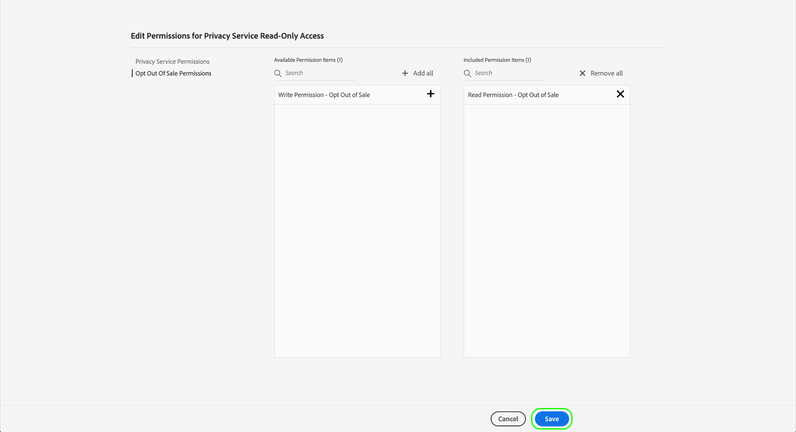

# 管理Privacy Service权限

>[!IMPORTANT]
>
>Adobe Experience Platform Privacy Service的权限已得到改进，可提高其粒度级别。 通过这些更改，组织管理员可以授予更多用户使用所需的角色和权限级别的访问权限。 技术帐户用户必须更新其Privacy Service权限，因为此即将进行的更新对他们而言是一次重大更改。 此权限更改的实施将在 **2023年3月28日**.
>
>技术帐户可供企业客户使用，并通过Adobe开发人员控制台创建。 技术帐户持有人的Adobe ID结束于 `@techacct.adobe.com`. 如果您不确定自己是否是技术帐户持有者，请联系您的组织管理员。

访问 [Adobe Experience Platform Privacy Service](./home.md) 可通过Adobe Admin Console中基于角色的细粒度权限进行控制。 通过创建产品配置文件以将权限分配给用户组，可以确定谁有权访问Privacy Service中的哪些功能 [UI](./ui/overview.md) 和 [API](./api/overview.md).

>[!NOTE]
>
>在为Privacy ServiceAPI创建集成时，必须选择现有的产品配置文件，才能确定集成具有权限的功能或操作。 请参阅 [开始使用Privacy ServiceAPI](./api/getting-started.md) 以了解更多信息。

本指南向您展示如何管理Privacy Service权限。

## 快速入门

要配置Privacy Service的访问控制，您必须拥有与Adobe Experience Platform Privacy Service产品集成的组织的管理员权限。 可授予或撤回权限的最低角色是 **产品配置文件管理员**. 其他可以管理权限的管理员角色包括 **产品管理员** （可以管理产品中的所有配置文件）和 **系统管理员** （无限制）。 请参阅 [管理角色](https://helpx.adobe.com/enterprise/using/admin-roles.html) 有关详细信息，请参阅Adobe企业管理指南。

本指南假定您熟悉产品配置文件等基本Admin Console概念，以及它们如何向个人用户和组授予产品权限。 有关更多信息，请参阅 [Admin Console用户指南](https://helpx.adobe.com/cn/enterprise/using/admin-console.html).

## 可用权限

下表概述了Privacy Service的可用权限，并介绍了授予访问权限的特定功能：

| 类别 | 权限 | 描述 |
| --- | --- | --- |
| [!UICONTROL Privacy Service权限] | [!UICONTROL 隐私读取权限] | 确定用户是否可以查看现有访问和删除请求及其详细信息。 |
| [!UICONTROL Privacy Service权限] | [!UICONTROL 隐私写入权限] | 确定用户是否可以创建新的访问和删除请求。 |
| [!UICONTROL Privacy Service权限] | [!UICONTROL “读取（访问）内容交付”权限] | 当Privacy Service处理访问请求时，将向该客户发送包含客户数据的ZIP文件。 在查找访问请求的详细信息时，此权限决定用户是否可以访问请求ZIP文件的下载链接。 |
| [!UICONTROL 选择退出销售权限] | [!UICONTROL 阅读权限 — 选择退出销售] | 确定用户是否可以查看现有的选择退出销售请求及其详细信息。 |
| [!UICONTROL 选择退出销售权限] | [!UICONTROL 写入权限 — 选择退出销售] | 确定用户是否可以创建新的选择退出销售请求。 |

{style="table-layout:auto"}

## 管理权限 {#manage}

要管理Privacy Service权限，请登录 [Admin Console](https://adminconsole.adobe.com/) 选择 **[!UICONTROL 产品]** 中。 从此处选择 **[!UICONTROL Adobe Experience Platform Privacy Service]**.

### 选择或创建产品配置文件

下一个屏幕显示贵组织下可供Privacy Service的可用产品配置文件列表。 如果不存在产品配置文件，请选择 **[!UICONTROL 新建用户档案]** 创建一个。 如果贵组织中有多个角色或用户组需要不同级别的访问权限，则应为每个角色或用户组创建单独的产品配置文件。

选择产品配置文件后，您可以使用 **[!UICONTROL 权限]** 选项卡开始 [编辑权限](#edit-permissions) ，或选择 **[!UICONTROL 用户]** 选项卡开始 [分配用户](#assign-users) 到用户档案。

### 编辑配置文件的权限 {#edit-permissions}

在 **[!UICONTROL 权限]** 选项卡，选择显示的任何权限类别以访问权限编辑视图。

编辑配置文件的权限时，可用权限会列在左列，而配置文件中包含的可用权限会列在右列。 选择列出的权限，以在任一列之间移动它们。

权限分为几类。 要在类别之间切换，请从左侧导航中选择所需的类别。

![显示 [!UICONTROL 选择退出销售] 权限部分](./images/permissions/switch-category.png)

选择 **[!UICONTROL 保存]** 权限配置完成后。

此时将重新显示产品配置文件视图，并反映添加的权限。

### 将用户分配到配置文件 {#assign-users}

要将用户分配到产品配置文件（并向他们授予配置文件的配置权限），请选择 **[!UICONTROL 用户]** 选项卡，后跟 **[!UICONTROL 添加用户]**.

有关管理产品配置文件用户的更多信息，请参阅 [Admin Console文档](https://helpx.adobe.com/enterprise/using/manage-product-profiles.html).

### 将旧版API凭据迁移到配置文件 {#migrate-tech-accounts}

>[!NOTE]
>
>此部分仅适用于在将Privacy Service权限集成到Adobe Admin Console之前创建的现有API凭据。 对于新凭据，将通过 [Adobe Developer控制台项目](https://developer.adobe.com/developer-console/docs/guides/projects/) 中。  请参阅 [将产品配置文件分配给项目](./api/getting-started.md#product-profiles) Privacy ServiceAPI快速入门指南以了解更多信息。

要将旧版API凭据迁移到产品配置文件，请选择 **[!UICONTROL API凭据]**，后跟 **[!UICONTROL 添加API凭据]**.

![[!UICONTROL 添加API凭据] 在Admin Console中进行选择，位于 [!UICONTROL API凭据] 选项卡](./images/permissions/api-credentials.png)

从列表中选择所需的开发人员控制台项目，然后选择 **[!UICONTROL 保存]** 以将其添加到产品配置文件。 使用这些项目凭据的所有API调用都将继承产品配置文件授予的粒度权限。

## 后续步骤

本指南介绍了Privacy Service的可用权限以及如何通过Admin Console管理这些权限。

有关如何在设置产品配置文件后创建新API集成的步骤，请参阅 [Privacy ServiceAPI快速入门指南](./api/getting-started.md). 有关管理其他Adobe Experience Platform功能的权限的更多信息，请参阅 [访问控制文档](../access-control/home.md).
