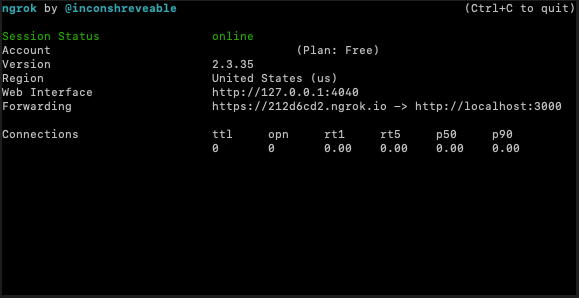
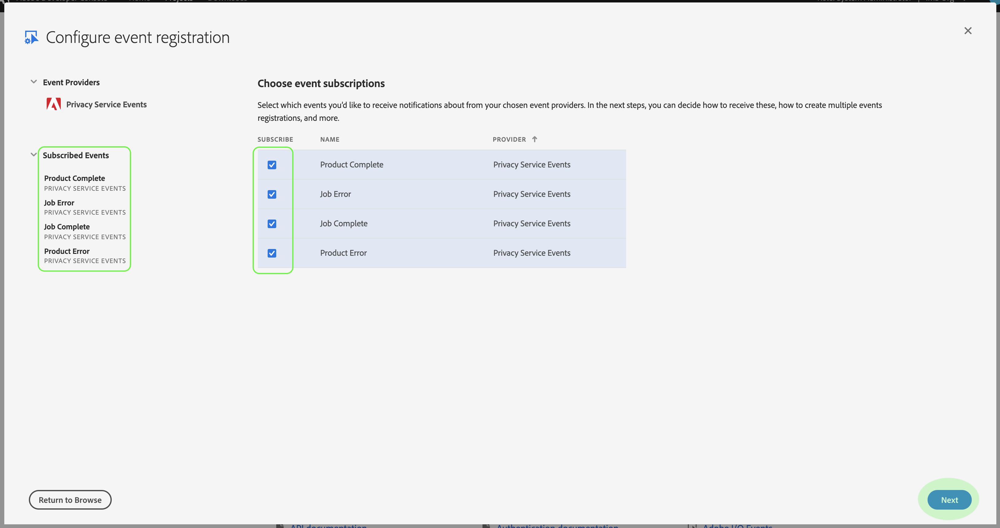
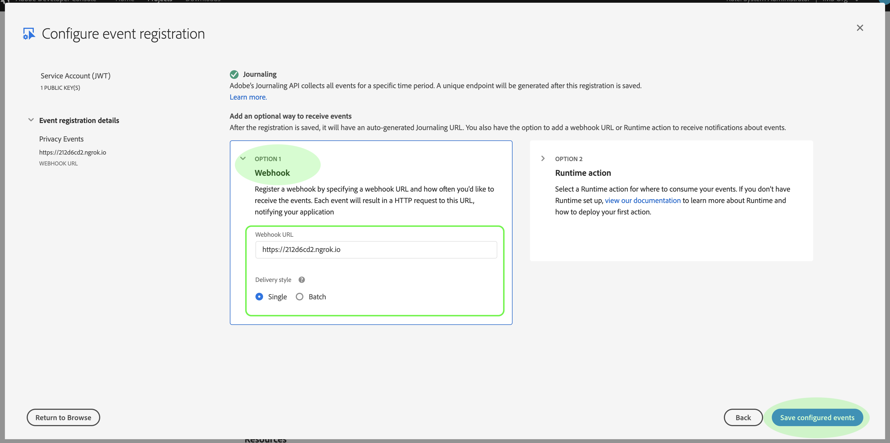

# 订阅隐私事件

隐私事件是Adobe Experience Platform Privacy Service提供的消息，利用发送到已配置网络挂接的Adobe I/O事件来促进高效的作业请求自动化。 它们减少或消除了轮询隐私服务API的需求，以便检查作业是否完成或是否已到达工作流中的特定里程碑。

当前有四种类型的通知与隐私作业请求生命周期相关：

| 类型 | 描述 |
--- | ---
| 作业完成 | 所有Experience Cloud解决方案都已报告回来，作业的整体或全局状态已标记为完成。 |
| 作业错误 | 处理请求时，一个或多个解决方案报告了错误。 |
| 产品完成 | 与此作业相关的解决方案之一已完成其工作。 |
| 产品错误 | 其中一个解决方案在处理请求时报告了错误。 |

本文档提供在Adobe I/O中设置隐私服务通知集成的步骤。 有关隐私服务及其功能的高级概述，请参阅隐 [私服务概述](home.md)。

## 入门指南

本教程使 **用** ngrok，它是一种软件产品，通过安全隧道向公共Internet公开本地服务器。 请 [在开始](https://ngrok.com/download) 本教程之前安装网络，以便继续学习并创建到本地计算机的网络挂钩。 本指南还要求您下载包含简单Node.js服务 [器的GIT存储库](https://nodejs.org/) 。

## 创建本地服务器

您的Node.js服务器必须返回 `challenge` 由请求发送到根()端点的`/`参数。 使用以下 `index.js` JavaScript设置文件以完成此操作：

```js
var express = require('express')
var app = express()

app.set('port', (process.env.PORT || 3000))
app.use(express.static(__dirname + '/public'))

app.get('/', function(request, response) {
  response.send(request.originalUrl.split('?challenge=')[1]);
})

app.listen(app.get('port'), function() {
  console.log("Node app is running at localhost:" + app.get('port'))
})
```

使用命令行，导航到Node.js服务器的根目录。 然后，键入以下命令：

1. `npm install`
1. `npm start`

这些命令安装所有依赖项并初始化服务器。 如果成功，您可以在http://localhost:3000/上找到正在运行的服务器。

## 使用ngrok创建网页挂接

打开新的命令行窗口，然后导航到之前安装代码的目录。 在此处，键入以下命令：

```shell
./ngrok http -bind-tls=true 3000
```

成功的输出如下所示：



请记住URL `Forwarding` ()`https://212d6cd2.ngrok.io`，因为这将用于识别您的网络挂钩的下一步。

## 在Adobe开发人员控制台中创建新项目

转到 [Adobe Developer Console](https://www.adobe.com/go/devs_console_ui) ，使用您的Adobe ID登录。 接下来，按照教程中概述的步 [骤操作，在Adobe](https://www.adobe.io/apis/experienceplatform/console/docs.html#!AdobeDocs/adobeio-console/master/projects-empty.md) Developer Console文档中创建空项目。

## 将隐私事件添加到项目

在控制台中创建完新项目后，单击“项 **[!UICONTROL 目概述]** ”屏 _幕上的“添_ 加事件”。


将出 _现“添加事件_ ”对话框。 选 **[!UICONTROL 择Experience Cloud]** ，以筛选可用事件类型的列表，然后选择隐 **[!UICONTROL 私服务事件，然后单击]** “下 **[!UICONTROL 一步”]**。


将显 _示配置事件_ 注册对话框。 通过选择相应的复选框，选择您要接收的事件。 您选择的事件显示在 _[!UICONTROL 左列的]_“订阅事件”下。 完成后，单击“下**[!UICONTROL &#x200B;一步&#x200B;]**”。



下一个屏幕会提示您提供公钥进行事件注册。 您可以选择自动生成密钥对，或上传您自己在终端中生成的公钥。

就本教程而言，将遵循第一个选项。 单击“Generate a key pair(生 **[!UICONTROL 成键对)”选]**&#x200B;项框，然后单击 **[!UICONTROL 右下角的“Generate keypair]** （生成键对）”按钮。


当密钥对生成时，浏览器会自动下载该密钥对。 您必须自己存储此文件，因为它不会保留在开发人员控制台中。

下一个屏幕允许您查看新生成的密钥对的详细信息。 单击&#x200B;**[!UICONTROL 下一步]**&#x200B;以继续。


在下一个屏幕中，提供事件注册的名称和说明。 最佳实践是创建一个唯一、易于识别的名称，以帮助区分此事件注册与同一项目中的其他客户。


在同一屏幕的更下方，您将获得两个用于配置如何接收事件的选项。 选 **[!UICONTROL 择]** Webhook `Forwarding` ，并提供您之前在 _[!UICONTROL Webhook URL下创建的新Webhook]_的URL。 接下来，在单击“保存配置的投放”以完成事件注册之**[!UICONTROL &#x200B;前，选择您首选的事件&#x200B;]**（单个或批处理）样式。



项目的详细信息页面将重新显示，隐私事件显示在左 _[!UICONTROL 侧导航]_的事件下。

## 视图事件数据

在您已对项目注册了隐私事件并且已处理了隐私作业后，您可以视图收到的任何有关该注册的通知。 从开发人 **[!UICONTROL 员控制]** 台的“项目”选项卡中，从列表中选择您的项目以打开“ _产品概述_ ”页。 从此处，从左 **[!UICONTROL 侧导航]** 中选择隐私事件。


此时 _会显示_ “注册详细信息”选项卡，您可以通过它视图有关注册的更多信息、编辑其配置或视图自激活Webhook后收到的实际事件。


单击“调 **[!UICONTROL 试跟踪]** ”选项卡以视图接收的列表。 单击列出的事件以视图其详细信息。


“有 _[!UICONTROL 效负荷]_”部分提供有关选定事件的详细信息，包括其事件类型(`com.adobe.platform.gdpr.productcomplete`)，如上例中所强调。

## 后续步骤

您可以重复上述步骤，根据需要为不同的Webhook地址添加新集成。