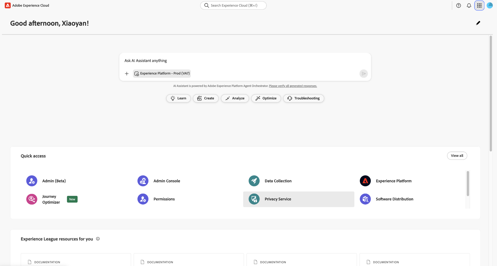

# 隐私服务UI概述

Adobe Experience Platform Privacy Service提供REST风格的API和用户界面，使您能够协调各种解决方案中的隐私和合规性请求。 本文档探讨隐私服务UI。 有关使用API的信息，请参阅隐私 [服务开发人员指南](../api/getting-started.md)。

## 登录隐私服务UI

您必须具有Adobe ID，才能验证到隐私服务UI。 此外，您必须在您的Adobe ID关联的组织内具有系统管理员权限。

导航到Adobe Experience Cloud登录页面，网址为https://experience.adobe.com。 单击 **[!UICONTROL 使用Adobe ID登录]** ，并在出现提示时输入您的Adobe ID凭据。

登录后，单击“隐 **[!UICONTROL 私UI”]**。

### 从Experience Platform登录

如果您有权访问Adobe Experience Platform UI，则还可以通过左侧导航中的请求选项卡 **[!UICONTROL 访问]** 隐私服务UI。

## 后续步骤

现在您已成功登录，请参阅用户指 [南](user-guide.md) ，了解如何使用隐私服务UI执行各种操作的步骤。