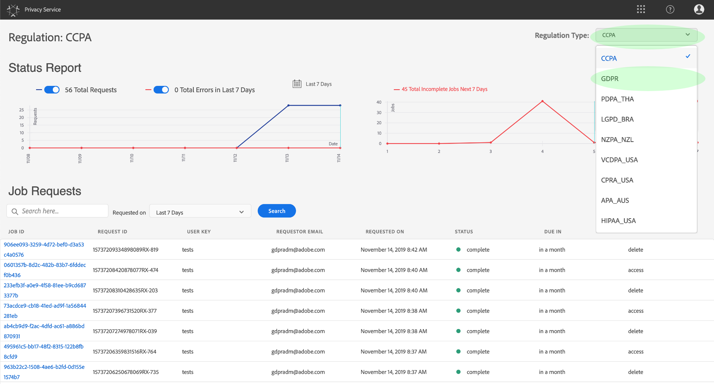
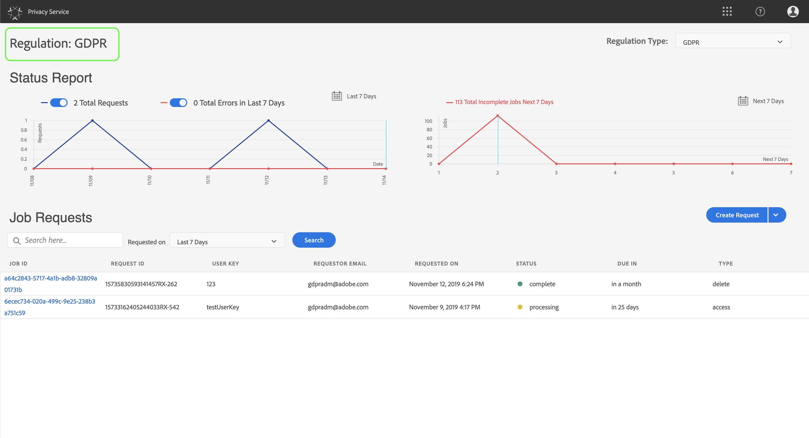
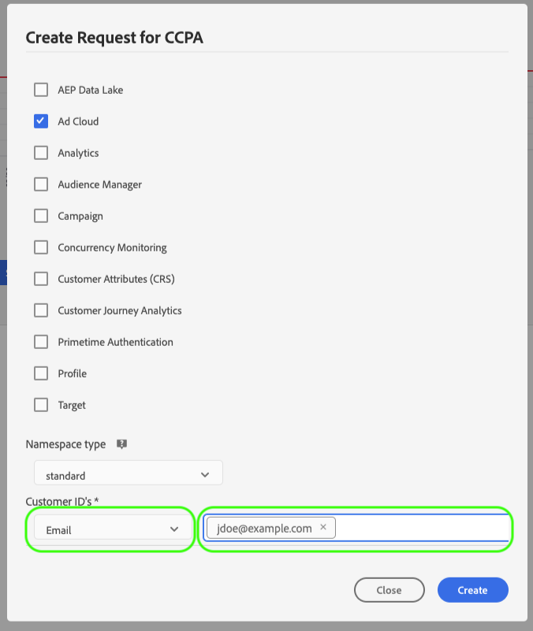
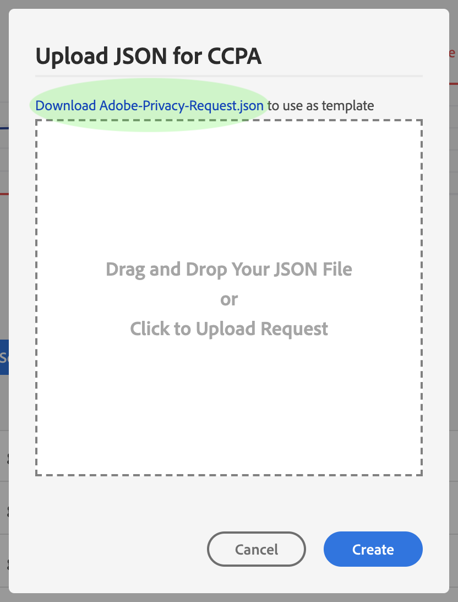

# 隐私服务用户指南

本文档提供了使用隐私服务用户界面创建和管理隐私请求的步骤。

## 浏览隐私服务UI仪表板

隐私服务UI的仪表板提供了两个构件，允许您视图隐私作业的状态：状 **态报告** 和 **作业请求**。 仪表板还显示所显示作业的当前选定规定。

### 调整类型

隐私服务支持两种法规类型的作业请求：

* 一般数据保护规定(GDPR)
* 加利福尼亚消费者隐私法(CCPA)。

将单独跟踪每种法规类型的任务。 要在调整类型之间切换，请单击“ **调整类型** ”(Regulation Type)下拉菜单，并从列表中选择所需的调整。

在更改规则类型时，仪表板会更新以显示适用于所选规则的所有操作、过滤器、构件和就业创建对话框。

### 状态报告

状态报告构件左侧的图形会针对可能报告有错误的任何作业跟踪提交的作业。 右侧的图形跟踪接近30天规范窗口结束的作业。

单击图形上方的两个切换按钮之一以显示或隐藏各自的度量。

通过将鼠标悬停在相关数据点上，可以视图与图形上任何数据点关联的确切数量的作业。

要视图有关给定数据点的更多详细信息，请单击相关数据点以在“作业请求”构件中显示相关的作业。 请注意在作业列表正上方应用的过滤器。

>[!NOTE] 将过滤器应用到“作业请求”构件后，可以通过单击过滤药片上的 **X** ，删除过滤器。 然后，作业请求将返回到默认跟踪列表。

### 作业请求

“作业请求”构件会列表组织中所有可用的作业请求，包括请求类型、当前状态、到期日期和申请人电子邮件等详细信息。

>[!NOTE] 之前创建的作业的数据仅在完成日期后30天内可访问。

您可以通过在“作业请求”标题下方的搜索栏中键入关键字来筛选列表。 列表会在您键入时自动过滤器，显示包含与搜索词匹配的值的请求。 您还可以使用“请 **求时间** ”下拉菜单为列出的作业选择时间范围。

要视图特定作业请求的详细信息，请从列表中单击该请求的作业ID以打开“作业详细信 *息* ”页。

此对话框包含有关每个Experience Cloud解决方案的状态信息，以及与整体作业相关的其当前状态。 由于每个隐私作业都是异步的，因此该页面会显示每个解决方案的最新通信日期和时间(GMT)，因为有些解决方案需要比其他解决方案更长的时间来处理请求。

如果解决方案提供了任何其他数据，则可在此对话框中查看该数据。 您可以通过单击各个产品行来视图此数据。

要以CSV文件形式下载完整的作业数据，请单 **击对话框右上角的** “导出到CSV”。

## 创建新的隐私作业请求

>[!NOTE] 要创建隐私作业请求，您必须为要访问或删除其数据的特定客户提供身份信息。 在继续本节之前，请查 [看有关隐私请求的身份数据文档](../identity-data.md) 。

隐私服务UI提供了两种创建新作业请求的方法：

* [使用Request Builder](#request-builder)
* [上传JSON文件](#json)

以下各节提供了使用这些方法的步骤。

### 使用Request Builder {#request-builder}

使用Request Builder，您可以在用户界面中手动创建新的隐私作业请求。 Request Builder最适用于更简单、更小的请求集，因为Request Builder将请求限制为每个用户只具有ID类型。 对于更复杂的请求，最好 [上传JSON文件](#json) 。

要使用Request Builder进行开始，请单 **击屏幕右侧状态报告构件下方的“创建请求** ”。

此时 *会打开创建请求* ，其中显示用于提交当前选定法规类型的隐私作业请求的可用选项。

 

从列表 **中选择请求的作业类型** （“删除”或“访问”）以及一个或多个可用 **产品** 。

 

在“ *命名空间类型*”下，为发送到隐私服务的客户ID选择适当的命名空间类型。

 

使用标准 _命名空间类型_ ，从下拉菜单（电子邮件、ECID或AAID）中选择命名空间，然后在右侧的文本框中键入ID值，按 **\&lt;enter>** ，将每个ID添加到列表中。

 

使用自定 _义命名空间类型_ ，您必须在命名空间中手动键入，然后才能提供以下ID值。

 

完成后，单击“ **创建**”。

 

该对话框将消失，新作业（或作业）会列在作业请求构件中及其当前处理状态。

### 上传JSON文件 {#json}

在创建更复杂的请求（如对每个正在处理的数据主体使用多个ID类型的请求）时，可以通过上传JSON文件来创建请求。

单击屏幕右侧 **的状态报告构件**，下方的“创建请求”旁边的箭头。 从显示的选项列表中，选择“上 **传JSON**”。

此时 *将显示“上传JSON* ”对话框，其中提供了一个窗口，供您将JSON文件拖放到其中。

 

如果您没有要上传的JSON文件，请单击 **Download Adobe-GDPR-Request.json** （下载Adobe-GDPR-Request.json）以下载模板，您可以根据从数据主体收集的值填充该模板。

 

在您的计算机上找到JSON文件，并将其拖入对话框窗口。 如果上传成功，则该文件名将显示在对话框中。 您可以根据需要继续添加更多JSON文件，方法是将它们拖放到对话框中。

完成后，单击“ **创建**”。 该对话框将消失，新作业（或作业）会列在“作业请求”构件中 _及其当前处理状态_ 。

### 后续步骤

通过阅读本文档，您学习了如何使用隐私服务UI创建隐私作业、视图作业的详细信息并监控其处理状态，以及在完成后下载结果。

有关如何使用隐私服务API以编程方式执行这些操作的步骤，请参阅开发 [人员指南](../api/getting-started.md)。