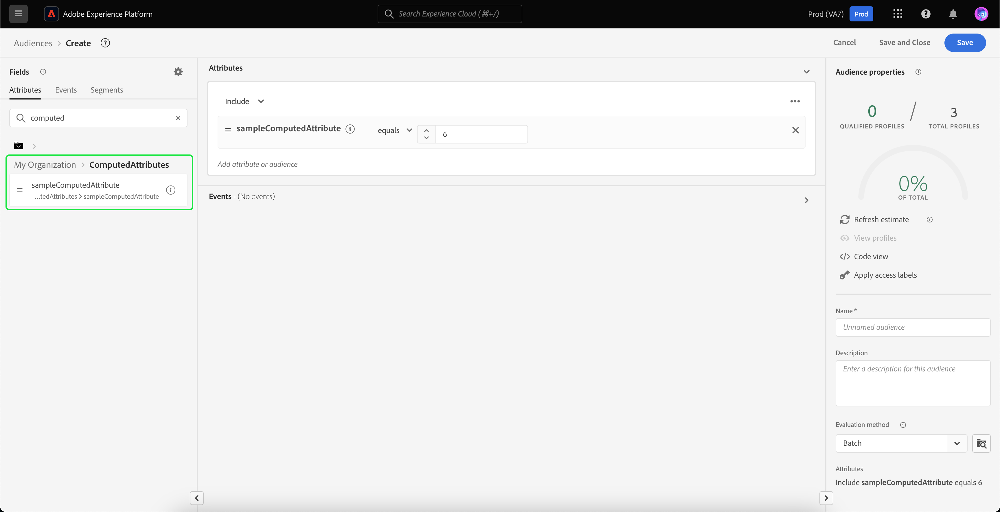

# 计算属性UI指南

>[!NOTE]
>
>要访问计算属性，您需要具有相应的权限(**查看计算属性** 和 **管理计算属性**)。 有关所需权限的更多信息，请阅读 [访问控制文档](../../access-control/home.md). 要了解如何应用这些权限，请参阅 [managing permissions指南](../../access-control/ui/permissions.md).

在Adobe Experience Platform中，“计算属性”是将事件级数据聚合到配置文件级属性的函数。 这些函数是自动计算的，以便在分段、激活和个性化中使用它们。

本文档提供了有关如何使用Adobe Experience Platform UI创建和更新计算属性的指南。

## 快速入门

本UI指南需要了解各种 [!DNL Experience Platform] 与管理有关的服务 [!DNL Real-Time Customer Profiles]. 在阅读本指南或使用UI之前，请查看以下服务的文档：

- [[!DNL Real-Time Customer Profile]](../home.md)：根据来自多个来源的汇总数据提供统一的实时使用者个人资料。
- [[!DNL Experience Data Model (XDM) System]](../../xdm/home.md)：用于实现此目标的标准化框架 [!DNL Experience Platform] 组织客户体验数据。

## 查看计算属性 {#view}

在Experience PlatformUI中，选择 **[!UICONTROL 配置文件]** 在左侧导航中，随后是 **[!UICONTROL 计算属性]** 查看可用于贵组织的计算属性的列表。 其中包括有关计算属性的名称、描述、上次评估日期和上次评估状态的信息。

![此 [!UICONTROL 个人资料] 部分和 [!UICONTROL 计算属性] 选项卡会突出显示，向用户显示如何访问计算属性浏览页面。](./images/ui/browse.png)

要选择可见的字段，您可以选择  添加或删除要显示的字段。

| 字段 | 描述 |
| ----- | ----------- |
| [!UICONTROL 名称] | 计算属性的显示名称。 |
| [!UICONTROL 描述] | 计算属性的描述。 |
| [!UICONTROL 评估方法] | 计算属性的评估方法。 此时，仅 **批次** 受支持。 |
| [!UICONTROL 上次评估时间] | 此时间戳表示上次成功的评估运行。 仅发生的事件 **早于** 在上次成功评估中会考虑此时间戳。 |
| [!UICONTROL 上次评估状态] | 说明在上次评估运行中是否成功计算计算了该计算属性的状态。 可能的值包括 **[!UICONTROL 成功]** 或 **[!UICONTROL 失败]**. |
| [!UICONTROL 刷新频率] | 指示计算属性的刷新频率。 可能的值包括每小时、每天、每周或每月。 |
| [!UICONTROL 快速刷新] | 显示是否为此计算属性启用快速刷新的值。 如果启用了快速刷新，则计算属性可以每天刷新，而不是每周、每两周或每月刷新。 此值仅适用于回溯周期大于每周的计算属性。 |
| [!UICONTROL 生命周期状态] | 计算属性的当前状态。 可能存在三种状态： <ul><li>**[!UICONTROL 草稿]：** 计算属性会 **非** 已在架构上创建字段。 在此状态下，可以编辑计算属性。 </li><li>**[!UICONTROL 已发布]：** 计算属性具有在架构上创建的字段，可以随时使用。 在此状态下，计算属性 **无法** 将被编辑。</li><li>**[!UICONTROL 不活动]：** 已禁用计算属性。 有关非活动状态的详细信息，请阅读 [常见问题页面](./faq.md#inactive-status). </li> |
| [!UICONTROL 已创建] | 显示计算属性的创建日期和时间的时间戳。 |
| [!UICONTROL 上次修改时间] | 显示上次修改计算属性的日期和时间的时间戳。 |

您还可以根据生命周期状态筛选显示的计算属性。 选择  图标。

您现在可以选择按状态([!UICONTROL 草稿]， [!UICONTROL 已发布]、和 [!UICONTROL 不活动])。

![可以筛选计算属性的选项会突出显示。 这些选项包括 [!UICONTROL 草稿]， [!UICONTROL 已发布]、和 [!UICONTROL 不活动].](./images/ui/view-filters.png)

此外，您还可以选择一个计算属性以查看有关该属性的详细信息。 有关计算属性详细信息页面的详细信息，请参阅 [查看计算属性的详细信息部分](#view-details).

## 创建计算属性 {#create}

要创建新的计算属性，请选择 **[!UICONTROL 创建计算属性]** 以输入新的计算属性工作流。

![此 [!UICONTROL 创建计算属性] 按钮突出显示，向用户展示如何访问创建计算属性页面。](./images/ui/create.png)

此 **[!UICONTROL 创建计算属性]** 页面。 在此页上，可以添加要创建的计算属性的基本信息。

| 字段 | 描述 |
| ----- | ----------- |
| [!UICONTROL 显示名称] | 计算属性的名称。 您应该为每个计算属性保持此显示名称是唯一的。 作为最佳实践，此显示名称应包含与计算属性相关的标识符。 例如，“过去7天购买鞋子的总和”。 |
| [!UICONTROL 字段名称] | 用于引用其他下游服务中的计算属性的名称。 此名称自动从显示名称派生出来，并以camelCase编写。 |
| [!UICONTROL 描述] | 您尝试创建的计算属性的描述。 |

![此 [!UICONTROL 基本信息] 的部分 [!UICONTROL 创建计算属性] 页面会突出显示。](./images/ui/basic-information.png)

添加计算属性详细信息后，您可以开始定义规则。

### 指定事件过滤条件

要创建规则，请先从 **[!UICONTROL 活动]** 部分，以筛选要聚合的事件。 目前，仅支持非数组类型的事件属性。

![此 [!UICONTROL 活动] 部分会突出显示。](./images/ui/events.png)

选择要在计算属性定义中使用的属性后，您可以选择将此值与哪个值进行比较。

### 应用聚合函数

现在，您可以将函数应用于条件输出中的字段。 首先，选择聚合函数类型。 可用选项包括 [!UICONTROL 总和]， [!UICONTROL 最小值]， [!UICONTROL Max]， [!UICONTROL 计数]、和 [!UICONTROL 最近]. 有关这些函数的更多信息，请参见 [函数部分](./overview.md#functions) ，位于计算属性概述中。

选择函数后，您可以选择要聚合的字段。 要选择的合格字段取决于所选的函数。

### 回顾持续时间

应用聚合函数后，您需要定义计算属性的回看周期。 此回顾时间范围指定聚合事件的时间长度。 此回顾持续时间可以通过小时、天、周或月来指定。

### 快速刷新 {#fast-refresh}

>[!CONTEXTUALHELP]
>id="platform_profile_computedAttributes_fastRefresh"
>title="快速刷新"
>abstract="快速刷新功能可以帮助您的属性保持最新。启用此选项可以让您每天刷新计算的属性，即使是更长的回顾期也是如此，以便您对用户活动做出快速反应。此值仅适用于回溯周期大于每周的计算属性。"

在应用聚合函数时，如果回看周期大于一周，则可以启用快速刷新。

![此 [!UICONTROL 快速刷新] 复选框会突出显示。](./images/ui/enable-fast-refresh.png)

快速刷新功能可以帮助您的属性保持最新。启用此选项可以让您每天刷新计算的属性，即使是更长的回顾期也是如此，以便您对用户活动做出快速反应。

有关快速刷新的详细信息，请阅读 [快速刷新部分](./overview.md#fast-refresh) ，位于计算属性概述中。

完成这些步骤后，您现在可以选择将此计算属性另存为草稿或立即发布。

![此 [!UICONTROL 另存为草稿] 和 [!UICONTROL Publish] 按钮会高亮显示。](./images/ui/draft-or-publish.png)

## 查看计算属性的详细信息 {#view-details}

要查看计算属性的详细信息，请选择要查看有关以下内容的详细信息： [!UICONTROL **浏览**] 页面。

页面的内容会有所不同，具体取决于计算属性是 **[!UICONTROL 已发布]** 或 **[!UICONTROL 草稿]**.

### 已发布的计算属性 {#published}

选择已发布的计算属性时，将显示计算属性详细信息页面。

此页显示计算属性的详细信息的摘要，以及显示值分布的图形和符合计算属性的示例配置文件。

>[!NOTE]
>
>值分布反映了采样作业时配置文件属性值的分布情况。 示例配置文件中的计算属性值反映了几个示例配置文件的最新合并配置文件值。

### 草稿计算属性 {#draft}

选择绘制计算属性时， **[!UICONTROL 编辑计算属性]** 页面。 此页面与 [!UICONTROL 创建计算属性] 页面，允许您编辑计算属性的基本信息及其定义，然后再更新草稿或发布它。

![此 [!UICONTROL 编辑计算属性] 页面。](./images/ui/edit.png)

## 使用计算属性 {#usage}

创建计算属性后，可以使用 **已发布** 计算的其他下游服务中的属性。 由于计算属性是在您的配置文件合并架构上创建的配置文件属性字段，因此您可以查找实时客户配置文件的计算属性值，在受众中使用它们，将其激活到目标，或在Adobe Journey Optimizer的历程中使用它们进行个性化。

## 后续步骤

要了解有关计算属性的更多信息，请阅读 [计算属性概述](./overview.md). 有关使用API创建和配置计算属性的信息，请参阅 [计算属性开发人员指南](./api.md).
