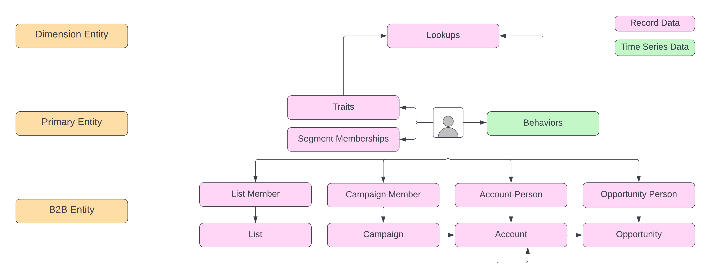

# [!DNL Real-Time Customer Profile] 概述

Adobe Experience Platform 使您能够为客户提供协调、一致且相关的体验，无论他们何时何地与您的品牌互动均是如此。使用[!DNL Real-Time Customer Profile]，您可以通过组合来自多个渠道的数据（包括在线、离线、CRM和第三方）来查看每个客户的整体视图。 [!DNL Profile]允许您将您的客户数据整合到一个统一视图中，并提供每个客户交互的带时间戳的可操作帐户。 此概述将帮助您了解[!DNL Experience Platform]中[!DNL Real-Time Customer Profile]的角色和用法。

## Experience Platform中的[!DNL Profile]

下图突出显示了Real-time Customer Profile与Experience Platform中的其他服务之间的关系：

## 了解用户档案

[!DNL Real-Time Customer Profile]合并来自各种企业系统的数据，然后以客户个人资料的形式提供对该数据的访问以及相关时间序列事件。 此功能使营销人员能够跨多个渠道与其受众推动协调、一致且相关的体验。 以下部分重点介绍您必须了解的一些核心概念，以便在Experience Platform中有效构建和维护用户档案。

### 个人资料实体组合

实时客户配置文件由一个名为&#x200B;**主实体**&#x200B;的主实体和各种支持实体组成。 在Experience Platform的上下文中，主要实体通常是&#x200B;**个人资料实体**，它由个人的特征、行为和受众成员资格组成。 其他实体允许分段引擎利用用户档案的主要实体以外的数据，并且包括以下内容：

- **维实体**：用于简化跨事件或配置文件记录共享的信息的数据建模过程的实体。 这也称为查找实体或分类实体。
- **B2B实体**：描述个人资料与企业对企业的帐户和商机关系的实体。

>[!IMPORTANT]
>
>由于维度和B2B实体仅存在于主实体之外，因此它们仅用于批量分段。

维度和B2B实体通过&#x200B;**架构关系**&#x200B;链接到主实体。 有关更多信息，请参阅以下文档：

- [为查找实体创建一对一架构关系](../xdm/tutorials/relationship-ui.md)
- [为B2B实体创建多对一架构关系](../xdm/tutorials/relationship-b2b.md)

### 配置文件数据存储

虽然[!DNL Real-Time Customer Profile]处理摄取的数据并使用Adobe Experience Platform [!DNL Identity Service]通过标识映射合并相关数据，但它在[!DNL Profile]数据存储中维护自己的数据。 [!DNL Profile]存储独立于数据湖中的目录数据以及标识图中的[!DNL Identity Service]数据。

配置文件存储使用Microsoft Azure Cosmos DB基础架构，Experience Platform数据湖使用Microsoft Azure Data Lake存储。

### 侧面护栏

Experience Platform提供了一系列护栏，帮助您避免创建Real-Time Customer Profile不支持的[Experience Data Model (XDM)架构](../xdm/home.md)。 这包括会导致性能下降的软限制，以及会导致错误和系统中断的硬限制。 有关详细信息（包括指南列表和示例用例），请阅读[个人资料护栏](guardrails.md)文档。

### 轮廓仪表板 {#profile-dashboard}

Experience Platform UI提供了一个功能板，通过该功能板可查看有关实时客户配置文件数据的重要信息，如在每日快照期间捕获的数据。 要了解如何在UI中访问和使用[!DNL Profile]仪表板，以及有关仪表板中显示的量度的详细信息，请参阅[配置文件仪表板UI指南](ui/profile-dashboard.md)。

### 配置文件片段与合并的配置文件 {#profile-fragments-vs-merged-profiles}

每个单独的客户配置文件都由多个配置文件片段组成，这些片段已合并以形成该客户的单一视图。 例如，如果客户跨多个渠道与您的品牌互动，则您的组织将在多个数据集中显示多个与该单个客户相关的配置文件片段。 将这些片段摄取到Experience Platform后，会合并在一起，以便为该客户创建一个配置文件。

换句话说，配置文件片段表示给定数据集中该ID的唯一主标识和相应的[记录](#record-data)或[事件](#time-series-events)数据。

当来自多个数据集的数据发生冲突时（例如，一个片段将客户列为“单身”，而另一个片段将客户列为“已婚”），[合并策略](#merge-policies)将确定哪些信息应优先处理并包含在个人资料中。 因此，Experience Platform中的配置文件片段总数可能始终大于合并的配置文件总数，因为每个配置文件通常由来自多个数据集的多个片段组成。

### 记录数据 {#record-data}

用户档案是主体、组织或个人的表示形式，由许多属性（也称为记录数据）组成。 例如，产品的配置文件可能包括SKU和描述，而人员的配置文件包含名字、姓氏和电子邮件地址等信息。 使用[!DNL Experience Platform]，您可以自定义配置文件以使用与您的业务相关的特定数据。 标准[!DNL Experience Data Model] (XDM)类[!DNL XDM Individual Profile]是描述客户记录数据时构建架构的首选类，它为Experience Platform服务之间的许多交互提供了不可或缺的数据。 有关在[!DNL Experience Platform]中使用架构的更多信息，请从阅读[XDM系统概述](../xdm/home.md)开始。

### 时间序列事件 {#time-series-events}

时序数据提供主体直接或间接执行操作时的系统快照，以及详细说明事件本身的数据。 时间序列数据由标准架构类XDM ExperienceEvent表示，它可以描述添加到购物车的项目、点击的链接以及查看的视频等事件。 时间序列数据可用于作为分段规则的基础，事件可在用户档案上下文中单独访问。

### 身份标识

每个企业都希望以个人化的方式与客户沟通。 但是，向客户提供相关数字体验的挑战之一是了解如何将他们的断开连接数据捆绑在一起，这通常散布在平板电脑、手机和笔记本电脑等不同的数字渠道中。 [!DNL Identity Service]允许您通过链接来自多个渠道的身份并为每个客户创建身份图，将客户的完整情况拼合在一起。 有关详细信息，请访问[Identity Service概述](../identity-service/home.md)。

### 合并策略

当从多个源将数据片段聚集在一起并进行组合以便查看每个客户的完整视图时，合并策略是[!DNL Experience Platform]用于确定数据优先顺序的规则以及用于创建客户配置文件的数据。

当多个数据集中存在冲突数据时，合并策略会确定应如何处理该数据以及应使用哪个值。 通过RESTful API或用户界面，您可以创建新的合并策略、管理现有策略以及为组织设置默认合并策略。

要了解有关合并策略及其在Experience Platform中的角色的更多信息，请从阅读[合并策略概述](merge-policies/overview.md)开始。

### 合并架构 {#profile-fragments-and-union-schemas}

[!DNL Real-Time Customer Profile]的主要功能之一是能够统一多渠道数据。 当使用[!DNL Real-Time Customer Profile]访问实体时，它可以为您提供跨数据集该实体所有配置文件片段的合并视图，称为“合并视图”，并通过所谓的合并架构实现。

要了解有关合并架构的更多信息，包括如何在UI中访问合并架构，请访问[合并架构UI指南](ui/union-schema.md)。

<!-- ### (Alpha) Computed attributes

>[!IMPORTANT]
>
>Computed attribute functionality is in alpha. The documentation and functionality are subject to change.

Computed attributes are functions used to aggregate event-level data into profile-level attributes. These functions are automatically computed so that they can be used across segmentation, activation, and personalization. These computations help you to easily answer questions related to things like lifetime purchase value, time between purchases, or number of application opens, without requiring you to manually perform complex calculations each time the information is needed. For more information on computed attributes, including understanding the role computed attributes play within Adobe Experience Platform, please begin by reading the [computed attributes overview](computed-attributes/overview.md). -->

## 轮廓和受众

Adobe Experience Platform [!DNL Segmentation Service]会生成为您的个别客户提供体验所需的受众。 创建受众后，该受众的ID将会添加到所有符合条件的用户档案的受众成员资格列表中。 区段规则是使用RESTful API和区段生成器用户界面生成并应用于[!DNL Real-Time Customer Profile]数据的。 若要了解有关分段的更多信息，请先阅读[分段服务概述](../segmentation/home.md)。

### 流式摄取和流式分段

实时输入可通过称为流式摄取的过程实现。 在摄取配置文件和时序数据时，[!DNL Real-Time Customer Profile]自动决定通过称为流式客户细分的持续过程包含或排除受众的数据，然后再将其与现有数据合并并更新合并视图。 因此，您可以即刻执行计算并做出决策，以便在客户与您的品牌互动时向客户交付增强的个性化体验。 在摄取数据时，还会对其进行验证，以确保数据被正确摄取，并符合数据集所基于的架构。 有关在摄取期间完成哪些验证的更多信息，请从阅读[数据摄取质量概述](../ingestion/quality/overview.md)开始。

## 正在将数据摄取到[!DNL Profile]

可以将[!DNL Experience Platform]配置为将记录和时序数据发送到[!DNL Profile]，支持实时流式摄取和批量摄取。 有关详细信息，请参阅概述如何[将数据添加到实时客户个人资料](tutorials/add-profile-data.md)的教程。

>[!NOTE]
>
>通过Adobe解决方案（包括[!DNL Analytics Cloud]、[!DNL Marketing Cloud]和[!DNL Advertising Cloud]）收集的数据流入[!DNL Experience Platform]并已摄取到[!DNL Profile]。

### 配置文件摄取量度

可观察性分析允许您在Adobe Experience Platform中公开关键量度。 除了[!DNL Experience Platform]各项功能的[!DNL Experience Platform]使用情况统计和绩效指标之外，还有一些与配置文件相关的特定指标，可让您深入了解传入请求率、成功摄取率、摄取记录大小等。 要了解更多信息，请先阅读[可观察性见解API概述](../observability/api/overview.md)，并查看实时客户配置文件量度的完整列表，请参阅[可用量度](../observability/api/metrics.md#available-metrics)的相关文档。

## 更新配置文件存储数据

有时候，可能需要更新您组织的配置文件存储区中的数据。 例如，您可能需要更正记录或更改属性值。 这可以通过批量摄取完成，并且需要为启用了配置文件的数据集配置更新插入标记。 有关如何为属性更新配置数据集的更多信息，请参阅[为配置文件和更新插入](../catalog/datasets/enable-upsert.md)启用数据集的教程。

## 数据治理和[!DNL Privacy]

数据管理是用于管理客户数据并确保遵守适用于数据使用的法规、限制和策略的一系列策略和技术。

由于与访问数据相关，因此数据治理在[!DNL Experience Platform]中的各个级别上扮演着关键角色：

- 数据使用标签
- 数据访问策略
- 营销活动数据的访问控制

数据管理可在多个时间点进行管理。 这些功能包括确定哪些数据被摄取到[!DNL Experience Platform]，以及在摄取后对于给定的营销操作可以访问哪些数据。 有关详细信息，请先阅读[数据管理概述](../data-governance/home.md)。

### 处理选择退出和数据隐私请求

[!DNL Experience Platform]允许您的客户发送与[!DNL Real-Time Customer Profile]中其数据的使用和存储相关的选择退出请求。 有关如何处理选择退出请求的更多信息，请参阅有关[接受选择退出请求](../segmentation/tutorials/consents.md)的文档。

## 后续步骤和其他资源

要了解有关使用Experience Platform UI或配置文件API处理实时客户配置文件数据的更多信息，请先分别阅读[配置文件UI指南](ui/user-guide.md)或[API开发人员指南](api/overview.md)。
