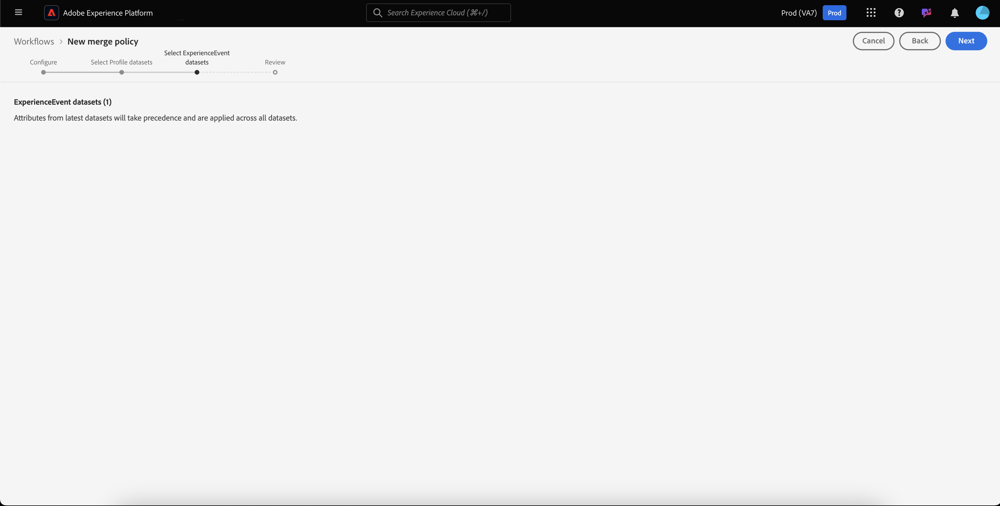

# 合并策略 UI 指南

Adobe Experience Platform允许您从多个来源将数据片段整合在一起并组合它们，以便查看每个客户的完整视图。 在汇总此数据时，合并策略是[!DNL Platform]用于确定数据优先顺序的规则以及将合并哪些数据以创建统一视图。

使用RESTful API或用户界面，您可以创建新的合并策略、管理现有策略以及为组织设置默认合并策略。 本指南提供了使用Adobe Experience Platform用户界面(UI)处理合并策略的分步说明。

要了解有关合并策略及其在Experience Platform中所扮演角色的更多信息，请先阅读[合并策略概述](overview.md)。

## 快速入门

本指南要求您实际了解几项重要的[!DNL Experience Platform]功能。 在遵循本指南之前，请查看以下服务的文档：

* [实时客户个人资料](../home.md)：根据来自多个来源的汇总数据提供统一的实时客户个人资料。
* [Adobe Experience Platform Identity Service](../../identity-service/home.md)：通过桥接从被摄取到[!DNL Platform]中的不同数据源的标识来启用Real-time Customer Profile。
* [体验数据模型(XDM)](../../xdm/home.md)： [!DNL Platform]用于组织客户体验数据的标准化框架。

## 查看合并策略 {#view-merge-policies}

在[!DNL Experience Platform] UI中，您可以通过选择左侧导航中的&#x200B;**[!UICONTROL 配置文件]**，然后选择&#x200B;**[!UICONTROL 合并策略]**&#x200B;选项卡来开始使用合并策略。 此选项卡包含贵组织的所有现有合并策略的列表，以及每个合并策略的详细信息，包括策略名称、合并策略是否为默认合并策略以及合并策略相关的架构类。

要选择显示哪些详细信息，或向显示添加其他列，请选择&#x200B;**[!UICONTROL 配置列]**，然后单击列名将其添加或从视图中删除。

## 创建合并策略 {#create-a-merge-policy}

要创建新的合并策略，请在“合并策略”选项卡上选择&#x200B;**[!UICONTROL 创建合并策略]**&#x200B;以输入新的合并策略工作流。

**[!UICONTROL 新合并策略]**&#x200B;工作流要求您通过一系列引导式步骤为新合并策略提供重要信息。 以下各节概述了这些步骤。

## [!UICONTROL 配置] {#configure}

工作流中的第一步允许您通过提供基本信息配置合并策略。 此信息包括：

* **[!UICONTROL 名称]**：合并策略的名称应该具有描述性但简洁。
* **[!UICONTROL 架构类]**：与合并策略关联的XDM架构类。 这会指定为其创建此合并策略的架构类。 组织可以为每个架构类创建多个合并策略。 当前UI中只有[!UICONTROL XDM个人资料]类可用。 您可以通过选择&#x200B;**[!UICONTROL 查看合并架构]**&#x200B;来预览架构类的合并架构。 有关详细信息，请参阅后面有关[查看合并架构](#view-union-schema)的部分。
* **[!UICONTROL ID拼接]**：此字段定义如何确定客户的相关身份。 身份拼接有两个可能的值，了解您选择的身份拼接类型将如何影响您的数据非常重要。 若要了解更多信息，请参阅[合并策略概述](overview.md)。
   * **[!UICONTROL 无]**：不执行标识拼接。
   * **[!UICONTROL 专用图]**：根据专用标识图执行标识拼接。
* **[!UICONTROL 默认合并策略]**：一个切换按钮，允许您选择此合并策略是否为贵组织的默认合并策略。 如果打开了选择器，系统会显示一条警告，要求您确认是否希望更改组织的默认合并策略。 请参阅[合并策略概述](overview.md)，了解有关默认合并策略的更多信息。
  
* **[!UICONTROL Edge上激活的合并策略]**：一个切换按钮，允许您选择此合并策略在Edge上是否处于活动状态。 要确保所有配置文件使用者在边缘上使用相同的视图，可以将合并策略标记为在边缘上处于活动状态。 为了在Edge上激活受众（标记为Edge受众），必须将其绑定到在Edge上标记为“活动”的合并策略。 如果受众未与在Edge上标记为“活动”的合并策略绑定&#x200B;****，则该受众不会在Edge上标记为“活动”，而是会标记为流式受众。 此外，组织中的每个沙盒只能具有Edge上活动的&#x200B;**一个**&#x200B;合并策略。

完成必填字段后，您可以选择&#x200B;**[!UICONTROL 下一步]**&#x200B;以继续工作流。

## [!UICONTROL 查看合并架构] {#view-union-schema}

创建或编辑合并策略时，您可以通过选择&#x200B;**[!UICONTROL 查看合并架构]**&#x200B;来查看所选架构类的合并架构。

这将打开[!UICONTROL 查看合并架构]对话框，其中显示与合并架构关联的所有参与架构、标识和关系。 您可以使用该对话框以与访问Platform UI [!UICONTROL 配置文件]部分中的[!UICONTROL 合并架构]选项卡相同的方式浏览合并架构。

有关合并架构的详细信息，包括如何在合并策略工作流中显示的[!UICONTROL 合并架构]选项卡或[!UICONTROL 查看合并架构]对话框中与其交互，请访问[合并架构UI指南](../ui/union-schema.md)。

## [!UICONTROL 选择配置文件数据集] {#select-profile-datasets}

在&#x200B;**[!UICONTROL 选择配置文件数据集]**&#x200B;屏幕上，您必须选择要用于合并策略的&#x200B;**[!UICONTROL 合并方法]**。 屏幕上还显示贵组织中与上一个屏幕上选择的架构类相关的[!UICONTROL 配置文件数据集]的总数。

根据您选择的合并方法，所有配置文件数据集都将按上次更新的顺序（对时间戳排序）合并，否则您需要选择要包含在合并策略中的配置文件数据集以及合并它们的顺序（数据集优先级）。

有关合并方法的详细信息，请参阅[合并策略概述](overview.md)。

### 已排序的时间戳 {#timestamp-ordered-profile}

选择&#x200B;**[!UICONTROL 已排序的时间戳]**&#x200B;作为合并方法，意味着最近更新数据集的属性将优先。 这适用于所有配置文件数据集。

>[!NOTE]
>
>**[!UICONTROL 配置文件数据集]**&#x200B;旁边的括号中的数字（例如，图中显示的`(37)`）显示将包含的配置文件数据集总数。

### 数据集优先级 {#dataset-precedence-profile}

选择&#x200B;**[!UICONTROL 数据集优先级]**&#x200B;作为合并方法需要您选择配置文件数据集并手动排列其优先级。 列出的每个数据集还包含上次摄取批次的状态，或显示未将批次摄取到该数据集的通知。

您可以从数据集列表中选择最多50个要包含在合并策略中的数据集。

>[!NOTE]
>
>**[!UICONTROL 配置文件数据集]**&#x200B;旁边的括号中的数字（例如，图中显示的`(37)`）显示可供选择的配置文件数据集总数。

选择数据集后，它们会被添加到&#x200B;**[!UICONTROL 选择数据集]**&#x200B;部分，允许您拖放数据集并根据所需的优先级对其进行排序。 当在列表中调整数据集时，数据集旁边的序数（1、2、3等）将更新，显示优先级（1被赋予最高优先级，然后2，然后继续）。

选择数据集也会更新&#x200B;**[!UICONTROL 合并架构]**&#x200B;部分，显示每个数据集为其贡献数据的合并架构中的字段。 有关合并架构的更多信息，包括如何与UI中的可视化进行交互，请参阅[合并架构UI指南](../ui/union-schema.md)

## [!UICONTROL 选择ExperienceEvent数据集] {#select-experienceevent-datasets}

工作流中的下一步要求您选择ExperienceEvent数据集。 此屏幕受您在[[!UICONTROL 选择配置文件数据集]](#select-profile-datasets)屏幕中选择的合并方法影响。

### 已排序的时间戳 {#timestamp-ordered-experienceevent}

如果您选择&#x200B;**[!UICONTROL 排序的时间戳]**&#x200B;作为配置文件数据集的合并方法，则最近更新的ExperienceEvent数据集的属性也将在此处优先。

>[!NOTE]
>
>**[!UICONTROL ExperienceEvent数据集]**&#x200B;旁边括号中的数字（例如，图中显示的`(20)`）显示贵组织创建的、与您在合并策略配置屏幕中选择的架构类相关的ExperienceEvent数据集总数。

### 数据集优先级 {#dataset-precedence-experienceevent}

如果选择&#x200B;**[!UICONTROL 数据集优先级]**&#x200B;作为配置文件数据集的合并方法，则需要选择要包含的ExperienceEvent数据集。 您可以从数据集列表中选择最多50个ExperienceEvent数据集。

>[!NOTE]
>
>**[!UICONTROL ExperienceEvent数据集]**&#x200B;旁边括号中的数字（例如，图中显示的`(20)`）显示贵组织创建的、与您在合并策略配置屏幕中选择的架构类相关的ExperienceEvent数据集总数。

选择数据集后，它们会显示在[!UICONTROL 选择数据集]部分中。

ExperienceEvent数据集无法手动排序，相反，如果ExperienceEvent数据集中的属性属于同一配置文件片段，则将其附加到配置文件数据集。

与选择配置文件数据集类似，选择ExperienceEvent数据集也会更新&#x200B;**[!UICONTROL 合并架构]**&#x200B;部分，显示每个数据集贡献数据的合并架构中的字段。 有关合并架构的更多信息，包括如何与UI中的可视化进行交互，请参阅[合并架构UI指南](../ui/union-schema.md)

## [!UICONTROL 审核] {#review}

工作流的最后一步是审查合并策略。 **[!UICONTROL 审核]**&#x200B;屏幕显示有关合并策略的信息，包括选定的ID拼接方法、选定的合并方法和包含的数据集。 （要查看包含的所有配置文件或ExperienceEvent数据集，请选择要展开下拉列表的数据集数量。）

审阅屏幕上还包含&#x200B;**[!UICONTROL 预览数据]**&#x200B;表，该表显示了使用合并策略的示例配置文件记录。 这使您可以在保存合并策略之前预览客户配置文件的外观。

在选择&#x200B;**[!UICONTROL 完成]**&#x200B;以完成创建工作流之前，请确保仔细查看合并策略配置并预览数据。

### 已排序的时间戳 {#timestamp-ordered-review}

如果您选择&#x200B;**[!UICONTROL 排序的时间戳]**&#x200B;作为合并策略的合并方法，则配置文件数据集的列表将按时间戳顺序包含贵组织创建的所有与架构类相关的数据集。 ExperienceEvent数据集的列表包含贵组织为所选架构类创建的所有数据集，并将附加到配置文件数据集。

**[!UICONTROL 预览数据]**&#x200B;表根据数据集的时间戳顺序显示样本配置文件记录。 这使您可以在保存合并策略之前预览客户配置文件的外观。

### 数据集优先级 {#dataset-precedence-review}

如果选择&#x200B;**[!UICONTROL 数据集优先级]**&#x200B;作为合并策略的合并方法，则配置文件和ExperienceEvent数据集的列表将分别包含在创建工作流期间选择的配置文件和ExperienceEvent数据集。 用户档案数据集的顺序应与您在创建期间指定的优先级匹配。 如果没有，请使用[!UICONTROL 返回]按钮返回至前面的工作流步骤并调整优先级。

**[!UICONTROL 预览数据]**&#x200B;表显示使用选定数据集的示例配置文件记录。 这使您可以在保存合并策略之前预览客户配置文件的外观。

### 更新了合并策略列表 {#updated-list}

完成创建新合并策略的工作流后，您将返回&#x200B;**[!UICONTROL 合并策略]**&#x200B;选项卡。 现在，组织的合并策略列表应包含刚刚创建的合并策略。

## 编辑合并策略

在[!UICONTROL 合并策略]选项卡中，您可以通过为要编辑的合并策略选择&#x200B;**[!UICONTROL 策略名称]**，修改为[!DNL XDM Individual Profile]类创建的现有合并策略。

显示&#x200B;**[!UICONTROL 编辑合并策略]**&#x200B;屏幕时，您可以更改名称和[!UICONTROL ID拼接]方法，以及更改此策略是否为贵组织的默认合并策略。

选择&#x200B;**[!UICONTROL 下一步]**&#x200B;继续合并策略工作流，以更新合并策略中包含的合并方法和数据集。

完成必要的更改后，查看合并策略并选择&#x200B;**[!UICONTROL 完成]**&#x200B;以保存更改并返回[!UICONTROL 合并策略]选项卡。

>[!WARNING]
>
>更改合并策略可能会影响分段和配置文件结果，因为它将改变解决数据冲突的方式。 在保存合并策略之前，请务必仔细查看对合并策略所做的更改。

## 数据治理策略违规

创建或更新合并策略时，将执行检查以确定合并策略是否违反了由您的组织定义的任何数据使用策略。 数据使用策略是Adobe Experience Platform数据管理的一部分，是描述允许或限制您对特定[!DNL Platform]数据执行的营销操作类型的规则。 例如，如果使用合并策略创建激活到第三方目标的受众，并且您的组织具有数据使用策略阻止将特定数据导出到第三方，则在尝试保存合并策略时，您将会收到&#x200B;**[!UICONTROL 检测到的数据治理策略违规]**&#x200B;通知。

此通知包括已违反的数据使用策略列表，允许您通过从列表中选择策略来查看违规的详细资料。 在选择违反的策略时，**[!UICONTROL 数据族系]**&#x200B;选项卡会提供违规的原因和受影响的激活，每个选项卡都会提供有关如何违反数据使用策略的更多详细信息。

要了解有关如何在Adobe Experience Platform中执行数据管理的更多信息，请从阅读[数据管理概述](../../data-governance/home.md)开始。

## 后续步骤

现在，您已为组织创建和配置合并策略，可以使用这些策略在Platform中调整客户配置文件视图，并根据配置文件数据创建受众。 有关如何使用[!DNL Experience Platform]用户界面和API创建和使用受众的更多信息，请参阅[分段概述](../../segmentation/home.md)。
