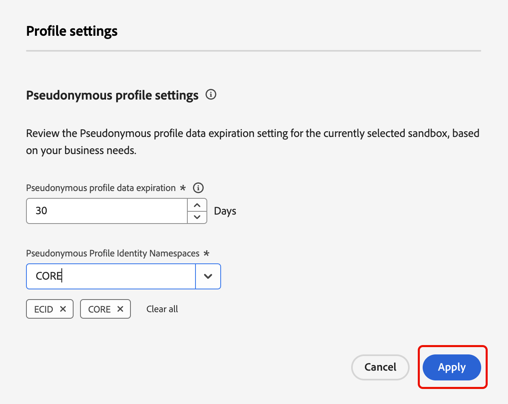

# 假名轮廓数据过期

在Adobe Experience Platform中，您可以为假名配置文件配置数据过期时间，从而允许您自动从配置文件存储中删除对您的用例不再有效或有用的数据。

## 假名轮廓 {#pseudonymous-profile}

>[!CONTEXTUALHELP]
>id="platform_profile_pseudonymousprofile"
>title="什么是假名轮廓？"
>abstract="假名轮廓是一份具有假名或未知身份标识命名空间的轮廓，或一份在给定时间内没有发生任何活动的轮廓。"
>text="Learn more in documentation"

>[!CONTEXTUALHELP]
>id="platform_profile_pseudonymousprofile_dataexpiration"
>title="假名轮廓数据有效期限"
>abstract="假名轮廓数据有效期限是指假名轮廓在被删除之前在 Adobe Experience Platform 中保留的天数。该值必须至少设置为 1。请注意，删除假名轮廓可能最多需要三天的时间。"

如果配置文件满足以下条件，则将其视为假名数据过期：

- 拼接配置文件的身份命名空间与客户指定的假名或未知身份命名空间匹配。
   - 例如，如果配置文件的标识命名空间是`ECID`、`GAID`或`AAID`。 拼接的配置文件没有来自任何其他身份命名空间的ID。 在此示例中，拼接的配置文件&#x200B;**不**&#x200B;具有电子邮件或CRM身份。
- 在用户定义的时间内没有发生任何活动。 活动由摄取的任何Experience事件或客户启动的配置文件属性更新来定义。
   - 例如，新的页面查看事件或页面属性更新会被视为活动。 但是，非用户启动的受众成员资格更新将&#x200B;**非**&#x200B;视为活动。 目前，要计算数据过期时间，用户档案级别的跟踪将基于体验事件的事件时间和用户档案属性的引入时间。

## 访问 {#access}

>[!AVAILABILITY]
>
>要访问此功能，您必须具有以下权限：
>
>- 管理配置文件设置
>- 查看配置文件
>- 查看身份命名空间
>
>**管理配置文件设置**&#x200B;权限允许您设置数据过期时间，**查看配置文件**&#x200B;权限允许您查看数据过期时间，**查看身份命名空间**&#x200B;权限允许您查看可用的身份命名空间。
>
>有关Experience Platform中权限的更多信息，请参阅[访问控制概述](../access-control/home.md#permissions)。

要将假名配置文件数据过期添加到您的组织，请转到配置文件仪表板并选择&#x200B;**[!UICONTROL Settings]**。

出现[!UICONTROL Profile settings]弹出框。 在此弹出窗口中，您可以设置假名配置文件数据到期的天数以及用于数据到期的标识命名空间。

对于生产沙盒，默认的假名配置文件数据到期为14天，最小为1天，最大为365天。 对于开发沙盒，默认的假名配置文件数据到期为3天，最小为1天，最大为365天。

选择&#x200B;**[!UICONTROL Apply]**&#x200B;以保存数据过期设置。

{width="800" zoomable="yes"}

## 常见问题 {#faq}

以下部分列出了有关假名配置文件数据到期的常见问题解答：

### 假名配置文件数据过期与体验事件数据过期有何不同？

+++ 回答

假名配置文件数据过期和体验事件数据过期是互补功能。

#### 粒度

假名配置文件数据过期在&#x200B;**沙盒**&#x200B;级别有效。 因此，数据过期将影响沙盒中的所有配置文件。

体验事件数据过期操作适用于&#x200B;**数据集**&#x200B;级别。 因此，每个数据集可以具有不同的数据过期设置。

#### 身份类型

仅假名配置文件数据过期&#x200B;**时**&#x200B;考虑的配置文件具有包含客户选择的身份命名空间的身份图，如`ECID`、`AAID`或其他类型的Cookie。 如果配置文件包含&#x200B;**any**&#x200B;额外的、在客户的选定列表中&#x200B;**not**&#x200B;的标识命名空间，则配置文件将&#x200B;**not**&#x200B;被删除。

Experience Event数据过期根据事件记录的时间戳仅删除事件&#x200B;**1。**&#x200B;包含的身份命名空间因过期目的而被&#x200B;**忽略**。

#### 删除的项目

假名配置文件数据过期会同时删除&#x200B;**个**&#x200B;事件和配置文件记录。 因此，配置文件类数据也将被删除。

Experience Event数据过期时间&#x200B;**仅**&#x200B;删除事件并&#x200B;**不**&#x200B;删除配置文件类数据。 仅当从&#x200B;**所有**&#x200B;数据集中删除所有数据并且配置文件剩余&#x200B;**没有**&#x200B;个配置文件类记录时，才会删除配置文件类数据。

+++

### 假名配置文件数据过期如何与体验事件数据过期结合使用？

+++ 回答

匿名配置文件数据过期和体验事件数据过期可用于相互补充。

您应根据保留已知客户数据的需要，在数据集中&#x200B;**始终**&#x200B;设置体验事件数据过期时间。 设置体验事件数据过期后，您可以使用假名配置文件数据过期自动删除假名配置文件。 通常，假名配置文件的数据过期时间短于体验事件的数据过期时间。

对于典型用例，您可以根据已知用户数据的值设置Experience Event数据过期时间，还可以将假名配置文件数据过期时间设置为更短的持续时间，以限制假名配置文件对Experience Platform许可证合规性的影响。

+++

### 假名配置文件数据过期的使用案例有哪些种类？

+++ 回答

- 如果您使用Web SDK直接将数据发送到Experience Platform。
- 如果您有一个网站，为未经身份验证的客户集体提供服务。
- 如果您的数据集中存在过多的配置文件计数，并且已确认这种过多的配置文件计数是因为匿名基于Cookie的标识命名空间。
   - 要确定这一点，您应使用身份命名空间重叠报表。 有关此报告的详细信息，可在预览示例状态API指南的[身份重叠报告部分](./api/preview-sample-status.md#identity-overlap-report)中找到。

+++

### 在使用假名配置文件数据过期之前，您应该注意哪些注意事项？

+++ 回答

- 假名配置文件数据过期在&#x200B;**沙盒**&#x200B;级别运行。 您可以选择为生产沙盒和开发沙盒使用不同的配置。
- 激活此功能后，将永久删除&#x200B;**配置文件**。 有&#x200B;**没有**&#x200B;方法可以回滚或还原已删除的配置文件。
- 这是&#x200B;**不是**&#x200B;一次性清理作业。 假名配置文件数据过期每天运行一次，并删除与客户输入匹配的配置文件。
- **所有定义为假名配置文件的**&#x200B;配置文件都将受假名配置文件数据过期的影响。 如果配置文件仅是Experience Event或仅包含配置文件属性，则&#x200B;**无**。
- 此清理将&#x200B;**仅**&#x200B;在配置文件中进行。 如果配置文件具有两个或多个关联的假名身份（如`AAID`和`ECID`），则清理后，Identity Service可能会继续在图形中显示已删除的身份。 这种差异将在不久的将来得到解决。
- 假名配置文件数据过期&#x200B;**不会**&#x200B;立即运行，最多可能需要三天才能处理。

+++

### 假名配置文件数据到期如何与Identity Service数据的护栏进行交互？

+++ 回答

- 身份服务[的“先进先出”删除系统](../identity-service/guardrails.md)可以从身份图中删除存储在身份服务中的ECID。
- 如果此删除行为导致仅ECID配置文件存储在实时客户配置文件（配置文件存储）中，则假名配置文件数据过期将从配置文件存储中删除此配置文件。

+++

## 后续步骤

阅读本指南后，您将了解如何查看和创建假名配置文件数据过期日期。 有关整个Experience Platform上的数据管理的更多信息，请阅读[数据管理许可证权利最佳实践指南](../landing/license-usage-and-guardrails/data-management-best-practices.md)。

