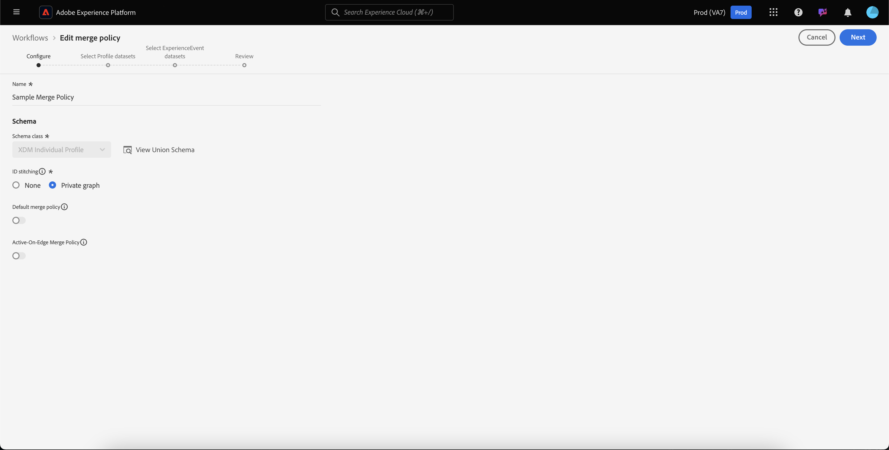

# 合并策略用户指南

Adobe Experience Platform使您能够将来自多个来源的数据整合在一起，并将其合并，以便了解每位客户的完整视图。 整合这些数据时，合并策略是平台用来确定数据的优先级以及将哪些数据合并以创建统一视图的规则。

使用RESTful API或用户界面，您可以创建新的合并策略、管理现有策略并为组织设置默认的合并策略。 本指南提供使用Adobe Experience Platform用户界面处理合并策略的分步说明。

如果您希望使用实时客户用户档案API处理合并策略，请按照合并策略API教程中所述 [的说明操作](../api/merge-policies.md)。

## 入门指南

本指南需要对与合并策略相关的各种Experience Platform服务进行有效的了解。 在开始本教程之前，请查看以下服务的相关文档：

* [实时客户用户档案](../home.md):根据来自多个来源的汇总数据提供统一、实时的消费者用户档案。
* [标识服务](../../identity-service/home.md):通过将来自不同数据源的身份引入平台，实现实时客户用户档案。
* [体验数据模型(XDM)](../../xdm/home.md):平台通过标准化框架组织客户体验数据。

## 视图合并策略

在Experience Platform用户界面中，您可以开始使用合并策略，通过单击左边栏中的列表，然后选择合并策略选项卡，来查看组织现有合并策略的 **用户档案****** 。

在登陆页中可看到组织可用的每个合并策略的详细信息，包括策略名 *称*、 *默认合并策略*&#x200B;和 *模式*。

要选择显示哪些详细信息，或要向显示屏添加其他列，请选择右侧的列选择器图标，然后单击列名以将其添加或从视图中删除。

## 创建合并策略

要创建新的合并策略，请单击“合 **并策略** ”选项卡右上角附近的“创 **建合并策略** ”。

将出 **现“创建合并策略** ”屏幕，允许您为新的合并策略提供重要信息。

* **名称**:合并策略的名称应具有描述性，但应简明。
* **模式**:与合并策略关联的模式。 这将指定为其创建此合并策略的XDM模式。 组织可以为每个模式创建多个合并策略。
* **ID拼接**:此字段定义如何确定客户的相关身份。 有两个可能的值：
   * **无**:不进行身份拼接。
   * **专用图**:根据您的个人身份图执行身份拼接。
* **属性合并**:用户档案片段是单个客户现有身份的列表中仅一个身份的用户档案信息。 当使用标识图类型导致多个标识时，可能存在冲突的用户档案属性值，且必须指定优先级。 使用 *属性合并* ，可以指定在发生合并冲突时要排定优先级的数据集用户档案值。 有两个可能的值：
   * **按顺序排列的时间戳**:如果发生冲突，请优先考虑最近更新的用户档案。
   * **数据集优先级** :根据用户档案片段的来源数据集优先处理这些片段。 选择此选项时，必须选择相关数据集及其优先级顺序。 有关详细信息，请参 [阅以下有关数据集](#dataset-precedence) 优先级的详细信息。
* **默认合并策略**:一个切换按钮，允许您选择此合并策略是否将是您组织的默认策略。 如果选择器已切换并且保存了新策略，则之前的默认策略将自动更新为不再为默认策略。

### 数据集优先级 {#dataset-precedence}

在选择属 *性合并值时* ，您可以选择数据集优先级 ** ，这允许您根据用户档案片段的来源数据集优先处理这些片段。

一个示例用例是，如果您的组织在一个数据集中存在信息，而该数据集中的数据优先或信任高于另一个数据集中的数据。

选择数 *据集优先级时*** ，会打开单独的面板，要求您从可用数据集中进行选择（或使用复选框选择所有）将包含的数据集。 然后，您可以将这些数据集拖放到“选定的数 *据集* ”面板中，并将它们拖至正确的优先级顺序。 优先级最高的数据集，次要数据集次之，依此类推。

创建完合并策略后，单击“保 **存** ”返回“合并策略 ** ”选项卡，新合并策略现在显示在策略列表中。

## 编辑合并策略

通过单击要编辑的合并策略的 *策略名称* ，可以通过“合并策略”选项卡修改 ** 现有的合并策略。

显示“ *Edit merge policy* ”(编辑合并策略 *)时，您可以对“* Adit *Merge Policy*”（编辑合并策略）屏幕进行更改，“ScrittingType”（编辑合并类型）、“ *ScrittingType”（合并类型）和***** Shinstring”（选择是否将此策略作为组织的默认合并策略）属性)。

>[!Note]
>您无法编辑合并策略ID，该ID显示在编辑屏幕顶部。 这是一个只读的、系统生成的ID，无法更改。

完成必要的更改后，单击保 **存** ，返回“合并策略 ** ”选项卡，其中现在可以看到更新的合并策略信息。

## 违反数据管理策略

创建或更新合并策略时，将执行检查以确定合并策略是否违反了贵组织定义的任何数据使用策略。 数据使用策略是Adobe Experience Platform数据管理的一部分，是描述您允许或限制在特定平台数据上执行的营销操作类型的规则。 例如，如果合并策略用于创建激活到第三方目标的区段，而您的组织有数据使用策略，阻止将特定数据导出到第三方，则在尝试保存合并策略时，您会收到“检测到数据管理策略违规”通知。

此通知包括已违反的数据使用策略列表，允许您通过从列表中选择策略来视图违规的详细信息。 选择违反的策略后，“数据世系 *”选项卡会提供违规原因和“受影响”激活*****，每个选项卡都会提供有关违反数据使用策略情况的详细信息。

要进一步了解如何在Adobe Experience Platform中执行数据管理，请首先阅读数据管 [理概述](../../data-governance/home.md)。

## 后续步骤

现在，您已经为IMS组织创建和配置了合并策略，您可以使用这些策略根据您的受众数据创建用户档案区段。 有关如何 [使用Experience Platform创建和使用区段的更多信息](../../segmentation/home.md) ，请参阅分段概述。