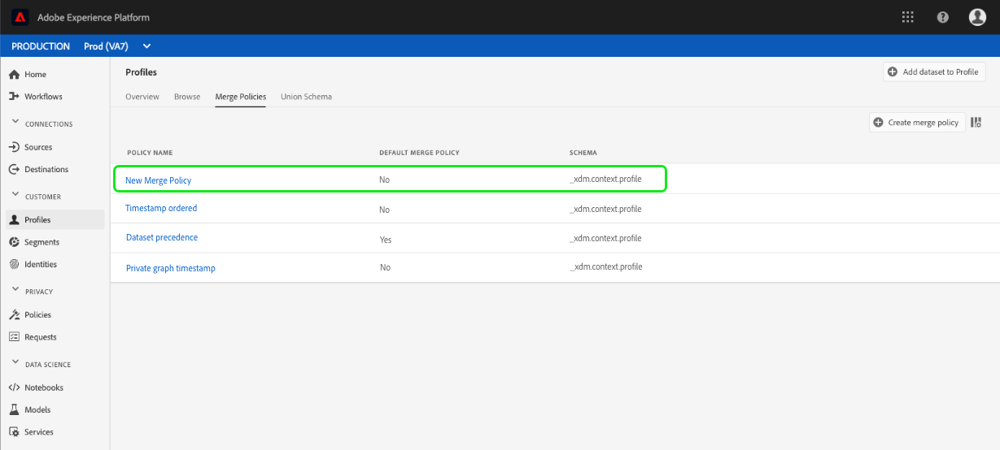

# 合并策略UI指南

Adobe Experience Platform使您能够将来自多个来源的数据片段整合在一起，并将它们合并在一起，以便了解每个客户的完整视图。 将数据整合在一起时，合并策略是确定 [!DNL Platform] 数据的优先级以及合并哪些数据以创建统一视图的规则。

例如，如果客户在多个渠道中与您的品牌互动，您的组织将在多个数据集中显示与该单个客户相关的多个用户档案片段。 当这些片段被引入平台时，它们会合并在一起，以便为该客户创建单一用户档案。 当来自多个来源的列表发生冲突(例如，一个片段将客户为“单一”，而另一个片段将客户列表为“已婚”)时，合并策略将确定要包含在个人用户档案中的信息。

使用REST风格的API或用户界面，您可以创建新的合并策略、管理现有策略并为组织设置默认的合并策略。 本指南提供使用Adobe Experience Platform用户界面(UI)处理合并策略的分步说明。

如果您希望使用API处理合并策略，请 [!DNL Real-time Customer Profile] 按照合并策略API指南中 [概述的说明操作](../api/merge-policies.md)。

## 入门指南

本指南需要对几个重要功能进行有效 [!DNL Experience Platform] 的了解。 在遵循本指南或使用用户档案API之前，请查看以下服务的文档：

* [[!DNL Real-time Customer Profile]](../home.md):基于来自多个来源的聚集数据提供统一、实时的消费者用户档案。
* [Adobe Experience Platform身份服务](../../identity-service/home.md):通过将来自不同数据源的身份融入其中，实现实时客户用户档案 [!DNL Platform]。
* [[!DNL Experience Data Model] (XDM)](../../xdm/home.md):组织客户体验数 [!DNL Platform] 据的标准化框架。

## 合并方法 {#merge-methods}

每个用户档案片段包含个人可能存在的身份总数中只有一个身份的信息。 当将这些数据合并到一起以形成客户用户档案时，这些信息可能会发生冲突，必须指定优先级。 通过选择合并方法，可以指定在数据集之间发生合并冲突时要排定优先级的数据集属性。

合并策略有两种可能的合并方法。 以下各个方法概述，并在以下各节中提供更多详细信息：

* **[!UICONTROL 排序的时间戳]:** 在冲突事件中，优先于最近更新的用户档案片段。
   * **自定义时间戳：**[!UICONTROL 排序的时间戳] 还支持自定义时间戳，当合并同一数据集（多个身份）或跨数据集的数据时，这些时间戳优先于系统时间戳。 要了解更多信息，请参阅使用自定 [义时间戳的一节](#custom-timestamps)。
* **[!UICONTROL 数据集优先级]:** 在冲突事件中，根据冲突产生的数据集优先用户档案片段。 选择此选项时，必须选择相关数据集及其优先级顺序。

### 按顺序排列时间戳 {#timestamp-ordered}

当用户档案记录被摄取到Experience Platform中时，在摄取时获得系统时间戳并添加到记录中。 如果 **[!UICONTROL 选择]** “按顺序排列的时间戳”作为合并策略的合并方法，则会根据系统时间戳合并用户档案。 换言之，合并是根据记录被引入平台的时间戳完成的。

#### 使用自定义时间戳 {#custom-timestamps}

有时，在某些用例中，需要提供自定义时间戳并使合并策略遵守自定义时间戳，而不是系统时间戳。 这包括回填数据或确保在记录不按顺序摄取时事件的正确顺序。

要使用自定义时间戳，必须将 **[!UICONTROL “外部源系统审计详细信息混]** 合”添加到您的用户档案模式。 添加后，可以使用字段填充自定义时 `lastUpdatedDate` 间戳。 在摄取记录时填充 `lastUpdatedDate` 了该字段，Experience Platform将使用该字段来合并不同数据集的记录。 如 `lastUpdatedDate` 果不存在或未填充，平台将继续使用系统时间戳。

>[!NOTE]
>
>在同一记录上 `lastUpdatedDate` 引入更新时，必须确保填充时间戳。

以下屏幕截图显示“外部源系 [!UICONTROL 统审核详细信息混合”中的字段]。 有关使用平台UI处理模式的分步说明(包括如何向模式添加混音)，请访 [问使用UI创建模式的教程](../../xdm/tutorials/create-schema-ui.md)。

要使用API使用自定义时间戳，请参阅“合 [并策略端点指南”部分有关使用自定义时间戳](../api/merge-policies.md#custom-timestamps)。

### 数据集优先级 {#dataset-precedence}

当选 **[!UICONTROL 择用户档案集]** 优先级作为合并策略的合并方法时，您可以根据数据集的来源为片段提供优先级。 一个示例用例是，如果您的组织在一个数据集中存在信息，该数据集中的数据优先或受信任，而不是其他数据集中的数据。

要使用数据集优先级创建合 **[!UICONTROL 并策略]**，必须选择包含的用户档案和ExperienceEvent数据集，然后可以手动对用户档案数据集进行优先级排序。 一旦选择并排序了数据集，最高优先级将被赋予，第二个数据集将被授予次高优先级，依此类推。

## [!UICONTROL ID拼接] {#id-stitching}

身份拼接([!UICONTROL ID拼接])是识别数据片段并将它们组合在一起以形成完整用户档案记录的过程。 为了说明不同的拼接行为，请考虑使用两个不同电子邮件地址与品牌互动的单一客户。

* **[!UICONTROL 无]:** 选择此选项后，ID将不会拼接到一起。 当进行分段时，属于同一人的身份将不会拼合在一起，分段只在确定客户是否符合段成员资格时考虑附加到每个ID的属性。 这可能导致单个客户具有多个用户档案，每个用户档案可能有资格获得不同的细分，从而向同一客户发送多个营销消息。
* **[!UICONTROL 专用图]:** 当选择私有图时，与同一个人相关的多个身份被拼接在一起。 这导致客户具有单个用户档案，并允许分段在确定段资格时考虑来自多个相关身份的多个属性。 在此方案中，客户可能具有单一用户档案，根据不同身份的属性组合有资格获得一个细分，并且只会收到一条营销消息。

要进一步了解身份及其在生成用户档案和细分方面的作用，请首先阅读Identity [Service概述](../../identity-service/home.md)。

## 默认合并策略 {#default-merge-policy}

组织可以创建默认的合并策略，供其组织在合并用户档案片段时使用。 这允许用户在Experience Platform中执行操作(如查看客户用户档案或创建区段)时轻松选择默认策略。 在大多数情况下，除非指定其他合并策略，否则将使用默认的合并策略。

每个组织都可以创建与单个XDM模式类相关的多个合并策略，但每个类只能声明一个默认的合并策略。 例如，您的组织可能具有与类相关的默认合并策略 [!DNL XDM Individual Profile] ，以及自定义构建的“产品库存”类的不同默认合并策略。

如果您创建新的合并策略并将其设置为默认值，则系统将自动更新以前的默认合并策略，使其不再为默认值。

>[!WARNING]
>
>用户档案计数和具有现有关联的默认合并策略的区段可能会受到影响。 应用了默认合并策略的任何区段都将更新为新的默认合并策略。

## 视图合并策略 {#view-merge-policies}

在UI [!DNL Experience Platform] 中，您可以开始使用合并策略，方法是在左侧导航 **[!UICONTROL 中选择]** 用户档案，然后选择合 **[!UICONTROL 并策略]** 选项卡。 此选项卡包含组织的所有现有合并策略的列表，以及每个合并策略的详细信息，包括策略名称、合并策略是否是默认合并策略以及合并策略与之相关的模式类。

要选择显示哪些详细信息，或向显示屏添加其他列， **[!UICONTROL 请选择]** “配置列”，然后单击列名以将其添加或从视图中删除。

## 创建合并策略 {#create-a-merge-policy}

要创建新的合并策略，请在合 **[!UICONTROL 并策略选项卡]** 上选择创建合并策略。

在“新 **[!UICONTROL 合并策略]** ”工作流屏幕上，您可以通过一系列引导步骤为新合并策略提供重要信息。

### [!UICONTROL 配置] {#configure}

在工作流的第一步中，您可以通过提供基本信息来配置合并策略。 此信息包括：

* **[!UICONTROL 名称]**:合并策略的名称应具有描述性且简明。
* **[!UICONTROL 模式类]**:与合并策略关联的XDM模式类。 它指定为其创建此合并策略的模式类。 组织可以为每个模式类创建多个合并策略。 目前， [!UICONTROL UI中仅提供] “XDM单个用户档案”类。
* **[!UICONTROL ID拼接]**:此字段定义如何确定客户的相关身份。 请参阅本指南 [前面有关](#id-stitching) ID拼接的部分以了解更多信息。 可能有两个值：
   * **[!UICONTROL 无]**:不进行身份拼接。
   * **[!UICONTROL 专用图]**:根据您的个人身份图执行身份拼接。
* **[!UICONTROL 默认合并策略]**:一个切换按钮，允许您选择此合并策略是否将是组织的默认策略。 如果选择器已切换，则会显示一条警告，要求您确认要更改组织的默认合并策略。 请参阅本指南前面 [有关默认合并策](#default-merge-policy) 略的部分，了解更多信息。
   

填写完所需字段后，您可以选择“下 **[!UICONTROL 一步]** ”以继续工作流。

### [!UICONTROL 选择用户档案数据集] {#select-profile-datasets}

在“选 **[!UICONTROL 择用户档案数据集]** ”屏幕上，必须选择 **[!UICONTROL 要用于合并策略的]** “合并”方法。 屏幕上还显示与上一个屏幕 [!UICONTROL 上选择的用户档案] 类相关的组织中模式数据集的总数。

根据您选择的合并方法，所有用户档案数据集将按上次更新的顺序（时间戳排序）进行合并，或者您需要选择合并策略中要包含的用户档案数据集以及合并它们的顺序（数据集优先级）。 有关合并方法的详细信息，请查看本文档 [前面提供](#merge-methods) 的合并方法部分。

#### 按顺序排列时间戳 {#timestamp-ordered-profile}

选择 **[!UICONTROL 按顺序排序]** 的时间戳作为合并方法意味着将优先选择来自最近更新的数据集中的属性。 这适用于所有用户档案集。

#### 数据集优先级 {#dataset-precedence-profile}

选择 **[!UICONTROL 用户档案集优先]** ，作为合并方法，您需要选择数据集并手动对它们进行优先级排序。 您可以从数据集列表中最多选择50个数据集。 当选择数据集时，它们会显示在屏幕的右侧，允许您拖放数据集并对其进行排序。 在列表中调整数据集时，数据集旁边的序数（1、2、3等）将更新，显示优先级（1被赋予最高优先级，然后是2，然后继续）。

### [!UICONTROL 选择ExperienceEvent数据集] {#select-experienceevent-datasets}

工作流的下一步需要您选择ExperienceEvent数据集。 此屏幕受您在“选择用户档案数据集”屏幕上选择的合 [[!UICONTROL 并方法的影]](#select-profile-datasets) 响。

此屏幕上还显示您的组织创建的 **[!UICONTROL 与您在合并策略配]** 置屏幕上选择的模式类相关的ExperienceEvent集总数。

#### 按顺序排列时间戳 {#timestamp-ordered-experienceevent}

如果您选 **[!UICONTROL 择按顺序排]** 列的时间戳作为用户档案数据集的合并方法，则此处也将优先选择最近更新的ExperienceEvent数据集的属性。

#### 数据集优先级 {#dataset-precedence-experienceevent}

如果选择 **[!UICONTROL 用户档案集]** “数据集优先级”作为数据集的合并方法，则需要选择要包含的ExperienceEvent数据集。 您可以从数据集列表中最多选择50个ExperienceEvent数据集。 当选择数据集时，它们显示在屏幕的右侧。 无法手动对ExperienceEvent数据集进行排序，而是将ExperienceEvent数据集中的属性附加到用户档案数据集(如果它们是同一用户档案片段的一部分)。

### [!UICONTROL 审阅] {#review}

工作流的最后一步是查看合并策略。 “审 **[!UICONTROL 阅]** ”屏幕显示新合并策略的名称、它所基于的模式类、您选择的 [!UICONTROL ID拼接选项] ，以及合并方法和合并策略中包含的数据集。 要视图包含的所有用户档案或ExperienceEvent数据集，请选择要展开下拉列表列表的数据集数。

请确保在选择“完成”以完成创建工作流 **[!UICONTROL 程之前]** ，仔细查看合并策略。

#### 按顺序排列时间戳 {#timestamp-ordered-review}

如果您选 **[!UICONTROL 择Timestamp]** ordered作为合并策略的合并方法，则用户档案数据集的列表将按照时间戳的顺序包括由您的组织创建的与模式类相关的所有数据集。 ExperienceEvent数据集的列表包括您的组织为所选模式类创建的所有数据集，并将附加到用户档案数据集。

#### 数据集优先级 {#dataset-precedence-review}

如果您选 **[!UICONTROL 择数据集优先]** ，作为合并策略的合并方法，则用户档案和ExperienceEvent数据集的列表只包括您在创建工作流程中分别选择的用户档案和ExperienceEvent数据集。 用户档案数据集的顺序应与您在创建过程中指定的优先级相匹配。 否则，请使用“返 [!UICONTROL 回] ”按钮返回到前一个工作流步骤并调整优先级。

### 更新了合并策略的列表 {#updated-list}

完成创建新合并策略的工作流后，您将返回到合并策 **[!UICONTROL 略选项卡]** 。 您组织的合并策略列表现在应包括您刚刚创建的合并策略。

## 编辑合并策略

从“合 [!UICONTROL 并策略] ”选项卡中，可以修改为类创建的现有合并策略， [!DNL XDM Individual Profile] 方法是为要编辑的 **[!UICONTROL 合并策略选]** 择策略名。

出现“ **[!UICONTROL 编辑合并策略]** ”屏幕时，您可以更改名称和 [!UICONTROL ID拼接]，还可以更改此策略是否是组织的默认合并策略。

选择 **[!UICONTROL 下一]** 步以继续执行合并策略工作流，以更新合并策略中包含的合并方法和数据集。

完成必要的更改后，请检查合并策略，然后选 **[!UICONTROL 择]** “完成”返回 **[!UICONTROL 合并策略]** 选项卡。

>[!WARNING]
>
>更改合并策略可能会影响分段和用户档案结果，因为它将改变解决数据冲突的方式。

## 违反数据管理策略

创建或更新合并策略时，将执行检查以确定合并策略是否违反了组织定义的任何数据使用策略。 数据使用策略是Adobe Experience Platform的一 [!DNL Data Governance] 部分，是描述您允许或限制对特定数据执行的营销操作类型的 [!DNL Platform] 规则。 例如，如果合并策略用于创建已激活到第三方目标的区段，而您的组织拥有阻止特定数据导出到第三方的数据使用策略，则在尝试保存合并策略时，您会收到检测到 **[!UICONTROL “数据治理策略违规]** ”的通知。

此通知包括已违反的列表使用策略，并允许您通过从列表中选择策略来视图违规的详细信息。 选择违反的策略后，“数 **[!UICONTROL 据世系]** ”选项卡会提供违规原因和受影响的激活，每个选项卡都提供有关违反数据使用策略的详细信息。

要进一步了解如何在Adobe Experience Platform内执行数据治理，请首先阅读数据治 [理概述](../../data-governance/home.md)。

## 后续步骤

现在，您已经为组织创建和配置了合并策略，您可以使用这些策略调整平台内客户用户档案的视图，并根据用户档案数据创建受众细分。 有关如何 [使用UI](../../segmentation/home.md) 和API创建和使用区段的更多信息，请 [!DNL Experience Platform] 参阅分段概述。