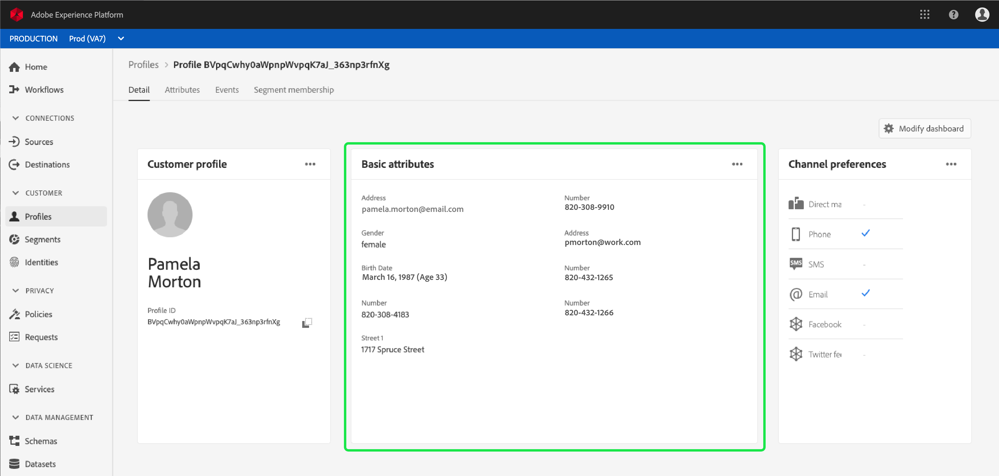

# [!DNL Real-time Customer Profile] 详细自定义 {#profile-detail-customization}

在Adobe Experience Platform用户界面中，您可以以客户用户档案的形 [!DNL Real-time Customer Profile] 式视图数据并与其交互。 在UI中显示的用户档案信息已从多个用户档案片段合并到一起，以形成每个客户的单个视图。 这包括基本属性、链接身份和渠道首选项等详细信息。 用户档案中显示的默认字段也可以在组织级别进行更改，以显示首选 [!DNL Profile] 属性。 本指南提供有关自定义在平台UI中显示数 [!DNL Profile] 据的方式的分步说明。

有关用户档案UI的完整指南，请访问 [用户档案用户指南](user-guide.md)。

## 对卡重新排序和调整大小 {#reorder-and-resize-cards}

从客户 **[!UICONTROL 用户档案]** 的“详细信息”选项卡中 **[!UICONTROL ，您可以选择“修改]** 仪表板”，以调整现有卡的大小和重新排序。

选择修改仪表板后，您可以通过选择卡标题并将卡拖放到所需的顺序来重新排序卡。 您还可以通过选择卡()右下角的角度符号并将卡拖动到所需`⌟`大小来调整卡的大小。 在此示例中，将调 **[!UICONTROL 整基本]** 属性卡的大小。

所选卡根据所需大小进行调整，并动态调整周围的卡。 这可能导致某些卡被移到其他行，需要您向下滚动才能看到所有卡。 例如，当“基本[!UICONTROL 属性]”卡的大小调整时，“链接的[!UICONTROL 标识]”卡不再显示在顶行上，现在显示在用户档案内的新的第二行上（未显示）。 要将“链[!UICONTROL 接的身]份”卡返回顶行，可将其拖放到“渠道首选项”卡的[!UICONTROL 当前位置]。

## 编辑和删除卡

除了调整卡的大小和重新排序卡，您还可以编辑某些卡的内容并从仪表板中完全删除某些卡。 选择卡`...`右上角的省略号()以编辑或删除它。 此操作会打开一个下拉菜单，其中包含编辑或删除卡的选项，具体取决于所选卡的属性。

>[!NOTE]
>
>并非所有卡都可以编辑或删除。 这是因为某些卡包含只读或必需的信息。 如果卡的右上角没有省略号，则它包含只读的AND必需信息，无法编辑，也无法删除。 如果卡在角中带有省略号，并且选择它时只显示删除卡的选项，则卡信息为只读，无法编辑。

在下 **[!UICONTROL 拉框中]** ，选择“编辑”以打开 **[!UICONTROL “编辑构件]** ”工作区，在该工作区中，您可以更新卡标题、重新排序或删除可见属性，或使用“添加属性”按钮添加 **[!UICONTROL 其他属性]** 。

## 添加属性 {#add-attributes}

从“编 **[!UICONTROL 辑构件]** ”屏幕，选 **[!UICONTROL 择卡右上角的]** “添加属性”，开始向该卡添加属性。

当“选 **[!UICONTROL 择合并模式]** ”字段对话框打开时，对话框的左侧显示完整的“XDM单  个用户档案合并”模式，其下嵌套有字段。 有关合并模式的详细信息，请参阅 [用户指南的合并 [!DNL Profile] 模式部分](user-guide.md#union-schema)。

对 **[!UICONTROL 话框右侧]** 的“选定属性”部分显示当前包含在您编辑的卡中的属性。 您也可以在此处删除属性并重新排序。 显示所选属性的总数以及可添加到单个卡的最大属性数(20)。

您可以选择任何可用的合并模式字段，以自定义您正在编辑的卡上的属性。 选定字段旁边将显示一个复选标记，并自动添加到选定属性的列表。 添加您希望在卡上显示的所有属性后，选择“选 **[!UICONTROL 择]** ”返回到“编 **[!UICONTROL 辑”屏幕]** 。

当您返回到“编 **[!UICONTROL 辑构件]** ”屏幕时，卡上属性的列表现在应更新以反映您的选择。 您仍然可以根据需要删除或重新排序卡属性或编辑卡标题。 完成编辑后，选择“保 **[!UICONTROL 存]** ”以保存更改。

保存后，您将返回到显示更 **[!UICONTROL 新的卡]** 和属性的“详细信息”选项卡。

## Add a new card {#add-a-new-card}

要进一步自定义Experience Platform中用户档案的外观，您可以选择向仪表板添加新卡，并选择要在这些卡上显示的属性。 首先，在“详细信 **[!UICONTROL 息”选项卡上]** ，选择“ **[!UICONTROL 修改仪表板]** ”。

接下来， **[!UICONTROL 选择仪表板]** 左上角的“添加构件”。

选择添加新卡会打开“编 **[!UICONTROL 辑构件]** ”屏幕，您可以在该屏幕中为新卡提供标题并选择您希望该卡显示的属性。 要开始向卡添加属性，请选择“添 **[!UICONTROL 加属性”]**。

当“选 **[!UICONTROL 择合并模式]** ”字段对话框打开时，对话框的左侧显示完整的 [!UICONTROL XDM单个用户档案合并] 模式，对话框右侧的“选定属性 **** ”部分显示您为卡选择的属性。 有关添加属性的详细信息，请参 [阅添加属性一节](#add-attributes) ，该部分在此文档前面显示。

显示所选属性的总数以及可添加到单个卡的最大属性数(20)。 您还可以从此屏幕中删除选定属性并对其重新排序。 添加您希望在卡上显示的所有属性后，选择“选 **[!UICONTROL 择]** ”返回到“编 **[!UICONTROL 辑”构件]** 屏幕。

返回“编辑构 **[!UICONTROL 件]** ”屏幕时，卡上属性的列表应反映您在上一屏幕中的选择。 您还可以根据需要重新排序和删除卡属性。

要保存新卡，您必须首先提供卡 **[!UICONTROL 标题]**，然后您将能够选择 **[!UICONTROL 保存]** 并完成卡创建过程。

保存后，您将返回到显示新 **[!UICONTROL 卡]** 和属性的“详细信息”选项卡。

## 恢复默认卡

如果您随时决定要恢复删除后的默认卡，您可以快速轻松地恢复。 首先，选择 **[!UICONTROL 修改仪表板]**，然后选择 **[!UICONTROL 恢复默认卡]**。 显示默认卡后，您可以选择保 **[!UICONTROL 存]** 以保存更改，如果不希望恢复 **[!UICONTROL 默认卡]** ，也可以选择取消。

## 后续步骤

通过遵循此文档，您现在应该能够更新组织的用户档案视图，包括添加和删除卡、编辑卡详细信息和属性以及重新排列卡和调整其大小。 要进一步了解如何在 [!DNL Profile] Experience PlatformUI中处理数据，请参阅 [[!DNL Profile] 用户指南](user-guide.md)。