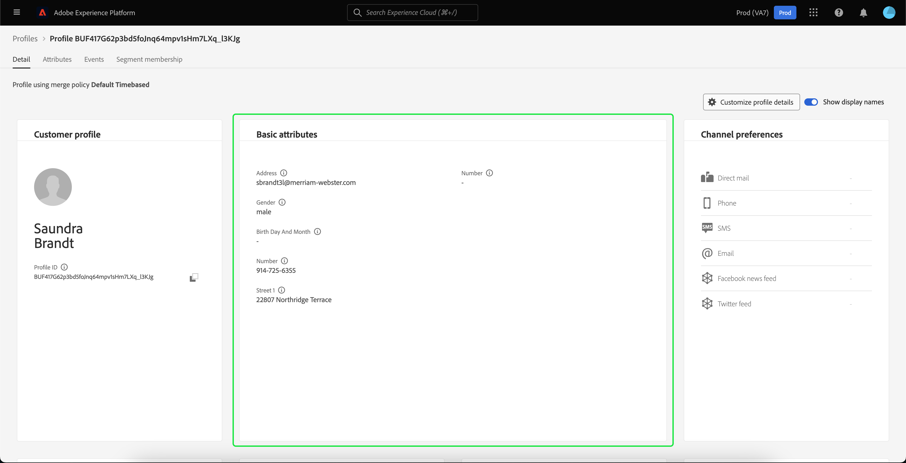

# [!DNL Real-Time Customer Profile]详细信息自定义 {#profile-detail-customization}

在Adobe Experience Platform用户界面中，您可以以客户配置文件的形式查看并与[!DNL Real-Time Customer Profile]数据进行交互。 UI中显示的配置文件信息已从多个配置文件片段合并在一起，形成每个客户的单个视图。 这包括基本属性、链接身份和渠道偏好设置等详细信息。 用户档案中显示的默认字段也可以在组织级别更改为显示首选[!DNL Profile]属性。 本指南提供了分步说明，用于自定义在Experience Platform UI中显示[!DNL Profile]数据的方式。

有关配置文件UI的完整指南，请访问[配置文件UI指南](user-guide.md)。

## 重新排序卡片并调整其大小 {#reorder-and-resize-cards}

从客户个人资料的&#x200B;**[!UICONTROL 详细信息]**&#x200B;选项卡中，您可以选择&#x200B;**[!UICONTROL 自定义个人资料详细信息]**，以调整现有卡的大小并重新排序。

选择修改功能板后，您可以通过选择卡片标题并将卡片拖放到所需顺序来重新排列卡片。 您还可以通过选择卡片右下角的角度符号(`⌟`)并将卡片拖动到所需大小来调整卡片大小。 在此示例中，正在调整&#x200B;**[!UICONTROL 基本属性]**&#x200B;卡片的大小。

所选卡片调整到所需的大小，并且周围卡片动态地重新定位。 这可能会导致某些信息卡被移动到其他行，从而需要您向下滚动才能看到所有信息卡。 例如，在调整“[!UICONTROL 基本属性]”卡片大小时，“[!UICONTROL 链接身份]”卡片将不再显示在顶行，而现在显示在配置文件内的新的第二行中（未显示）。 若要将“[!UICONTROL 链接身份]”卡片返回至顶行，可将其拖放到“[!UICONTROL 渠道首选项]”卡片的当前位置。

## 编辑和删除信息卡

除了调整卡片大小并重新排序之外，您还可以编辑某些卡片的内容并从功能板中完全删除某些卡片。 选择卡片右上角的省略号(`...`)以进行编辑或删除。 这将打开一个下拉菜单，其中包含编辑或删除信息卡的选项，具体取决于所选信息卡的属性。

>[!NOTE]
>
>并非所有信息卡都可以编辑或删除。 这是因为某些信息卡包含只读或必需信息。 如果卡片的右上角没有省略号，则它包含只读的AND必需信息，不能编辑也不能删除它。 如果信息卡在角部有椭圆形，选择该信息卡将仅显示删除信息卡的选项，则信息卡为只读信息且无法编辑。

在下拉列表中选择&#x200B;**[!UICONTROL 编辑]**&#x200B;以打开&#x200B;**[!UICONTROL 编辑小组件]**&#x200B;工作区，您可以在其中更新卡片标题、重新排序或删除可见属性，或者使用&#x200B;**[!UICONTROL 添加属性]**&#x200B;按钮添加其他属性。

## 添加属性 {#add-attributes}

从&#x200B;**[!UICONTROL 编辑构件]**&#x200B;屏幕中，选择卡片右上角的&#x200B;**[!UICONTROL 添加属性]**&#x200B;以开始向该卡片添加属性。

打开&#x200B;**[!UICONTROL 选择合并架构字段]**&#x200B;对话框时，对话框左侧显示完整的[!UICONTROL XDM个人资料]合并架构，其字段嵌套在下。 有关合并架构的详细信息，请参阅 [!DNL Profile] 用户指南[&#128279;](user-guide.md#union-schema)的合并架构部分。

对话框右侧的&#x200B;**[!UICONTROL 选定属性]**&#x200B;部分显示了当前包含在您正在编辑的信息卡中的属性。 您也可以在此处删除和重新排序属性。 显示选定的属性总数，以及可添加到单个卡片的最大属性数(20)。

您可以选择任何可用的合并架构字段，以自定义您正在编辑的卡片上的属性。 选择字段时，您可以选择查看文件路径名或显示名称。 若要在这两个显示之间切换，请选择&#x200B;**[!UICONTROL 显示显示名称]**&#x200B;切换开关。

![在“配置文件详细信息”页面中高亮显示[!UICONTROL 显示名称]切换开关。](../images/profile-customization/show-display-names.png)

所选字段旁边会显示复选标记，并且会自动添加到所选属性列表中。 添加所有要显示在卡片上的属性后，选择&#x200B;**[!UICONTROL 选择]**&#x200B;以返回&#x200B;**[!UICONTROL 编辑构件]**&#x200B;屏幕。

现在当您返回&#x200B;**[!UICONTROL 编辑小组件]**&#x200B;屏幕时，卡片上的属性列表应该更新以反映您的选择。 您仍然可以根据需要删除卡片属性或重新排序卡片属性或编辑卡片标题。 编辑完成后，选择&#x200B;**[!UICONTROL 保存]**&#x200B;以保存更改。

保存后，您将返回到&#x200B;**[!UICONTROL 详细信息]**&#x200B;选项卡，其中显示了更新的卡片和属性。

## 添加新信息卡 {#add-a-new-card}

要进一步自定义Experience Platform中配置文件的外观，您可以选择向功能板添加新信息卡，并选择您希望在这些信息卡上显示的属性。 要开始，请在&#x200B;**[!UICONTROL 详细信息]**&#x200B;选项卡上选择&#x200B;**[!UICONTROL 修改仪表板]**。

接下来，选择仪表板左上角的&#x200B;**[!UICONTROL 添加构件]**。

选择添加新信息卡会打开&#x200B;**[!UICONTROL 编辑构件]**&#x200B;屏幕，您可以在其中为新信息卡提供标题并选择您希望信息卡显示的属性。 要开始向卡片添加属性，请选择&#x200B;**[!UICONTROL 添加属性]**。

打开&#x200B;**[!UICONTROL 选择合并架构字段]**&#x200B;对话框时，对话框左侧显示完整的[!UICONTROL XDM个人资料]合并架构，对话框右侧的&#x200B;**[!UICONTROL 选定属性]**&#x200B;部分显示您为信息卡选择的属性。 有关添加属性的详细信息，请参阅本文档前面显示的关于添加属性[&#128279;](#add-attributes)的部分。

显示选定的属性总数，以及可添加到单个卡片的最大属性数(20)。 您还可以从此屏幕中删除所选属性并重新排序。 添加要显示在卡片上的所有属性后，选择&#x200B;**[!UICONTROL 选择]**&#x200B;以返回到&#x200B;**[!UICONTROL 编辑构件]**&#x200B;屏幕。

当您返回&#x200B;**[!UICONTROL 编辑小组件]**&#x200B;屏幕时，卡片上的属性列表应反映您在上一个屏幕中所做的选择。 您还可以根据需要重新排序和移除卡属性。

为了保存您的新信息卡，您必须首先提供&#x200B;**[!UICONTROL 信息卡标题]**，然后才能选择&#x200B;**[!UICONTROL 保存]**&#x200B;并完成信息卡创建过程。

保存后，您将返回到&#x200B;**[!UICONTROL 详细信息]**&#x200B;选项卡，其中显示了您的新卡片和属性。

## 恢复默认信息卡

如果在任何时候您决定要恢复已移除的默认信息卡，则可以快速轻松地恢复默认信息卡。 首先，选择&#x200B;**[!UICONTROL 修改仪表板]**，然后选择&#x200B;**[!UICONTROL 还原默认信息卡]**。 显示默认信息卡后，您可以选择&#x200B;**[!UICONTROL 保存]**&#x200B;以保存更改，如果您不想恢复默认信息卡，请选择&#x200B;**[!UICONTROL 取消]**。

## 后续步骤

通过阅读本文档，您现在应该能够更新组织的配置文件视图，包括添加和删除信息卡、编辑信息卡详细信息和属性，以及重新排序信息卡和调整信息卡大小。 要了解有关在Experience Platform UI中使用[!DNL Profile]数据的更多信息，请参阅[[!DNL Profile] 用户指南](user-guide.md)。
