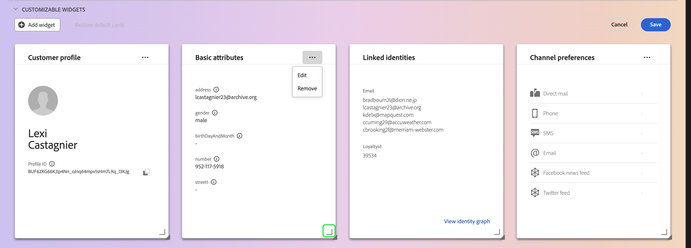
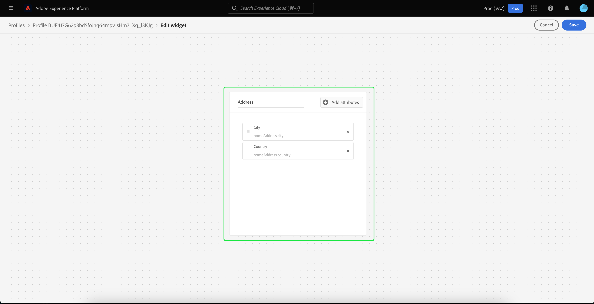

# [!DNL Real-Time Customer Profile] 详细信息自定义 {#profile-detail-customization}

在Adobe Experience Platform用户界面中，您可以查看并与之交互 [!DNL Real-Time Customer Profile] 以客户配置文件形式呈现的数据。 UI中显示的配置文件信息已从多个配置文件片段合并在一起，以形成每个客户的单个视图。 这包括基本属性、链接身份和渠道偏好设置等详细信息。 用户档案中显示的默认字段也可以在组织级别更改为显示首选字段 [!DNL Profile] 属性。 本指南提供了有关自定义以下各项的方式的分步说明： [!DNL Profile] 数据显示在Platform UI中。

有关配置文件UI的完整指南，请访问 [配置文件UI指南](user-guide.md).

## 重新排序卡片并调整其大小 {#reorder-and-resize-cards}

从 **[!UICONTROL 详细信息]** 选项卡，您可以选择 **[!UICONTROL 自定义配置文件详细信息]** 以调整现有卡的大小和重新排序。

选择修改仪表板后，您可以通过选择卡片标题并将卡片拖放到所需的顺序来重新排序卡片。 您还可以通过选择卡片右下角的角度符号来调整卡片大小(`⌟`)，并将信息卡拖动到所需的大小。 在此示例中， **[!UICONTROL 基本属性]** 正在调整卡的大小。

所选卡片会调整到所需的大小，并且周围卡片会动态重新定位。 这可能会导致某些信息卡移动到其他行，需要您向下滚动才能看到所有信息卡。 例如，当“[!UICONTROL 基本属性]“卡已调整大小”[!UICONTROL 链接的身份]“ ”信息卡不再显示在顶行，现在显示在配置文件内的新的第二行（未显示）。 要返回&quot;[!UICONTROL 链接的身份]”信息卡放到顶行，您可以将其拖放到的当前位置“[!UICONTROL 渠道首选项]“ ”卡。

## 编辑和移除信息卡

除了调整卡片大小和重新排序卡片外，您还可以编辑某些卡片的内容并从功能板中完全删除某些卡片。 选择省略号(`...`)以对其进行编辑或将其删除。 这将打开一个下拉列表，其中包含编辑或移除信息卡的选项，具体取决于所选信息卡的属性。

>[!NOTE]
>
>并非所有信息卡都可以编辑或删除。 这是因为某些信息卡包含只读或必需信息。 如果卡片的右上角没有省略号，则它包含只读和必需信息，不能编辑也不能删除它。 如果信息卡在角部有椭圆，选择它时只显示删除信息卡的选项，则信息卡为只读信息，无法编辑。

选择 **[!UICONTROL 编辑]** 在下拉列表中打开 **[!UICONTROL 编辑构件]** 工作区，您可以在其中更新卡片标题、重新排序或删除可见属性，或者使用添加其他属性 **[!UICONTROL 添加属性]** 按钮。

## 添加属性 {#add-attributes}

从 **[!UICONTROL 编辑构件]** 屏幕，选择 **[!UICONTROL 添加属性]** 以开始向该卡添加属性。

当 **[!UICONTROL 选择合并架构字段]** 对话框打开，对话框左侧显示完整的 [!UICONTROL XDM个人资料] 合并架构，字段嵌套在下。 有关合并模式的更多信息，请参阅 [合并模式部分 [!DNL Profile] 用户指南](user-guide.md#union-schema).

此 **[!UICONTROL 选定的属性]** 对话框右侧的部分显示当前包含在正在编辑的信息卡中的属性。 您也可以在此处删除和重新排序属性。 显示选定的属性总数，以及可添加到单个卡片的最大属性数(20)。

您可以选择任何可用的合并架构字段以自定义您正在编辑的卡片上的属性。 选定的字段旁边会显示一个复选标记，并且会自动添加到选定属性的列表中。 添加要在信息卡上显示的所有属性后，请选择 **[!UICONTROL 选择]** 以返回 **[!UICONTROL 编辑构件]** 屏幕。

当您返回 **[!UICONTROL 编辑构件]** 屏幕上，卡片上的属性列表现在应该更新以反映您的选择。 您仍然可以根据需要删除卡片属性或重新排序卡片属性或编辑卡片标题。 编辑完成后，选择 **[!UICONTROL 保存]** 以保存更改。

保存后，您将返回到 **[!UICONTROL 详细信息]** 选项卡，其中显示了更新的信息卡和属性。

## 添加新信息卡 {#add-a-new-card}

要进一步自定义Experience Platform中配置文件的外观，您可以选择向仪表板添加新信息卡，并选择想要在这些信息卡上显示的属性。 要开始，请选择 **[!UICONTROL 修改仪表板]** 在 **[!UICONTROL 详细信息]** 选项卡。

接下来，选择 **[!UICONTROL 添加构件]** 在仪表板的左上角。

选择添加新信息卡会打开 **[!UICONTROL 编辑构件]** 一个屏幕，您可以在其中为新信息卡提供标题，并选择您希望信息卡显示的属性。 要开始向信息卡添加属性，请选择 **[!UICONTROL 添加属性]**.

当 **[!UICONTROL 选择合并架构字段]** 对话框打开，对话框左侧显示完整的 [!UICONTROL XDM个人资料] 合并模式和 **[!UICONTROL 选定的属性]** 对话框右侧的部分显示了您为信息卡选择的属性。 有关添加属性的更多信息，请参阅 [关于添加属性的部分](#add-attributes) 此文档前面显示的URL值。

显示选定的属性总数，以及可添加到单个卡片的最大属性数(20)。 您还可以从此屏幕中删除所选属性并重新排序。 添加要在信息卡上显示的所有属性后，请选择 **[!UICONTROL 选择]** 以返回 **[!UICONTROL 编辑构件]** 屏幕。

当您返回 **[!UICONTROL 编辑构件]** 屏幕时，卡片上的属性列表应反映您在上一个屏幕中所做的选择。 您还可以根据需要重新排序和移除卡属性。

要保存新卡，您必须首先提供 **[!UICONTROL 卡片标题]**，则您将能够选择 **[!UICONTROL 保存]** 并完成信息卡创建过程。

保存后，您将返回到 **[!UICONTROL 详细信息]** 选项卡，您可在其中看到新信息卡和属性。

## 恢复默认信息卡

如果在任何时候您决定恢复已被删除的默认信息卡，则可以快速轻松地恢复默认信息卡。 首先，选择 **[!UICONTROL 修改仪表板]**，然后选择 **[!UICONTROL 恢复默认信息卡]**. 显示默认卡片后，您可以选择 **[!UICONTROL 保存]** 保存更改或选择 **[!UICONTROL 取消]** 如果您不想恢复默认卡。

## 后续步骤

通过阅读本文档，您现在应该能够更新组织的配置文件视图，包括添加和删除信息卡、编辑信息卡详细信息和属性，以及重新排序信息卡和调整信息卡大小。 详细了解使用 [!DNL Profile] Experience PlatformUI中的数据，请参阅 [[!DNL Profile] 用户指南](user-guide.md).
