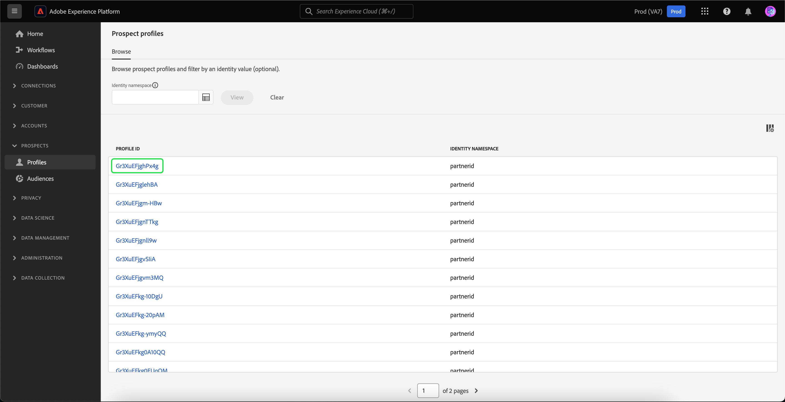

# 目标客户配置文件

Adobe Experience Platform 使您能够为客户提供协调、一致且相关的体验，无论他们何时何地与您的品牌互动均是如此。

潜在客户配置文件用于表示尚未与您的公司联系但您想联系的人员。 利用潜在客户配置文件，您可以使用来自可信第三方合作伙伴的属性来补充您的客户配置文件。

## 浏览 {#browse}

要访问目标客户配置文件，请选择 **[!UICONTROL 配置文件]** 在 **[!UICONTROL 潜在客户]** 部分。

此 **[!UICONTROL 浏览]** 页面。 此时将显示您组织的所有潜在客户配置文件的列表。

![此 [!UICONTROL 配置文件] 按钮突出显示，显示 [!UICONTROL 浏览] 目标客户配置文件的页面。](../images/prospect-profile/browse-profiles.png)

>[!IMPORTANT]
>
>虽然客户个人资料和潜在客户个人资料之间的大多数浏览功能是相同的，但是 **无法** 按合并策略浏览目标客户配置文件。 这是因为潜在客户配置文件自动受系统设计的基于时间的合并策略的控制。 有关合并策略的更多信息，请参阅 [合并策略概述](../merge-policies/overview.md).

有关浏览用户档案的详细信息，请阅读 [用户档案用户指南的浏览部分](./user-guide.md#browse-identity).

## 目标客户配置文件详细信息 {#profile-details}

>[!IMPORTANT]
>
>在Adobe Experience Platform中驻留25天后，潜在客户配置文件将自动过期。

要查看有关特定目标客户配置文件的详细信息，请在 [!UICONTROL 浏览] 页面。

此时将显示有关目标客户用户档案的信息，包括与用户档案和受众成员资格关联的属性。

欲知这些选项卡的详情，请阅读 [查看配置文件用户指南的配置文件详细信息部分](./user-guide.md#profile-detail).

您还可以通过选择以查看JSON格式的所有属性 **[!UICONTROL 查看JSON]**.

![此 [!UICONTROL 查看JSON] “ prospect profile details ”页面上突出显示的按钮。](../images/prospect-profile/profile-select-view-json.png)

此 [!UICONTROL 查看JSON] 出现对话框。 潜在客户配置文件的属性现在显示为JSON表单。

## 建议的用例 {#use-cases}

要了解如何在Experience Platform中将目标客户配置文件功能与其他Platform功能结合使用，请阅读以下用例文档：

- [通过潜在客户发现功能吸引和赢取新客户](../../rtcdp/partner-data/prospecting.md)

## 后续步骤

阅读本指南后，您现在了解了如何在Adobe Experience Platform中使用潜在客户配置文件。 要了解如何在受众中使用这些潜在客户配置文件，请阅读 [prospect audiences指南](../../segmentation/ui/prospect-audience.md).
