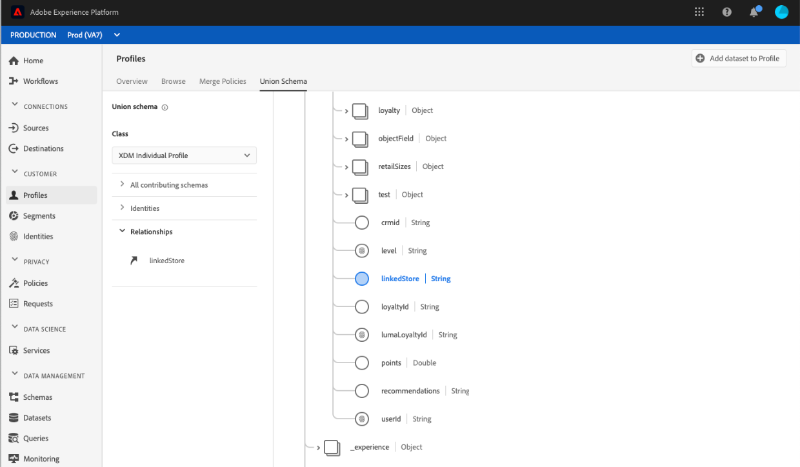

# [!UICONTROL 合并模式] UI指南

在Adobe Experience Platform用户界面(UI)中，您可以轻松视图组织内的任何合并模式，并预览特定类的字段、身份、关系和贡献模式。 本指南提供有关如何使用平台UI视图和浏览合并模式的详细信息。

## 入门指南

本UI指南需要了解与管理实 [!DNL Experience Platform] 时客户用户档案数据相关的各种服务。 在阅读本指南或在UI中工作之前，请查阅以下服务的文档：

* [[!DNL Real-time Customer Profile]](../home.md):基于来自多个来源的聚集数据提供统一、实时的消费者用户档案。
* [[!DNL Identity Service]](../../identity-service/home.md):当 [!DNL Real-time Customer Profile] 不同数据源被引入时，通过连接它们的身份实现 [!DNL Platform]。
* [[!DNL Experience Data Model] (XDM)](../../xdm/home.md):组织客户体验数 [!DNL Platform] 据的标准化框架。

## 了解合并模式

实时客户用户档案使您能够创建强大、集中的用户档案，这些事件包含客户属性和有时间戳的，客户在与Adobe Experience Platform集成的系统中进行每次交互。 此数据的格式和结构由体验数据模型(XDM)模式提供，每个模式基于XDM类并包含与该类兼容的字段。

可以为多个用例创建模式，引用同一类，但包含特定于其使用的字段。 当模式启用用户档案时，它将成为合并模式的一部分。 换言之，合并模式由多个共享同一类并已启用用户档案的模式组成。 合并模式允许您看到共享同一类的模式中包含的所有字段的合并。 实时客户用户档案使用合并模式为每位客户创建整体视图。

使用合并模式需要深入了解XDM模式。 有关详细信息，请首先阅读 [模式排版基础](../../xdm/schema/composition.md)。

## 视图合并模式

要导航到平台UI中的合并模式，请从左 **[!UICONTROL 侧导航]** 中选择用户档案 **[!UICONTROL ，然后选择]** 合并模式选项卡。 合并 [!UICONTROL 模式] 选项卡将打开，显示当前选定类的合并模式。

## 选择类

要显示特定XDM类的合并模式，请从“类”下拉菜单中选择 **[!UICONTROL 该类]** 。 由于并非所有类都具有合并模式，因此下拉列表中仅提供具有合并模式的类(即具有已启用用户档案的模式的类)。

选择某个类后，显示的模式会更新，以反映选定类的合并模式。 例如，您可以选择“ **[!UICONTROL XDM单个用户档案]** ”来视图该类的合并模式。

## 浏览合并模式

您可以浏览合并模式，方法是上下滚动以视图完整的模式结构，并选择右尖括号()以展`>`开嵌套字段。

选择任何字段以视图其详细信息，包括显示名称、数据类型、说明、路径、创建日期和上次修改日期。 您还可以视图包含所选字段的贡献模式的列表。

选择贡献模式的名称会显示与该模式相关的数据集的名称，这些数据集会将数据引入所选字段。 每个数据集名称都显示为一个链接。 选择数据集名称后，将在新窗口中打开该数据集的活动选项卡。

有关数据集的更多信息(包括查看数据集活动和在UI中预览数据集数据)，请访 [问数据集UI指南](../../catalog/datasets/user-guide.md)。

## 视图贡献模式

您还可以通过选择所有贡献视图来模式哪些特定模式对 **[!UICONTROL 合并模式有贡献]** ，以扩展模式列表。 根据您选择的类和您的组织在平台中创建的模式数，这可能是包含单个模式的短列表或包含多个模式的长列表。

选择特定模式的名称会突出显示合并模式中属于您选择的模式的字段。 选择模式后，合并模式将灰显，并显示黑条，指示作用模式的一部分的字段。

## 视图身份

通过UI，您可以视图合并模式中包含的身份列表，方法是选择“ **[!UICONTROL 身份]** ”展开列表。

从列表中选择单个标识会导致显示的模式根据需要自动更新以显示标识字段。 如果标识字段嵌套，则这可能包括扩展多个字段。

标识字段在合并模式中高亮显示，并且标识的详细信息显示在屏幕的右侧。 详细信息包括包含标识字段的贡献模式的列表，您可以向下展开以查找到与该模式相关的数据集的链接，这些数据集将数据引入所选标识字段。

## 视图关系

合并模式UI还允许您查看已根据所选模式类为模式定义的关系。 定义关系是一种连接属于不同类的两个模式的方式，以便获得更复杂的客户数据洞察。

如果已为所选类建立关系，则选择“关 **[!UICONTROL 系]** ”将显示用于创建关系的字段列表。 并非所有模式都使用或需要定义关系，因此关系部分通常不包含任何字段。

要进一步了解模式关系，包括如何使用UI定义关系，请访 [问此文档，了解模式关系](../../xdm/tutorials/relationship-ui.md)。

从列表中选择关系字段会导致显示的模式根据需要更新，以显示突出显示的关系字段。 如果关系字段嵌套，这可能包括展开多个字段。

## 后续步骤

通过阅读本指南，您现在了解如何使用UI视图和导航合并 [!DNL Experience Platform] 模式。 有关模式的更多信息（包括如何在整个平台中使用它们），请首先阅读XDM [系统概述](../../xdm/home.md)。
