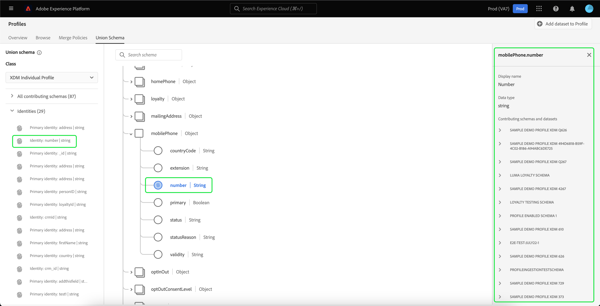

# [!UICONTROL 并集模式] UI指南

在Adobe Experience Platform用户界面(UI)中，您可以轻松查看组织内的任何合并架构，并预览特定类的字段、身份、关系和参与架构。 本指南提供了有关如何使用平台UI查看和探索并集模式的详细信息。

## 快速入门

此UI指南需要了解 [!DNL Experience Platform] 与管理实时客户资料数据有关的服务。 在阅读本指南或在UI中工作之前，请查阅以下服务的文档：

* [[!DNL Real-time Customer Profile]](../home.md):根据来自多个来源的汇总数据提供统一的实时客户资料。
* [[!DNL Identity Service]](../../identity-service/home.md):启用 [!DNL Real-time Customer Profile] 通过在引入时桥接来自不同数据源的身份 [!DNL Platform].
* [[!DNL Experience Data Model (XDM)]](../../xdm/home.md):标准化框架， [!DNL Platform] 组织客户体验数据。

## 了解并集模式

通过实时客户资料，您可以跨与Adobe Experience Platform集成的系统创建强大、集中的资料，其中包含客户属性和加盖时间戳的事件。 此数据的格式和结构由体验数据模型(XDM)架构提供，每个架构都基于XDM类，并包含与该类兼容的字段。

可以为多个用例创建架构，引用相同的类，但包含特定于其使用的字段。 在为用户档案启用架构后，该架构将成为并集架构的一部分。 换言之，合并架构由多个架构组成，这些架构共享相同的类并已为用户档案启用。 合并模式使您能够看到共享同一类的模式中包含的所有字段的合并。实时客户配置文件使用合并模式创建每个客户的整体视图。

使用并集模式需要深入了解XDM模式。 欲知更多信息，请首先阅读 [架构组合基础知识](../../xdm/schema/composition.md).

## 查看并集架构

要导航到Platform UI中的并集架构，请选择 **[!UICONTROL 用户档案]** 从左侧导航中，选择 **[!UICONTROL 并集架构]** 选项卡。 的 [!UICONTROL 并集架构] 选项卡打开以显示当前选定类的并集架构。

## 选择类

要显示特定XDM类的并集架构，请从 **[!UICONTROL 类]** 下拉列表。 由于并非所有类都具有并集架构，因此下拉列表中只提供具有并集架构的类（即具有已为用户档案启用的架构的类）。

选择某个类后，显示的架构会进行更新，以反映所选类的并集架构。 例如，您可以选择 **[!UICONTROL XDM个人配置文件]** 查看该类的并集架构。

## 探索并集模式

您可以通过上下滚动查看完整的架构结构并选择右尖括号(`>`)以展开嵌套字段。

选择任意字段可查看其详细信息，包括显示名称、数据类型、描述、路径、创建日期和上次修改日期。 您还可以查看包含您选择的字段的参与架构列表。

选择参与架构的名称会显示与该架构相关的数据集的名称，这些数据集将数据摄取到选定的字段。 每个数据集名称都显示为一个链接。 选择数据集名称后，该数据集的活动选项卡会在新窗口中打开。

有关数据集（包括在UI中查看数据集活动和预览数据集数据）的更多信息，请访问 [datasets UI指南](../../catalog/datasets/user-guide.md).

## 查看参与架构

您还可以通过选择 **[!UICONTROL 所有参与架构]** 展开架构列表。 根据您选择的类和贵组织在Platform中创建的架构数，这可以是一个包含单个架构的简短列表，也可以是一个包含多个架构的长列表。

选择特定架构的名称会突出显示并集架构中属于您所选架构的字段。 选择架构后，并集架构显示为灰显，黑色条指示参与架构的一部分字段。

## 查看标识

通过UI，您可以通过选择 **[!UICONTROL 标识]** 以展开列表。

从列表中选择单个标识会导致显示的架构根据需要自动更新以显示标识字段。 这可能包括在嵌套身份字段时展开多个字段。

标识字段在并集架构中突出显示，并且标识的详细信息显示在屏幕的右侧。 详细信息包括包含身份字段的参与架构列表，您可以向下展开以查找与将数据摄取到所选身份字段的架构相关的数据集的链接。

## 查看关系

并集架构UI还允许您查看已根据所选架构类为架构定义的关系。 定义关系是一种连接属于不同类的两个架构的方式，以便更复杂地分析客户数据。

如果已为所选类建立关系，请选择 **[!UICONTROL 关系]** 显示用于创建关系的字段列表。 并非所有架构都使用或需要定义关系，因此关系部分通常不包含任何字段。

要进一步了解架构关系，包括如何使用UI定义它们，请访问 [关于架构关系的文档](../../xdm/tutorials/relationship-ui.md).

从列表中选择关系字段会根据需要更新显示的架构，以显示突出显示的关系字段。 如果嵌套了关系字段，这可能包括展开多个字段。

## 后续步骤

通过阅读本指南，您现在可以了解如何使用 [!DNL Experience Platform] UI。 有关架构的更多信息（包括如何在整个平台中使用这些架构），请首先阅读 [XDM系统概述](../../xdm/home.md).
