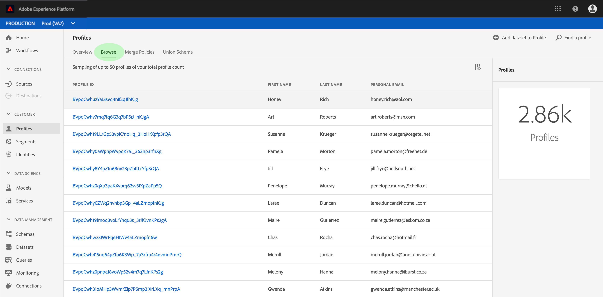
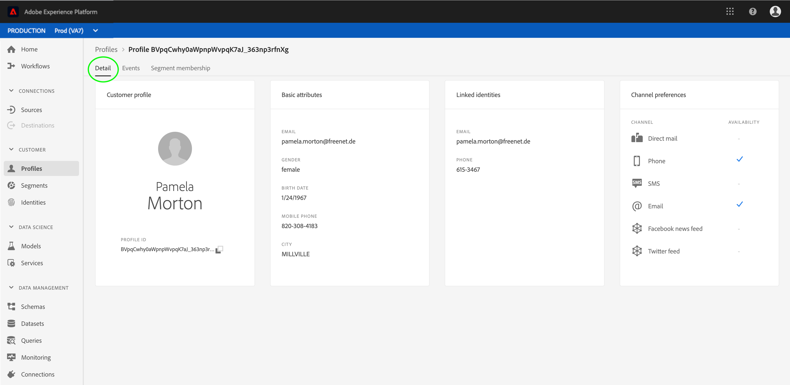

# 实时客户用户档案用户指南

实时客户用户档案可为每位客户创建整体视图，将来自多个渠道（包括在线、离线、CRM和第三方数据）的数据组合在一起。

此文档可作为与Adobe Experience Platform用户界面中实时客户用户档案交互的指南。

## 入门指南

本用户指南需要了解与实时客户用户档案管理相关的各种Experience Platform服务。 在阅读本用户指南之前，请查阅以下服务的文档：

* [实时客户用户档案](../home.md):根据来自多个来源的汇总数据提供统一、实时的消费者用户档案。
* [标识服务](../../identity-service/home.md):通过将来自不同数据源的身份引入平台，实现实时客户用户档案。
* [体验数据模型(XDM)](../../xdm/home.md):平台通过标准化框架组织客户体验数据。

## 用户档案概述

在 [Experience Platform UI中](http://platform.adobe.com)，单击左侧导 **航中的用户档案** ，以打开 _用户档案工作区中的概述___ 选项卡。 此选项卡显示多个构件，这些构件提供有关用户档案商店的高级信息，包括可寻址受众总数、上周摄取的用户档案记录数，以及同一时间段内成功和失败记录的统计信息。

## 视图用户档案样本

单击 **“浏览** ”以视图可用用户档案的示例列表。 此范例包括您的总用户档案数中最多50个 [用户档案](#profile-count)。 样本由自动作业来刷新，该作业在摄取时拾取新的用户档案数据。 每个列出的用户档案都显示其ID、名字、姓和个人电子邮件。 单击列出的用户档案的ID将在用户档案查看器中显示其详细 [信息](#profile-viewer)。

可以通过单击列选择器图标自定义列表中显示的属性。 此时会显示一个下拉列表，其中包含可添加或删除的常用用户档案属性。

### 用户档案计数 {#profile-count}

用户档案数显示您的组织在Experience Platform中拥有的用户档案总数，此时您的组织的默认合并策略已将用户档案片段合并到一起，为每个客户组成一个用户档案。 换句话说，您的组织可能有多个与跨不同渠道与您的品牌进行交互的单个客户相关的用户档案片段，但这些片段将合并在一起（根据默认合并策略），并将返回“1”个用户档案计数，因为它们都与同一个人相关。

用户档案计数还包括具有属性（记录数据）的用户档案和仅包含时间序列(事件)数据的用户档案(如Adobe Analytics用户档案)。 该计数会定期刷新，以提供平台内的最新用户档案总数。 每当用户档案摄取量增加或减少计数5%以上时，都会自动触发作业以更新计数。 如果您的组织使用流摄取，则作业计划每小时运行一次以获取新摄取的数据。

### 用户档案搜索

如果您知道特定用户档案的链接标识（如其电子邮件地址），则可以单击“查找用户档案”查找该 **用户档案**。 这是访问特定用户档案的最可靠方式，无论该列表是否出现在样本中。

在出现的对话框中，从下拉式列表（本例中的“电子邮件”）中选择相应的ID命名空间，然后在下面输入ID值，然后单击“确 **定”**。 如果找到，则目标用户档案的详细信息将显示在用户档案查看器中，如下一节所述。

### 用户档案查看器 {#profile-viewer}

选择或搜索特定用户档案后，用户档案查看器 _的_ “详细信息”屏幕将打开。 此页显示有关选定用户档案的信息，如用户档案的基本属性、链接身份和可用的联系人渠道。 显示的用户档案信息已从多个用户档案片段合并到一起，以形成单个客户的单个视图。

用户档案查看器还提供了选项卡，允许您视图与此用户档案关联的事件和区段成员关系（如果有）。

## 合并策略

单击 **合并策略** ，以视图属于您组织的一列表合并策略。 每个列出的策略都显示其名称，无论它是否为默认的合并策略，以及它所应用的模式。

有关在UI中使用合并策略的详细信息，请参阅 [mMerge策略用户指南](merge-policies.md)。

## 合并模式

单击 **合并模式** ，以视图用户档案数据存储的合并模式。 合并模式是同一类下的所有体验数据模型(XDM)字段的合并，该类的模式已用于实时客户用户档案。 单击左侧列表中的类以在画布中视图其合并模式的结构。

有关合并模式及其在实时客户用户档案中的 [角色的更多信息](../../xdm/schema/composition.md) ，请参阅模式构图指南中关于合并模式的部分。

## 后续步骤

阅读本指南，您现在可以了解如何使用Experience Platform UI视图和管理用户档案数据。 有关如何利用实时客户用户档案数据生成受众细分的信息，请参阅细分 [文档](../../segmentation/home.md)。