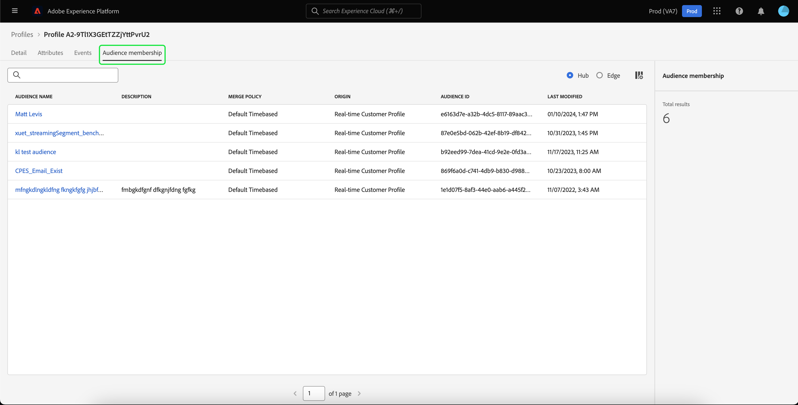

# [!DNL Real-Time Customer Profile] UI 指南

[!DNL Real-Time Customer Profile]为每个客户创建整体视图，结合来自多个渠道的数据，包括在线、离线、CRM和第三方数据。 本文档用作在Adobe Experience Platform用户界面(UI)中与[!DNL Real-Time Customer Profile]数据交互的指南。

## 快速入门

此UI指南要求您了解与管理[!DNL Experience Platform]有关的各种[!DNL Real-Time Customer Profiles]服务。 在阅读本指南或使用UI之前，请查看以下服务的文档：

* [[!DNL Real-Time Customer Profile] 概述](../home.md)：根据来自多个源的汇总数据，提供统一的实时使用者个人资料。
* [[!DNL Identity Service]](../../identity-service/home.md)：在将[!DNL Real-Time Customer Profile]引入到[!DNL Experience Platform]中时，通过桥接来自不同数据源的标识来启用它们。
* [[!DNL Experience Data Model (XDM)]](../../xdm/home.md)： [!DNL Experience Platform]用于组织客户体验数据的标准化框架。

## [!UICONTROL 概述]

在Experience Platform UI中，从左侧导航中选择&#x200B;**[!UICONTROL 配置文件]**&#x200B;以打开显示配置文件仪表板的&#x200B;**[!UICONTROL 概述]**&#x200B;选项卡。

>[!NOTE]
>
>如果您的组织是Experience Platform的新用户，并且尚未创建活动配置文件数据集或合并策略，则[!UICONTROL 配置文件]仪表板不可见。 相反，[!UICONTROL 概述]选项卡显示链接和文档，以帮助您开始使用实时客户个人资料。

### 轮廓仪表板 {#profile-dashboard}

配置文件仪表板概述了与组织配置文件数据相关的关键量度。

若要了解详细信息，请访问[个人资料仪表板指南](../../dashboards/guides/profiles.md)。

## [!UICONTROL 浏览]选项卡

在&#x200B;**[!UICONTROL 浏览]**&#x200B;选项卡上，通过选择切换开关，您可以在&#x200B;**卡片**&#x200B;视图或&#x200B;**图形**&#x200B;视图中查看配置文件。

此外，您可以使用合并策略浏览配置文件，或使用身份命名空间和值查找特定配置文件。

### 按[!UICONTROL 合并策略]浏览

默认情况下，**[!UICONTROL 浏览]**&#x200B;选项卡设置为您组织的默认合并策略。 要选择其他合并策略，请选择合并策略名称旁边的`X`，然后使用该选择器打开&#x200B;**[!UICONTROL 选择合并策略]**&#x200B;对话框。

>[!NOTE]
>
>如果未选择合并策略，请使用&#x200B;**[!UICONTROL 合并策略]**&#x200B;字段旁边的选择器按钮打开选择对话框。

要从&#x200B;**[!UICONTROL 选择合并策略]**&#x200B;对话框中选择合并策略，请选择策略名称旁边的单选按钮，然后使用&#x200B;**[!UICONTROL 选择]**&#x200B;返回[!UICONTROL 浏览]选项卡。 然后，您可以选择&#x200B;**[!UICONTROL 视图]**&#x200B;以刷新示例配置文件并查看应用了新合并策略的配置文件采样。

显示的配置文件表示在应用所选合并策略后，从您组织的配置文件存储区中选择最多20个配置文件的示例。 将新数据添加到贵组织的配置文件存储区后，将刷新所选合并策略的示例配置文件。

要查看其中一个示例配置文件的详细信息，请选择&#x200B;**[!UICONTROL 配置文件ID]**。 有关详细信息，请参阅本指南稍后关于[查看配置文件详细信息](#profile-detail)的部分。

要了解有关合并策略及其在Experience Platform中的角色的更多信息，请参阅[合并策略概述](../merge-policies/overview.md)。

### 按[!UICONTROL 标识]浏览 {#browse-identity}

在&#x200B;**[!UICONTROL 浏览]**&#x200B;选项卡上，您可以使用标识命名空间来按标识值查找特定配置文件。 按身份浏览需要您提供合并策略、身份命名空间和身份值。

如有必要，请使用&#x200B;**[!UICONTROL 合并策略]**&#x200B;选择器打开&#x200B;**[!UICONTROL 选择合并策略]**&#x200B;对话框，然后选择要使用的合并策略。

然后使用&#x200B;**[!UICONTROL 身份命名空间]**&#x200B;选择器打开&#x200B;**[!UICONTROL 选择身份命名空间]**&#x200B;对话框并选择要搜索的命名空间。 如果贵组织具有多个命名空间，则可以使用对话框中的搜索栏开始键入命名空间的名称。

您可以选择命名空间来查看其他详细信息，也可以选择单选按钮来选择命名空间。 然后，您可以使用&#x200B;**[!UICONTROL 选择]**&#x200B;继续。

选择[!UICONTROL 身份命名空间]并返回[!UICONTROL 浏览]选项卡后，您可以输入与所选命名空间相关的&#x200B;**[!UICONTROL 身份值]**。

>[!NOTE]
>
>此值特定于单个客户配置文件，并且必须是所提供命名空间的有效条目。 例如，选择身份命名空间“Email”将需要有效电子邮件地址形式的身份值。

输入值后，选择&#x200B;**[!UICONTROL 视图]**，并返回与该值匹配的单个配置文件。 选择&#x200B;**[!UICONTROL 配置文件ID]**&#x200B;以查看配置文件。

## 查看配置文件 {#view-profile}

>[!CONTEXTUALHELP]
>id="platform_errors_uplib_201001_404"
>title="未找到实体"
>abstract="这意味着 Experience Platform 找不到所请求的实体。要解决此错误，请尝试以下解决方案之一：<ul><li>确保您尝试访问的实体的 URL 中列出了正确的轮廓 ID。</li><li>确保您拥有适合您尝试访问的实体的相应的组织和沙盒组合。</li></ul>"

选择&#x200B;**[!UICONTROL 配置文件ID]**&#x200B;后，**[!UICONTROL 详细信息]**&#x200B;选项卡将打开。 显示在&#x200B;**[!UICONTROL 详细信息]**&#x200B;选项卡上的配置文件信息已从多个配置文件片段合并在一起，形成单个客户的视图。 这包括客户详细信息，如基本属性、链接身份和渠道偏好设置。

此外，您还可以查看有关配置文件的其他详细信息，如其[属性](#attributes)、[事件](#events)和[受众成员资格](#audience-membership)。

### “详细信息”选项卡 {#profile-detail}

**[!UICONTROL 详细信息]**&#x200B;选项卡提供有关所选配置文件的更多详细信息，并分为四个部分：客户配置文件分析、AI insight构件、可自定义构件和自动分类构件。

此外，您可以切换是否显示AI生成的洞察、显示与边缘相比的集线器详细信息，以及在图形视图中查看详细信息。

#### 客户轮廓洞察 {#customer-profile-insights}

**[!UICONTROL 客户个人资料分析]**&#x200B;部分显示个人资料属性的简短介绍。 这包括用户档案ID、电子邮件、电话号码、性别、出生日期，以及用户档案的身份和受众成员资格。

#### AI 洞察小组件 {#ai-insight-widgets}

[!BADGE Alpha]{type=Informative}此功能当前位于Alpha中。

**[!UICONTROL AI insight小组件]**&#x200B;部分显示由AI生成的小组件。 这些小组件根据配置文件数据(包括人口统计信息（如年龄、性别或位置）、用户行为（如购买历史记录、网站活动或社交媒体参与）以及心理图形（如兴趣、偏好或生活方式选择），提供对配置文件的快速见解。 所有AI小组件都使用配置文件中已存在&#x200B;****&#x200B;的数据。

#### 可定制的小组件 {#customizable-widgets}

**[!UICONTROL 可自定义构件]**&#x200B;部分显示您可自定义以符合业务需求的构件。 您可以将属性分组到单独的构件中、删除不需要的构件或调整构件的布局。

显示的默认字段也可以在组织级别更改以显示首选用户档案属性。 要了解有关自定义这些字段的更多信息，包括添加和删除属性以及调整仪表板面板大小的分步说明，请阅读[配置文件详细信息自定义指南](profile-customization.md)。

您还可以选择在查看属性名称作为其显示名称与字段路径名称之间进行切换。 若要在这两个显示之间切换，请选择&#x200B;**[!UICONTROL 显示显示名称]**&#x200B;切换开关。

#### 自动分类的小组件 {#auto-classified-widgets}

[!BADGE Alpha]{type=Informative}此功能当前位于Alpha中。

**[!UICONTROL 自动分类小组件]**&#x200B;部分显示利用合并架构确定属性所属的源字段组的小组件，提供有关数据来源位置的更清晰的上下文。 您可以使用搜索栏更轻松地在构件中查找关键字。

这些小组件将事件数据（与体验事件小组件）和属性数据相结合，使您能够统一查看配置文件。 您可以使用这些构件来探索用户档案数据的结构，以便更好地构建[可自定义构件](#customizable-widgets)。

>[!NOTE]
>
>如果有多个源字段组，则小组件将仅使用可用选项中的&#x200B;**one**。

### “属性”选项卡 {#attributes}

**[!UICONTROL 属性]**&#x200B;选项卡提供了一个列表视图，该视图汇总了应用指定的合并策略后与单个配置文件相关的所有属性。

通过选择&#x200B;**[!UICONTROL 查看JSON]**，也可以将这些属性视为JSON对象。 对于希望更好地了解如何将配置文件属性摄取到Experience Platform中的任何用户，此功能非常有用。

要查看Edge上可用的属性，请在数据位置选择器上选择&#x200B;**[!UICONTROL Edge]**。

有关边缘配置文件的详细信息，请阅读[边缘配置文件文档](../edge-profiles.md)。

### “事件”选项卡 {#events}

**[!UICONTROL 事件]**&#x200B;选项卡包含与客户关联的100个最新ExperienceEvents中的数据。 此数据可能包括电子邮件打开次数、购物车活动和页面查看次数。 为任何单个事件选择&#x200B;**[!UICONTROL 查看全部]**&#x200B;将提供附加字段和值作为事件的一部分捕获。

通过选择以&#x200B;**[!UICONTROL 查看JSON]**，还可以将事件视为JSON对象。 这有助于了解如何在Experience Platform中捕获事件。

### “受众成员资格”选项卡 {#audience-membership}

**[!UICONTROL 受众成员资格]**&#x200B;选项卡显示一个列表，其中包含单个客户配置文件当前所属受众的名称和描述。 当配置文件符合受众资格或过期时，此列表会自动更新。 配置文件当前符合条件的受众总数，将显示在选项卡的右侧。

有关Experience Platform中分段的更多信息，请参阅[Adobes Experience Platform分段服务文档](../../segmentation/home.md)。

要查看Edge上可用配置文件的受众成员资格，请在数据位置选择器中选择&#x200B;**[!UICONTROL Edge]**。 有关边缘分段的更多信息，请参阅[边缘分段指南](../../segmentation/methods/edge-segmentation.md)。

## 合并策略

从主&#x200B;**[!UICONTROL 配置文件]**&#x200B;菜单中，选择&#x200B;**[!UICONTROL 合并策略]**&#x200B;选项卡以查看属于您组织的合并策略列表。 每个列出的策略都会显示其名称（无论其是否为默认合并策略）及其应用的架构类。

有关合并策略的详细信息，请参阅[合并策略概述](../merge-policies/overview.md)。

## 并集架构 {#union-schema}

从主&#x200B;**[!UICONTROL 配置文件]**&#x200B;菜单中，选择&#x200B;**[!UICONTROL 合并架构]**&#x200B;选项卡，以查看所摄取数据的可用合并架构。 合并架构是同一类下所有[!DNL Experience Data Model] (XDM)字段的合并，这些字段的架构已在[!DNL Real-Time Customer Profile]中启用。

有关合并架构的详细信息，请访问[合并架构UI指南](union-schema.md)。

## 计算属性 {#computed-attributes}

从主&#x200B;**[!UICONTROL 配置文件]**&#x200B;菜单中，选择&#x200B;**[!UICONTROL 计算属性]**&#x200B;选项卡以查看属于您组织的计算属性列表。

有关计算属性的详细信息，请阅读[计算属性概述](../computed-attributes/overview.md)。 有关如何在Experience Platform UI中使用计算属性的更多信息，请参阅[计算属性UI指南](../computed-attributes/ui.md)。

## 后续步骤

通过阅读本指南，您可以了解如何使用Experience Platform UI查看和管理组织的配置文件数据。 有关如何使用Experience Platform API处理配置文件数据的信息，请参阅[实时客户配置文件API指南](../api/overview.md)。
