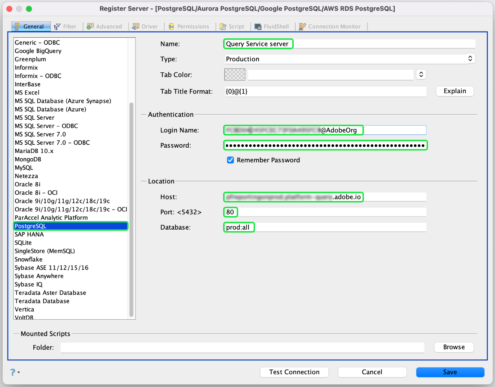

# 连接 [!DNL Aqua Data Studio]

这家文档步行前往与Adobe Experience Platform [!DNL Aqua Data Studio] 连接 [!DNL Query Service]。

安装完 [!DNL Aqua Data Studio]成后，必须先注册服务器。 在主菜单中，单击“服 **[!UICONTROL 务器]**”，然后单击“ **[!UICONTROL 注册服务器”]**。

出现“ **[!UICONTROL 注册服务器]** ”对话框。 在“ **[!UICONTROL 常规]** ”选项卡 **[!UICONTROL 下]** ，从左侧的列表中选择PostgreSQL。 在显示的对话框中，提供以下服务器设置的详细信息。

- **[!UICONTROL 名称]**:连接的名称。
- **[!UICONTROL 登录名和口令]**:将使用的登录凭据。 用户名采用的形式 `ORG_ID@AdobeOrg`。
- **[!UICONTROL 主机和端口]**:主机端点及其端口 [!DNL Query Service]。 必须使用端口80连接 [!DNL Query Service]。
- **[!UICONTROL 数据库]:** 将使用的数据库。

>[!NOTE]
>
>有关查找登录凭据、主机、端口和数据库名称的详细信息，请访 [问平台上的凭据页](https://platform.adobe.com/query/configuration)。 要查找凭据，请登录， [!DNL Platform]单击 **[!UICONTROL 查询]**，然后单 **[!UICONTROL 击凭据]**。

Select the **[!UICONTROL Driver]** tab. 在“ **[!UICONTROL 参数]**”下，将值设置为 `?sslmode=require`

输入连接详细信息后，单击“ **[!UICONTROL 测试连接]** ”以确保凭据正常工作。 如果连接成功，请单击“保 **[!UICONTROL 存]** ”以注册服务器。 成功注册后， **仪表板** 上会显示连接，确认您现在可以连接到服务器并视图其模式对象。

## 后续步骤

现在，您已连接 [!DNL Query Service]到，可以使用 **[!UICONTROL 中的查询分]**[!DNL Aqua Data Studio] 析器执行和编辑SQL语句。 有关如何编写和运行查询的更多信息，请阅读运 [行查询指南](../creating-queries/creating-queries.md)。