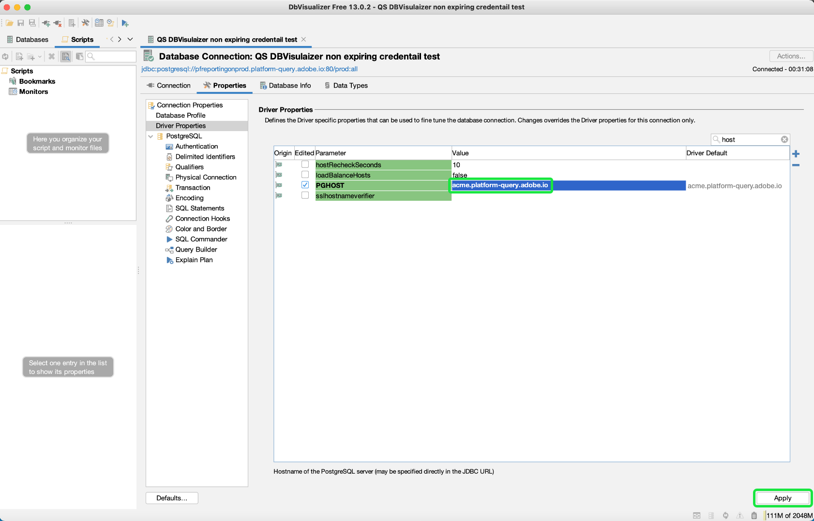

# 连接 [!DNL DbVisualizer] to [!DNL Query Service] {#connect-dbvisualizer}

本文档介绍了连接 [!DNL DbVisualizer] 使用Adobe Experience Platform的数据库工具 [!DNL Query Service].

## 快速入门

本指南要求您已拥有 [!DNL DbVisualizer] 桌面应用程序，熟悉如何导航其界面。 要下载 [!DNL DbVisualizer] 桌面应用程序或有关更多信息，请参阅 [官方 [!DNL DbVisualizer] 文档](https://www.dbvis.com/download/).

>[!NOTE]
>
>有 [!DNL Windows], [!DNL macOS]和 [!DNL Linux] 版本 [!DNL DbVisualizer]. 本指南中的屏幕截图是使用 [!DNL macOS] 桌面应用程序。 版本之间的UI可能存在细微差异。

获取连接所需的凭据 [!DNL  DbVisualizer] 要Experience Platform，您必须有权访问平台UI中的“查询”工作区。 如果您当前无权访问“查询”工作区，请联系您的IMS组织管理员。

## 创建数据库连接 {#connect-database}

在本地计算机上安装桌面应用程序后，请启动该应用程序并选择 **[!DNL Create a Database Connection]** 从初始 [!DNL DbVisualizer] 菜单。 然后选择 **[!DNL Create a Connection]** 在右侧的面板中。

![的 [!DNL DbVisualizer] 主菜单中突出显示了“创建数据库连接”。](../images/clients/dbvisualizer/create-db-connection.png)

使用搜索栏或选择 [!DNL PostgreSQL] 从驱动程序名称下拉列表中。 出现“Database Connection（数据库连接）”工作区。

![驱动程序名称下拉菜单，其中 [!DNL PostgreSQL] 突出显示。](../images/clients/dbvisualizer/driver-name.png)

### 设置连接的属性 {#properties}

从数据库连接工作区中，选择 **[!DNL Properties]** 选项卡，接着是 **[!DNL Driver Properties]** 中。

接下来，输入下表中描述的驱动程序属性。

>[!IMPORTANT]
>
>要将DBVisualizer与Adobe Experience Platform连接，必须启用SSL的使用。 请参阅 [SSL模式文档](./ssl-modes.md) 了解对与Adobe Experience Platform查询服务的第三方连接的SSL支持，以及如何使用 `verify-full` SSL模式。

| 属性 | 描述 |
| ------ | ------ |
| `PGHOST` | 的主机名 [!DNL PostgreSQL] 服务器。 此值是您的Experience Platform **[!UICONTROL 主机] 凭据**. |
| `ssl` | 定义SSL值 `1` 启用SSL。 |
| `sslmode` | 这控制SSL保护的级别。 建议您使用 `require` 将第三方客户端连接到Adobe Experience Platform时的SSL模式。 的 `require` 模式可确保在所有通信上都需要加密，并且网络可靠地连接到正确的服务器。 不需要服务器SSL证书验证。 |
| `user` | 连接到数据库的用户名是您的组织ID。 它是以 `@Adobe.Org`. 此值是您的Experience Platform **[!UICONTROL 用户名] 凭据**. |

使用搜索栏查找每个属性，然后为参数值选择相应的单元格。 单元格将以蓝色突出显示。 在值字段中输入Platform凭据，然后选择 **[!DNL Apply]** 添加驱动程序属性。

>[!NOTE]
>
>添加秒 `user` 配置文件，选择 `user` 从参数列中，选择蓝色的+（加号）图标，以添加每个用户的凭据。 选择 **[!DNL Apply]** 添加驱动程序属性。

的 [!DNL Edited] 列显示复选标记以表示参数值已更新。

### 输入[!DNL Query Service] 凭据

要查找将BBVisualizer与查询服务连接所需的凭据，请登录到平台UI，然后选择 **[!UICONTROL 查询]** 从左侧导航，然后是 **[!UICONTROL 凭据]**. 有关查找 **主机**, **端口**, **数据库**, **用户名**&#x200B;和 **密码** 凭据，请阅读 [凭据指南](../ui/credentials.md).

>[!IMPORTANT]
>
>[!DNL Query Service] 此外，还提供了未过期的凭据，以便能够与第三方客户端进行一次性设置。 请参阅相关文档 [有关如何生成和使用未过期凭据的完整说明](../ui/credentials.md#non-expiring-credentials). 如果要将BDVisualizer作为一次性设置进行连接，则必须完成此过程。 的 `credential` 和 `technicalAccountId` 获取的值包括DBVisualizer的值 `password` 参数。

## 身份验证

要在每次建立连接时都需要用户ID和基于密码的身份验证，请选择 **[!DNL Authentication]** 从下方的导航侧栏 [!DNL PostgreSQL].

在连接身份验证面板中，检查 **[!DNL Require Userid]** 和 **[!DNL Require Password]** 复选框，然后选择 **[!DNL Apply]**.

![的“身份验证”面板 [!DNL PostgreSQL] 与“需要用户ID”和“密码”复选框的数据库连接突出显示。](../images/clients/dbvisualizer/connection-authentication.png)

## 连接到平台

您可以使用过期或未过期的凭据建立连接。 要建立连接，请选择 **[!DNL Connection]** 选项卡，并输入以下设置的Experience Platform凭据。

>[!NOTE]
>
>除非参数描述中有说明，否则下表中BDVisualizer要求的所有凭据对于过期和未过期的凭据都是相同的。

| 连接参数 | 描述 |
|---|---|
| **[!UICONTROL 名称]** | 为连接创建名称。 建议您提供一个人类易记的名称来识别连接。 |
| **[!UICONTROL 数据库服务器]** | 这是您的Experience Platform **[!UICONTROL 主机]** 凭据。 |
| **[!UICONTROL 数据库端口]** | 的端口 [!DNL Query Service]. 必须使用端口 **80** 连接 [!DNL Query Service]. |
| **[!UICONTROL 数据库]** | 使用Experience Platform **[!UICONTROL 数据库]** 凭据值： `prod:all`. |
| **[!UICONTROL 数据库用户ID]** | 这是您的平台组织ID。 使用Experience Platform **[!UICONTROL 用户名]** 凭据值。 该ID的格式为 `ORG_ID@AdobeOrg`. |
| **[!UICONTROL 数据库密码]** | 此字母数字字符串是您的Experience Platform **[!UICONTROL 密码]** 凭据。如果要使用未过期的凭据，此值是 `technicalAccountID` 和 `credential` 在配置JSON文件中下载。 密码值采用以下形式：{technicalAccountId}:{credential}。 用于未过期凭据的配置JSON文件是在初始化期间一次性下载，Adobe不会保留的副本。 |

输入所有相关凭据后，选择 **[!DNL Connect]**.

![的 [!DNL PostgreSQL] 使用“连接”选项卡和“连接”按钮突出显示“数据库连接”工作区。](../images/clients/dbvisualizer/connect.png)

的 [!DNL Connect] 会议第一次举行时，会议将举行对话。

![连接： [!DNL PostgreSQL] 对话框中，数据库用户ID和数据库密码文本字段突出显示。](../images/clients/dbvisualizer/connect-dialog.png)

输入用户ID和密码，然后选择 **[!DNL Connect]**. 日志中会显示一条消息，确认连接成功。

## 后续步骤

现在，您已连接 [!DNL DbVisualizer] with [!DNL Query Service]，您可以使用 [!DNL DbVisualizer] 来编写查询。 有关如何编写和运行查询的详细信息，请阅读 [查询执行指南](../best-practices/writing-queries.md).
