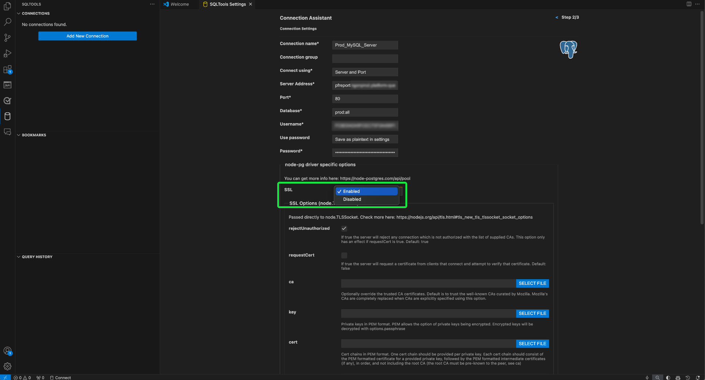

# 将[!DNL GitHub Copilot]和[!DNL Visual Studio Code]连接到查询服务

>[!IMPORTANT]
>
>在使用此集成工具之前，您必须了解与GitHub共享的数据。 共享数据包括有关正在编辑的代码和文件的上下文信息（“提示”）以及有关用户操作的详细信息（“用户参与数据”）。  请查阅[[!DNL GitHub Copilot]的隐私声明](https://docs.github.com/en/site-policy/privacy-policies/github-general-privacy-statement#github-privacy-statement)以了解他们收集的数据。 您还必须考虑涉及第三方服务的安全影响，因为您有责任确保遵守组织的数据治理策略。 对于使用此工具时可能产生的任何数据相关问题，Adobe概不负责。 有关更多信息，请参阅GitHub的文档。

[!DNL GitHub Copilot]由OpenAI Codex提供支持，是一种AI驱动的工具，它通过直接在编辑器中建议代码片段和整个函数来增强编码体验。 与[!DNL Visual Studio Code] ([!DNL VS Code])集成，[!DNL Copilot]可以显着加快您的工作流程，尤其是在处理复杂查询时。 按照本指南了解如何将[!DNL GitHub Copilot]和[!DNL VS Code]连接到查询服务，以便更高效地编写和管理您的查询。 有关[!DNL Copilot]的详细信息，请访问[GitHub的Copilot产品页](https://github.com/pricing)和[官方 [!DNL Copilot] 文档](https://docs.github.com/en/copilot/about-github-copilot/what-is-github-copilot)。

本文档介绍了使用Adobe Experience Platform查询服务连接[!DNL GitHub Copilot]和[!DNL VS Code]所需的步骤。

## 快速入门 {#get-started}

本指南要求您已经拥有GitHub帐户的访问权限并注册了[!DNL GitHub Copilot]。 您可以[从GitHub网站](https://github.com/github-copilot/signup)注册。 您还需要[!DNL VS Code]。 您可从他们的官方网站[&#128279;](https://code.visualstudio.com/download)下载1&rbrace;。 [!DNL VS Code] 

安装[!DNL VS Code]并激活[!DNL Copilot]订阅后，获取Experience Platform的连接凭据。 这些凭据位于Experience Platform UI中[!UICONTROL 查询]工作区的[!UICONTROL 凭据]选项卡中。 阅读[的凭据指南，了解如何在Experience Platform UI](../ui/credentials.md)中找到这些值。 如果您当前无权访问[!UICONTROL 查询]工作区，请联系您的组织管理员。

### 所需的[!DNL Visual Studio Code]扩展 {#required-extensions}

需要以下[!DNL Visual Studio Code]扩展才能直接在代码编辑器中有效地管理和查询Experience Platform SQL数据库。 下载并安装这些扩展。

- [SQLTools](https://marketplace.visualstudio.com/items?itemName=mtxr.sqltools)：使用SQLTools扩展管理和查询多个SQL数据库。 它包含查询运行器、SQL格式器和连接资源管理器等功能，并支持其他驱动程序以提高开发人员的工作效率。 有关详细信息，请阅读Visual Studio Marketplace上的概述。
- [SQLTools PostgreSQL/Cockroach驱动程序](https://marketplace.visualstudio.com/items?itemName=mtxr.sqltools-driver-pg)：此扩展允许您直接在代码编辑器中连接、查询和管理PostgreSQL和CockroachDB数据库。

后续扩展将启用[!DNL GitHub Copilot]及其聊天功能。

- [[!DNL GitHub Copilot]](https://marketplace.visualstudio.com/items?itemName=GitHub.copilot)：在您键入时提供内联编码建议。
- [[!DNL GitHub Copilot] Chat](https://marketplace.visualstudio.com/items?itemName=GitHub.copilot-chat)：提供对话式AI帮助的伴随扩展。

## 创建连接 {#create-connection}

选择圆柱图标()，后跟&#x200B;**[!DNL Add New Connection]**&#x200B;或圆柱加号图标（）。[!DNL VS Code]

出现&#x200B;**[!DNL Connection Assistant]**。 选择&#x200B;**[!DNL PostgreSQL]**&#x200B;数据库驱动程序。

![在[!DNL VS Code]中突出显示PostgreSQl的SQLTools设置页。](../images/clients/github-copilot/postgres-database-driver.png)

### 输入连接设置 {#input-connection-settings}

出现[!DNL Connection Settings]视图。 在SQLTools [!DNL Connection Assistant]的相应字段中输入您的Experience Platform连接凭据。 下表说明了所需的值。

| 属性 | 描述 |
| --- |--- |
| [!DNL Connection name] | 提供诸如`Prod_MySQL_Server`之类的“[!DNL Connection name]”，它具有描述性并清楚地指示其用途（例如，用于MySQL服务器的生产环境）。 最佳实践包括： <ul><li>遵循贵组织的命名惯例，以确保该名称在系统中唯一。</li><li>保持简明扼要，以保持清晰度并避免与其他连接混淆。</li><li>在名称中包含有关连接功能或环境的相关详细信息。</li></ul> |
| [!DNL Connect using] | 使用&#x200B;**[!DNL Server and Port]**&#x200B;选项指定服务器地址（主机名）和端口号，以建立与Experience Platform的直接连接 |
| [!DNL Server address] | 输入在Experience Platform Postgres凭据中提供的&#x200B;**[!UICONTROL 主机]**&#x200B;值，如`acmeprod.platform-query.adobe.io`。 |
| [!DNL Port] | 对于Experience Platform服务，此值通常为`80`。 |
| [!DNL Database] | 输入在Experience Platform Postgres凭据中提供的&#x200B;**[!UICONTROL 数据库]**&#x200B;值，如`prod:all`。 |
| [!DNL Username] | 此属性是指您的组织ID。 输入在Experience Platform Postgres凭据中提供的&#x200B;**[!UICONTROL 用户名]**&#x200B;值。 |
| [!DNL Password] | 此属性是您的访问令牌。 输入在Experience Platform Postgres凭据中提供的&#x200B;**[!UICONTROL 密码]**&#x200B;值。 |

接下来，选择&#x200B;**[!DNL Use Password]**，然后从出现的下拉菜单中选择&#x200B;**[!DNL Save as plaintext in settings]**。 出现[!DNL Password]字段。 使用此文本输入字段输入您的访问令牌。

最后，要启用SSL，请选择[!DNL SSL]输入字段，然后从显示的下拉菜单中选择[!DNL Enabled]。

>[!TIP]
>
>输入所有凭据后，您可以在保存连接之前测试连接。 向下滚动到工作区的底部并选择&#x200B;**[!DNL Test Connection]**。
>
>{width="100" zoomable="yes"}

正确输入连接详细信息后，选择&#x200B;**[!DNL Save Connection]**&#x200B;以确认设置。

将显示[!DNL Review connection details]视图并显示您的连接凭据。 当您确定连接详细信息准确时，请选择&#x200B;**[!DNL Connect Now]**。

您的[!DNL VS Code]工作区随来自[!DNL GitHub Copilot]的建议一起出现。

![在[!DNL VS Code].](../images/clients/github-copilot/connected.png)中连接的SQL会话

## [!DNL GitHub Copilot]快速指南

连接到您的Experience Platform实例后，您可以使用[!DNL Copilot]作为AI编码助手，帮助您更快更自信地编写代码。 本节介绍其主要功能及其使用方式。

## [!DNL GitHub Copilot] 入门 {#get-started-with-copilot}

首先，确保您已安装[!DNL VS Code]的最新版本。 过时的[!DNL VS Code]版本可能会阻止键[!DNL Copilot]功能按预期工作。 接下来，请确保已启用[!DNL Enable Auto Completions]设置。 如果[!DNL Copilot]运行正常，则状态栏中会显示&#x200B;**[!DNL Copilot]图标** （）（如果有问题，则会显示[!DNL Copilot]错误图标）。 选择&#x200B;**[!DNL Copilot]图标**&#x200B;以打开[!DNL [!DNL GitHub Copilot]菜单]。 从&#x200B;**[!DNL [!DNL GitHub Copilot]菜单]**&#x200B;中选择&#x200B;**[!DNL Edit Settings]**

![显示[!DNL GitHub Copilot Menu]并突出显示[!DNL Copilot]图标和“编辑设置”的[!DNL VS Code]编辑器。](../images/clients/github-copilot/github-copilot-menu.png)

向下滚动选项，并确保为[!DNL Enable Auto Completions]设置启用该复选框。

![选中并突出显示“启用自动完成”复选框的[!DNL GitHub Copilot]的设置面板。](../images/clients/github-copilot/enable-auto-completions.png)

## 代码完成 {#code-completions}

安装[!DNL GitHub Copilot]扩展并登录后，它会自动激活名为&#x200B;**Ghost Text**&#x200B;的功能，此功能会在您键入时建议代码完成。 这些建议可帮助您更有效地编写代码，并且中断较少。 您还可以使用注释来指导AI代码建议。 这意味着非技术用户可以将纯语音转换为代码以浏览其数据。

![带有代码建议的VSCode UI和突出显示的[!DNL GitHub Copilot]图标。](../images/clients/github-copilot/ghost-text.png)

>[!TIP]
>
>如果要为特定文件或语言禁用[!DNL Copilot]，请选择状态栏中的图标并禁用它。

### 接受完整的或部分重影文本建议 {#accept-suggestions}

当[!DNL GitHub Copilot]建议代码完成时，您可以接受部分或完整的建议。 选择&#x200B;**Tab**&#x200B;接受整个建议，或按住&#x200B;**Control(或Mac上的Command)**&#x200B;并按&#x200B;**向右箭头**&#x200B;接受部分文本。 若要取消建议，请按&#x200B;**Escape**。

>[!TIP]
>  
>如果未获得建议，请确保以文件的语言[&#128279;](#get-started-with-copilot)启用[!DNL Copilot] 。

![在[!DNL VS Code]编辑器中，部分键入的代码旁边显示[!DNL GitHub Copilot]的灰色文本建议为Ghost Text。](../images/clients/github-copilot/accept-partial-suggestions.png)

### 替代建议 {#alternative-suggestions}

若要循环显示替代代码建议，请在[!DNL Copilot]对话框中选择箭头。

![显示Copilot替代建议面板的[!DNL VS Code]编辑器。](../images/clients/github-copilot/code-suggestions.png)

## 使用内联聊天 {#inline-chat}

您还可以直接与[!DNL Copilot]聊天有关您的代码。 使用&#x200B;**Control（或Command） + I**&#x200B;触发内联聊天对话框。 此功能用于循环处理您的代码并在上下文中优化建议。 您可以突出显示代码块，并在接受之前使用内联聊天查看AI提出的其他解决方案。

<!-- THis section is poss unnecessary:
There are inline features for chat including doc, expalin, fix and test

 -->

## 专用聊天视图 {#dedicated-chat}

您可以使用更传统的聊天界面和专用的聊天侧边栏来形成想法和策略、解决编码问题并讨论实施详细信息。 选择聊天图标(![Copilot聊天图标。[!DNL VS Code]侧边栏中的](../images/clients/github-copilot/chat-icon.png))打开专用聊天窗口。

![突出显示聊天图标的[!DNL GitHub Copilot]聊天边栏。](../images/clients/github-copilot/chat-sidebar.png)

您还可以通过选择历史记录图标（)。

## 后续步骤

您现在可以从代码编辑器高效地直接查询Experience Platform数据库，并使用[!DNL GitHub Copilot]的AI支持的代码建议来简化编写和优化SQL查询。 有关如何编写和运行查询的详细信息，请参阅查询执行的[指南](../best-practices/writing-queries.md)。
