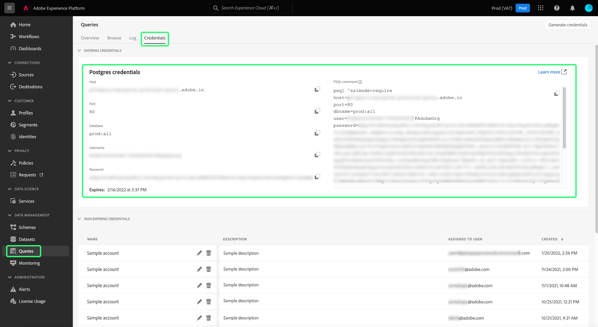

# 将[!DNL Looker]连接到查询服务

本文档介绍了将[!DNL Looker]与Adobe Experience Platform [!DNL Query Service]连接的步骤。

>[!NOTE]
>
> 本指南假定您已具有访问[!DNL Looker]的权限并熟悉如何导航其界面。 有关[!DNL Looker]的详细信息，请参阅[官方 [!DNL Looker] 文档](https://docs.looker.com/)。

## 创建新的数据库连接 {#create-connection}

登录[!DNL Looker]后，依次选择&#x200B;**[!DNL Admin]**&#x200B;和&#x200B;**[!DNL Connections]**。 将打开[!DNL Connections]页面。 在[!DNL Connections]页面上，选择&#x200B;**[!DNL Add Connection]**。

在此处，输入下面列出的连接设置的详细信息。 有关[创建新数据库连接的说明以及可用属性](https://cloud.google.com/looker/docs/connecting-to-your-db#creating_a_new_database_connection)的说明，请参阅官方的Looker文档。

- **[!DNL Name]：**&#x200B;您连接的名称。
- **[!DNL Dialect]：**&#x200B;用于SQL数据库的方言。 [!DNL Query Service]使用&#x200B;**[!DNL PostgreSQL]**。
- **[!DNL Host and Port]：** [!DNL Query Service]的主机终结点及其端口。
- **[!DNL Database]：**&#x200B;将使用的数据库。
- **[!DNL Username and Password]：**&#x200B;将使用的登录凭据。 该用户名的格式为`ORG_ID@AdobeOrg`。
- **SSL**：启用SSL以确保跨网络的安全连接。

要查找连接Looker与查询服务所需的凭据，请登录到Experience Platform UI，然后从左侧导航中选择&#x200B;**[!UICONTROL 查询]**，然后选择&#x200B;**[!UICONTROL 凭据]**。 有关查找&#x200B;**主机**、**端口**、**数据库**、**用户名**&#x200B;和&#x200B;**密码**&#x200B;凭据的详细信息，请阅读[凭据指南](../ui/credentials.md)。

>[!IMPORTANT]
>
>[!DNL Query Service]还提供未过期的凭据，以允许对第三方客户端进行一次性设置。 请参阅文档[有关如何生成和使用未过期的凭据](../ui/credentials.md#non-expiring-credentials)的完整说明。 如果您希望将Looker作为一次性设置进行连接，则必须完成此过程。 获得的`credential`和`technicalAccountId`值包含Looker `password`参数的值。

要了解Adobe Experience Platform中对第三方连接的SSL支持，请参阅[[!DNL Query Service] SSL文档](./ssl-modes.md)。 本文档提供了有关如何使用`verify-full` SSL模式进行连接的说明。

输入连接详细信息后，请选择&#x200B;**[!DNL Test These Settings]**&#x200B;以确保凭据正常工作。 有关[测试连接设置](https://cloud.google.com/looker/docs/connecting-to-your-db#testing_your_connection_settings)的详细信息，请参阅Looker官方文档。 成功连接后，屏幕上会显示一条消息，指示您可以连接。 连接成功后，请选择&#x200B;**[!DNL Add Connection]**&#x200B;以创建连接。

## 后续步骤

现在您已与[!DNL Query Service]连接，可以使用[!DNL Looker]编写查询。 有关如何编写和运行查询的详细信息，请参阅[运行查询指南](../best-practices/writing-queries.md)。
