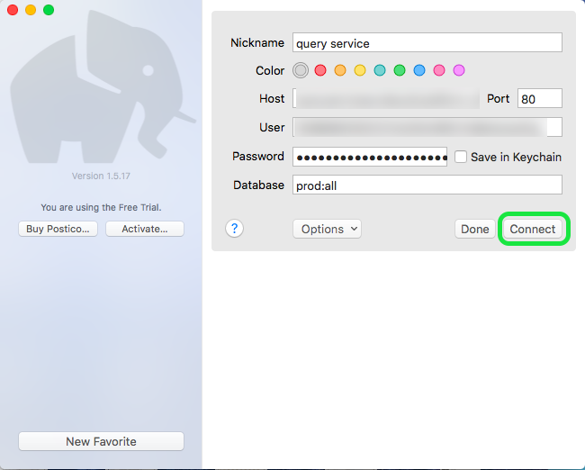
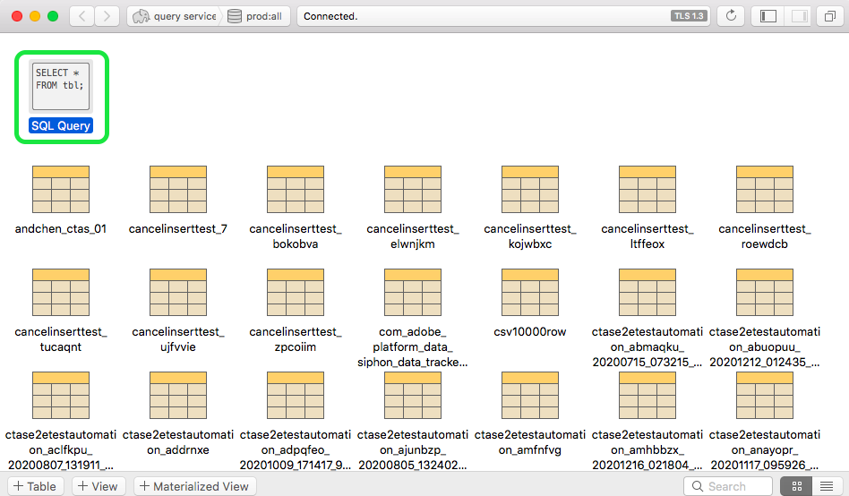

# [!DNL Postico]

本文档介绍将[!DNL Postico]与Adobe Experience Platform[!DNL Query Service]连接的步骤。

>[!NOTE]
>
> 本指南假定您已经具有访问[!DNL Postico]的权限，并且熟悉如何导航其接口。 有关[!DNL Postico]的详细信息，请参阅[offical [!DNL Postico] 文档](https://eggerapps.at/postico/docs)。
> 
> 此外，[!DNL Postico]仅&#x200B;****&#x200B;可用于macOS设备。

## 将[!DNL Postico]连接到查询服务

要将[!DNL Postico]连接到查询服务，请打开[!DNL Postico]并选择&#x200B;**[!DNL New Favorite]**。

您现在可以输入值以连接Adobe Experience Platform。

有关查找数据库名称、主机、端口和登录凭据的详细信息，请访问Platform](https://platform.adobe.com/query/configuration)上的[凭据页。 要查找您的凭据，请登录[!DNL Platform]，然后选择&#x200B;**[!UICONTROL 查询]**，后跟&#x200B;**[!UICONTROL 凭据]**。

插入凭据后，选择&#x200B;**[!DNL Connect]**&#x200B;与查询服务连接。

连接到平台后，您将能够看到之前与查询服务建立的所有关系的列表。

## 创建SQL语句

要创建新的SQL查询，请选择并打开“SQL查询”。

此时将显示一个框，您可以在此处键入要执行的查询。 完成后，选择&#x200B;**[!DNL Execute Statement]**&#x200B;以运行查询。

将显示一个表格，其中显示您完成的查询运行的结果。

## 后续步骤

现在您已连接[!DNL Query Service]，可以使用[!DNL Postico]编写查询。 有关如何编写和运行查询的详细信息，请阅读[运行查询指南](../best-practices/writing-queries.md)。