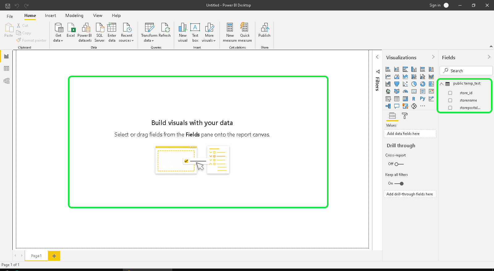

# [!DNL Power BI]

本文档介绍将Power BI与Adobe Experience Platform查询服务连接的步骤。

>[!NOTE]
>
> 本指南假定您已经具有访问[!DNL Power BI]的权限，并且熟悉如何导航其接口。 有关[!DNL Power BI]的详细信息，请参阅[offical [!DNL Power BI] 文档](https://docs.looker.com/)。
>
> 此外，Power BI **仅**&#x200B;可用于Windows设备。

## 设置[!DNL Power BI]

安装Power BI后，您需要安装`Npgsql`（用于PostgreSQL的。NET驱动程序包）。 有关Npgsql的详细信息，请参阅[Npgsql文档](https://www.npgsql.org/doc/index.html)。

>[!IMPORTANT]
>
>您必须下载v4.0.10或更低版本，因为较新版本会导致错误。

在自定义设置屏幕的“[!DNL Npgsql GAC Installation]”下，选择&#x200B;**[!DNL Will be installed on local hard drive]**。

要确保npgsql已正确安装，请先重新启动计算机，然后再继续执行后续步骤。

## 将[!DNL Power BI]连接到[!DNL Query Service]

要将[!DNL Power BI]连接到[!DNL Query Service]，请打开[!DNL Power BI]并在顶部菜单功能区中选择&#x200B;**[!DNL Get Data]**。

选择&#x200B;**[!DNL PostgreSQL database]**，后跟&#x200B;**[!DNL Connect]**。

您现在可以输入服务器和数据库的值。 有关查找数据库名称、主机、端口和登录凭据的详细信息，请访问Platform](https://platform.adobe.com/query/configuration)上的[凭据页。 要查找您的凭据，请登录[!DNL Platform]，然后选择&#x200B;**[!UICONTROL 查询]**，后跟&#x200B;**[!UICONTROL 凭据]**。

**[!DNL Server]** 是在连接详细信息下找到的主机。对于生产，将端口`:80`添加到主机字符串的末尾。 **[!DNL Database]** 可以是“all”或数据集表名。

此外，还可以选择&#x200B;**[!DNL Data Connectivity mode]**。 选择&#x200B;**[!DNL Import]**&#x200B;可显示所有可用表的列表，或选择&#x200B;**[!DNL DirectQuery]**&#x200B;可直接创建查询。

要详细了解&#x200B;**[!DNL Import]**&#x200B;模式，请阅读有关预览和导入表](#preview)的章节。 [要进一步了解&#x200B;**[!DNL DirectQuery]**&#x200B;模式，请阅读有关创建SQL语句](#create)的章节。 [确认数据库详细信息后选择&#x200B;**[!DNL OK]**。

将显示一条提示，要求您输入用户名、密码和应用程序设置。 填写这些详细信息，然后选择&#x200B;**[!DNL Connect]**&#x200B;以继续下一步。

## 预览并导入表{#preview}

如果已选择&#x200B;**[!DNL Import]**&#x200B;模式，将显示一个对话框，显示所有可用表的列表。 选择要预览的表，然后选择&#x200B;**[!DNL Load]**&#x200B;以将数据集导入[!DNL Power BI]。

表现在导入到Power BI中。

## 创建SQL语句{#create}

如果已选择&#x200B;**[!DNL DirectQuery]**&#x200B;模式，则需要用要创建的SQL查询填写“高级选项”部分。

在&#x200B;**[!DNL SQL statement]**&#x200B;下，插入要创建的SQL查询。 确保选中标记为&#x200B;**[!DNL Include relationship columns]**&#x200B;的复选框。 编写查询后，选择&#x200B;**[!DNL OK]**&#x200B;继续。

将显示预览查询。 选择&#x200B;**[!DNL Load]**&#x200B;可查看查询结果。

## 后续步骤

现在您已连接[!DNL Query Service]，可以使用[!DNL Power BI]编写查询。 有关如何编写和运行查询的详细信息，请阅读[运行查询](../best-practices/writing-queries.md)的指南。