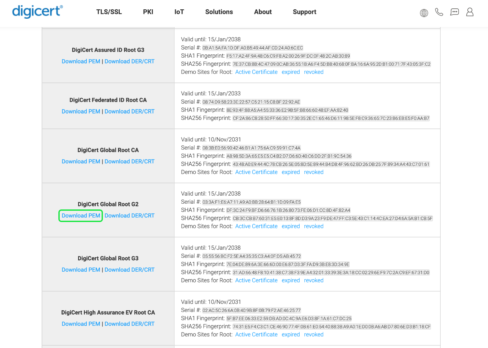

# [!DNL Query Service] SSL选项

为了提高安全性，Adobe Experience Platform [!DNL Query Service] 为SSL连接提供本机支持，以加密客户端/服务器通信。 本文档介绍了第三方客户端连接到时可用的SSL选项 [!DNL Query Service] 以及如何使用 `verify-full` ssl参数值。

## 先决条件

本文档假设您已经下载了第三方桌面客户端应用程序以用于Platform数据。 有关在与第三方客户端连接时如何合并SSL安全性的具体说明，请参阅各自的连接指南文档。 用于所有内容的列表 [!DNL Query Service] 支持的客户端，请参见 [客户端连接概述](./overview.md).

## 可用的SSL选项 {#available-ssl-options}

Platform支持各种SSL选项，以满足您的数据安全需求并平衡加密和密钥交换的处理开销。

不同的 `sslmode` 参数值提供不同级别的保护。 通过使用SSL证书对您的数据进行动态加密，它有助于防止“中间人”(MITM)攻击、窃听和模拟。 下表提供了可用的不同SSL模式及其提供的保护级别的明细。

>[!NOTE]
>
> SSL值 `disable` 由于必需的数据保护合规性，Adobe Experience Platform不支持。

| sslmode | 窃听保护 | MITM保护 | 描述 |
|---|---|---|---|
| `allow` | 部分 | 否 | 安全性不是优先权，速度和低处理开销更重要。 此模式仅在服务器坚持加密时才选择加密。 |
| `prefer` | 部分 | 否 | 不需要加密，但是如果服务器支持，将对通信进行加密。 |
| `require` | 是 | 否 | 所有通信都需要加密。 该网络被信任连接到正确的服务器。 不需要服务器SSL证书验证。 |
| `verify-ca` | 是 | 取决于CA策略 | 所有通信都需要加密。 在共享数据之前，需要服务器验证。 这要求您在 [!DNL PostgreSQL] 主目录。 [详情如下](#instructions) |
| `verify-full` | 是 | 是 | 所有通信都需要加密。 在共享数据之前，需要服务器验证。 这要求您在 [!DNL PostgreSQL] 主目录。 [详情如下](#instructions). |

>[!NOTE]
>
>两者之间的差异 `verify-ca` 和 `verify-full` 取决于根证书颁发机构(CA)的策略。 如果您已创建自己的本地CA来为您的应用程序颁发私有证书，请使用 `verify-ca` 通常提供足够的保护。 如果使用公共CA， `verify-ca` 允许连接到其他人可能已向CA注册的服务器。 `verify-full` 应始终与公共根CA一起使用。

在建立与平台数据库的第三方连接时，建议您使用 `sslmode=require` 至少要确保移动数据的安全连接。 此 `verify-full` 建议将SSL模式用于大多数安全敏感型环境。

## 设置根证书以进行服务器验证 {#root-certificate}

为确保安全连接，必须在建立连接之前在客户端和服务器上配置SSL用法。 如果只在服务器上配置了SSL，则客户端可能会在确定服务器要求高安全性之前发送敏感信息，如密码。

默认情况下， [!DNL PostgreSQL] 不执行服务器证书的任何验证。 验证服务器的身份并确保在发送任何敏感数据之前建立安全连接（作为SSL的一部分） `verify-full` 模式)，则必须在本地计算机上放置根（自签名）证书(`root.crt`)和由服务器上的根证书签名的叶证书。

如果 `sslmode` 参数设置为 `verify-full`，libpq将通过检查证书链来验证服务器是否可信，该证书链一直到存储在客户端上的根证书。 然后，它验证主机名是否与服务器证书中存储的名称匹配。

要允许服务器证书验证，必须放置一个或多个根证书(`root.crt`)中 [!DNL PostgreSQL] 文件。 文件路径将类似于 `~/.postgresql/root.crt`.

## 启用验证完整SSL模式以供第三方使用 [!DNL Query Service] 连接 {#instructions}

如果您需要更严格的安全控制 `sslmode=require`，您可以按照突出显示的步骤将第三方客户端连接到 [!DNL Query Service] 使用 `verify-full` SSL模式。

>[!NOTE]
>
>要获取SSL证书，有许多选项可用。 由于无管理证书日益增多，本指南中使用DigiCert，因为它们是高保证TLS/SSL、PKI、物联网和签名解决方案的可信全球提供商。

1. 导航到 [可用的DigiCert根证书列表](https://www.digicert.com/kb/digicert-root-certificates.htm)
1. 搜索“”[!DNL DigiCert Global Root CA]”从可用证书列表中。
1. 选择 [!DNL **下载PEM**] 将文件下载到本地计算机。
   
1. 将安全证书文件重命名为 `root.crt`.
1. 将文件复制到 [!DNL PostgreSQL] 文件夹。 必需的文件路径因您的操作系统而异。 如果该文件夹尚不存在，请创建该文件夹。
   - 如果您使用的是macOS，则路径为 `/Users/<username>/.postgresql`
   - 如果您使用的是Windows，则路径为 `%appdata%\postgresql`

>[!TIP]
>
>查找您的 `%appdata%` 文件在Windows操作系统上的位置，按⊞ **Win + R** 和输入 `%appdata%` 放入搜索字段。

在 [!DNL DigiCert Global Root CA] CRT文件可在 [!DNL PostgreSQL] 文件夹，您可以连接到 [!DNL Query Service] 使用 `sslmode=verify-full` 或 `sslmode=verify-ca` 选项。

## 后续步骤

通过阅读本文档，您可以更好地了解用于将第三方客户端连接到的SSL选项 [!DNL Query Service]，以及如何启用 `verify-full` 用于动态加密数据的SSL选项。

如果您尚未这样做，请遵循 [将第三方客户端连接到 [!DNL Query Service]](./overview.md).
