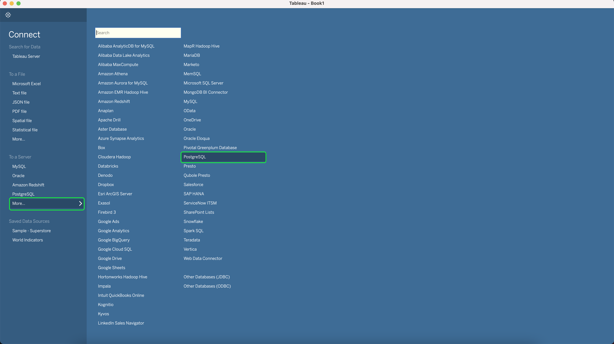

# 与Tableau连接

安装表（如果尚未安装）。

>[!NOTE] 您可以在此处获得“Tableau Desktop”的14天试用 [版](https://www.tableau.com/products/desktop/download)。
>    
> 该版本 `2018.1.2 (20181.18.0615.1128 64 bit)` 已成功连接到查询服务。

运行Tableau，在打开屏幕上单击以打开Postgres连接。

单独 `Host, Port, Database, Username, Password` 从平台UI的“ **Connect BI Tools** ”页复制到相应的表字段中。

在尝试连接之前，请确认 **已选中** “SSL必需”框。

