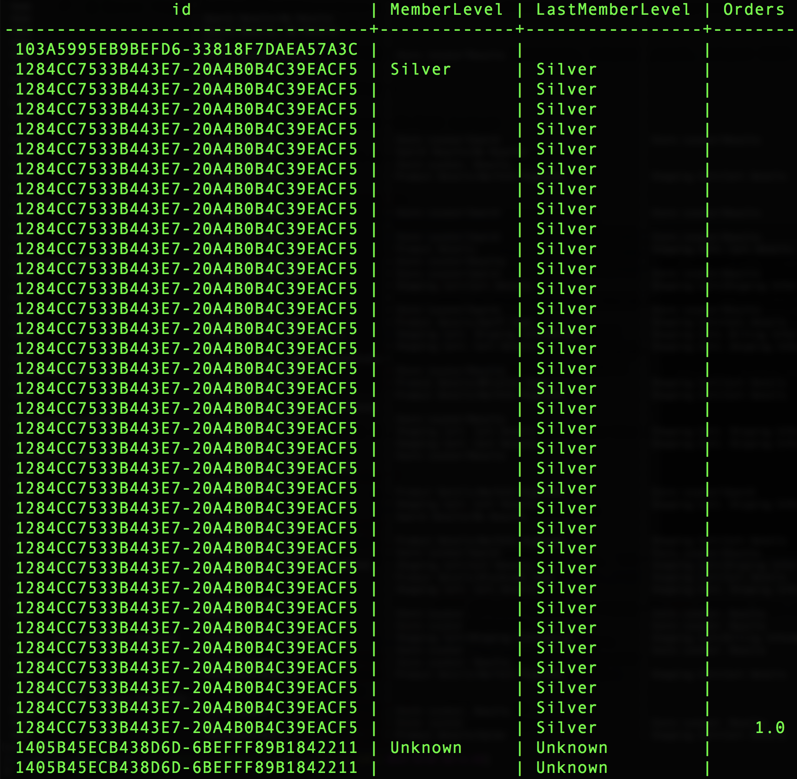
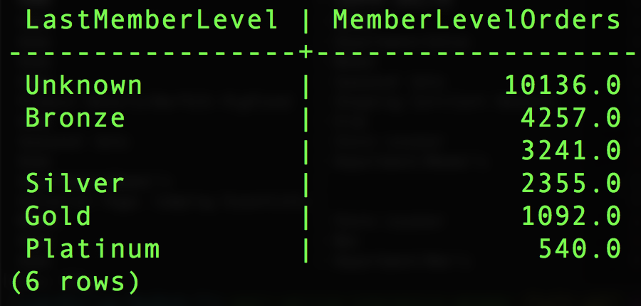

# 使用Adobe定义的函数

Adobe的主要优势之一是他们了解体验数据以及客户需要如何处理这些数据。 您可以利用这一理解来构建助手功能，使您的工作更轻松。

本文档涵盖Adobe定义的功能(ADF)，以支持三个关键的Analytics活动:
- [会话化](#sessionization)
- [归因](#attribution)
- [路径分析](#pathing)

## 会话化

重现 `SESS_TIMEOUT()` 使用Adobe Analytics进行的访问分组。 它执行类似的基于时间的分组，但具有可自定义的参数。

**语法：**

`SESS_TIMEOUT(timestamp, timeout_in_seconds) OVER ([partition] [order] [frame])`

**返回：**

具有字段的结构 `(timestamp_diff, num, is_new, depth)`

### 浏览行级和输 `SESS_TIMEOUT()` 出

```sql
SELECT analyticsVisitor,
      session.is_new,
      session.timestamp_diff,
      session.num,
      session.depth
FROM  (
        SELECT endUserIDs._experience.aaid.id as analyticsVisitor,
        SESS_TIMEOUT(timestamp, 60 * 30)
        OVER (PARTITION BY endUserIDs._experience.aaid.id
        ORDER BY timestamp
        ROWS BETWEEN UNBOUNDED PRECEDING AND CURRENT ROW)
        AS session
        FROM your_analytics_table
        WHERE _ACP_YEAR = 2018
      )
LIMIT 100;
```


### 创建包含访客、会话和页面视图的新趋势报告

```sql
SELECT
      date_format( from_utc_timestamp(timestamp, 'EDT') , 'yyyy-MM-dd') as Day,
      COUNT(DISTINCT analyticsVisitor ) as Visitors,
      COUNT(DISTINCT analyticsVisitor || session.num ) as Sessions,
      SUM( PageViews ) as PageViews
FROM
    (
      SELECT
          timestamp,
          endUserIDs._experience.aaid.id as analyticsVisitor,
          SESS_TIMEOUT(timestamp, 60 * 30)
      OVER (PARTITION BY endUserIDs._experience.aaid.id
      ORDER BY timestamp
      ROWS BETWEEN UNBOUNDED PRECEDING AND CURRENT ROW)
      AS session,
          web.webPageDetails.pageviews.value as PageViews
      FROM your_analytics_table
      WHERE _ACP_YEAR = 2018
    )
GROUP BY Day 
ORDER BY Day DESC 
LIMIT 31;
```


## 归因

归因是您如何为营销工作分配指标或转化，如收入、订单或注册。

在Adobe Analytics中，归因设置是使用eVar等变量配置的，并在摄取数据时生成。

在查询服务中找到的归因ADF允许在查询时定义和生成这些分配。

此示例重点介绍最近联系归因，但Adobe也优惠了首次联系归因。

>[!NOTE] 其他超时选项和基于事件的过期选项将在未来版本的查询服务中可用。

**语法：**

`ATTRIBUTION_LAST_TOUCH(timestamp, [channel_name], column) OVER ([partition] [order] [frame])`

**返回：**

具有场的结构 `(value)`

### 浏览行级归因

```sql
SELECT
  endUserIds._experience.aaid.id,
  _experience.analytics.customDimensions.evars.evar10 as MemberLevel,
  ATTRIBUTION_LAST_TOUCH(timestamp, 'eVar10', _experience.analytics.customDimensions.evars.evar10)
      OVER(PARTITION BY endUserIds._experience.aaid.id
           ORDER BY timestamp
           ROWS BETWEEN UNBOUNDED PRECEDING AND CURRENT ROW).value
      AS LastMemberLevel,
  commerce.purchases.value as Orders
FROM your_analytics_table 
WHERE _ACP_YEAR=2018 AND _ACP_MONTH=4
LIMIT 50;
```



### 创建按上一成员级别(eVar10)划分的订单

```sql
SELECT
  LastMemberLevel,
  SUM(Orders) as MemberLevelOrders
FROM 
(SELECT
  ATTRIBUTION_LAST_TOUCH(timestamp, 'eVar10', _experience.analytics.customDimensions.evars.evar10)
      OVER(PARTITION BY endUserIds._experience.aaid.id
           ORDER BY timestamp
           ROWS BETWEEN UNBOUNDED PRECEDING AND CURRENT ROW).value
      AS LastMemberLevel,
  commerce.purchases.value as Orders
FROM your_analytics_table 
WHERE _ACP_YEAR=2018 AND _ACP_MONTH=4
)
GROUP BY LastMemberLevel 
ORDER BY MemberLevelOrders DESC
LIMIT 25;
```



## 路径分析

路径分析有助于了解客户如何浏览您的网站。 ADF和 `NEXT()``PREVIOUS()` ADF使这成为可能。

**语法：**

```
NEXT(key, [shift, [ignoreNulls]]) OVER ([partition] [order] [frame])
PREVIOUS(key, [shift, [ignoreNulls]]) OVER ([partition] [order] [frame])
```

**返回：**

具有场的结构 `(value)`

### 选择当前页面和下一页

```sql
SELECT 
      endUserIds._experience.aaid.id,
      timestamp,
      web.webPageDetails.name,
      NEXT(web.webPageDetails.name, 1, true)
          OVER(PARTITION BY endUserIds._experience.aaid.id
              ORDER BY timestamp
              ROWS BETWEEN CURRENT ROW AND UNBOUNDED FOLLOWING).value
          AS next_pagename
FROM your_analytics_table
WHERE _ACP_YEAR=2018 
LIMIT 10;
```


### 在会话的条目中为前五个页面名称创建细分报告

```sql
  SELECT 
    PageName,
    PageName_2,
    PageName_3,
    PageName_4,
    PageName_5,
    SUM(PageViews) as PageViews
  FROM
    (SELECT
      PageName,
      NEXT(PageName, 1, true)
        OVER(PARTITION BY VisitorID, session.num
              ORDER BY timestamp
              ROWS BETWEEN CURRENT ROW AND UNBOUNDED FOLLOWING).value
        AS PageName_2,
      NEXT(PageName, 2, true)
        OVER(PARTITION BY VisitorID, session.num
              ORDER BY timestamp
              ROWS BETWEEN CURRENT ROW AND UNBOUNDED FOLLOWING).value
        AS PageName_3,
      NEXT(PageName, 3, true)
         OVER(PARTITION BY VisitorID, session.num
              ORDER BY timestamp
              ROWS BETWEEN CURRENT ROW AND UNBOUNDED FOLLOWING).value
        AS PageName_4,
      NEXT(PageName, 4, true)
         OVER(PARTITION BY VisitorID, session.num
              ORDER BY timestamp
              ROWS BETWEEN CURRENT ROW AND UNBOUNDED FOLLOWING).value
        AS PageName_5,
      PageViews,
      session.depth AS SessionPageDepth
    FROM
      (SELECT
        endUserIds._experience.aaid.id as VisitorID,
        timestamp,
        web.webPageDetails.pageviews.value AS PageViews,
        web.webPageDetails.name AS PageName,
        SESS_TIMEOUT(timestamp, 60 * 30) 
          OVER (PARTITION BY endUserIDs._experience.aaid.id 
                ORDER BY timestamp 
                ROWS BETWEEN UNBOUNDED PRECEDING AND CURRENT ROW) 
        AS session
      FROM your_analytics_table
      WHERE _ACP_YEAR=2018)
    )
  WHERE SessionPageDepth=1
  GROUP BY PageName, PageName_2, PageName_3, PageName_4, PageName_5
  ORDER BY PageViews DESC
  LIMIT 100;
```


