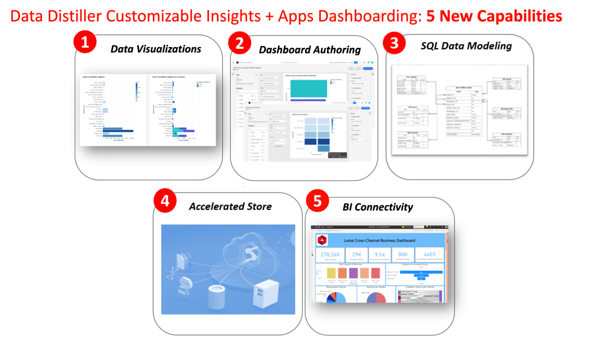

# 可自定义的分析

利用Data Distiller的可自定义见解，创建定制的报表数据模型以提取更深入的见解、优化策略并调整分析以满足特定业务需求。 使用可自定义的分析功能可跨维度（例如，用户档案、受众、营销活动、历程、权利和同意）增强透明度并从Adobe Experience Platform数据获得运营分析。 此功能提供了多功能、自适应解决方案，可定制贵组织的报表数据模型以符合您的特定业务需求。

本文档介绍了使用数据Distiller开发可自定义的分析功能板的用例、基本功能和所需步骤。

## 先决条件

本教程使用用户定义的功能板在Platform UI中可视化自定义数据模型中的数据。 请参阅 [用户定义的功能板文档](../../../dashboards/user-defined-dashboards.md) 以了解有关此功能的更多信息。

## 快速入门

要构建用于报表分析的自定义数据模型，并扩展包含扩充的Platform数据的Real-Time CDP数据模型，需要数据Distiller SKU。 请参阅 [封装](../../packaging.md)， [护栏](../../guardrails.md#query-accelerated-store)、和  [许可](../../data-distiller/license-usage.md) 与数据Distiller SKU相关的文档。 如果您没有Data Distiller SKU，请联系您的Adobe客户服务代表以了解更多信息。

## 可自定义的分析用例 {#use-cases}

以下是一些常见用例，可以通过Data Distiller中的可自定义分析来有效解决这些用例。

### 用户档案和受众使用情况透明度 {#usage-transparency}

**挑战：** 如何按特定标准(如业务单位、忠诚度状态或客户存留期值(CLTV))细分关键绩效指标(KPI)。

**可自定义的分析解决方案：** 数据Distiller支持在Adobe Experience Platform中扩展报表数据模型，从而简化 [添加了自定义配置文件属性，例如CLTV](../../use-cases/customer-lifetime-value.md) 或忠诚度状态。

### 同意异常跟踪 {#consent-anomaly-tracking}

**挑战：** 如何将受众重叠和大小趋势线报表应用于电子邮件、短信和电话等渠道的自定义同意属性。

**可自定义的分析解决方案：** 可以扩展报表数据模型以跟踪同意偏好设置在一段时间内的变化。 这涉及构建其他事实和维度表以趋势化同意偏好设置并计划 [增量数据刷新](../../key-concepts/incremental-load.md).

### 优化受众分段策略 {#optimize-audience-segmentation-strategy}

**挑战：** 如何将机器学习(ML)模型生成的倾向得分集成到其受众KPI报表中。

**可自定义的分析解决方案：** Data Distiller允许包含 [自定义ML模型的倾向分数](../../use-cases/propensity-score.md)，便于在受众级别计算总分。 然后，可以将此数据与标准KPI一起报告。

### 受众扩展 {#audience-expansion}

**挑战：** 如何获取受众重叠报表中不仅仅是个人资料计数，以及如何获取其他人口统计数据或偏好以指导受众扩展策略。

**可自定义的分析解决方案：** 通过扩展报表数据模型，用户可以合并其他用户档案属性，利用相关人口统计数据和偏好设置扩充受众重叠报表。

## 生成可自定义分析的关键功能 {#key-capabilities}

下图突出显示生成可自定义分析的几个基本功能。 这些功能包括：

1. **数据可视化：** 结合趋势和条形图等可视元素，全面查看数据趋势。
1. **功能板创作：** 支持创建为特定用例定制的自定义仪表板，提供更加个性化和有针对性的分析体验。
1. **灵活的SQL数据建模：** 使用通用的SQL数据建模方法，让用户能够无缝地组合和处理不同的数据集，从而提高适应性和分析深度。
1. **加速商店：** 实施加速存储机制以通过SQL高效地提供聚合见解，从而确保对有价值信息的简化和快速访问。
1. **BI连接：** 促进与常用Business Intelligence(BI)工具(包括Power BI、Tableau、Looker和Apache Superset)的无缝集成。 该连接确保与多种BI环境兼容，使用户能够灵活地使用他们选择的工具进行深入分析和报告。

## 创建可自定义分析的步骤 {#steps-to-create}

要在Data Distiller中开发可自定义的分析功能板，请按照以下分步说明进行操作。

1. **临时查询探索：** 首先执行ad hoc `SELECT` 查询，以浏览数据湖上的原始数据。 这允许对实验进行实时、探索性的数据分析，并且验证查询结果未存储在数据湖中的数据。
1. **批量查询利用率：** 使用批处理查询 [创建计划作业](../../api/scheduled-queries.md#create-a-new-scheduled-query) 用于生成分析汇总表，确保采用系统化和自动化的方法处理数据。 批量查询执行 `INSERT TABLE AS SELECT` 和 `CREATE TABLE AS SELECT` 用于清理、形状、操作和扩充数据的查询。 这些查询的结果存储在数据湖中。
1. **聚合分析加载：** 将生成的聚合洞察加载到加速存储并使用SQL测试查询，并确保数据检索的准确性和效率。 学习如何 [对加速存储进行无状态查询](../../api/accelerated-queries.md)，请参阅文档。
1. **访问和集成：** 通过与Adobe Experience Platform集成，无缝访问存储在加速存储中的洞察 [用户定义的仪表板](../../../dashboards/user-defined-dashboards.md) 或其他首选Business Intelligence(BI)工具。 这些与第三方客户端的集成为用户提供了有凝聚力的直观体验。

## 后续步骤

通过阅读本文档，您现在可以更好地了解用例、基本功能和使用Data Distiller开发可自定义的分析仪表板的必要步骤。 要继续了解如何创建定制的报表数据模型，请参阅 [报表见解数据模型指南](./reporting-insights-data-model.md).
