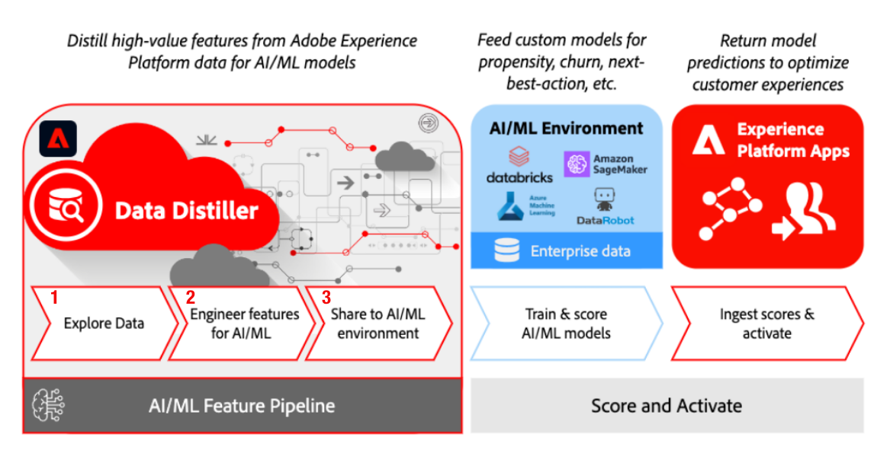

# AI/ML 功能管道

<!-- This guide illustrates a new workflow to enrich your preferred machine learning (ML) data pipelines with curated data from Adobe Experience Platform. The use case demonstrates how to transform raw data into features, and deliver the feature data to train or score a model that supports your marketing use cases. Use the provided [!DNL Python] notebooks in your machine learning environments to leverage Data Distiller capabilities and explore, curate, and access customer data from Adobe Experience Platform to enrich and enhance your AI/ML models.

This document provides an overview of the AI/ML feature pipelines use case and details the steps required to get started with the cloud machine learning environment (CMLE) notebooks. -->

Data Distiller使数据科学家和工程师能够利用Adobe Experience Platform中收集和整理的高价值客户体验数据，丰富其机器学习管道。 通过任何环境中的[!DNL Python]笔记本，您可以在Experience Platform中以交互方式浏览客户数据，从数据中定义和计算功能，并将计算功能读取到机器学习环境中以进行建模。

>[!IMPORTANT]
>
>此工作流需要Data Distiller和Adobe Experience Platform Intelligence许可证。 如果您没有这两种产品，请与您的Adobe服务代表联系。



- 借助Data Distiller强大的查询功能，您可以从Experience Platform中提供的丰富行为数据中提取有意义的特征。 然后，您可以将提取的特征数据纳入到机器学习环境中，而无需在Experience Platform之外复制大量事件数据。
- 将准备好的功能数据集读取到您首选的机器学习工具中，并与来自企业数据的其他功能相结合，训练、试验、调整和部署为您的业务定制的自定义模型。
- 从您的模型生成分数、预测或推荐，并将输出返回到Experience Platform以通过Real-Time Customer Data Platform和Adobe Journey Optimizer优化客户体验。

## 先决条件 {#prerequisites}

此工作流要求您对Adobe Experience Platform的各个方面有一定的了解。 在开始本教程之前，请查看文档以了解以下概念：

- 如何[身份验证和访问Experience Platform API](../../../landing/api-authentication.md)。
- 沙盒： [基于属性的访问控制权限](../../../access-control/abac/overview.md)以及如何创建和管理角色，并为这些角色分配所需的资源权限。
- 数据管理：如何[将数据使用标签应用于数据集和字段，并根据相关的数据治理策略和访问控制策略对每个](../../../data-governance/labels/overview.md)进行分类。

## 后续步骤

通过阅读本文档，您已了解使用首选机器学习工具构建支持营销用例的自定义模型背后的重要概念。

本系列指南中包含的文档介绍了从Experience Platform创建功能管道以在机器学习环境中馈送自定义模型的基本步骤。 您现在已准备好在Data Distiller与[!DNL Jupyter Notebook]之间建立连接。

- **设置**：[从 [!DNL Python] 笔记本连接到数据Distiller](./establish-connection.md)

下面链接的文档与上面信息图中指示的步骤相对应。

- **步骤1**：[浏览和分析数据集](./exploratory-analysis.md)
- **步骤2**：[机器学习的工程师功能](./feature-engineering.md)
- **步骤3**：[导出功能数据集](./export-data.md)

## 其他资源

- [aepp](https://github.com/adobe/aepp)：Adobe管理的开源[!DNL Python]库，用于从[!DNL Python]代码向Data Distiller和其他Experience Platform服务发出请求。

<!-- Old content below -->

<!-- ## Train and score a propensity model to predict subscription conversions from Experience Platform data {#train-and-score-a-propensity-model}

The linked repositories provide sample notebooks that demonstrate the AI/ML feature pipeline end-to-end workflow. The workflow uses customer data from Experience Platform with cloud-based machine learning tools to train and score a propensity model that predict subscription conversions. Use the notebooks as a template to help data science teams take advantage of your organization's Experience Platform data and services. Experience Platform data and services can then be used within your modeling workflow to develop custom models that support your organization's marketing and experience activities.

The sample notebooks listed in this document provide a stylized example of training and scoring a propensity model to predict subscription conversions from Experience Platform data. The first notebook generates synthetic datasets in an Experience Platform sandbox which is then used in subsequent notebooks to illustrate an end-to-end flow. The workflow includes:

- Exploring and featuring data from Experience Platform
- Making the prepared training data available in your machine learning environment ([!DNL Databricks] ML is used as an example, but you can modify the sample notebooks to use your own ML environment)
- Training and scoring the propensity model
- Enriching Experience Platform profiles with the computed propensity scores, and using those scores to create and activate an audience

The sample notebooks are intended to be used in one of two ways:

1. As a tutorial for using Experience Platform data in ML workflows.
    - Ideally, use a dedicated Experience Platform sandbox for completing the tutorial. The use of a dedicated sandbox will avoid mixing synthetic data with real customer data. You can reset or delete the sandbox after completing the tutorial to free it up for other use. See the documentation to learn how to [create a new sandbox](../../../sandboxes/ui/user-guide.md#create), or to [swtich between them](../../../sandboxes/ui/user-guide.md#switch-between-sandboxes).
    - Clone or download this repository to create a copy in your ML environment.
    - Follow the instructions in the [getting started](#getting-started) section to get an Experience Platform API credential with the necessary permissions and update the `config.ini` file with the required values.
    - Review and execute the cells in each notebook in order to demonstrate and validate the workflow in your environment.
    - Modify the code in the notebooks as needed to adapt to your environment.
2. As a template for Experience Platform-related ML projects for your organization.
    - Fork the CMLE repository as a starting template for a new ML project. 
    - Alternatively, reference the code in these notebooks as helpful examples to start a new project from scratch.

>[!WARNING]
>
> The workflow illustrated in these notebooks involves exporting datasets from Experience Platform to a cloud storage destination, where it can be read and processed using external machine learning tools. As such, there is some risk of sensitive personal data leaving the Experience Platform and being used inappropriately outside of the platform.<br><br>Experience Platform provides data governance tools for you to manage your data usage obligations and help minimize this risk. You are responsible ensuring that data in the Experience Platform is properly labeled before querying or exporting that data. This includes manually re-applying labels to derived datasets created from query output. Derived datasets from queries do not support the processing of sensitive personal data. You are responsible for understanding the limitations and obligations of your data and how you use that data in Experience Platform and the destination platform, which may have its own rules and obligations for incoming and outgoing data. Learn more about [data governance tools](../../../data-governance/home.md) in Experience Platform. -->


<!-- ## Getting started {#getting-started}

There are several steps necessary to get started with the CMLE notebooks. The CMLE notebooks make use of the [aepp](https://github.com/adobe/aepp/tree/main) package, which provides functions for making requests to [Experience Platform APIs](https://developer.adobe.com/experience-platform-apis/). 

The following steps are required to set up access to Experience Platform APIs through `aepp`. If you wish to code requests to Experience Platform APIs yourself rather than use `aepp`, you will still need to complete these steps to get a credential with the necessary permissions and store it safely. -->

<!-- ### Step 1: Create an API credential in the Adobe Developer Console {#create-api-credential}

API credentials can be created by anyone with Developer access to Experience Platform in your organization. If you are a data scientist without Developer access, ask your manager or Adobe Admin to [create a credential](../../../landing/api-authentication.md#generate-credentials) for you in the [Adobe Developer Console](https://developer.adobe.com/console/home). Alternatively, they can [grant you Developer access](../../../landing/api-authentication.md#add-developers-to-product-profile) to create one yourself.

You are recommended to create an [!DNL Oauth2] API credential specifically for Cloud ML workflows with appropriate permissions and labels. -->

<!-- 
Is this the correct doc to link to about creating an Oauth2 API credential?:
../../../destinations/destination-sdk/functionality/destination-configuration/oauth2-authorization.md
 -->

<!-- See [Authenticate and access Experience Platform APIs](../../../landing/api-authentication.md) detailed instructions instructions on creating an API credential. -->

<!-- ### Step 2: Get the necessary attribute-based access control permissions for your credential {#get-permissions}

An API credential will not be able to access Experience Platform APIs without explicit permissions granted by your organization's Adobe System Admin for specific Experience Platform services and data. A System Admin can [assign the API credential to a role](../../../landing/api-authentication.md#assign-api-to-a-role) and manage permissions for role in the [!UICONTROL Permissions] UI in Experience Platform. 

You will need to provide your system admin with the name and technical account email of your API credential. System admins can refer to the documentation to find information about how to [manage API credentials for a role](../../../access-control/abac/ui/permissions.md#manage-api-credentials-for-role) and [grant the required permissions to access Experience Platform resources](../../../landing/api-authentication.md#get-abac-permissions).

The minimum permissions required to execute these notebooks include:

- Sandbox(es) that will be used for data science (usually `prod`)
- Data modeling: [!UICONTROL Manage Schemas]
- Data management: [!UICONTROL Manage Datasets]
- Data ingestion: [!UICONTROL View Sources]
- Destinations: [!UICONTROL Manage and Activate Dataset Destinations]
- Query Service: [!UICONTROL Manage Queries] -->

<!-- #### Label access {#label-access} -->

<!-- Edited up to here -->

<!-- By default, a role (and the API credentials assigned to that role) is blocked from accessing any labeled data. Given the organization's data governance policies, a System Admin may grant the role access to certain labeled data that is deemed appropriate for data science usage. 

We recommend that any API credential used for CMLE workflows does **NOT** have access to data labeled `C9` (No Data Science), `PSPD` (Permitted Sensitive Personal Data), or `RHD` (PHI/Regulated Health Data). Experience Platform customers are responsible to manage label access and policies appropriately in order to comply with relevant regulations and organizational policies. -->

<!-- ### Step 3: Update the config.ini file with credential and environment information

Once you have an API credential with the required permissions, you will need to add the credential and environment values to the config.ini file.

The config.ini file should look like the following after copying the CMLE repository:

```ini
[Platform]
ims_org_id=
sandbox_name=
environment=prod

[Synthetic]
fieldgroup_id=
events_schema=
events_dataset=
profile_schema=
profile_dataset=

[Authentication]
client_id=
client_secret=
scopes=openid, AdobeID, read_organizations, additional_info.projectedProductContext, session
tech_acct_id=

[Cloud]
export_path=cmle/egress
import_path=cmle/ingress
data_format=parquet
compression_type=gzip
model_name=cmle_propensity_model
```

You will need to update the file with values for the following fields:

- `ims_org_id`: You can easily find the IMS Org ID by clicking `CTRL+i` anywhere in the Experience Platform UI
- `sandbox_name`: Refer to [Sandboxes](https://experience.adobe.com/platform/sandbox/browse?limit=50&page=1&sortField=title) in the Experience Platform UI to find the name (not the title) of the sandbox you will be using
- `client_id`: The Client ID for the API credential obtained in [Step 1](#step-1-create-an-api-credential-in-the-adobe-developer-console)
- `client_secret`: The Client Secret for the API credential obtained in [Step 1](#step-1-create-an-api-credential-in-the-adobe-developer-console)
- `tech_acct_id`: The Technical Account Email for the API credential obtained in [Step 1](#step-1-create-an-api-credential-in-the-adobe-developer-console)

If you are an Adobe employee using the CMLE notebooks in an internal stage IMS Org, change the value for `environment` from "prod" to "stage".

The `[Synthetic]` section stores ID references to the schema and dataset objects that are created in the `SyntheticData` notebook. These will be populated and referenced by the code in the notebooks, so you may leave them blank to start.

The `[Cloud]` section is pre-populated for the example use case illustrated in the notebooks and can be left as is, or modified as needed if you are adapting the notebooks for your own project.

If you are using git with your copy of the CMLE directory, be sure to add the config.ini file to `.gitignore` to avoid accidentally publishing your credential information to a remote repository. -->

<!-- ### Step 4: Configure `aepp` to authenticate with Experience Platform APIs

To use the `aepp` package in your code you will need to read the config.ini file using the standard `configparser` package and configure the connection to the Experience Platform APIs. The following cell from the [Synthetic data generation](../notebooks/SyntheticData.ipynb) notebook provides an example:

```python
import os
from configparser import ConfigParser
import aepp

os.environ["ADOBE_HOME"] = os.path.dirname(os.getcwd())

if "ADOBE_HOME" not in os.environ:
    raise Exception("ADOBE_HOME environment variable needs to be set.")

config = ConfigParser()
config_file = "config.ini"
config_path = os.path.join(os.environ["ADOBE_HOME"], "conf", config_file)

if not os.path.exists(config_path):
    raise Exception(f"Looking for configuration under {config_path} but config not found, please verify path")

config.read(config_path)

aepp.configure(
  org_id=config.get("Platform", "ims_org_id"),
  tech_id=config.get("Authentication", "tech_acct_id"), 
  secret=config.get("Authentication", "client_secret"),
  scopes=config.get("Authentication", "scopes"),
  client_id=config.get("Authentication", "client_id"),
  environment=config.get("Platform", "environment"),
  sandbox=config.get("Platform", "sandbox_name")
)
```

If necessary, modify the `config_path` in your code with the actual location of your config.ini file.

You can test the connection to Experience Platform APIs by executing the following lines:

```python
from aepp import schema
schema.Schema().getTenantId()
```

If successful, your organization's Platform tenant ID will be displayed in the cell output. -->

<!-- ## Troubleshooting {#troubleshooting}

If the connection test above is unsuccessful, you will likely get `KeyError: 'tenantId'`. This usually means that the API credential you are using to connect to Platform does not have the required permissions (the "Data modeling: Manage Schemas" permission in this case). Try the following to resolve the error:

- Confirm with your Adobe System Admin that your API credential has been added to a Role that has the permissions specified above.
- Check your `config.ini` file and make sure that your environment and credential information is correct.

If your configuration is correct and you are able to successfully make calls to `aepp` methods, you may sometimes get an unsuccessful response from the Platform server. This may happen if you try to create an object in Platform that already exists, or get an object that does not exist, or attempt to send a malformed payload with a request. Most `aepp` methods make a request to an Experience Platform API endpoint and return the response from the server. Print the response and review it to get error message from the API. This will usually give you enough information to understand the problem with the request and fix it. -->
