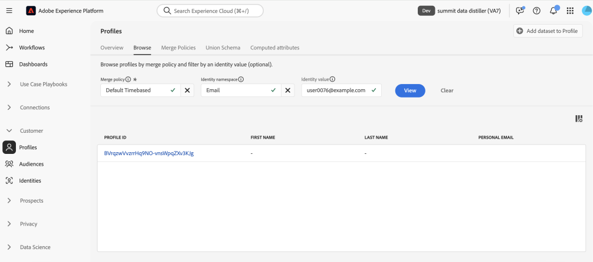

# 使用Adobe Experience Platform Data Distiller最大程度实现价值的重要提示 — OS656

本页包含示例数据集，供您应用在Adobe Summit会话“OS656 — 使用Adobe Experience Platform Data Distiller实现最大价值的关键提示”中所学到的内容。 您将了解如何通过丰富实时客户档案数据来加快Adobe Real-Time Customer Data Platform和Journey Optimizer的实施。 此扩充利用对客户行为模式的深入洞察来构建受众，以实现体验交付和优化。

通过Luma案例研究，您将分析用户行为数据并创建&#x200B;*回访间隔、频度、货币(RFM)*&#x200B;模型 — 一种基于购买模式的客户细分营销分析技术。

## 先决条件

要执行此用例，您的Adobe Experience Platform实例必须获得[Data Distiller](./overview.md)的许可。 有关更多信息，请与Adobe代表联系。

## RFM模型概览 {#rfm-overview}

RFM是“回访间隔”(R)、“频率”(F)和“货币”(M)的缩写，是一种数据驱动的客户细分和分析方法。 此方法可评估客户行为的三个关键方面：客户最近购买产品的时间、参与频率以及花费金额。 通过量化这些因素，企业可以获得关于客户细分的可操作洞察，并制定目标营销策略以更好地满足个人客户需求。

## 了解RFM模型的客户行为 {#understand-customer-behavior}

RFM模型使用三个关键参数根据事务性行为划分客户。

- **回访间隔**&#x200B;测量自客户上次购买以来的时间，指示参与级别和未来购买潜力。
- **频率**&#x200B;跟踪客户互动的频率，以明确表明忠诚度和持续参与度。
- **货币价值**&#x200B;评估客户的总支出，突出显示它们对业务的整体价值。

通过组合这些因素，企业为每个客户分配数字分数（通常在`1`到`4`之间）。 分数越低，结果就越好。 例如，所有类别中的客户得分`1`都被认为是最佳的，表明最近活动、高参与度和大量支出。

## RFM模型的优点和限制 {#benefits-and-limitations}

每一种营销建模技术都涉及取舍，既带来好处，又带来限制。 RFM建模是了解客户行为、优化营销策略的重要工具。 其优势包括细分客户以个性化消息传递、优化收入、提高响应率、维系率、满意度和客户存留期价值(CLTV)。

但是，RFM建模存在局限性。 它根据回访间隔、频度和货币值假定区段内的一致性，这可能会过度简化客户行为。 该模型还会为这些因素分配相同的权重，从而可能错误地表示客户价值。 此外，它不考虑上下文，例如产品特定的特征或客户偏好，这些上下文可能会导致对购买行为的错误解释。

## 构建基于动态RFM得分的SQL受众 {#build-a-dynamic-rfm-audience}

在开始Luma案例研究之前，您需要摄取一个示例数据集。 首先，[选择链接以本地下载`luma_web_data.zip`数据集](../resources/luma_web_data.zip)。 示例数据集是采用压缩.zip格式的csv文件，以便与用例保持一致。 使用Adobe Acrobat或受信任文件提取工具（如操作系统的内置实用程序）解压缩此ZIP文件。 在实践中，您通常从Adobe Analytics、Adobe Commerce或Adobe Web/Mobile SDK收集数据。

在本教程中，您将使用Data Distiller将相关事件和字段提取到标准化CSV格式中。 目标是仅包括基本字段，同时维护扁平的数据结构以提高效率和易用性。

### 步骤1：将CSV数据上传到Experience Platform {#upload-csv-data}

按照以下步骤将CSV文件上传到Adobe Experience Platform。

#### 从CSV文件创建数据集 {#create-a-dataset}

在Experience Platform UI中，在左侧导航边栏中选择&#x200B;**[!UICONTROL 数据集]**，然后选择&#x200B;**[!UICONTROL 创建数据集]**。 然后从可用选项中选择&#x200B;**[!UICONTROL 从CSV文件创建数据集]**。

此时将显示[!UICONTROL 配置数据集]面板。 在&#x200B;**[!UICONTROL Name]**&#x200B;字段中，输入数据集名称为“luma_web_data”，然后选择&#x200B;**[!UICONTROL 下一步]**。

将显示[!UICONTROL 添加数据]面板。 将CSV文件拖放到&#x200B;**[!UICONTROL 添加数据]**&#x200B;框中，或选择&#x200B;**[!UICONTROL 选择文件]**&#x200B;浏览并上传该文件。

要了解有关此过程的更多信息，请参阅数据集UI指南中的[批次摄取教程](../../ingestion/tutorials/ingest-batch-data.md)和[数据集创建工作流](../../catalog/datasets/user-guide.md#create)。

#### 查看并完成上传 {#review-and-complete-upload}

上传文件后，数据预览将显示在UI底部。 选择&#x200B;**[!UICONTROL 完成]**&#x200B;以完成上载。


此时将显示“luma_web_data”数据集的数据集活动视图。 手动上传CSV文件
已作为批次摄取，并由[!UICONTROL 批次ID]标识。 右侧的面板将表名称显示为`luma_web_data`。

>[!TIP]
>
>在Data Distiller中编写查询时，请使用表名称而不是数据集名称。 数据集名称仅用于在UI中浏览。


<!--  
My table name is; luma_web_data_20250312_235611_817 Should we explain the suffix? 
-->

数据处理完毕后，选择右上角的[!UICONTROL 预览数据集]以预览数据集。 这就是数据集预览的显示方式：


#### 架构注意事项 {#schema-considerations}

不需要结构化XDM架构（例如，记录、事件或B2B架构），因为数据会作为原始CSV文件导入。 数据集使用临时架构。

>[!TIP]
>
>临时架构是带有字段的XDM架构，这些字段的命名空间仅供单个数据集使用。 临时架构用于Experience Platform的各种数据摄取工作流以及创建特定类型的源连接。

虽然Data Distiller支持所有架构类型，但摄取到Real-time Customer Profile的最终数据集将使用记录XDM架构。

### 步骤2：连接到数据湖并浏览可用数据集 {#connect-to-the-data-lake-and-explore-datasets}

下一步是探索Adobe Experience Platform数据湖中的数据，以确保准确性和完整性。 数据必须准确且完整，才能生成有意义的见解，但在数据传输期间可能会发生错误、不一致或缺少值。 这使得数据验证和探索变得至关重要。

>[!TIP]
>
>数据湖存储原始的未处理数据（如事件日志、点击流数据和批量摄取的记录），以供分析和处理。 配置文件存储区包含客户可识别的数据（包括身份拼接事件和属性信息），以支持实时个性化和激活。

使用Data Distiller通过各种操作验证数据集质量和完整性。 要确认数据在摄取期间是否准确转换，请执行`SELECT`查询以检查、验证和分析数据。 此过程有助于识别和解决不一致问题、不一致问题或缺少信息。

#### 执行基本探索查询 {#basic-exploration-queries}

在Adobe Experience Platform UI中，选择左侧导航边栏中的&#x200B;**[!UICONTROL 查询]**，然后选择&#x200B;**[!UICONTROL 创建查询]**。 此时将显示“查询编辑器”。

将以下查询粘贴到编辑器并执行它：

```sql
SELECT * FROM luma_web_data; 
```

查询结果显示在&#x200B;**[!UICONTROL 结果]**&#x200B;选项卡的查询编辑器下方。 若要展开新对话框中的结果，请选择&#x200B;**[!UICONTROL 查看结果]**。 结果如下图所示。


有关详细信息，请参阅查询执行的[一般指南](../best-practices/writing-queries.md)文档。

#### 专注于订单并排除已取消的交易记录 {#focus-orders-exclude-cancelled}

RFM模型会根据完成的购买评估回访间隔、频度和货币价值。 非事务性事件（如页面查看和签出交互）将从分析中排除。 此外，必须删除已取消的订单，因为它们不会有助于进行有效的RFM计算，并且需要不同的处理方法。

为确保准确性：

- 识别与取消关联的购买ID，并使用`GROUP BY`对它们进行分组。
- 从数据集中排除这些购买ID。
- 筛选数据以仅保留已完成的订单。

以下查询演示了如何识别并排除数据集中的已取消订单。

第一个查询选择与取消关联的所有非null的购买ID，并使用`GROUP BY`聚合它们。 必须从数据集中排除生成的购买ID。

```sql
CREATE VIEW orders_cancelled
AS
  SELECT purchase_id
  FROM   luma_web_data
  WHERE  event_type IN ( 'order', 'cancellation' )
         AND purchase_id IS NOT NULL
  GROUP  BY purchase_id
  HAVING Count(DISTINCT event_type) = 2; 
```

第二个查询仅检索不在此排除集中的购买ID。

```sql
SELECT *
FROM   luma_web_data
WHERE  purchase_id NOT IN (SELECT purchase_id
                           FROM   orders_cancelled)
        OR purchase_id IS NULL; 
```

第三个查询会从数据集中删除所有无序事件。

```sql
SELECT *
FROM   luma_web_data
WHERE  event_type = 'order'
       AND purchase_id NOT IN (SELECT purchase_id
                               FROM   orders_cancelled); 
```

### 步骤3：使用数据Distiller函数扩充数据 {#enrich-the-data}

接下来，使用Data Distiller提取和转换客户数据，生成RFM分数，聚合交易，并通过购买行为细分客户。 按照以下步骤计算回访间隔、频度和货币(RFM)值，构建受众模型，并为激活准备见解。

#### 计算每个唯一用户ID的RFM得分

要计算RFM分数，请使用字段过滤从原始数据中提取关键字段。

由于每个订单都需要电子邮件登录，因此下一查询将基于上一部分的逻辑进行构建，方法是选择电子邮件作为`userid`。 数据Distiller应用`TO_DATE`函数将时间戳转换为日期格式。 `total_revenue`字段表示每个交易记录的价格，稍后通过汇总每个`userid`的交易记录将其汇总。

```sql
SELECT email AS userid, 
       purchase_id AS purchaseid, 
       price_total AS total_revenue, -- reflects the price for each individual transaction
       TO_DATE(timestamp) AS purchase_date -- converts timestamp to date format
FROM luma_web_data 
WHERE event_type = 'order' 
      AND purchase_id NOT IN (SELECT purchase_id FROM orders_cancelled) 
      AND email IS NOT NULL;
```

结果如下图所示。


接下来，创建一个`TABLE`以将上一个查询的结果存储在派生的数据集中。 将以下命令复制并粘贴到查询编辑器中以创建`TABLE`。

```sql
CREATE TABLE IF NOT EXISTS order_data AS
  SELECT email              AS userid,
         purchase_id        AS purchaseid,
         price_total        AS total_revenue,
         To_date(timestamp) AS purchase_date
  FROM   luma_web_data
  WHERE  event_type = 'order'
         AND purchase_id NOT IN (SELECT purchase_id FROM orders_cancelled)
         AND email IS NOT NULL; 
```

结果类似于以下图像，但具有不同的数据集ID。


作为最佳实践，请运行简单的浏览查询以检查数据集中的数据。 使用以下语句查看您的数据。

```sql
SELECT * FROM order_data;
```


#### 汇总交易记录以生成RFM值 {#aggregate-transactions}

要计算RFM值，此查询汇总每个用户的事务处理。

`DATEDIFF(CURRENT_DATE, MAX(purchase_date)) AS days_since_last_purchase`函数计算每个用户自最近一次购买以来的天数。

使用以下SQL查询：

```sql
SELECT 
    userid, 
    DATEDIFF(CURRENT_DATE, MAX(purchase_date)) AS days_since_last_purchase, 
    COUNT(purchaseid) AS orders, 
    SUM(total_revenue) AS total_revenue 
FROM order_data 
GROUP BY userid;
```

结果如下图所示。


为了提高查询效率和可重用性，请创建`VIEW`以存储聚合的RFM值。

```sql
CREATE VIEW rfm_values
AS
  SELECT userid,
         DATEDIFF(current_date, MAX(purchase_date)) AS days_since_last_purchase,
         COUNT(purchaseid)                          AS orders,
         SUM(total_revenue)                         AS total_revenue
  FROM   order_data
  GROUP BY userid; 
```

结果类似于以下图像，但ID不同。


同样作为最佳实践，请运行简单的浏览查询以检查视图中的数据。 使用以下语句。

```sql
SELECT * FROM rfm_values;
```

以下屏幕截图显示了查询的示例结果，其中显示了每个用户的已计算RFM值。 结果对应于`CREATE VIEW`查询中的视图ID。


#### 生成RFM多维多维数据集 {#generate-multi-dimensional-cube}

要根据客户的RFM得分划分客户，请使用RFM多维多维多维数据集。 `NTILE`窗口函数将值排序为排名存储段，并将每个维度划分为四个相等的组（四分位点），从而可以进行结构化分段。

- 回访间隔：客户按最近购买的时间(`days_since_last_purchase`)排名。 最近购买者属于第1组，而最近未购买者属于第4组。
- 频率：按客户购买频率(`ORDER BY orders DESC`)对客户进行排名。 买房频率最高的是第1组，买房频率最低的是第4组。
- 货币：按总支出(`total_revenue`)对客户进行排名。 支出最高的组是第1组，支出最低的组是第4组。

运行以下SQL查询以生成RFM多维数据集：

```sql
SELECT userid,
       days_since_last_purchase,
       orders,
       total_revenue,
       5 - NTILE(4)
             OVER (
               ORDER BY days_since_last_purchase DESC) AS recency,
       NTILE(4)
         OVER (
           ORDER BY orders DESC)                       AS frequency,
       NTILE(4)
         OVER (
           ORDER BY total_revenue DESC)                AS monetization
FROM rfm_values; 
```

结果如下图所示。


接下来，使用以下语句为此数据创建`VIEW`。

为RFM多维数据集创建`VIEW`通过存储预分段数据来提高效率，从而无需在将来查询中重新计算RFM分数。 它简化了SQL语句，保证了数据一致性，增强了可重用性，便于进一步分析。

```sql
CREATE OR replace VIEW rfm_scores
AS
  SELECT userid,
         days_since_last_purchase,
         orders,
         total_revenue,
         5 - NTILE(4)
               over (
                 ORDER BY days_since_last_purchase DESC) AS recency,
         NTILE(4)
           over (
             ORDER BY orders DESC)                       AS frequency,
         NTILE(4)
           over (
             ORDER BY total_revenue DESC)                AS monetization
  FROM   rfm_values;
```

结果类似于以下图像，但视图ID不同。


#### 模型RFM段 {#model-rfm-segments}

通过计算RFM得分，可将客户分为以下六个优先级区段：

1. `Core`：具有高回访间隔、频度和货币值（回访间隔= 1，频度= 1，货币= 1）的最佳客户。
1. `Loyal`：一致但不是顶级消费者的频繁客户（频率= 1）。
1. `Whales`：最高支出者，不考虑回访间隔和频率（货币= 1）。
1. `Promising`：频繁但支出较低的用户（频率= 1、2、3；货币= 2、3、4）。
1. `Rookies`：新客户的频度较低（回访间隔= 1，频度= 4）。
1. `Slipping`：以前忠诚的客户，活动减少（回访间隔= 2、3、4；频率= 4）。

要简化访问和重新使用，请创建一个`VIEW`以存储RFM区段、分数和值。

以下SQL中的`CASE`语句根据客户的RFM得分将客户划分为区段，并将结果分配给`RFM_Model`变量。

+++选择以查看SQL

```sql
CREATE OR replace VIEW rfm_model_segment
AS
  SELECT userid,
         days_since_last_purchase,
         orders,
         total_revenue,
         recency,
         frequency,
         monetization,
         CASE
           WHEN recency = 1
                AND frequency = 1
                AND monetization = 1 THEN '1. Core - Your Best Customers'
           WHEN recency IN( 1, 2, 3, 4 )
                AND frequency = 1
                AND monetization IN ( 1, 2, 3, 4 ) THEN
           '2. Loyal - Your Most Loyal Customers'
           WHEN recency IN( 1, 2, 3, 4 )
                AND frequency IN ( 1, 2, 3, 4 )
                AND monetization = 1 THEN
           '3. Whales - Your Highest Paying Customers'
           WHEN recency IN( 1, 2, 3, 4 )
                AND frequency IN ( 1, 2, 3 )
                AND monetization IN( 2, 3, 4 ) THEN
           '4. Promising - Faithful customers'
           WHEN recency = 1
                AND frequency = 4
                AND monetization IN ( 1, 2, 3, 4 ) THEN
           '5. Rookies - Your Newest Customers'
           WHEN recency IN ( 2, 3, 4 )
                AND frequency = 4
                AND monetization IN ( 1, 2, 3, 4 ) THEN
           '6. Slipping - Once Loyal, Now Gone'
         END RFM_Model
  FROM   rfm_scores; 
```

+++

生成的`VIEW`遵循与以前创建相同的结构，但具有不同的ID。

作为最佳实践，请运行简单的浏览查询以检查视图中的数据。 使用以下语句。

<!-- Double check this SQL. I wrote it.- it was absent fom the KT doc. -->

```sql
SELECT * FROM rfm_model_segment;
```

<!-- Perhaps these VIEW results could be chopped? -->

以下屏幕截图显示`SELECT * FROM rfm_model_segment;`查询的示例结果，其中显示了分段的RFM模型数据。 输出反映生成的`VIEW`的结构，包括根据RFM分数分配的客户区段。


### 步骤4：使用SQL将RFM数据批量摄取到Real-Time Customer Profile {#sql-batch-ingest-rfm-data}

接下来，将丰富RFM的客户数据批量摄取到Real-Time Customer Profile。 首先，创建启用配置文件的数据集，然后使用SQL插入转换后的数据。

#### 创建派生的数据集以存储RFM属性 {#create-a-derived-dataset}

由于此数据集将被摄取到配置文件存储中，因此它需要分区键。

>[!TIP]
>
>主标识字段用作分区键，确保高效的数据分发、检索和查询性能。 通过身份命名空间分配主要身份可将相关配置文件记录分组在一起，从而优化配置文件存储中的查找和更新。

创建空数据集以存储RFM属性并分配主标识。

在此SQL语句中：

- `userId TEXT PRIMARY IDENTITY NAMESPACE 'Email'`：使用“Email”命名空间将userId列定义为主标识&#x200B;。
- `days_since_last_purchase INTEGER`：存储自用户上次购买以来的天数&#x200B;。
- `orders INTEGER`：表示用户下订单的总数&#x200B;。
- `total_revenue DECIMAL(18, 2)`：捕获用户生成的总收入，精确到18位和两位小数&#x200B;。
- `recency INTEGER, frequency INTEGER, monetization INTEGER`：存储用户的相应RFM分数&#x200B;。
- `rfm_model TEXT`：保存分配给用户的RFM区段分类&#x200B;。
- `WITH (LABEL = 'PROFILE')`：在Experience Platform中将表标记为已启用配置文件，确保提取的数据有助于构建实时客户配置文件&#x200B;。

>[!NOTE]
>
>“电子邮件”命名空间是Adobe Experience Platform中的[标准身份命名空间](../../identity-service/features/namespaces.md#standard)。 在定义身份字段时，请确保指定适当的命名空间，以促进准确身份解析。&#x200B;AEM
>
>有关定义身份字段和使用身份命名空间的更多信息，请参阅[Identity Service文档](../../identity-service/home.md)或[在Adobe Experience Platform UI中定义身份字段指南](../../xdm/ui/fields/identity.md)。

由于查询编辑器支持顺序执行，因此您可以在单个会话中包含表创建查询和数据插入查询。 以下SQL首先创建启用配置文件的表来存储RFM属性。 然后，它将RFM丰富的客户数据从`rfm_model_segment`插入到`adls_rfm_profile`表中，并在租户特定的命名空间下构造实时客户配置文件摄取所需的每个记录。

由于查询编辑器支持顺序执行，因此您可以在单个会话中运行表创建和数据插入查询。 以下SQL首先创建启用配置文件的表来存储RFM属性。 然后，它将RFM丰富的客户数据从`rfm_model_segment`插入到`adls_rfm_profile`表中，确保每个记录都在租户特定的命名空间(`_{TENANT_ID}`)下正确构建。 此命名空间对于实时客户配置文件摄取和准确的身份解析至关重要。

>[!IMPORTANT]
>
>将`_{TENANT_ID}`替换为您组织的租户命名空间。 此命名空间是您的组织所独有的，可确保在Adobe Experience Platform中正确分配所有摄取的数据。

```sql
CREATE TABLE IF NOT EXISTS adls_rfm_profile (
    userId TEXT PRIMARY IDENTITY NAMESPACE 'Email', -- Primary identity field using the 'Email' namespace
    days_since_last_purchase INTEGER, -- Days since the last purchase
    orders INTEGER, -- Total number of orders
    total_revenue DECIMAL(18, 2), -- Total revenue with two decimal precision
    recency INTEGER, -- Recency score
    frequency INTEGER, -- Frequency score
    monetization INTEGER, -- Monetary score
    rfm_model TEXT -- RFM segment classification
) WITH (LABEL = 'PROFILE'); -- Enable the table for Real-Time Customer Profile

INSERT INTO adls_rfm_profile
SELECT STRUCT(userId, days_since_last_purchase, orders, total_revenue, recency,
              frequency, monetization, rfm_model) _{TENANT_ID}
FROM rfm_model_segment;
```

此查询的结果与本剧本中以前创建的数据集类似，但ID不同。

创建数据集后，导航到&#x200B;**[!UICONTROL 数据集]** > **[!UICONTROL 浏览]** > `adls_rfm_profile`以验证数据集是否为空。


您还可以导航到&#x200B;**[!UICONTROL 架构]** > **[!UICONTROL 浏览]** > `adls_rfm_profile`，以查看新创建的数据集的XDM个人资料架构图及其自定义字段组。


#### 将数据插入新创建的数据集 {#insert-data-into-derived-dataset}

接下来，将来自`rfm_model_segment VIEW`的数据插入为实时客户资料启用的`adls_rfm_profile`。

确保`INSERT`语句的`SELECT`查询中的字段顺序与`rfm_model_segment`的结构完全匹配。 此对齐方式确保将`rfm_model_segment`中的值正确插入到目标表中的相应字段中。 源字段和目标字段之间的不匹配可能导致数据不匹配。

>[!NOTE]
>
>此查询以批处理模式运行，这需要启动集群以执行进程。 该操作从数据湖中读取数据，在群集内处理该数据，并将结果写回数据湖。

```sql
INSERT INTO adls_rfm_profile
SELECT Struct(userid, days_since_last_purchase, orders, total_revenue, recency,
              frequency, monetization, rfm_model) _{TENANT_ID}
FROM   rfm_model_segment; 
```

完成后，查询输出在控制台中显示“查询完成”。

### 步骤5：计划查询以进行批处理 {#schedule-the-query}

现在，您的SQL代码会生成一个派生的数据集，并将其用于Real-time Customer Profile，下一步就是通过计划以特定时间间隔运行查询来自动进行更新。 通过自动更新数据集，您无需手动执行。

#### 计划查询执行

保存SQL后，导航到&#x200B;**[!UICONTROL 模板]**&#x200B;选项卡以查看保存的查询并启动计划过程。 计划查询的方法有两种：

从右侧边栏中选择&#x200B;**[!UICONTROL 添加计划]**。


或者，选择模板名称下方的&#x200B;**[!UICONTROL 计划]**&#x200B;选项卡，然后选择&#x200B;**[!UICONTROL 添加计划]**。


有关计划查询的详细信息，请参阅[查询计划文档](../ui/query-schedules.md)。

此时将显示[!UICONTROL 计划详细信息]视图。 在此处，输入以下详细信息以配置计划：

- **[!UICONTROL 执行频率]**： **每周**
- **[!UICONTROL 执行日]**：**星期一和星期二**
- **[!UICONTROL 计划执行时间]**： **上午10:10 UTC**
- **[!UICONTROL 计划期间]**：**2025年3月17日至4月30日**

选择&#x200B;**[!UICONTROL 保存]**&#x200B;以确认计划。


保存计划后，您可以随时导航到&#x200B;**[!UICONTROL 计划查询]**&#x200B;选项卡以监视计划的Data Distiller作业。 有关[查看查询执行状态、错误消息和警报](../ui/monitor-queries.md)的更多详细信息，请参阅监视计划查询文档。

配置完毕后， SQL查询将在定义的时间间隔内自动运行，确保数据保持最新，无需手动干预。

### 步骤6：创建和激活基于RFM的受众

<!-- double check this intro paragraph ... -->

在本教程中，可通过两种方法创建和激活基于RFM的受众。

- 解决方案1：使用Data Distiller和SQL查询直接创建和激活受众。
- 解决方案2：在Experience Platform UI中使用预计算的RFM属性定义和管理受众，不使用SQL。

选择最适合您的工作流的方法。

#### 解决方案1：通过Data Distiller的SQL受众 {#data-distiller-sql-audience}

使用`CREATE AUDIENCE AS SELECT`命令定义新受众。 创建的受众保存在数据集中，并在&#x200B;**[!UICONTROL 数据Distiller]**&#x200B;下的&#x200B;**[!UICONTROL 受众]**&#x200B;工作区中注册。

使用SQL扩展创建的受众自动在[!UICONTROL 受众]工作区的[!UICONTROL Data Distiller]源下注册。 通过[受众门户](../../segmentation/ui/audience-portal.md)，您可以根据需要查看、管理和激活受众。


有关SQL受众的详细信息，请参阅[Data Distiller受众文档](../data-distiller-audiences/overview.md)。 要了解如何在UI中管理受众，请参阅[受众门户概述](../../segmentation/ui/audience-portal.md#audience-list)。

#### 创建受众 {#create-an-audience}

要创建受众，请使用以下SQL命令：

```sql
-- Define an audience for best customers based on RFM scores
CREATE AUDIENCE rfm_best_customer 
WITH (
    primary_identity = _{TENANT_ID}.userId, 
    identity_namespace = queryService
) AS ( 
    SELECT * FROM adls_rfm_profile 
    WHERE _{TENANT_ID}.recency = 1 
        AND _{TENANT_ID}.frequency = 1 
        AND _{TENANT_ID}.monetization = 1 
);

-- Define an audience that includes all customers
CREATE AUDIENCE rfm_all_customer 
WITH (
    primary_identity = _{TENANT_ID}.userId, 
    identity_namespace = queryService
) AS ( 
    SELECT * FROM adls_rfm_profile 
);

-- Define an audience for core customers based on email identity
CREATE AUDIENCE rfm_core_customer 
WITH (
    primary_identity = _{TENANT_ID}.userId, 
    identity_namespace = Email
) AS ( 
    SELECT * FROM adls_rfm_profile 
    WHERE _{TENANT_ID}.recency = 1 
        AND _{TENANT_ID}.frequency = 1 
        AND _{TENANT_ID}.monetization = 1 
);
```

#### 插入受众 {#insert-an-audience}

要将配置文件添加到现有受众，请使用`INSERT INTO`命令。 这样，您就可以将个人资料或整个受众添加到现有受众数据集。

```sql
-- Insert profiles into the audience dataset
INSERT INTO AUDIENCE adls_rfm_audience 
SELECT 
    _{TENANT_ID}.userId, 
    _{TENANT_ID}.days_since_last_purchase, 
    _{TENANT_ID}.orders, 
    _{TENANT_ID}.total_revenue, 
    _{TENANT_ID}.recency, 
    _{TENANT_ID}.frequency, 
    _{TENANT_ID}.monetization 
FROM adls_rfm_profile 
WHERE _{TENANT_ID}.rfm_model = '6. Slipping - Once Loyal, Now Gone';
```

#### 向受众添加用户档案 {#add-profiles-to-audience}

使用以下SQL命令创建和填充受众：

```sql
-- Create an empty audience dataset
CREATE AUDIENCE adls_rfm_audience 
WITH (
    primary_identity = userId, 
    identity_namespace = Email
) AS 
SELECT 
    CAST(NULL AS STRING) userId, 
    CAST(NULL AS INTEGER) days_since_last_purchase, 
    CAST(NULL AS INTEGER) orders, 
    CAST(NULL AS DECIMAL(18,2)) total_revenue, 
    CAST(NULL AS INTEGER) recency, 
    CAST(NULL AS INTEGER) frequency, 
    CAST(NULL AS INTEGER) monetization, 
    CAST(NULL AS STRING) rfm_model 
WHERE FALSE;
```

#### 删除受众 {#delete-an-audience}

要删除现有受众，请使用`DROP AUDIENCE`命令。 如果受众不存在，则除非指定`IF EXISTS`，否则会发生异常。

使用以下SQL命令删除受众：

```sql
DROP AUDIENCE IF EXISTS adls_rfm_audience;
```

#### 解决方案2：创建具有RFM属性的受众 {#create-audience-with-rfm-attributes}

使用RFM属性根据用户的行为和特征划分用户。 此部分将指导您通过Adobe Experience Platform UI使用RFM得分定义受众。

要验证数据是否已加载到Real-Time Customer Profile，请导航到&#x200B;**[!UICONTROL 客户] > [!UICONTROL 配置文件] > [!UICONTROL 浏览]**。 选择&#x200B;**[!UICONTROL 身份命名空间]**&#x200B;作为`Email`并输入`user0076@example.com`。 检查配置文件详细信息，确认它包含预期的RFM属性。




要浏览现有受众，请从左侧导航面板中选择&#x200B;**[!UICONTROL 受众]**，并确保已选择&#x200B;**[!UICONTROL 浏览]**&#x200B;选项卡。 此时将显示沙盒中可用受众的列表。 选择受众会显示其描述、符合条件的规则以及包含的用户档案数。

要创建新受众，请选择右上角的&#x200B;**[!UICONTROL 创建受众]**。 此时将显示一个对话框，其中包含两个选项。 选择&#x200B;**[!UICONTROL 生成规则]**，然后选择&#x200B;**[!UICONTROL 创建]**。


受众构成UI提供了对配置文件属性的访问权限。 导航到&#x200B;**[!UICONTROL Attributes] > [!UICONTROL XDM Individual Profile]**&#x200B;以查看可用属性。

有关使用受众合成的更多详细信息，请参阅[受众合成UI指南](../../segmentation/ui/audience-composition.md)。 有关使用区段生成器的更多详细信息，请参阅[区段生成器用户界面指南](../../segmentation/ui/segment-builder.md)。


在Data Distiller中创建的自定义属性存储在与租户命名空间名称匹配的文件夹中，该名称显示在沙盒名称旁边。 这些属性可用于定义受众分段标准。


要使用RFM属性构建受众，请将`Rfm_Model`属性拖放到受众编辑器中。 这些属性可用于“Edge”、“流”和“批处理”受众。


要结束受众，请选择右上角的&#x200B;**[!UICONTROL 保存并发布]**。 保存后，新创建的受众将显示在[!UICONTROL 受众]工作区中，您可以在该工作区中查看其摘要和符合条件。

使用区段生成器访问派生的RFM属性并设计其他受众。 根据RFM分数激活新创建的SQL受众，并将其发送到任何首选目标，包括Adobe Journey Optimizer。
