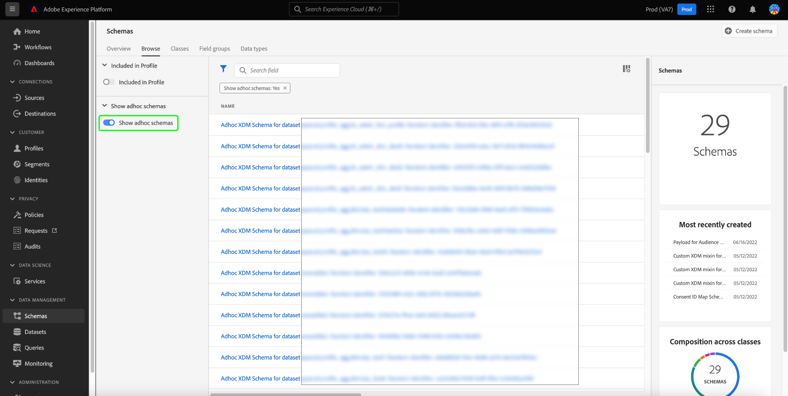
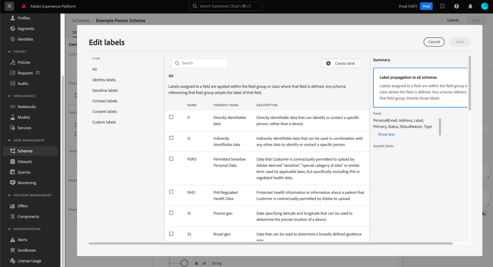

# 对临时架构的基于属性的访问控制支持

带入Adobe Experience Platform的任何数据将由Experience Data Model (XDM)架构封装，并且可能会受到贵组织或法律法规定义的使用限制的约束。

通过在未指定架构时通过查询服务执行CTAS查询，自动生成临时架构。 通常，有必要限制使用临时架构的某些字段或数据集来控制对敏感个人数据和个人身份信息的访问。 Adobe Experience Platform通过允许您使用基于属性的访问控制功能通过Experience Platform UI为架构字段添加标签，从而简化此访问控制。

您可以随时应用标签，灵活地选择管理数据的方式。 但是，最佳实践是在数据被摄取到Experience Platform中后立即对其进行标记，或者当数据在Experience Platform中可用时立即进行标记。

基于模式的标签是基于属性的访问控制的重要组成部分，可以更好地管理授予用户或用户组的访问权限。 Adobe Experience Platform允许您通过创建和应用标签来限制对临时架构的任何字段的访问。

本文档提供了一个教程，用于通过将标签应用于通过查询服务生成的临时架构的数据字段来管理对敏感数据的访问。

## 快速入门

本指南要求您对 Adobe Experience Platform 的以下组件有一定了解：

* [体验数据模型(XDM)系统](../../xdm/home.md)： Experience Platform用于组织客户体验数据的标准化框架。
   * [[!DNL Schema Editor]](../../xdm/ui/overview.md)：了解如何在Experience Platform UI中创建和管理架构和其他资源。
* [[!DNL Data Governance]](../../data-governance/home.md)：了解[!DNL Data Governance]如何允许您管理客户数据并确保遵守适用于数据使用的法规、限制和策略。
* [基于属性的访问控制](../../access-control/abac/overview.md)：基于属性的访问控制是Adobe Experience Platform的一项功能，它使管理员能够根据属性控制对特定对象和/或功能的访问。 属性可以是添加到对象的元数据，例如添加到临时或常规架构字段的标签。 管理员定义包括管理用户访问权限的属性的访问策略。

## 创建临时架构

执行查询并生成结果后，将自动生成临时架构并将其添加到架构清单。

要添加数据标签，请在Experience Platform UI的左边栏中选择[!UICONTROL 架构]，导航到[!UICONTROL 架构]仪表板浏览选项卡。 将显示架构清单。

>[!NOTE]
>
>默认情况下，临时架构不显示在架构清单中。

## 在Experience Platform UI的架构清单中发现临时架构 {#discover-ad-hoc-schemas}

要在Experience Platform UI中启用临时架构显示，请选择过滤器图标（)，然后在显示的左边栏中选择**[!UICONTROL 显示临时架构]。

从可用列表中选择最近创建的临时方案的名称。 此时将显示临时架构结构的可视化图表。

## 编辑治理标签

要编辑临时架构的数据标签，请选择[!UICONTROL 标签]选项卡。 标签工作区允许您将标签应用、创建和编辑到临时架构字段，并通过UI控制访问权限。 此处显示了临时架构中的所有字段。

## 编辑架构或字段的标签

要编辑整个架构的标签，请选择铅笔图标（)到[!UICONTROL 标签]选项卡下的架构名称一侧。

要将标签应用于现有字段，请从列表中选择一个或多个字段，然后在右侧边栏中依次选择[!UICONTROL 编辑治理标签]。

## “编辑标签”弹出框

出现[!UICONTROL 编辑标签]弹出框。 从该视图中，您可以通过UI创建或编辑现有治理标签。

请参阅文档以了解如何[创建或编辑所选架构或字段](../../xdm/tutorials/labels.md#edit-the-labels-for-the-schema-or-field)的标签。

>[!NOTE]
>
>创建新标签或编辑现有标签需要组织的管理员权限。 如果您没有管理员权限，请联系您的系统管理员来安排访问权限。

还可以使用权限工作区创建标签。 有关说明，请参阅有关在权限工作区[&#128279;](../../access-control/abac/ui/labels.md)中创建标签的指南。

应用基于属性的访问控制的适当级别后，当用户尝试访问不可访问的数据时，以下系统行为适用于通过查询服务执行的任何查询：

1. 如果用户被拒绝访问架构中的某个字段，则用户将无法读取或写入受限字段。 这适用于以下常见方案：

   * 当用户尝试执行仅具有受限列的查询时，系统将引发该列不存在的错误。
   * 当用户尝试执行具有多个列（包括受限列）的查询时，系统将仅返回所有非受限列的输出。

1. 如果用户请求访问计算字段，则要求用户具有对构成中使用的所有字段的访问权限，否则系统将拒绝对计算字段的访问。

如果在ad hoc模式上设置了身份或主身份，则系统自动接受任何关联的数据卫生请求，并清理与身份列关联的数据集中的数据。

## 后续步骤

阅读本文档后，您对如何将数据使用标签添加到通过查询服务CTAS查询创建的临时架构有了更好的了解。 如果您尚未这样做，以下文档有助于您更好地了解查询服务中的数据治理：

* [临时架构身份](./ad-hoc-schema-identities.md)
* [数据治理](../../data-governance/home.md)
