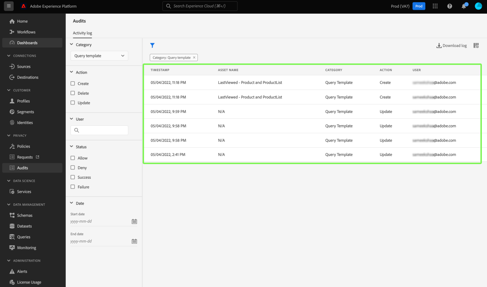

# [!DNL Query Service]审核日志集成

Adobe Experience Platform [!DNL Query Service]审核日志集成提供查询相关用户操作的记录。 审核日志是进行故障排除并遵守公司数据管理政策和法规要求的重要工具。 利用功能，可返回多种事件类型的操作日志，并过滤和导出记录。 可以通过Experience Platform UI或[审核查询API](https://www.adobe.io/experience-platform-apis/references/audit-query/)访问日志，并以CSV或JSON文件格式下载。

要了解有关审核日志用户界面的详细信息，请参阅[审核日志概述文档](../../landing/governance-privacy-security/audit-logs/overview.md)。 要了解有关调用Experience Platform API的更多信息，请参阅[审核日志API指南](../../landing/api-guide.md)。

>[!NOTE]
>
>会话逐出操作将被记录。 有关UI工作流，请参阅[管理查询服务会话](../ui/session-management.md)。

## 先决条件

您必须启用[!DNL Data Governance] [!UICONTROL View User Activity Log]权限才能在Experience Platform UI中查看审核日志仪表板。 该权限是通过Adobe [Admin Console](https://adminconsole.adobe.com/)启用的。 如果您没有启用此权限的管理员权限，请联系贵组织的管理员。 有关通过Admin Console[添加权限的完整说明，请参阅访问控制文档](../../access-control/home.md)。

## [!DNL Query Service]审核日志类别 {#audit-log-categories}

[!DNL Query Service]提供的审核日志类别如下。

| 类别 | 描述 |
|---|---|
| [!UICONTROL Query] | 此类别允许您审核查询执行。 |
| [!UICONTROL Query template] | 此类别允许您审核对查询模板执行的各种操作（创建、更新和删除）。 |
| [!UICONTROL Scheduled query] | 此类别允许您审核在[!DNL Query Service]内创建、更新或删除的计划。 |

## 执行[!DNL Query Service]审核日志 {#perform-an-audit-log}

要对[!DNL Query Service]活动执行审核，请从左侧导航中选择&#x200B;**[!UICONTROL Audits]**，然后选择funnel图标（)以显示筛选器控件列表以帮助缩小结果范围。

从[!UICONTROL Audits]功能板[!UICONTROL Activity log]选项卡中，您可以按[!DNL Query Service]类别中的任意类别筛选所有记录的Experience Platform操作。 可以根据日志结果执行的时段、执行的操作/功能或执行查询的用户来进一步筛选日志结果。 有关如何根据类别、操作、用户和状态筛选日志的完整说明[，请参阅审核日志文档](../../landing/governance-privacy-security/audit-logs/overview.md#managing-audit-logs-in-the-ui)。

返回的审核日志数据包含以下关于满足所选筛选条件的所有查询的信息。

| 列名 | 描述 |
|---|---|
| [!UICONTROL Timestamp] | 以`month/day/year hour:minute AM/PM`格式执行的操作的确切日期和时间。 |
| [!UICONTROL Asset Name] | [!UICONTROL Asset Name]字段的值取决于选择作为过滤器的类别。 使用[!UICONTROL Scheduled query]类别时，这是&#x200B;**计划名称**。 使用[!UICONTROL Query template]类别时，这是&#x200B;**模板名称**。 使用[!UICONTROL Query]类别时，这是&#x200B;**会话ID** |
| [!UICONTROL Category] | 此字段与您在“筛选器”下拉列表中选择的类别匹配。 |
| [!UICONTROL Action] | 这可以是创建、删除、更新或执行。 可用的操作取决于选作过滤器的类别。 |
| [!UICONTROL User] | 此字段提供执行查询的用户ID。 |

>[!NOTE]
>
>通过以CSV或JSON文件格式下载日志结果，提供的查询详细信息比审计日志仪表板中默认显示的多。

## 详细信息面板

选择审核日志结果的任意行，将在屏幕右侧打开一个详细信息面板。

详细信息面板可用于查找[!UICONTROL Asset ID]和[!UICONTROL Event status]。

[!UICONTROL Asset ID]的值会根据审核中使用的类别进行更改。

* 使用[!UICONTROL Query]类别时，[!UICONTROL Asset ID]是&#x200B;**会话ID**。
* 使用[!UICONTROL Query template]类别时，[!UICONTROL Asset ID]是&#x200B;**模板ID**，前缀为`[!UICONTROL templateID:]`。
* 使用[!UICONTROL Scheduled query]类别时，[!UICONTROL Asset ID]是&#x200B;**计划ID**，前缀为`[!UICONTROL scheduleID:]`。

[!UICONTROL Event status]的值会根据审核中使用的类别进行更改。

* 使用[!UICONTROL Query]类别时，[!UICONTROL Event status]字段提供用户在该会话中执行的所有&#x200B;**查询ID**&#x200B;的列表。
* 使用[!UICONTROL Query template]类别时，[!UICONTROL Event status]字段提供&#x200B;**模板名称**&#x200B;作为事件状态的前缀。
* 使用[!UICONTROL Query schedule]类别时，[!UICONTROL Event status]字段提供&#x200B;**计划名称**&#x200B;作为事件状态的前缀。

## [!DNL Query Service]审核日志类别的可用筛选器 {#available-filters}

可用的过滤器因在下拉列表中选择的类别而异。 下表详细列出了[[!DNL Query Service] 审核日志类别](#audit-log-categories)可用的筛选器。

| 过滤器 | 描述 |
|---|---|
| 类别 | 有关可用类别的完整列表，请参阅[[!DNL Query Service] 审核日志类别](#audit-log-categories)部分。 |
| 操作 | 在引用[!DNL Query Service]审核类别时，更新是对现有表单的&#x200B;**修改**，删除是对计划或模板的&#x200B;**删除**，创建是&#x200B;**创建新计划或模板**，执行是&#x200B;**运行查询**。 |
| 用户 | 输入完整的用户ID（例如，johndoe@acme.com）以按用户进行筛选。 |
| 状态 | [!UICONTROL Allow]、[!UICONTROL Success]和[!UICONTROL Failure]选项将根据“状态”或“事件状态”筛选日志，而[!UICONTROL Deny]选项将筛选&#x200B;**所有**&#x200B;日志。 |
| 日期 | 选择开始日期和/或结束日期，以定义筛选结果的日期范围。 |

## 后续步骤

通过阅读本文档，您可以更好地了解[!DNL Query Service]审核日志功能，以及如何使用它来筛选您的[!DNL Query Service]用户操作。

如果您使用[!DNL Query Service]审核日志功能进行疑难解答，建议您阅读[疑难解答指南](../troubleshooting-guide.md)。
