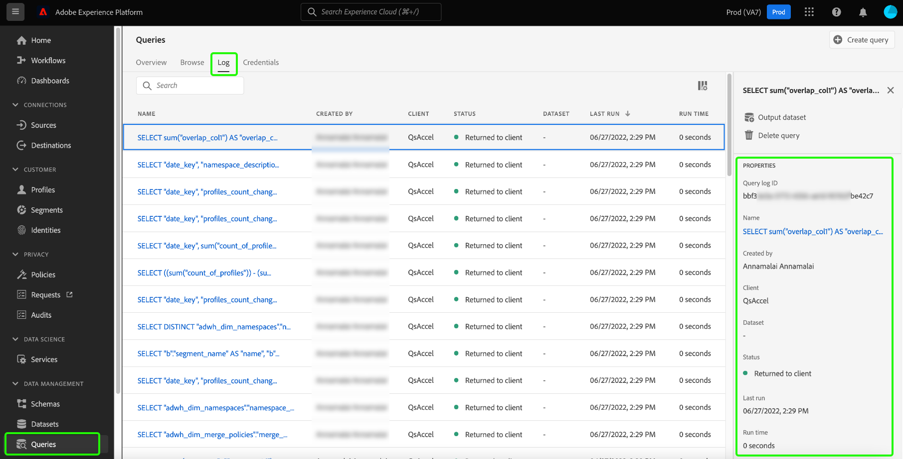

# 查询服务中的数据治理

Adobe Experience Platform将来自多个企业系统的数据整合在一起，并允许您根据自己的需求，通过查询服务来清理、形状、操作和扩充数据。 这允许营销人员更好地识别、了解和吸引客户。 由于某些数据可能会受到基于组织政策和法规的使用限制，因此确保充分的数据治理是处理个人信息的重要方面。 必须确保所摄取的数据及其相关操作符合定义的数据使用策略。

查询服务中的数据治理允许您管理客户数据，并确保遵守适用于数据使用的法规、限制和策略。 在确保根据您的业务所定义的法规应用使用策略时，这将发挥关键作用。

建议日常执行数据处理的组织概述、实践和执行这些准则，为所有用户创建注重隐私的环境。

在使用查询服务时，以下类别有助于遵守数据合规性法规：

1. 安全性
1. 审核
1. 数据使用
1. 隐私
1. 数据卫生

本文档将分析治理的各个方面，并演示在使用查询服务时如何促进数据合规性。 请参阅[治理、隐私和安全概述](../../landing/governance-privacy-security/overview.md)，以进一步了解Experience Platform如何允许您管理客户数据和确保合规性。

## 安全性 {#security}

数据安全是保护数据免遭未经授权的访问并确保在其整个生命周期内安全访问的过程。 Experience Platform中通过应用各种功能（如基于角色的访问控制和基于属性的访问控制）的角色和权限，来维护安全访问。 凭据、SSL和数据加密也用于确保跨Experience Platform的数据保护。

查询服务的安全性分为以下几类：

* [访问控制](#access-control)：通过角色和权限（包括数据集和列级权限）来控制访问。
* 通过[连接](#connectivity)保护数据：通过与过期凭据或不过期凭据实现有限连接，通过Experience Platform和外部客户端保护数据。
* 通过[加密和客户管理的密钥(CMK)](#encryption-and-customer-managed-keys)保护数据：数据静止时通过加密控制访问。

### 访问控制 {#access-control}

Adobe Experience Platform中的访问控制允许您使用[Adobe Admin Console](https://adminconsole.adobe.com/)，通过基于角色的权限来管理对查询服务功能的访问。 同样，您可以通过架构和数据字段上的标签管理来控制对特定数据属性的访问。

本节概述用户必须具有哪些必要的访问控制权限，才能充分利用查询服务功能。 有关将访问权限分配给产品配置文件的详细说明，请参阅[管理权限](../../access-control/ui/permissions.md)和[管理用户](../../access-control/ui/users.md)上的文档。

#### 相关权限

下表根据相关访问控制权限的作用域级别定义了相应的访问控制权限。

**查询执行权限**

要在查询服务中运行查询，必须向用户分配具有以下权限的角色：

| 权限 | 描述 |
|---|---|
| [!UICONTROL 管理查询] | 此权限允许用户执行数据探索和批量查询，这些查询可以读取现有数据集或将数据写入数据集。 这包括`CREATE TABLE AS SELECT` (`CTAS`)和`INSERT INTO AS SELECT` (`ITAS`)查询。 |

**数据集权限**

本节用作在通过查询服务查询数据时访问数据集所需的基于资源的访问的指南。

通过权限界面，您可以使用以下权限为数据集和架构定义基于资源的访问控制：

| 权限 | 描述 |
|---|---|
| [!UICONTROL 管理数据集] | 此权限提供对架构的只读访问权限，并允许读取、创建、编辑和删除要与查询服务一起使用的数据集。 |
| [!UICONTROL 查看数据集] | 此权限允许对用于查询服务的数据集和架构进行只读访问。 |

#### 列/字段的访问控制

基于属性的访问控制功能使查询服务用户能够限制对关键用户数据的访问。 可以根据分配给角色的权限来授予或限制访问权限。 用户对单个列的访问受相关数据使用标签以及应用于分配给用户的角色的权限集控制。

使用数据使用标签标记架构字段组和类会将数据使用限制应用于具有相同字段组和类的所有架构。 有关此功能的完整信息，请参阅[基于属性的访问控制](../../access-control/abac/overview.md)的概述。

此功能允许您向所选的用户组授予对机密列的访问权限。 列的访问控制可以限制特定类型用户的读取和写入功能。

列的访问控制可以在标准架构和临时架构的架构级别应用。 将数据使用标签应用于XDM架构以限制对一个或多个列的访问。 数据标签始终得到应用，即使对于通过查询服务创建的数据集，使用预定义模式或作为CTAS操作的一部分生成的临时模式。

一旦使用标签和角色应用了适当的访问级别，当用户尝试访问不可访问的数据时，会发生以下系统行为：

1. 如果用户被拒绝访问架构中的某一列，则该用户也被拒绝对受限列的读取或写入权限。 这适用于以下常见方案：

   * **用例1**：当用户尝试执行仅影响受限列的查询时，系统会引发该列不存在的错误。
   * **用例2**：当用户尝试执行包含多个列（包括一个受限列）的查询时，系统仅返回所有非受限列的输出。

1. 如果用户尝试访问计算字段，则要求用户具有对构成中使用的所有字段的访问权限，或者系统拒绝对计算字段的访问权限。

#### 视图的访问控制

查询服务提供了对[`CREATE VIEW`](../sql/syntax.md#create-view)语句使用标准ANSI SQL的功能。 对于高度敏感的数据工作流，在创建视图时必须实施适当的控制。

`CREATE VIEW`关键字定义了查询的视图，但该视图未实际实现。 相反，每次在查询中引用视图时都会运行查询。 当用户从数据集创建视图时，父数据集的基于角色和属性的访问控制规则&#x200B;**未分层应用**。 因此，在创建视图时，必须明确设置每列的权限。

#### 对加速的数据集创建基于字段的访问限制 {#create-field-based-access-restrictions-on-accelerated-datasets}

通过基于[属性的访问控制功能](../../access-control/abac/overview.md)，您可以在[加速存储](../data-distiller/sql-insights/send-accelerated-queries.md)中的事实和维度数据集上定义组织或数据使用范围。 这允许管理员管理对特定区段的访问，并更好地管理授予用户或用户组的访问权限。

要对加速数据集创建基于字段的访问限制，您可以使用查询服务CTAS查询创建加速数据集，并基于现有XDM架构或临时架构构建这些数据集。 然后，管理员可以[添加和编辑架构](../../xdm/tutorials/labels.md#edit-the-labels-for-the-schema-or-field)或[临时架构](./ad-hoc-schema-labels.md#edit-governance-labels)的数据使用标签。 您可以在[!UICONTROL 架构] UI的[!UICONTROL 标签]工作区中，应用、创建和编辑架构的标签。

还可以通过数据集UI将数据使用标签[直接应用或编辑到数据集](../../data-governance/labels/user-guide.md#add-labels)，或者从访问控制[!UICONTROL 标签]工作区创建数据使用标签。 有关详细信息，请参阅有关如何[创建新标签](../../access-control/abac/ui/labels.md)的指南。

随后，用户对单个列的访问可由附加的数据使用标签以及应用于分配给用户的角色的权限集进行控制。

### 连接性 {#connectivity}

查询服务可通过Experience Platform UI访问，也可通过与外部兼容客户端建立连接来访问。 对所有可用前端的访问由一组凭据控制。

#### 通过外部客户端的连接

使用第三方客户端访问查询服务需要凭据才能获得授权。 要通过任何兼容的外部客户端访问查询服务，必须提供这些凭据。 您可以使用[过期凭据](#expiring-credentials)或[非过期凭据](#non-expiring-credentials)连接到外部客户端。

#### 通过过期凭据进行的连接时间有限 {#expiring-credentials}

[过期凭据](../ui/credentials.md)允许用户与外部客户端建立临时连接。 这组凭据仅在24小时内有效。 这些类型的凭据的过期以及查询服务仪表板中的凭据选项卡都可以看到。

#### 未过期凭据 {#non-expiring-credentials}

[未过期的凭据](../ui/credentials.md#non-expiring-credentials)允许您与外部客户端建立永久连接，这样无需手动密码即可更轻松地连接到查询服务。

要启用生成不过期凭据的选项，必须遵循概述的[必备工作流](../ui/credentials.md#prerequisites)。 在此过程中，您的组织管理员需要配置产品配置文件的权限，从而让管理员能够控制哪些帐户有权使用不会过期的凭据。

可以为允许使用未过期凭据的技术用户帐户分配角色，以通过根据他们的责任和需求定义其读写访问权限范围来确保适当的数据管理。 请参阅前面关于[的部分，其中通过访问控制](#access-control)使用基于角色的权限来管理对查询服务的访问。

完成必备工作流后，授权用户现在可以[生成所需的连接凭据](../ui/credentials.md#generate-credentials)。

#### SSL数据加密

为了提高安全性，查询服务为SSL连接提供本机支持，以加密客户端/服务器通信。 Experience Platform支持各种SSL选项，以满足您的数据安全需求并平衡加密和密钥交换的处理开销。

有关详细信息（包括如何使用`verify-full` SSL参数值连接），请参阅关于与查询服务[&#128279;](../clients/ssl-modes.md)的第三方客户端连接的可用SSL选项的指南。

### 加密和客户管理的密钥(CMK) {#encryption-and-customer-managed-keys}

加密是使用算法过程将数据转换为编码和不可读的文本，以确保在没有解密密钥的情况下信息受到保护且不可访问。

查询服务数据合规性确保数据始终加密。 传输中的数据始终符合HTTPS标准，静态数据在Azure Data Lake存储中使用系统级密钥进行加密。 有关详细信息，请参阅有关[如何在Adobe Experience Platform](../../landing/governance-privacy-security/encryption.md)中加密数据的文档。 有关如何在Azure Data Lake Storage中加密静态数据的详细信息，请参阅[Azure官方文档](https://docs.microsoft.com/en-us/azure/data-lake-store/data-lake-store-encryption)。

传输中的数据始终符合HTTPS，同样，当数据在数据湖中静止时，使用客户管理密钥(CMK)进行加密，该密钥已受Data Lake Management支持。 当前支持的版本为TLS1.2。请参阅[客户管理的密钥(CMK)文档](../../landing/governance-privacy-security/customer-managed-keys/overview.md)，了解如何为Adobe Experience Platform中存储的数据设置您自己的加密密钥。

## 审核 {#audit}

查询服务记录用户活动，并将该活动分类为不同的日志类型。 日志提供有关&#x200B;**谁**&#x200B;执行了&#x200B;**什么**&#x200B;操作以及&#x200B;**何时**&#x200B;的信息。 日志中记录的每个操作都包含元数据，这些元数据指示操作类型、日期和时间、执行操作的用户的电子邮件ID以及与操作类型相关的其他属性。

Experience Platform用户可以根据需要请求任何日志类别。 此部分提供有关为查询服务捕获的信息类型以及可在何处访问此信息的详细信息。

### 查询日志 {#query-logs}

查询日志UI允许您监视和查看已通过查询编辑器或查询服务API运行的所有查询的执行详细信息。 这提高了查询服务活动的透明度，允许您检查跨查询服务执行的&#x200B;**所有**&#x200B;查询的元数据。 它包括所有类型的查询，无论是探索性查询、批量查询还是计划查询。

可通过[!UICONTROL 查询]工作区的[!UICONTROL 日志]选项卡中的Experience Platform UI访问查询日志。

### 审核日志 {#audit-logs}

审核日志包含比查询日志更详细的信息，使您能够根据属性（如用户、日期、查询类型等）筛选日志。 除了查询日志UI中提供的详细信息之外，审核日志还存储单个用户的详细信息及其会话数据或到第三方客户端的连接。

审核记录提供了用户操作的精确记录，可以帮助解决问题，并帮助您的企业有效地遵守公司数据管理政策和法规要求。 审核日志提供了所有Experience Platform活动的记录。 使用审核日志，您可以审核与查询执行、模板和计划查询相关的用户操作，以提高用户在查询服务中执行的操作的透明度和可见性。

下表显示了由审核日志捕获的查询类别及其记录的操作类型：

| 类别 | 操作类型 |
|---|---|
| 查询 | 执行 |
| 查询模板 | 创建、删除、更新 |
| 计划查询 | 创建、删除、更新 |

以下是三个扩展服务器日志的列表，这些日志的详细信息多于查询日志中的信息。 在审核日志查询类别中找到扩展日志：

1. **元查询日志**：执行查询时，执行各种关联的后端子查询（例如解析）。 这些类型的查询称为“元数据”查询。 可在审计日志中找到其相关详细信息。
1. **会话日志**：系统会在用户登录查询服务时为其创建会话条目日志，而不管用户是否执行查询。
1. **第三方客户端连接日志**：当用户成功将查询服务连接到第三方客户端时，将生成连接审核日志。

查看[审核日志概述](../../landing/governance-privacy-security/audit-logs/overview.md)，了解审核日志如何帮助您的组织实现数据合规性的更多信息。

## 数据使用 {#data-usage}

Experience Platform中的数据治理框架提供了一种统一的方式，可跨所有Adobe解决方案、服务和平台负责任地使用数据。 它协调在整个云Adobe Experience Cloud中捕获、传输和使用元数据的系统方法。 这反过来又可帮助数据控制者根据所需的营销操作以及这些预期营销操作对该数据施加的限制来标记数据。 有关“数据管理”如何允许您将数据使用标签应用于数据集和字段的更多信息，请参阅[数据使用标签](../../data-governance/labels/overview.md)概述。

最佳实践是在数据历程的每个阶段努力实现数据合规性。 为此，作为数据管理框架的一部分，应适当标记使用临时架构的派生数据集。 查询服务形成的派生数据集有两种类型：使用标准架构的数据集和使用临时架构的数据集。

>[!NOTE]
>
>使用查询服务创建的数据集称为“派生数据集”。

由于临时架构是由个人用户为特定目的创建的，因此XDM架构字段为该特定数据集进行命名空间，而不是用于不同的数据集。 因此，临时架构在Experience Platform UI中默认不可见。 尽管标准架构和临时架构在数据使用标签的应用方面没有区别，但查询服务为设置标签而创建的临时架构必须首先在Experience Platform UI中可见。 有关更多详细信息，请参阅[在Experience Platform UI中发现Ad Hoc架构指南](./ad-hoc-schema-labels.md#discover-ad-hoc-schemas)。

访问架构后，您可以[将标签应用于各个字段](../../xdm/tutorials/labels.md)。 标记某个架构后，从该架构派生的所有数据集都将继承这些标签。 从此处，您可以设置数据使用策略，以限制将带有特定标签的数据激活到特定目标。 有关详细信息，请参阅[数据使用策略](../../data-governance/policies/overview.md)的概述。

## 隐私 {#privacy}

[Privacy Service](../../privacy-service/home.md)帮助您根据隐私法规管理客户访问和删除其数据的请求。 它通过搜索数据以查找预先存在的标识符来完成此操作，并根据请求的隐私作业访问或删除该数据。 数据必须正确标记，服务才能确定在隐私作业期间要访问或删除哪些字段。 受隐私请求约束的数据必须包含客户身份信息，这样才能将不同的数据段与隐私请求所应用于的个人联系起来。 查询服务可以使用唯一标识符扩充它使用的数据以满足隐私作业的要求。

隐私请求可以发送到数据湖或配置文件数据存储。 从数据湖中删除的记录不会导致从这些记录中删除用户档案。 此外，从Data Lake删除个人信息的隐私作业不会删除其个人资料，因此在隐私作业完成后摄取的任何信息（包含该个人资料ID）都会正常更新该个人资料。 这再次表明需要正确识别在临时架构中使用的数据。

有关隐私请求的[身份数据](../../privacy-service/identity-data.md)以及如何配置数据操作和利用Adobe技术有效检索客户隐私请求的相应身份信息的更多信息，请参阅Privacy Service文档。

用于数据管理的查询服务功能简化并简化了数据分类和遵守数据使用法规的过程。 识别数据后，可使用查询服务在所有输出数据集上分配主身份。 您&#x200B;**必须**&#x200B;将身份添加到数据集，以方便数据隐私请求并努力实现数据合规性。

架构数据字段可以通过Experience Platform UI设置为标识字段，并且查询服务还允许您使用SQL命令“ALTER TABLE”[&#128279;](../sql/syntax.md#alter-table)来标记主标识。 使用`ALTER TABLE`命令设置标识在数据集使用SQL创建时特别有用，而不是通过Experience Platform UI直接从架构创建。 有关在使用标准架构时如何[在UI](../../xdm/ui/fields/identity.md)中定义标识字段的说明，请参阅文档。

## 数据卫生 {#data-hygiene}

“数据卫生”是指修复或删除数据的过程，这些数据可能过时、不准确、格式不正确、重复或不完整。 这些流程可确保数据集在所有系统中都准确且一致。 在数据历程的每个步骤中，甚至从初始数据存储位置开始，确保充分的数据卫生非常重要。 在Experience Platform查询服务中，这是数据湖或加速存储。

您可以向派生数据集分配身份，以允许按照Experience Platform的集中式数据卫生服务管理其数据。

相反，在加速存储上创建聚合数据集时，聚合数据不能用于派生原始数据。 作为这种数据聚合的结果，无需提出数据卫生请求。

此方案的例外是删除。 如果请求在数据集上删除数据卫生，并且在删除完成之前，执行另一个派生的数据集查询，则派生的数据集将从原始数据集捕获信息。 在这种情况下，您必须注意，如果已发送删除数据集的请求，则不得使用相同数据集源执行任何新派生的数据集查询。

有关Adobe Experience Platform中的数据卫生的更多信息，请参阅[数据卫生概述](../../hygiene/home.md)。
