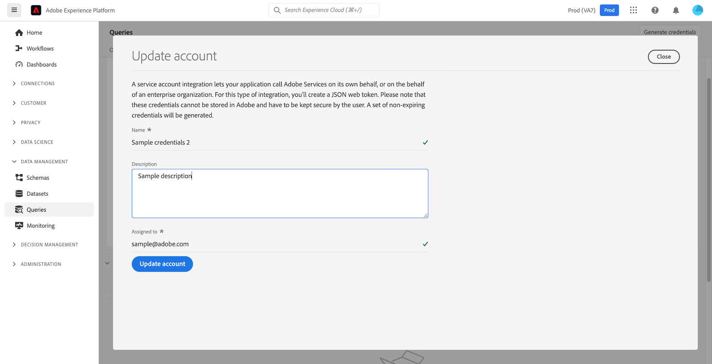

# 凭据指南

Adobe Experience Platform查询服务允许您与外部客户端连接。 您可以使用过期凭据或不过期凭据连接到这些外部客户端。

>[!NOTE]
>
>凭据面板并非自动供所有用户使用。如果您需要，请联系您的Adobe客户团队以请求将[!UICONTROL Credentials]选项卡包含在查询服务工作区中。 如有请求，此更改将在整个组织中实施，并由Adobe的工程团队执行。 它不是由用户控制的设置。

## 过期凭据 {#expiring-credentials}

>[!CONTEXTUALHELP]
>id="platform_queryservice_credentials_expiringcredentials"
>title="客户端的 SSL 模式"
>abstract="必须在连接到查询服务的客户端中启用 SSL。确保 SSL 模式设置为“要求”。"

您可以使用过期凭据快速设置与外部客户端的连接。


**[!UICONTROL Expiring credentials]**&#x200B;部分提供了以下信息：

- **[!UICONTROL Host]**：要连接客户端的主机名称。 这会合并您的组织名称，如Experience Platform UI顶部功能区中所示。
- **[!UICONTROL Port]**：要连接的主机端口号。
- **[!UICONTROL Database]**：要连接客户端的数据库名称。
- **[!UICONTROL Username]**：用于连接到查询服务的用户名。
- **[!UICONTROL Password]**：用于连接到查询服务的密码。 为了安全起见，UI中的密码已进行哈希处理。 选择复制图标()以将完整的未散列凭据复制到剪贴板。
- **[!UICONTROL PSQL command]**：自动插入所有相关信息的命令，供您在命令行上使用PSQL连接到Query Service。
- **[!UICONTROL Expires]**：过期凭据的过期日期和时间。 令牌的默认有效期为24小时，但可以在Admin Console的高级设置中进行更改。

>[!TIP]
>
>若要更改与查询服务的过期凭据连接的会话生命周期，请导航到[Admin Console](https://adminconsole.adobe.com/)，然后在屏幕选项上选择以下内容： **设置** > **隐私和安全** > **身份验证设置** > **高级设置** > **最长会话生命周期**。
>
>
>
>有关Admin Console提供的[高级设置](https://helpx.adobe.com/enterprise/using/authentication-settings.html#advanced-settings)的更多信息，请参阅Adobe帮助文档。

### 在查询会话中连接到Customer Journey Analytics数据 {#connect-to-customer-journey-analytics}

使用带有Power BI或Tableau的Customer Journey Analytics BI扩展访问带有SQL的Customer Journey Analytics [数据视图](https://experienceleague.adobe.com/en/docs/analytics-platform/using/cja-dataviews/data-views)。 通过将查询服务与BI扩展集成，您可以直接在查询服务会话中访问数据视图。 此集成简化了使用查询服务作为其PostgreSQL接口的BI工具的功能。 此功能消除了BI工具中重复数据视图的需要，确保跨平台的一致报告，并简化了Customer Journey Analytics数据与BI平台中其他源的集成。

请参阅文档，了解如何[将查询服务连接到各种桌面客户端应用程序](../clients/overview.md)，如[Power BI](../clients/power-bi.md)或[Tableau](../clients/tableau.md)

>[!IMPORTANT]
>
>需要Customer Journey Analytics工作区项目和数据视图才能使用此功能。

要在Power BI或Tableau中访问Customer Journey Analytics数据，请选择[!UICONTROL Database]下拉菜单，然后从可用选项中选择`prod:cja`。 接下来，复制[!DNL Postgres]凭据参数（主机、端口、数据库、用户名等），以便在Power BI或Tableau配置中使用。


>[!NOTE]
>
>将Power BI或Tableau连接到Customer Journey Analytics时，会使用查询服务“并发会话”权利。 如果需要其他会话和查询，可以购买额外的临时查询用户包附加组件以获取五个额外的并发会话和一个额外的并发查询。

您还可以直接通过查询编辑器或Postgres CLI访问Customer Journey Analytics数据。 为此，请在编写查询时引用`cja`数据库。 有关如何写入、执行和保存查询的更多信息，请参阅查询编辑器[查询创作指南](./user-guide.md#query-authoring)。

有关使用SQL访问Customer Journey Analytics数据视图的完整说明，请参阅[BI扩展指南](https://experienceleague.adobe.com/en/docs/analytics-platform/using/cja-dataviews/bi-extension)。

## 未过期凭据 {#non-expiring-credentials}

>[!CONTEXTUALHELP]
>id="platform_queryservice_credentials_migratenonexpiringcredentials"
>title="迁移到 OAuth 服务器到服务器凭据"
>abstract="由于 JWT 凭据将在 2025 年 6 月 30 日后失效，因此需要进行此次迁移。该过程大约需要 30-40 秒，并且一旦开始就无法取消。迁移后，所有现有作业和集成将继续使用 OAuth。您可以离开此页面，随时返回查看状态。"

您可以使用不会过期的凭据来设置与外部客户端的更永久的连接。

>[!IMPORTANT]
>
>首次将未过期的凭据创建或迁移到OAuth服务器到服务器时，您必须使用系统管理员帐户。 只有系统管理员可以为您的组织执行此操作。 如果非系统管理员尝试执行此步骤，此过程将失败，并出现授权错误。 初始设置后，具有所需权限的用户可以创建或迁移后续的不过期凭据。

>[!NOTE]
>
>未过期的凭据具有以下限制：
>
>- 用户必须使用`{technicalAccountId}:{credential}`格式的用户名和密码登录。 可在[生成凭据](#generate-credentials)部分中找到更多信息。
>- 默认情况下，未过期的凭据仅被授予执行`SELECT`查询的权限。 要运行`CTAS`或`ITAS`查询，请手动将“管理数据集”和“管理架构”权限添加到与未过期凭据关联的角色。 “管理架构”权限位于“数据建模”部分下，而“管理数据集”权限位于[Adobe Developer Console](https://developer.adobe.com/console/)的“数据管理”部分下。
>- 当列出查询对象时，第三方客户端可能会执行与预期不同的操作。 例如，某些第三方客户端（如[!DNL DB Visualizer]）将不会在左侧面板中显示视图名称。 但是，如果在`SELECT`查询中调用了视图名称，则视图名称可访问。 同样，[!DNL PowerUI]可能不会列出通过SQL创建的临时视图，以便在创建仪表板时进行选择。

### 先决条件

在生成不会过期的凭据之前，必须在Adobe Admin Console中完成以下步骤：

1. 登录[Adobe Admin Console](https://adminconsole.adobe.com/)并从顶部导航栏中选择相关组织。
2. [选择产品配置文件。](../../access-control/ui/browse.md)
3. [为产品配置文件配置&#x200B;**沙盒**&#x200B;和&#x200B;**管理查询服务集成**&#x200B;权限](../../access-control/ui/permissions.md)。
4. [将新用户添加到产品配置文件](../../access-control/ui/users.md)，以便授予他们已配置的权限。
5. [将用户添加为产品配置文件管理员](https://helpx.adobe.com/enterprise/using/manage-product-profiles.html)，以允许为任何活动的产品配置文件创建帐户。
6. [将用户添加为产品配置文件开发人员](https://helpx.adobe.com/cn/enterprise/using/manage-developers.html)以创建集成。

完成这些步骤后，将在[Adobe Developer Console](https://developer.adobe.com/console/)中配置所需的权限，以便您生成OAuth服务器到服务器凭据并使用过期或不过期凭据功能。

有关分配权限的详细信息，请参阅[访问控制文档](../../access-control/home.md)。

### 生成凭据 {#generate-credentials}

要创建一组不会过期的凭据，请返回Experience Platform UI并从左侧导航中选择&#x200B;**[!UICONTROL Queries]**&#x200B;以访问[!UICONTROL Queries]工作区。 接下来，选择&#x200B;**[!UICONTROL Credentials]**&#x200B;选项卡，然后选择&#x200B;**[!UICONTROL Generate credentials]**。


将出现一个对话框，允许您生成凭据。 要创建不会过期的凭据，必须提供以下详细信息：

- **[!UICONTROL Name]**：您正在生成的凭据的名称。
- **[!UICONTROL Description]**： （可选）您正在生成的凭据的说明。
- **[!UICONTROL Assigned to]**：将向其分配凭据的用户。 此值应为创建凭据的用户的电子邮件地址。
- **[!UICONTROL Password]** （可选）凭据的可选密码。 如果未设置密码，Adobe将自动为您生成密码。

提供所有必需的详细信息后，选择&#x200B;**[!UICONTROL Generate credentials]**&#x200B;以生成凭据。


>[!IMPORTANT]
>
>选择&#x200B;**[!UICONTROL Generate credentials]**&#x200B;后，配置JSON文件将下载到您的本地计算机。 由于Adobe **不**&#x200B;记录生成的凭据，因此您必须安全地存储下载的文件并保留凭据的记录。
>
>此外，如果凭据未使用90天，则凭据将被注销。

配置JSON文件包含技术帐户名称、技术帐户ID和凭据等信息。 提供时采用以下格式。

```json
{"technicalAccountName":"9F0A21EE-B8F3-4165-9871-846D3C8BC49E@TECHACCT.ADOBE.COM","credential":"3d184fa9e0b94f33a7781905c05203ee","technicalAccountId":"4F2611B8613AA3670A495E55"}
```

保存生成的凭据后，选择&#x200B;**[!UICONTROL Close]**。 您现在可以看到所有未过期的凭据的列表。


您可以编辑或删除未过期的凭据。 要编辑未过期的凭据，请选择铅笔图标（)。 要删除未过期的凭据，请选择删除图标（）。

编辑未过期的凭据时，将显示一个模式窗口。 您可以提供以下详细信息以进行更新：

- **[!UICONTROL Name]**：您正在生成的凭据的名称。
- **[!UICONTROL Description]**： （可选）您正在生成的凭据的说明。
- **[!UICONTROL Assigned to]**：将向其分配凭据的用户。 此值应为创建凭据的用户的电子邮件地址。



提供所有必需的详细信息后，选择&#x200B;**[!UICONTROL Update account]**&#x200B;以完成凭据更新。

### 将凭据迁移到OAuth {#migrate-credentials}

如果您使用的是不会过期的JWT凭据，则必须在2025年6月30日之前将每个凭据迁移到OAuth服务器到服务器，以避免服务中断。

>[!IMPORTANT]
>
>JWT凭据将在2025年6月30日后停止工作。 您必须手动完成此迁移以保持授权。

要了解如何识别受影响的凭据并完成迁移，请参阅[从JWT迁移到OAuth服务器到服务器凭据指南](./migrate-jwt-to-oauth.md)。

有关常见问题，请参阅[迁移常见问题解答](./migrate-jwt-to-oauth.md#faq)。

## 使用凭据连接到外部客户端 {#use-credential-to-connect}

您可以使用过期凭据或不过期凭据与外部客户端(例如Aqua Data Studio、Looker或Power BI)连接。 这些凭据的输入方法因外部客户端而异。 有关使用这些凭据的特定说明，请参阅外部客户端的文档。

该图像指示在UI中找到的每个参数的位置，但不会过期的凭据的密码除外。 虽然未过期的凭据由其JSON配置文件提供，但您可以在UI中的&#x200B;**凭据**&#x200B;选项卡下查看过期的凭据。


下表概述了连接到外部客户端通常所需的参数。

>[!NOTE]
>
>使用未过期的凭据连接到主机时，仍需要使用[!UICONTROL EXPIRING CREDENTIALS]部分中列出的所有参数，但密码和用户名除外。
>&#x200B;>输入用户名和密码的格式使用冒号分隔值，如本示例`username:{your_username}`和`password:{password_string}`所示。

| 参数 | 描述 | 示例 |
|---|---|---|
| **服务器/主机** | 要连接的服务器/主机的名称。 <ul><li>此值既用于过期凭据，又用于非过期凭据，其形式为`server.adobe.io`。 在&#x200B;**[!UICONTROL Host]**&#x200B;部分的[!UICONTROL EXPIRING CREDENTIALS]下找到该值。</ul></li> | `acme.platform.adobe.io` |
| **端口** | 要连接的服务器/主机的端口。 <ul><li>此值同时用于过期凭据和不过期凭据，可在&#x200B;**[!UICONTROL Port]**&#x200B;部分的[!UICONTROL EXPIRING CREDENTIALS]下找到。</ul></li> | `80` |
| **数据库** | 要连接的数据库。 <ul><li>此值同时用于过期凭据和不过期凭据，并在&#x200B;**[!UICONTROL Database]**&#x200B;部分的[!UICONTROL EXPIRING CREDENTIALS]下找到。 </ul></li> | `prod:all` |
| **用户名** | 连接到外部客户端的用户名。 <ul><li>此值用于过期凭据和非过期凭据。 它采用`@AdobeOrg`之前的字母数字字符串形式。 此值位于&#x200B;**[!UICONTROL Username]**&#x200B;下。</li></ul> | `ECBB80245ECFC73E8A095EC9@AdobeOrg` |
| **密码** | 连接到外部客户端的用户的密码。 <ul><li>如果您使用的是过期凭据，则可在&#x200B;**[!UICONTROL Password]**&#x200B;部分中的[!UICONTROL EXPIRING CREDENTIALS]下找到它。</li><li>如果您使用的是未过期的凭据，此值是来自technicalAccountID的拼接参数和从配置JSON文件获取的凭据。 密码值采用以下形式： `{technicalAccountId}:{credential}`。</li></ul> | <ul><li>即将过期的凭据密码包含超过一千个字符的字母数字字符串。 没有给出任何示例。</li><li>未过期的凭据密码如下： <br>`4F2611B8613DK3670V495N55:3d182fa9e0b54f33a7881305c06203ee`</li></ul> |

{style="table-layout:auto"}

## 后续步骤

现在，您已了解过期凭据和不过期凭据的工作方式，可以使用这些凭据连接到外部客户端。 有关外部客户端的详细信息，请参阅[将客户端连接到查询服务指南](../clients/overview.md)。
