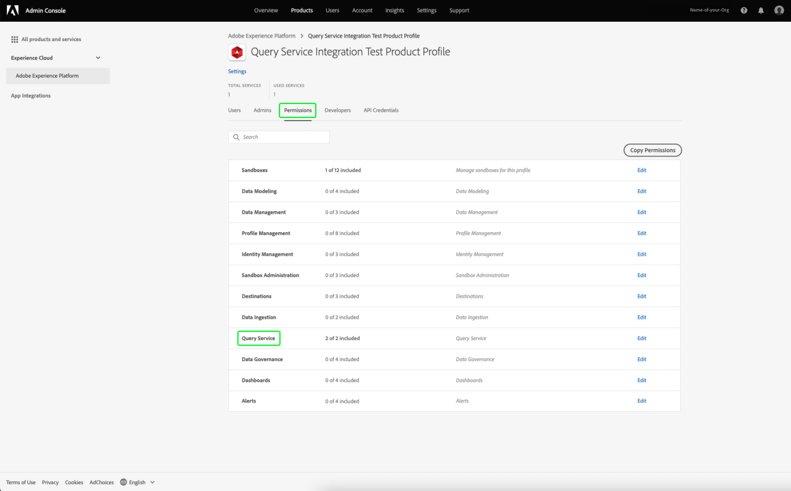

# 凭据指南

Adobe Experience Platform查询服务允许您与外部客户端连接。 您可以使用过期凭据或未过期的凭据连接到这些外部客户端。

## 过期凭据

您可以使用过期凭据快速设置与外部客户端的连接。


**[!UICONTROL 过期凭据]**&#x200B;部分提供以下信息：

- **[!UICONTROL 主机]**:要连接到的主机的名称。要连接到查询服务，这将包括您当前使用的IMS组织的名称。
- **[!UICONTROL 端口]**:要连接到的主机的端口号。
- **[!UICONTROL 数据库]**:要连接到的数据库的名称。
- **[!UICONTROL 用户名]**:用于连接到查询服务的用户名。
- **[!UICONTROL 密码]**:用于连接到查询服务的密码。
- **[!UICONTROL PSQL命令]**:命令自动插入所有相关信息，以便您使用命令行上的PSQL连接到查询服务。
- **[!UICONTROL 过期]**:过期凭据的到期日期。凭据在生成后24小时过期。

## 未过期的凭据

您可以使用未过期的凭据来设置与外部客户端的更永久连接。

在创建未过期的凭据之前，必须先在Adobe Admin Console中为您的组织配置&#x200B;**沙盒**&#x200B;和&#x200B;**管理查询服务集成**&#x200B;权限。

登录到[Adobe Admin Console](https://adminconsole.adobe.com/)，然后从顶部导航栏中选择相关的组织。

在[!UICONTROL 概述]的[!UICONTROL 产品和服务]部分中，选择&#x200B;**Adobe Experience Platform**。


此时将显示Adobe Experience Platform详细信息页面。 接下来，创建新用户档案。 选择&#x200B;[!UICONTROL **新建配置文件**]。


此时将出现一个用户档案创建对话框。 为新配置文件输入描述性名称，然后选择&#x200B;[!UICONTROL **Save**]。 此时会显示新配置文件的[!UICONTROL Settings]页面。 从可用选项中选择&#x200B;[!UICONTROL **权限**]&#x200B;选项卡。

### 启用查询服务权限

要确保为您的组织启用正确的查询服务权限，请从列表中找到并选择&#x200B;[!UICONTROL **查询服务**]&#x200B;类别。



将显示查询服务的[!UICONTROL 编辑权限]工作区。 选择&#x200B;[!UICONTROL **管理查询**]&#x200B;和&#x200B;[!UICONTROL **管理查询服务集成**]&#x200B;的加号(**+**)图标，将其添加到[!UICONTROL 包含的权限项]列。 接下来，选择&#x200B;[!UICONTROL **Save**]&#x200B;以确认更改。


这会返回到设置>权限选项卡。

### 启用沙盒权限

要确保为您的组织选择正确的沙盒，请从列表中找到并选择&#x200B;[!UICONTROL **沙盒**]&#x200B;类别。


将出现“沙箱”工作区。 从[!UICONTROL 可用权限项]中，找到相关的沙盒，在此图像中，它是Prod沙盒。 选择加号(**+**)图标，将其添加到[!UICONTROL Included Permission Items]中。 接下来，选择&#x200B;[!UICONTROL **Save**]&#x200B;以确认更改。


这会返回到设置>权限选项卡。

要允许用户访问未过期的帐户功能，还需执行三个步骤。

- 添加新用户以向授予新创建的权限。 选择&#x200B;[!UICONTROL **Users**]&#x200B;选项卡，然后选择&#x200B;[!UICONTROL **Add User**]。


此时将显示创建用户对话框。 为新用户输入名称和电子邮件，然后选择&#x200B;[!UICONTROL **保存**]。

- 然后，必须将用户添加为管理员，以便允许为任何活动的产品用户档案创建帐户。 将新创建的用户添加为管理员。 选择&#x200B;[!UICONTROL **Admins**]&#x200B;选项卡，然后选择&#x200B;[!UICONTROL **Add Admins**]。


此时将显示“添加管理员”对话框。 将新管理员的详细信息输入到文本字段中，然后选择&#x200B;[!UICONTROL **Save**]。

- 然后，必须将用户添加为开发人员，才能创建集成。 选择&#x200B;**Developers**&#x200B;选项卡，然后选择&#x200B;**Add Developer**。


此时将显示“添加开发人员”对话框。 将新开发人员的详细信息输入到文本字段中，然后选择&#x200B;**保存**。

要了解有关如何分配权限的更多信息，请阅读[访问控制](../../access-control/home.md)中的文档。

现在，在Adobe开发人员控制台中配置了所有所需的权限，以便用户使用过期的凭据功能。

要创建一组未过期的凭据，请在“查询凭据”工作区中选择&#x200B;**[!UICONTROL 生成凭据]**。


此时会出现生成凭据模式窗口。 要创建未过期的凭据，您需要提供以下详细信息：

- **[!UICONTROL 名称]**:要生成的凭据的名称。
- **[!UICONTROL 描述]**:（可选）对要生成的凭据的描述。
- **[!UICONTROL 分配给]**:将为其分配凭据的用户。此值应为创建凭据的用户的电子邮件地址。
- **[!UICONTROL 密码]** （可选）凭据的可选密码。如果未设置密码，Adobe将自动为您生成密码。

提供所有必需的详细信息后，请选择&#x200B;**[!UICONTROL 生成凭据]**&#x200B;以生成凭据。


>[!IMPORTANT]
>
>选择&#x200B;**[!UICONTROL 生成凭据]**&#x200B;按钮后，将配置JSON文件下载到本地计算机。 由于Adobe **不**&#x200B;记录生成的凭据，因此&#x200B;**必须**&#x200B;安全地存储下载的文件并保留凭据记录。
>
>此外，如果凭据90天未使用，则凭据将被删除。

配置JSON文件包含技术帐户名称、技术帐户ID和凭据等信息。 它以以下格式提供。

```json
{"technicalAccountName":"9F0A21EE-B8F3-4165-9871-846D3C8BC49E@TECHACCT.ADOBE.COM","credential":"3d184fa9e0b94f33a7781905c05203ee","technicalAccountId":"4F2611B8613AA3670A495E55"}
```

现在，您已保存生成的凭据，请选择&#x200B;**[!UICONTROL 关闭]**。 您现在可以看到所有未过期凭据的列表。


您可以编辑或删除未过期的凭据。 要编辑未过期的凭据，请选择铅笔图标()。 要删除未过期的凭据，请选择删除图标()。

编辑未过期的凭据时，会显示一个模式窗口。 您可以提供以下详细信息以进行更新：

- **[!UICONTROL 名称]**:要生成的凭据的名称。
- **[!UICONTROL 描述]**:（可选）对要生成的凭据的描述。
- **[!UICONTROL 分配给]**:将为其分配凭据的用户。此值应为创建凭据的用户的电子邮件地址。


提供所有必需的详细信息后，请选择&#x200B;**[!UICONTROL 更新帐户]**&#x200B;以完成凭据更新。

## 使用凭据连接到外部客户端

您可以使用过期或未过期的凭据与外部客户端(如Aqua Data Studio、Looker或Power BI)进行连接。

下表包含通常连接到外部客户端所需的参数列表及其说明。

>[!NOTE]
>
>在使用未过期的凭据连接到主机时，仍需要使用[!UICONTROL EXPISING CREDENTIALS]部分中列出的所有参数（密码除外）。

| 参数 | 描述 |
|---|---|
| **服务器/主机** | 您连接到的服务器/主机的名称。 此值采用`server.adobe.io`的形式，可在&#x200B;**[!UICONTROL Host]**&#x200B;下找到。 |
| **端口** | 要连接的服务器/主机的端口。 此值位于&#x200B;**[!UICONTROL Port]**&#x200B;下。 端口的示例值为`80`。 |
| **数据库** | 您连接到的数据库。 此值位于&#x200B;**[!UICONTROL Database]**&#x200B;下。 数据库的示例值为`prod:all`。 |
| **用户名** | 连接到外部客户端的用户的用户名。 这采用`@AdobeOrg`之前的字母数字字符串的形式。 此值位于&#x200B;**[!UICONTROL Username]**&#x200B;下。 |
| **密码** | 连接到外部客户端的用户的密码。 <ul><li>如果您使用的是过期凭据，则可在过期凭据部分的&#x200B;**[!UICONTROL Password]**&#x200B;下找到此凭据。</li><li>如果您使用的是未过期的凭据，则此值由technicalAccountID的参数和从配置JSON文件获取的凭据组成。 密码值采用以下形式：`{technicalAccountId}:{credential}`。</li></ul> |

## 后续步骤

现在，您已了解过期和未过期凭据的工作方式，接下来可以使用这些凭据连接到外部客户端。 有关外部客户端的详细信息，请阅读[将客户端连接到查询服务指南](../clients/overview.md)。
