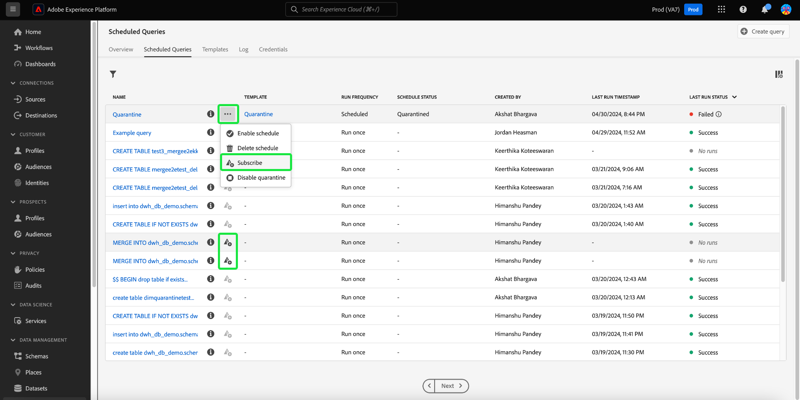

# 监测计划查询

Adobe Experience Platform通过UI提高了所有查询作业状态的可见性。 在[!UICONTROL 计划查询]选项卡中，您现在可以找到有关查询运行的重要信息，包括状态、计划详细信息和失败时的错误消息/代码。 您还可以通过[!UICONTROL 计划查询]选项卡，通过UI为任何此类查询订阅基于其状态的查询警报。

## [!UICONTROL 计划的查询]

[!UICONTROL 计划查询]选项卡提供了所有计划CTAS和ITAS查询的概述。 可以找到所有计划查询的运行详细信息，以及任何失败查询的错误代码和消息。

要导航到[!UICONTROL 计划查询]选项卡，请从左侧导航栏中选择&#x200B;**[!UICONTROL 查询]**，然后选择&#x200B;**[!UICONTROL 计划查询]**

下表描述了每个可用的列。

>[!NOTE]
>
>警报订阅图标()包含在无标题列的每一行中。 有关详细信息，请参阅[警报订阅](#alert-subscription)部分。

| 列 | 描述 |
|---|---|
| **[!UICONTROL 名称]** | 名称字段是模板名称或SQL查询的前几个字符。 使用查询编辑器通过UI创建的任何查询都会在开始时命名。 如果查询是通过API创建的，则其名称将成为用于创建查询的初始SQL的片段。 要查看与查询关联的所有运行的列表，请从[!UICONTROL Name]列中选择一项。 有关详细信息，请参阅[查询运行计划详细信息](#query-runs)部分。 |
| **[!UICONTROL 模板]** | 查询的模板名称。 选择模板名称以导航到查询编辑器。 为方便起见，查询模板会显示在查询编辑器中。 如果没有模板名称，该行将标有连字符，并且无法重定向到查询编辑器以查看查询。 |
| **[!UICONTROL SQL]** | SQL查询的片段。 |
| **[!UICONTROL 运行频率]** | 查询设置为运行的节奏。 可用值为`Run once`和`Scheduled`。 |
| **[!UICONTROL 创建者]** | 创建查询的用户的名称。 |
| **[!UICONTROL 已创建]** | 创建查询时的时间戳（UTC格式）。 |
| **[!UICONTROL 上次运行时间戳]** | 运行查询时的最新时间戳。 此列突出显示查询是否已根据其当前计划执行。 |
| **[!UICONTROL 上次运行状态]** | 最近查询执行的状态。 状态值为： `Success`、`Failed`、`In progress`和`No runs`。 |
| **[!UICONTROL 计划状态]** | 计划查询的当前状态。 共有六个潜在值： [!UICONTROL 正在注册]、[!UICONTROL 活动]、[!UICONTROL 非活动]、[!UICONTROL 已删除]、连字符和[!UICONTROL 已隔离]。<ul><li>**[!UICONTROL Registering]**&#x200B;状态表示系统仍在为查询创建新的计划。 请注意，您不能在注册时禁用或删除计划查询。</li><li>**[!UICONTROL 活动]**&#x200B;状态表示计划的查询&#x200B;**尚未超过**&#x200B;其完成日期和时间。</li><li>**[!UICONTROL 非活动]**&#x200B;状态表示计划的查询已&#x200B;**通过**&#x200B;其完成日期和时间，或者已被用户标记为非活动状态。</li><li>**[!UICONTROL Deleted]**&#x200B;状态表示查询计划已删除。</li><li>连字符表示计划查询是单次、非循环查询。</li><li>**[!UICONTROL 隔离]**&#x200B;状态表示查询连续十次运行失败，需要您的干预才能执行任何进一步的执行。</li></ul> |

>[!TIP]
>
>如果导航到查询编辑器，则可以选择&#x200B;**[!UICONTROL 查询]**&#x200B;以返回[!UICONTROL 模板]选项卡。

## 自定义计划查询的表设置 {#customize-table}

您可以根据需要调整[!UICONTROL 计划查询]选项卡上的列。 要打开[!UICONTROL 自定义表]设置对话框并编辑可用列，请选择设置图标（)。

>[!NOTE]
>
>默认情况下，引用计划创建日期的[!UICONTROL Created]列处于隐藏状态。

切换相关的复选框以删除或添加表列。 接下来，选择&#x200B;**[!UICONTROL 应用]**&#x200B;以确认您的选择。

>[!NOTE]
>
>在创建过程中，通过UI创建的任何查询都将变为命名模板。 模板名称将显示在模板列中。 如果查询是通过API创建的，则模板列为空。

## 使用内联操作管理计划查询 {#inline-actions}

[!UICONTROL 计划查询]视图提供了各种内联操作以从一个位置管理所有计划查询。 每行中都会显示内联操作，并带有省略号。 选择要管理的计划查询的省略号，以在弹出菜单中查看可用选项。 可用选项包括[[!UICONTROL 禁用计划]](#disable)或[!UICONTROL 启用计划]、[[!UICONTROL 删除计划]](#delete)、[[!UICONTROL 订阅]](#alert-subscription)以查询警报，以及[启用或[!UICONTROL 禁用隔离]](#quarantined-queries)。

### 禁用或启用计划查询 {#disable}

要禁用计划查询，请为要管理的计划查询选择省略号，然后从弹出菜单的选项中选择&#x200B;**[!UICONTROL 禁用计划]**。 将显示一个对话框以确认您的操作。 选择&#x200B;**[!UICONTROL 禁用]**&#x200B;以确认您的设置。

禁用计划查询后，可通过同一进程启用计划。 选择省略号，然后从可用选项中选择&#x200B;**[!UICONTROL 启用计划]**。

>[!NOTE]
>
>如果查询已被隔离，则应在启用其计划之前查看模板的SQL。 如果模板查询仍有问题，这可以防止计算小时数的浪费。

### 删除计划查询 {#delete}

要删除计划查询，请为要管理的计划查询选择省略号，然后从弹出菜单的选项中选择&#x200B;**[!UICONTROL 删除计划]**。 将显示一个对话框以确认您的操作。 选择&#x200B;**[!UICONTROL 删除]**&#x200B;以确认您的设置。

删除计划查询后，将&#x200B;**不**&#x200B;从计划查询列表中删除。 省略号提供的内联操作将被删除并替换为灰显的添加警报订阅图标。 您无法订阅已删除计划的警报。 该行保留在UI中，用于提供有关作为计划查询的一部分执行的运行的信息。

如果要为该查询模板计划运行，请从相应的行中选择模板名称以导航到查询编辑器，然后按照[说明将计划添加到查询](./query-schedules.md#create-schedule)，如文档中所述。

### 订阅警报 {#alert-subscription}

要订阅计划查询运行的警报，请选择`...` （省略号）或警报订阅图标（)管理计划查询。 出现内联操作下拉菜单。 接下来，从可用选项中选择&#x200B;**[!UICONTROL 订阅]**。

[!UICONTROL 警报]对话框打开。 [!UICONTROL 警报]对话框允许您同时订阅UI通知和电子邮件警报。 有多个可用的警报订阅选项： `start`、`success`、`failure`、`quarantine`和`delay`。 选中相应的框并选择&#x200B;**[!UICONTROL 保存]**&#x200B;进行订阅。

下表说明了支持的查询警报类型：

| 提醒类型 | 描述 |
|---|---|
| `start` | 此警报会在启动或开始处理计划的查询运行时通知您。 |
| `success` | 此警报会在计划的查询运行成功完成时通知您，指示查询在没有任何错误的情况下执行。 |
| `failed` | 当计划的查询运行遇到错误或无法成功执行时，将触发此警报。 它有助于您及时识别和处理问题。 |
| `quarantine` | 当计划的查询运行处于隔离状态时，将激活此警报。 在[隔离功能](#quarantined-queries)中注册查询时，任何连续运行失败10次的计划查询都会自动进入[!UICONTROL 隔离]状态。 然后，您需要进行干预，然后才能执行任何进一步的执行。 |
| `delay` | 此警报通知您查询执行结果[&#128279;](#query-run-delay)是否有延迟超过指定的阈值。 您可以设置自定义时间，以在该持续时间运行查询时触发警报，而不完成或失败。 |

>[!NOTE]
>
>若要收到查询运行被隔离的通知，您必须先在[隔离功能](#quarantined-queries)中注册计划的查询运行。

有关详细信息，请参阅[警报订阅API文档](../api/alert-subscriptions.md)。

### 查看查询详细信息 {#query-details}

选择信息图标()以查看查询的详细信息面板。 详细信息面板包含查询的所有相关信息，但不包括计划查询表中包含的事实信息。 其他信息包括查询ID、上次修改日期、查询的SQL、计划ID和当前设置的计划。

## 隔离的查询 {#quarantined-queries}

>[!NOTE]
>
>隔离警报不适用于“只运行一次”的临时查询。 隔离警报仅适用于计划批处理（CTAS和ITAS）查询。

注册隔离功能后，任何连续运行失败10次的计划查询将自动置于[!UICONTROL 隔离]状态。 具有此状态的查询将变为非活动状态，并且不会按其计划的节奏执行。 然后，您需要进行干预，然后才能执行任何进一步的执行。 这样可以保护系统资源，因为您必须先查看和更正SQL问题，然后才能进一步执行。

要为隔离功能启用计划查询，请从出现的下拉菜单中选择省略号(`...`)，然后选择[!UICONTROL 启用隔离]。

在计划创建过程中，还可以在隔离功能中注册查询。 有关详细信息，请参阅[查询计划文档](./query-schedules.md#quarantine)。

## 查询运行延迟 {#query-run-delay}

通过设置查询延迟警报，保持对计算小时数的控制。 如果查询状态在特定时段后保持不变，则可以监视查询性能并接收通知。 使用“[!UICONTROL 查询运行延迟]”警报，以在特定时间段后查询未完成继续处理时收到通知。

当您[订阅计划查询运行的警报](#alert-subscription)时，可用的警报之一是[!UICONTROL 查询运行延迟]。 此警报要求您设置执行时间的阈值，此时您会收到处理延迟的通知。

要选择触发通知的阈值持续时间，请在文本输入字段中输入数字，或使用向上和向下箭头递增1分钟。 由于阈值以分钟为单位进行设置，因此观察查询运行延迟的最长持续时间为1440分钟（24小时）。 运行延迟的默认时间段为150分钟。

>[!NOTE]
>
>查询运行只能有一个运行延迟时间。 如果更改延迟阈值，则订阅警报的用户和整个组织的延迟阈值都会更改。

请参阅订阅警报部分，了解如何[订阅[!UICONTROL 查询运行延迟]警报](#alert-subscription)。

## 筛选查询 {#filter}

您可以根据运行频率筛选查询。 从[!UICONTROL 计划查询]选项卡中，选择过滤器图标（）以打开过滤器侧栏。

要根据查询的运行频率筛选查询列表，请选中&#x200B;**[!UICONTROL 已计划]**&#x200B;或&#x200B;**[!UICONTROL 运行一次]**&#x200B;筛选复选框。

>[!NOTE]
>
>任何已执行但未计划的查询均符合[!UICONTROL 运行一次]的条件。

启用筛选条件后，选择&#x200B;**[!UICONTROL 隐藏筛选器]**&#x200B;以关闭筛选器面板。

## 查询运行计划详细信息 {#query-runs}

要打开计划详细信息页面，请从[!UICONTROL 计划查询]选项卡中选择查询名称。 此视图提供在该计划查询中执行的所有运行的列表。 提供的信息包括开始和结束时间、状态以及所使用的数据集。

此信息以五列表格形式提供。 每一行表示查询执行。

| 列名 | 描述 |
|---|---|
| **[!UICONTROL 查询运行ID]** | 每日执行的查询运行ID。 选择&#x200B;**[!UICONTROL 查询运行ID]**&#x200B;以导航到[!UICONTROL 查询运行概述]。 |
| **[!UICONTROL 查询运行开始]** | 执行查询的时间戳。 时间戳采用UTC格式。 |
| **[!UICONTROL 查询运行完成]** | 查询完成时的时间戳。 时间戳采用UTC格式。 |
| **[!UICONTROL 状态]** | 最近查询执行的状态。 状态值为： `Success`、`Failed`、`In progress`或`Quarantined`。 |
| **[!UICONTROL 数据集]** | 执行中涉及的数据集。 |

可在[!UICONTROL 属性]面板中看到正在计划的查询的详细信息。 此面板包括初始查询ID、客户端类型、模板名称、查询SQL和计划的节奏。

选择查询运行ID以定位至运行详细信息页并查看查询信息。

## 查询运行概述 {#query-run-overview}

[!UICONTROL 查询运行概述]提供了有关此计划查询的单独运行的信息，以及运行状态的更详细细目。 此页面还包括客户机信息以及可能导致查询失败的任何错误的详细信息。

查询状态部分提供了查询失败时的错误代码和错误消息。

您可以从此视图将查询SQL复制到剪贴板。 要复制查询，请选择SQL代码片段右上角的复制图标。 此时会显示一条弹出消息，确认已复制代码。

### 使用匿名块运行查询的详细信息 {#anonymous-block-queries}

使用匿名块组成其SQL语句的查询被分隔到其各自的子查询中。 通过分隔为子查询，可单独检查每个查询块的运行详细信息。

>[!NOTE]
>
>使用DROP命令的匿名块的运行详细信息&#x200B;**不会**&#x200B;报告为单独的子查询。 CTAS查询、ITAS查询和用作匿名块子查询的COPY语句有单独的运行详细信息可用。 当前不支持DROP命令的运行详细信息。

匿名块通过在查询前使用`$$`前缀来表示。 若要了解有关查询服务中匿名块的更多信息，请参阅[匿名块文档](../key-concepts/anonymous-block.md)。

匿名块子查询的运行状态左侧有选项卡。 选择一个选项卡以显示运行详细信息。

如果匿名块查询失败，您可以通过此UI查找该特定块的错误代码。

选择&#x200B;**[!UICONTROL 查询]**&#x200B;以返回计划详细信息屏幕，或选择&#x200B;**[!UICONTROL 计划查询]**&#x200B;以返回[!UICONTROL 计划查询]选项卡。

