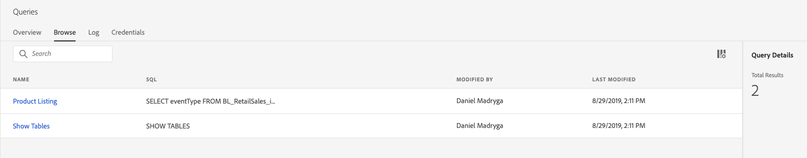

# 查询服务指南

Adobe Experience Platform查询服务提供一个用户界面，可用于编写和执行查询、视图先前执行的查询以及访问IMS组织内用户保存的查询。 要在 [Adobe Experience Platform中访问UI][platform-ui]，请在左侧导 **航中选择** 查询。

## 查询编辑器

查询编辑器使您能够编写和执行查询，而无需使用外部客户端。 单击 **创建查询** ，打开查询编辑器并创建新查询。 您还可以通过从“日志”或“浏览”选项卡中选择查询来访 *问* , *查询编* 辑器。 选择之前执行或保存的查询将打开查询编辑器并显示所选查询的SQL。

查询编辑器提供了编辑空间，您可以在此处开始键入查询。 在您键入时，编辑器会自动完成表中的SQL保留字、表和字段名称。 编写完查询后，单击“ **播放** ”以运行查询。 编辑 *器下方的“控制台* ”选项卡显示查询服务当前正在执行的操作，指示查询何时返回。 “控 *制台* ”旁边的“结果”选项卡显示查询结果。 有关使用 [查询编辑器的详细信息][query-editor] ，请参阅查询编辑器指南。

## 浏览

“浏 *览* ”选项卡显示由单位中的用户保存的查询。 将这些项目视为查询项目是有用的，因为这里保存的查询可能仍在建设中。 查询显示在“浏 *览* ”选项卡上，如果之前由服务执行过查询，则“日志 ** ”选项卡中也会显示为运行查询。

| 栏目 | 描述 |
| --- | --- |
| 名称 | 用户创建的查询名。 您可以单击该名称以在查询编辑器中打开查询。 您还可以使用搜索栏搜索查询的名称。 搜索区分大小写。 |
| SQL | SQL查询的前几个字符。 将指针悬停在代码上方可显示完整查询。 |
| 修改者 | 上次修改查询的用户。 您组织中有权访问查询服务的任何用户都可以修改查询。 |
| 上次修改时间 | 浏览器时区中对查询进行上次修改的日期和时间。 |

## 日志

“日 *志* ”选项卡提供了以前已执行的查询的列表。 默认情况下，日志将查询按相反的年代顺序列表。

| 栏目 | 描述 |
| --- | --- |
| 名称 | 查询名称，由SQL查询的前几个字符组成。 单击该名称可打开查询编辑器，您可以编辑查询。 您可以使用搜索栏搜索查询的名称。 搜索区分大小写。 |
| 创建者 | 创建查询的人的姓名。 |
| 客户端 | 用于查询的客户端。 |
| 数据集 | 查询使用的输入数据集。 单击数据集可转到输入数据集详细信息屏幕。 |
| 状态 | 查询的当前状态。 |
| 上次运行 | 查询最后运行时。 可以通过单击此列上的箭头，按升序或降序对列表进行排序。 |
| 运行时间 | 运行查询所花费的时间。 |

## 凭据

“凭 *据* ”选项卡显示您的Postgres凭据。 单击任 **意字段旁边的** “复制”图标，将其内容存储在键盘缓冲区中。 有关如何使用这些凭据与外部客户端连接的详细信息，请阅读“与客 [户端连接”指南][connect-clients]。

## 后续步骤

现在，您已熟悉平台上的查询服务用户界面，可以访问查询编辑器以开始创建您自己的查询项目并与组织中的其他用户共享。 有关在查询编辑器中创作和运行查询的详细信息，请参阅 [查询编辑器用户指南][query-editor]。

[platform-ui]: https://platform.adobe.com
[query-editor]: user-guide.md
[connect-clients]: ../clients/overview.md
