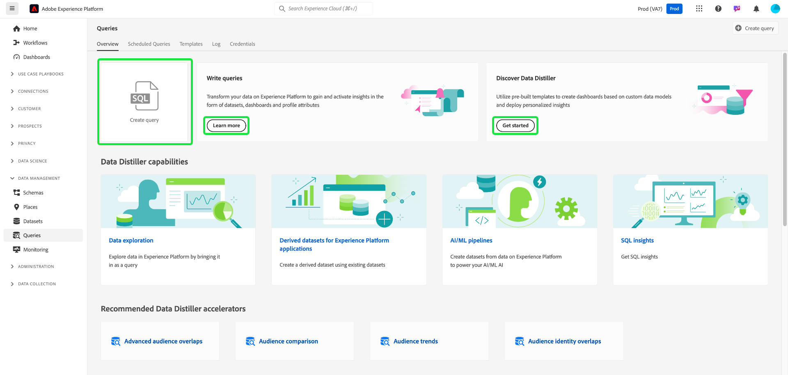
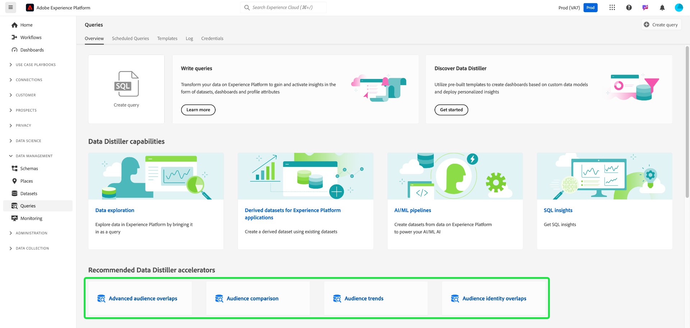
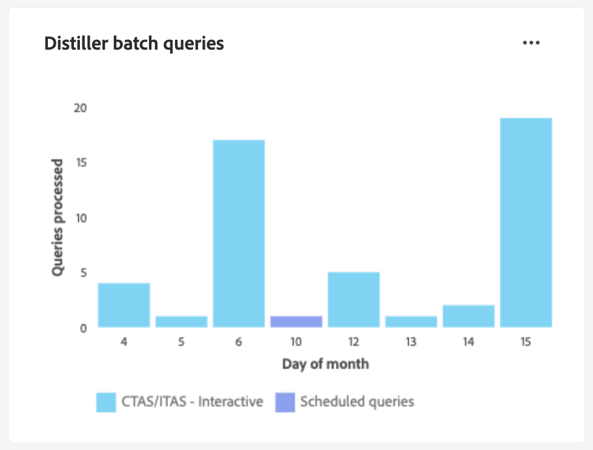
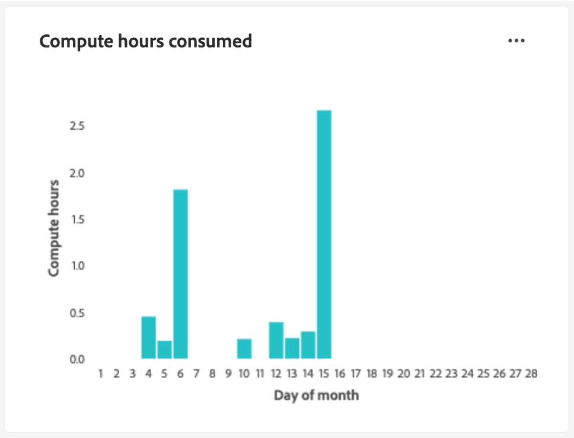
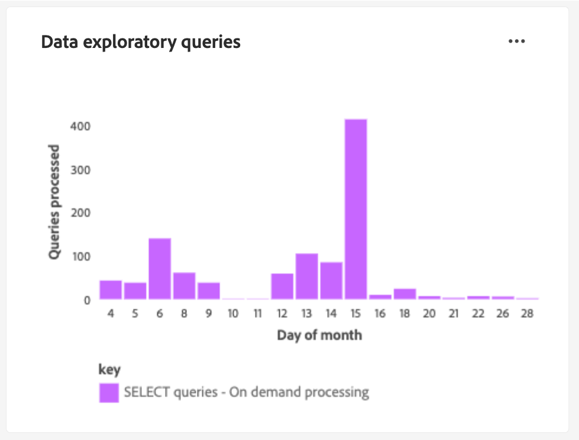
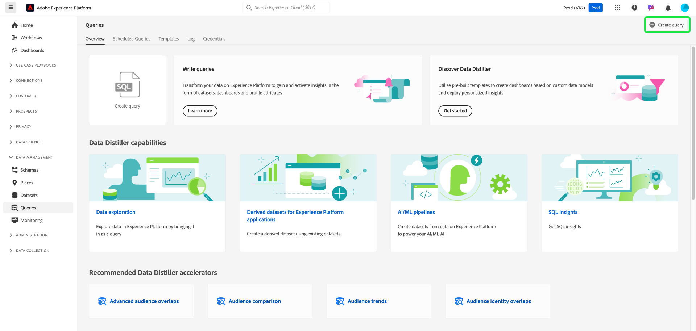
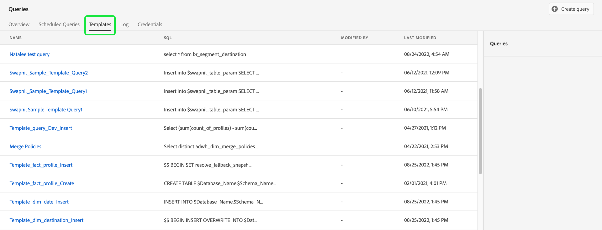
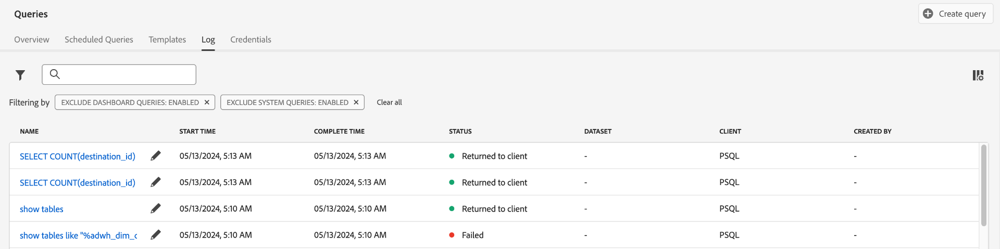

# 查询服务UI指南

Adobe Experience Platform查询服务提供了一个用户界面，可用于编写和执行查询、查看先前执行的查询以及访问由您组织内的用户保存的查询。 要在[Adobe Experience Platform](https://platform.adobe.com)中访问UI，请在左侧导航中选择&#x200B;**[!UICONTROL Queries]**。 [!UICONTROL Queries] [!UICONTROL Overview]出现。

## 概述 {#overview}

[!UICONTROL Overview]选项卡为使用查询和数据Distiller模板提供了一个简化的入口点。 在这里，您可以访问编写查询、浏览数据集和分析受众数据所需的所有功能，以确保您的数据分析和受众分析有一个流畅的工作流程。 使用本概述了解使用Data Distiller可以实现的目标，并发现有关查询服务使用情况的关键指标。

### 主面板 {#main-panels}

[!UICONTROL Overview]页面包含几个主要部分以帮助您入门：

1. 选择&#x200B;**[!UICONTROL Create query]**&#x200B;可快速导航到查询编辑器以编写和执行新查询。
2. 选择&#x200B;**[!UICONTROL Learn more]**&#x200B;以查看有关如何&#x200B;**[!UICONTROL Write queries]**&#x200B;的详细文档。
3. 在&#x200B;**[!UICONTROL Get started]**&#x200B;部分中选择&#x200B;**[!UICONTROL Discover Data Distiller]**&#x200B;以打开Data Distiller概述并了解可用的功能。

### 数据蒸馏器功能 {#data-distiller-capabilities}

[!UICONTROL Data Distiller capabilities]部分提供了指向更高级的Data Distiller功能的文档链接：

- **[[!UICONTROL Data exploration]](../use-cases/data-exploration.md)**：了解如何使用SQL浏览、排除和验证批处理摄取的数据。
- **[[!UICONTROL Derived datasets for Experience Platform applications]](../data-distiller/derived-datasets/overview.md)**：了解如何创建派生的数据集以支持复杂而多样的用例，从而最大限度地提高您的数据效用。
- **[[!UICONTROL AI/ML pipelines]](../data-distiller/ml-feature-pipelines/overview.md)**：了解首选机器学习工具背后的重要概念，以及如何构建支持营销用例的自定义模型。 本指南系列描述了构建功能管道的必要步骤，这些管道用于准备来自Experience Platform的数据以馈送机器学习环境中的自定义模型。
- **[[!UICONTROL SQL insights]](../data-distiller/sql-insights/overview.md)**：了解使用Data Distiller从SQL开发见解功能板的主要功能和所需步骤。

### 推荐的数据蒸馏器加速器 {#recommended-accelerators}

选择快速链接以导航到相关的Data Distiller功能板[!UICONTROL Templates]。 每个加速器都提供了强大的工具和可视化图表来帮助您分析受众数据、优化分段和增强定位策略。

- **[[!UICONTROL Advanced audience overlaps]](../../dashboards/sql-insights-query-pro-mode/templates/overlaps.md)**：通过此仪表板，您可以分析多个受众区段之间的受众交叉点，以揭示有价值的见解并优化分段策略。 您还可以导出您的见解以供进一步离线分析或报告。
- **[[!UICONTROL Audience comparison]](../../dashboards/sql-insights-query-pro-mode/templates/comparison.md)**：从此仪表板，您可以并排比较和对比关键受众量度，以详细分析两个受众组。 这些见解可帮助您了解受众规模、增长和其他关键绩效指标，使您能够利用数据驱动型决策优化分段和定位策略。
- **[[!UICONTROL Audience trends]](../../dashboards/sql-insights-query-pro-mode/templates/trends.md)**：使用[!UICONTROL Audience trends]仪表板通过关键量度（受众增长、身份计数和单一身份配置文件）可视化受众如何随时间的演变。 跟踪趋势以揭示对受众行为的宝贵见解，从而让您能够优化分段、增强参与度并优化定位策略以实现更有效的营销活动。
随时间跟踪受众量度，以监控受众规模、身份增长以及整体参与度的变化。
- **[[!UICONTROL Audience identity overlaps]](../../dashboards/sql-insights-query-pro-mode/templates/identity-overlaps.md)**：使用“受众身份重叠”仪表板分析选定受众中的身份重叠。 可视化图表和列表数据为优化身份拼接、减少冗余和改进分段提供了见解。 这些见解有助于更有效地定位、增强个性化并简化客户交互。

### 数据蒸馏器示例 {#data-distiller-examples}

选择卡片以打开文档指南和示例，帮助您充分利用Data Distiller：

- **[[!UICONTROL Decile-based derived datasets]](../use-cases/deciles-use-case.md)**：了解如何在Adobe Experience Platform中创建用于分段和受众创建的基于十分位数的派生数据集。 使用航空公司忠诚度方案，其中包括架构设计、十分位数计算以及用于排名和聚合数据的查询示例。
- **[[!UICONTROL Customer lifetime value]](../use-cases/customer-lifetime-value.md)**：了解如何使用Real-Time CDP和自定义仪表板跟踪和可视化客户生命周期值。 利用这些见解制定吸引新客户、留住现有客户并最大化利润率的策略。
- **[[!UICONTROL Propensity score]](../use-cases/propensity-score.md)**：了解如何使用机器学习预测模型确定倾向分数。 本指南包括发送培训数据、将经过培训的模型与SQL一起应用以及预测客户购买可能性。
- **[[!UICONTROL Consent analysis]](../../dashboards/insights-use-cases/consent-analysis.md)**：了解如何使用Real-Time CDP、查询服务和数据Distiller分析和跟踪客户同意。 本指南涵盖构建同意功能板、优化分段、跟踪趋势和确保合规性，帮助您建立信任并提供个性化体验。
- **[[!UICONTROL Fuzzy match]](../use-cases/fuzzy-match.md)**：了解如何对Experience Platform数据执行“模糊”匹配，以查找近似匹配并分析数据集之间的字符串相似度。 遵循本指南以节省时间并使您的数据更易于访问。 该示例演示了如何在两个旅行社数据集之间匹配酒店房间属性，说明如何高效地匹配、比较和协调大型复杂数据集，以获得一致性和准确性。

### 关键量度 {#key-metrics}

关键量度部分显示有助于监视查询服务使用情况的重要数据的可视化图表。 对于每个图表，您可以选择右上角的省略号(`...`)，后跟[!UICONTROL View more]查看以表格形式显示的结果，或者以CSV文件格式下载数据以在电子表格中查看。 有关详细信息，请参阅[查看更多指南](../../dashboards/sql-insights-query-pro-mode/view-more.md)。

#### 设置日期过滤器 {#set-date-filter}

若要对这些可视化应用全局日期过滤器，请选择过滤器图标（)，并在&#x200B;**[!UICONTROL Filters]**&#x200B;对话框中调整日期范围。 应用此过滤器可针对特定时间范围定制显示的量度，并增强分析的相关性。

#### [!UICONTROL Distiller batch queries] {#distiller-batch-queries}

[!UICONTROL Distiller batch queries]图表提供按天划分的查询活动，突出显示已处理的CTA和ITAS（交互式和已计划）查询的数量。 图表突出显示模式，例如交互式查询在某些日期达到高峰，以及不频繁使用计划查询。 利用这些见解通过识别活动高峰期、优化调度策略和平衡查询执行来优化性能，从而提高工作流效率和资源利用率。

#### [!UICONTROL Compute hours consumed] {#compute-hours-consumed}

[!UICONTROL Compute hours consumed]图表提供了用于处理查询服务操作的计算小时数的每日可视化图表。 使用这些计算小时趋势来监控资源消耗、确定高需求时段，并优化查询执行以确保高效的资源分配和性能。

#### [!UICONTROL Data exploratory queries]

[!UICONTROL Data exploratory queries]图表显示每天按需处理的SELECT查询数。 此可视化图表突出显示查询活动趋势（如特定日期使用量的峰值），以帮助您了解数据探索工作最活跃的时间。 利用这些见解监控查询使用模式、平衡工作负载并优化资源分配，以进行探索性数据分析。 此分析确保查询服务得到更高效的使用，并改进高需求期间的规划。

## 查询编辑器

使用查询编辑器编写和执行查询，而不使用外部客户端。 选择&#x200B;**[!UICONTROL Create Query]**&#x200B;以打开查询编辑器并创建新查询。 您还可以通过从&#x200B;**[!UICONTROL Log]**&#x200B;或&#x200B;**[!UICONTROL Templates]**&#x200B;选项卡中选择查询来访问查询编辑器。 如果选择先前执行或保存的查询，查询编辑器将打开并显示选定查询的SQL。

在查询编辑器中键入内容时，编辑器会自动完成表中的SQL保留字、表和字段名。 完成查询编写后，选择播放图标（)以运行查询。 编辑器下方的&#x200B;**[!UICONTROL Console]**&#x200B;选项卡显示查询服务当前正在执行的操作，并指示何时返回查询。 **[!UICONTROL Result]**&#x200B;旁边的[!UICONTROL Console]选项卡显示查询结果。 有关使用查询编辑器的详细信息，请参阅[查询编辑器指南](./user-guide.md)。

### 关于结果选项卡 {#results-tab}

[!UICONTROL Result]选项卡在执行后显示查询的表格输出。 使用此选项卡可查看结果、验证输出并直接在界面中执行跟进操作。 从该视图中，您可以：

- 以CSV、XLSX或JSON格式下载结果以进行离线分析。 查看[下载查询结果](./user-guide.md#download-query-results)。
- 以全屏方式查看结果，以在可调整大小的网格布局中检查大型表或宽数据集。 查看[全屏查看结果](./user-guide.md#view-results)。
- 以CSV格式将结果复制到剪贴板，以便快速粘贴到电子表格应用程序中。 查看[复制结果](./user-guide.md#copy-results)。

这些功能旨在支持无缝的数据验证、报告和共享工作流程，并且无需离开查询编辑器。

### 参数化查询 {#parameterized-queries}

查询编辑器支持参数化查询，这使您可以将变量插入到SQL语句中，并在运行时动态分配值。 此功能有助于简化可重用查询并提高工作流的灵活性。

您可以在编写查询时定义参数，然后在运行查询之前通过[!UICONTROL Query parameters]选项卡分配值。 参数化查询对于在整个组织内共享的计划查询或查询模板特别有用。

要了解如何定义和使用参数，请参阅查询编辑器中的[参数化查询](./parameterized-queries.md)。

## 计划的查询 {#scheduled-queries}

已另存为模板的查询可以计划为定期运行。 在计划查询时，您可以选择运行频率、开始和结束日期、计划查询在一周中运行的日期以及要将查询导出到的数据集。 使用查询编辑器设置查询计划。

要了解如何通过UI计划查询，请参阅[计划查询指南](./user-guide.md#scheduled-queries)。 要了解如何使用API添加计划，请参阅[计划查询端点指南](../api/scheduled-queries.md)。

一旦安排了一个查询，它就会出现在[!UICONTROL Scheduled Queries]选项卡上的已安排查询列表中。 从列表中选择计划查询，即可找到有关查询、运行、创建者和时间的完整详细信息。

| 列 | 描述 |
| --- | --- |
| **[!UICONTROL Name]** | 名称字段是模板名称或SQL查询的前几个字符。 使用查询编辑器通过UI创建的任何查询都会在开始时命名。 如果查询是通过API创建的，则查询的名称是用于创建查询的初始SQL的片段。 |
| **[!UICONTROL Template]** | 查询的模板名称。 选择模板名称以导航到查询编辑器。 为方便起见，查询模板会显示在查询编辑器中。 如果没有模板名称，该行将标有连字符，并且无法重定向到查询编辑器以查看查询。 |
| **[!UICONTROL SQL]** | SQL查询的片段。 |
| **[!UICONTROL Run frequency]** | 此列指示查询的运行频率。 可用值为`Run once`和`Scheduled`。 可以根据查询的运行频率对其进行筛选。 |
| **[!UICONTROL Created by]** | 创建查询的用户的名称。 |
| **[!UICONTROL Created]** | 创建查询时的时间戳（UTC格式）。 |
| **[!UICONTROL Last run timestamp]** | 运行查询时的最新时间戳。 此列突出显示查询是否已根据其当前计划执行。 |
| **[!UICONTROL Last run status]** | 最近查询执行的状态。 三个状态值为： `successful` `failed`或`in progress`。 |

有关如何通过查询服务UI[监视查询的详细信息，请参阅文档](./monitor-queries.md)。

## 模板 {#browse}

**[!UICONTROL Templates]**&#x200B;选项卡显示由您组织中的用户保存的查询。 将它们视为查询项目很有用，因为在此处保存的查询可能仍在构建中。 显示在&#x200B;**[!UICONTROL Templates]**&#x200B;选项卡上的查询在&#x200B;**[!UICONTROL Log]**&#x200B;选项卡中也会显示为运行查询（如果它们之前已由查询服务执行）。

| 列 | 描述 |
| --- | --- |
| **[!UICONTROL Name]** | 名称字段是用户创建的查询名称或您的SQL查询的前几个字符。 使用查询编辑器通过UI创建的任何查询都会在开始时命名。 如果查询是通过API创建的，则查询的名称是用于创建查询的初始SQL的片段。 您可以选择查询名称以在查询编辑器中打开查询。 您还可以使用搜索栏搜索查询的[!UICONTROL Name]。 搜索区分大小写。 |
| **[!UICONTROL SQL]** | sql查询的前几个字符。 将鼠标悬停在代码上会显示完整查询。 |
| **[!UICONTROL Modified by]** | 上次修改查询的用户。 贵组织中有权访问查询服务的任何用户都可以修改查询。 |
| **[!UICONTROL Last modified]** | 上次修改查询的日期和时间，以浏览器的时区表示。 |

有关Experience Platform UI中模板的更多信息，请参阅[查询模板](./query-templates.md)文档。

## 日志 {#log}

**[!UICONTROL Log]**&#x200B;选项卡提供以前已执行的查询列表。 默认情况下，日志会按反向时间顺序列出查询。

| 列 | 描述 |
| --- | --- |
| **[!UICONTROL Name]** | 查询名称，由SQL查询的前几个字符组成。 选择模板名称以打开该运行的[!UICONTROL Query log details]视图。 您可以使用搜索栏搜索查询的名称。 搜索区分大小写。 |
| **[!UICONTROL Start time]** | 执行查询的时间。 |
| **[!UICONTROL Complete time]** | 查询运行完成的时间。 |
| **[!UICONTROL Status]** | 查询的当前状态。 |
| **[!UICONTROL Dataset]** | 查询使用的输入数据集。 选择数据集以转到输入数据集详细信息屏幕。 |
| **[!UICONTROL Client]** | 用于查询的客户端。 |
| **[!UICONTROL Created by]** | 创建查询的人员姓名。 |

>[!NOTE]
>
>选择铅笔图标()，以导航到查询编辑器。 为方便编辑，已预填充查询。

有关查询事件自动生成的日志文件的详细信息，请参阅[查询日志文档](./query-logs.md)。

## 凭据

**[!UICONTROL Credentials]**&#x200B;选项卡同时显示您的过期凭据和不过期凭据。 有关如何使用这些凭据与外部客户端连接的详细信息，请参阅[凭据指南](../clients/overview.md)。

## 管理 {#admin}

使用&#x200B;**[!UICONTROL Admin]**&#x200B;选项卡监视和管理组织内的并发查询编辑器会话。 此功能面向管理员，不需要用于编写或运行查询。

在&#x200B;**[!UICONTROL Admin]**&#x200B;选项卡中，管理员可以查看沙盒中的活动会话并结束空闲会话以释放共享容量。 此操作不会中断正在运行的查询。 有关详细说明和权限要求，请参阅[管理查询服务会话指南](session-management.md)。

## 后续步骤

现在您已经熟悉[!DNL Experience Platform]上的查询服务用户界面，您可以访问查询编辑器以开始创建自己的查询项目并与组织中的其他用户共享。 有关在查询编辑器中创作和运行查询的详细信息，请参阅[查询编辑器用户指南](./user-guide.md)。
