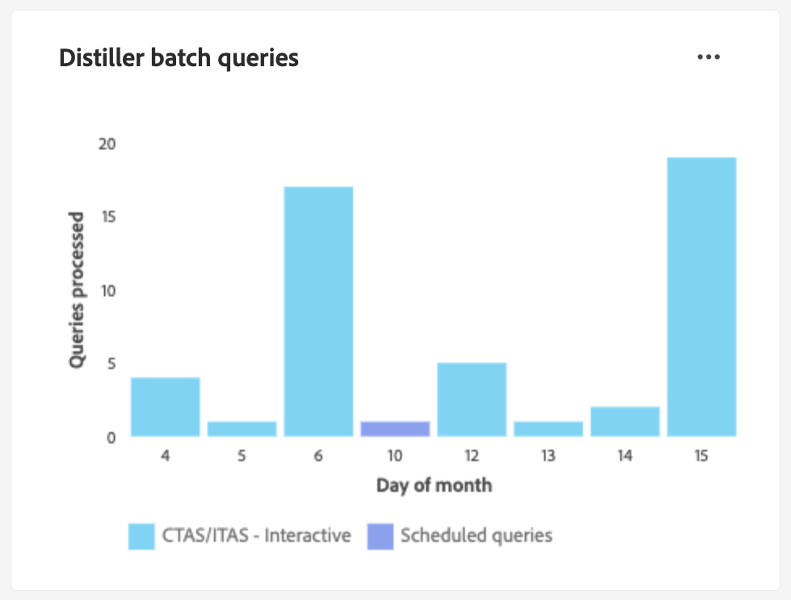

# 查询服务UI指南

Adobe Experience Platform查询服务提供了一个用户界面，可用于编写和执行查询、查看先前执行的查询以及访问由您组织内的用户保存的查询。 要在[Adobe Experience Platform](https://platform.adobe.com)中访问UI，请在左侧导航中选择&#x200B;**[!UICONTROL 查询]**。 出现[!UICONTROL 查询] [!UICONTROL 概述]。

## 概述 {#overview}

[!UICONTROL 概述]选项卡为处理查询和数据Distiller模板提供了一个简化的入口点。 在这里，您可以访问编写查询、浏览数据集和分析受众数据所需的所有功能，以确保您的数据分析和受众分析有一个流畅的工作流程。 使用本概述了解使用Data Distiller可以实现的目标，并发现有关查询服务使用情况的关键指标。

### 主面板 {#main-panels}

[!UICONTROL 概述]页面包含几个主要部分，可帮助您入门：

1. 选择&#x200B;**[!UICONTROL 创建查询]**&#x200B;可快速导航到查询编辑器以编写和执行新查询。
2. 选择&#x200B;**[!UICONTROL 了解更多]**&#x200B;以查看有关如何&#x200B;**[!UICONTROL 编写查询]**&#x200B;的详细文档。
3. 在&#x200B;**[!UICONTROL 发现数据Distiller]**&#x200B;部分中选择&#x200B;**[!UICONTROL 开始使用]**&#x200B;以打开数据Distiller概述并了解可用的功能。

### 数据蒸馏器功能 {#data-distiller-capabilities}

[!UICONTROL 数据Distiller功能]部分提供了指向更高级数据Distiller功能的文档链接：

- **[[!UICONTROL 数据探索]](../use-cases/data-exploration.md)**：了解如何使用SQL探索、排查和验证批次摄取的数据。
- **[[!UICONTROL Experience Platform应用程序的派生数据集]](../data-distiller/derived-datasets/overview.md)**：了解如何创建派生数据集，以支持复杂而多样的用例，从而最大限度地发挥数据实用工具的作用。
- **[[!UICONTROL AI/ML管道]](../data-distiller/ml-feature-pipelines/overview.md)**：了解首选机器学习工具背后的重要概念，以及如何构建支持营销用例的自定义模型。 本指南系列描述了构建功能管道的必要步骤，这些管道用于准备来自Experience Platform的数据以馈送机器学习环境中的自定义模型。
- **[[!UICONTROL SQL分析]](../data-distiller/sql-insights/overview.md)**：了解使用Data Distiller从SQL开发分析仪表板所需的主要功能和步骤。

### 推荐的数据蒸馏器加速器 {#recommended-accelerators}

选择快速链接以导航到相关数据Distiller功能板[!UICONTROL 模板]。 每个加速器都提供了强大的工具和可视化图表来帮助您分析受众数据、优化分段和增强定位策略。

- **[[!UICONTROL 高级受众重叠]](../../dashboards/sql-insights-query-pro-mode/templates/overlaps.md)**：通过此仪表板，您可以分析多个受众区段之间的受众交叉点，以揭示有价值的见解并优化分段策略。 您还可以导出您的见解以供进一步离线分析或报告。
- **[[!UICONTROL 受众比较]](../../dashboards/sql-insights-query-pro-mode/templates/comparison.md)**：通过此仪表板，您可以并排比较和对比关键受众量度，以详细分析两个受众组。 这些见解可帮助您了解受众规模、增长和其他关键绩效指标，使您能够利用数据驱动型决策优化分段和定位策略。
- **[[!UICONTROL 受众趋势]](../../dashboards/sql-insights-query-pro-mode/templates/trends.md)**：使用[!UICONTROL 受众趋势]仪表板通过受众增长、身份计数和单一身份配置文件等关键量度，可视化受众如何随时间的演变。 跟踪趋势以揭示对受众行为的宝贵见解，从而让您能够优化分段、增强参与度并优化定位策略以实现更有效的营销活动。
随时间跟踪受众量度，以监控受众规模、身份增长以及整体参与度的变化。
- **[[!UICONTROL 受众标识重叠]](../../dashboards/sql-insights-query-pro-mode/templates/identity-overlaps.md)**：使用受众标识重叠仪表板分析选定受众中的标识重叠。 可视化图表和列表数据为优化身份拼接、减少冗余和改进分段提供了见解。 这些见解有助于更有效地定位、增强个性化并简化客户交互。

### 数据蒸馏器示例 {#data-distiller-examples}

选择卡片以打开文档指南和示例，帮助您充分利用Data Distiller：

- **[[!UICONTROL 基于Decile的派生数据集]](../use-cases/deciles-use-case.md)**：了解如何在Adobe Experience Platform中创建用于分段和受众创建的基于Decile的派生数据集。 使用航空公司忠诚度方案，其中包括架构设计、十分位数计算以及用于排名和聚合数据的查询示例。
- **[[!UICONTROL 客户存留期值]](../use-cases/customer-lifetime-value.md)**：了解如何使用Real-Time CDP和自定义仪表板跟踪和可视化客户存留期值。 利用这些见解制定吸引新客户、留住现有客户并最大化利润率的策略。
- **[[!UICONTROL 倾向得分]](../use-cases/propensity-score.md)**：了解如何使用机器学习预测模型确定倾向得分。 本指南包括发送培训数据、将经过培训的模型与SQL一起应用以及预测客户购买可能性。
- **[[!UICONTROL 同意分析]](../../dashboards/insights-use-cases/consent-analysis.md)**：了解如何使用Real-Time CDP、查询服务和数据Distiller来分析和跟踪客户同意。 本指南涵盖构建同意功能板、优化分段、跟踪趋势和确保合规性，帮助您建立信任并提供个性化体验。
- **[[!UICONTROL 模糊匹配]](../use-cases/fuzzy-match.md)**：了解如何对Experience Platform数据执行“模糊”匹配以查找近似匹配并分析数据集之间的字符串相似度。 遵循本指南以节省时间并使您的数据更易于访问。 该示例演示了如何在两个旅行社数据集之间匹配酒店房间属性，说明如何高效地匹配、比较和协调大型复杂数据集，以获得一致性和准确性。

### 关键量度 {#key-metrics}

关键量度部分显示有助于监视查询服务使用情况的重要数据的可视化图表。 对于每个图表，您可以选择右上角的省略号(`...`)，然后选择[!UICONTROL 查看更多]以查看以表格形式显示的结果，或者以CSV文件格式下载数据以在电子表格中查看。 有关详细信息，请参阅[查看更多指南](../../dashboards/sql-insights-query-pro-mode/view-more.md)。

#### 设置日期过滤器 {#set-date-filter}

若要对这些可视化应用全局日期过滤器，请选择过滤器图标（)，并在&#x200B;**[!UICONTROL 筛选器]**&#x200B;对话框中调整日期范围。 应用此过滤器可针对特定时间范围定制显示的量度，并增强分析的相关性。

#### [!UICONTROL Distiller批次查询] {#distiller-batch-queries}

[!UICONTROL Distiller批量查询]图表按日期划分查询活动，突出显示已处理的CTA和ITAS（交互式和已计划）查询的数量。 图表突出显示模式，例如交互式查询在某些日期达到高峰，以及不频繁使用计划查询。 利用这些见解通过识别活动高峰期、优化调度策略和平衡查询执行来优化性能，从而提高工作流效率和资源利用率。

#### [!UICONTROL 计算小时已耗用] {#compute-hours-consumed}

[!UICONTROL 计算所用小时数]图表提供了用于处理查询服务操作的计算小时数的逐日可视化图表。 使用这些计算小时趋势来监控资源消耗、确定高需求时段，并优化查询执行以确保高效的资源分配和性能。

#### [!UICONTROL 数据探索查询]

[!UICONTROL 数据探索查询]图表显示每天按需处理的SELECT查询数。 此可视化图表突出显示查询活动趋势（如特定日期使用量的峰值），以帮助您了解数据探索工作最活跃的时间。 利用这些见解监控查询使用模式、平衡工作负载并优化资源分配，以进行探索性数据分析。 此分析确保查询服务得到更高效的使用，并改进高需求期间的规划。

## 查询编辑器

使用查询编辑器编写和执行查询，而不使用外部客户端。 选择&#x200B;**[!UICONTROL 创建查询]**&#x200B;以打开查询编辑器并创建新查询。 您还可以通过从&#x200B;**[!UICONTROL 日志]**&#x200B;或&#x200B;**[!UICONTROL 模板]**&#x200B;选项卡中选择查询来访问查询编辑器。 如果选择先前执行或保存的查询，查询编辑器将打开并显示选定查询的SQL。

在查询编辑器中键入内容时，编辑器会自动完成表中的SQL保留字、表和字段名。 完成查询编写后，选择播放图标（)以运行查询。 编辑器下方的&#x200B;**[!UICONTROL Console]**&#x200B;选项卡显示查询服务当前正在执行的操作，并指示何时返回查询。 [!UICONTROL 控制台]旁边的&#x200B;**[!UICONTROL 结果]**&#x200B;选项卡显示查询结果。 有关使用查询编辑器的详细信息，请参阅[查询编辑器指南](./user-guide.md)。

## 计划的查询 {#scheduled-queries}

已另存为模板的查询可以计划为定期运行。 在计划查询时，您可以选择运行频率、开始和结束日期、计划查询在一周中运行的日期以及要将查询导出到的数据集。 使用查询编辑器设置查询计划。

要了解如何通过UI计划查询，请参阅[计划查询指南](./user-guide.md#scheduled-queries)。 要了解如何使用API添加计划，请参阅[计划查询端点指南](../api/scheduled-queries.md)。

一旦安排了一个查询，它就会出现在[!UICONTROL 已安排的查询]选项卡上的已安排的查询列表中。 从列表中选择计划查询，即可找到有关查询、运行、创建者和时间的完整详细信息。

<!--  -->

| 列 | 描述 |
| --- | --- |
| **[!UICONTROL 名称]** | 名称字段是模板名称或SQL查询的前几个字符。 使用查询编辑器通过UI创建的任何查询都会在开始时命名。 如果查询是通过API创建的，则查询的名称是用于创建查询的初始SQL的片段。 |
| **[!UICONTROL 模板]** | 查询的模板名称。 选择模板名称以导航到查询编辑器。 为方便起见，查询模板会显示在查询编辑器中。 如果没有模板名称，该行将标有连字符，并且无法重定向到查询编辑器以查看查询。 |
| **[!UICONTROL SQL]** | SQL查询的片段。 |
| **[!UICONTROL 运行频率]** | 此列指示查询的运行频率。 可用值为`Run once`和`Scheduled`。 可以根据查询的运行频率对其进行筛选。 |
| **[!UICONTROL 创建者]** | 创建查询的用户的名称。 |
| **[!UICONTROL 已创建]** | 创建查询时的时间戳（UTC格式）。 |
| **[!UICONTROL 上次运行时间戳]** | 运行查询时的最新时间戳。 此列突出显示查询是否已根据其当前计划执行。 |
| **[!UICONTROL 上次运行状态]** | 最近查询执行的状态。 三个状态值为： `successful` `failed`或`in progress`。 |

有关如何通过查询服务UI[监视查询的详细信息，请参阅文档](./monitor-queries.md)。

## 模板 {#browse}

**[!UICONTROL 模板]**&#x200B;选项卡显示由您组织中的用户保存的查询。 将它们视为查询项目很有用，因为在此处保存的查询可能仍在构建中。 显示在&#x200B;**[!UICONTROL 模板]**&#x200B;选项卡上的查询在&#x200B;**[!UICONTROL 日志]**&#x200B;选项卡中也会显示为运行查询（如果它们之前已由查询服务执行）。

| 列 | 描述 |
| --- | --- |
| **[!UICONTROL 名称]** | 名称字段是用户创建的查询名称或您的SQL查询的前几个字符。 使用查询编辑器通过UI创建的任何查询都会在开始时命名。 如果查询是通过API创建的，则查询的名称是用于创建查询的初始SQL的片段。 您可以选择查询名称以在查询编辑器中打开查询。 您还可以使用搜索栏搜索查询的[!UICONTROL Name]。 搜索区分大小写。 |
| **[!UICONTROL SQL]** | sql查询的前几个字符。 将鼠标悬停在代码上会显示完整查询。 |
| **[!UICONTROL 修改者]** | 上次修改查询的用户。 贵组织中有权访问查询服务的任何用户都可以修改查询。 |
| **[!UICONTROL 上次修改时间]** | 上次修改查询的日期和时间，以浏览器的时区表示。 |

有关Experience Platform UI中模板的更多信息，请参阅[查询模板](./query-templates.md)文档。

## 日志 {#log}

**[!UICONTROL Log]**&#x200B;选项卡提供以前已执行的查询列表。 默认情况下，日志会按反向时间顺序列出查询。

| 列 | 描述 |
| --- | --- |
| **[!UICONTROL 名称]** | 查询名称，由SQL查询的前几个字符组成。 选择模板名称以打开该运行的[!UICONTROL 查询日志详细信息]视图。 您可以使用搜索栏搜索查询的名称。 搜索区分大小写。 |
| **[!UICONTROL 开始时间]** | 执行查询的时间。 |
| **[!UICONTROL 完成时间]** | 查询运行完成的时间。 |
| **[!UICONTROL 状态]** | 查询的当前状态。 |
| **[!UICONTROL 数据集]** | 查询使用的输入数据集。 选择数据集以转到输入数据集详细信息屏幕。 |
| **[!UICONTROL 客户端]** | 用于查询的客户端。 |
| **[!UICONTROL 创建者]** | 创建查询的人员姓名。 |

>
>
>选择铅笔图标()，以导航到查询编辑器。 为方便编辑，已预填充查询。

有关查询事件自动生成的日志文件的详细信息，请参阅[查询日志文档](./query-logs.md)。

## 凭据

**[!UICONTROL 凭据]**&#x200B;选项卡同时显示您的过期凭据和非过期凭据。 有关如何使用这些凭据与外部客户端连接的详细信息，请参阅[凭据指南](../clients/overview.md)。

## 后续步骤

现在您已经熟悉[!DNL Experience Platform]上的查询服务用户界面，您可以访问查询编辑器以开始创建自己的查询项目并与组织中的其他用户共享。 有关在查询编辑器中创作和运行查询的详细信息，请参阅[查询编辑器用户指南](./user-guide.md)。
