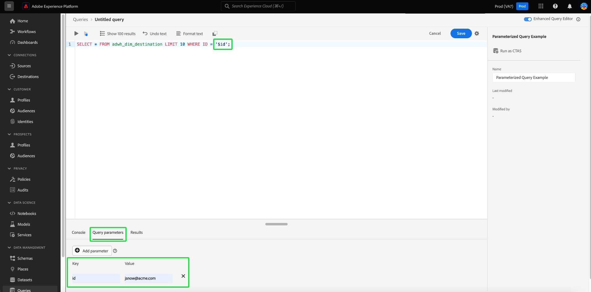

# 参数化查询

>[!IMPORTANT]
>
>参数化查询UI功能在以下位置提供： **仅限限量发布** 并非所有客户都可使用。

查询服务支持在查询编辑器中使用参数化查询。 通过参数化查询，您现在可以为参数使用占位符，并在执行时添加参数值。 占位符允许您使用动态数据，其中您不知道在执行语句之前值是什么。 您还可以提前准备查询并将其重复用于类似目的。 重用查询可节省大量工作，因为您可以避免为每个用例创建不同的SQL查询。

## 先决条件

在继续阅读本指南之前，请阅读 [查询编辑器UI指南](./user-guide.md). 查询编辑器指南提供了有关如何在Experience Platform用户界面中编写、验证和运行客户体验数据查询的详细信息。

>[!NOTE]
>
>在Adobe Experience Platform UI中，仅在内联模板的父级支持参数化查询。 这意味着参数化查询仅在原始模板中使用时才有效。 子模板必须是静态模板，并且不能具有动态参数。 请参阅 [内联模板文档](../essential-concepts/inline-templates.md) 了解更多信息。

## 参数化查询语法 {#syntax}

参数化查询使用格式 `'$YOUR_PARAMETER_NAME'` 可以使用点表示法连接和。 下面显示了使用参数化查询的示例SQL语句。

```sql
INSERT INTO
   $Database_Name.Schema_Name.adwh_lkup_process_delta_log
   (process_name, merge_policy_id, process_status, process_date, create_ts, change_ts)
SELECT
   '$Table_Process_Name' process_name,
   hash('$Merge_PolicyID') merge_policy_id,
   '$process_status' process_status,
   to_date('$date_key') process_date,
   CURRENT_TIMESTAMP create_ts,
   CURRENT_TIMESTAMP change_ts;
```

## 创建参数化查询 {#create}

要在UI中创建参数化查询，请导航到查询编辑器。 请参阅以下部分： [访问查询编辑器](./user-guide.md#accessing-query-editor) 以获取更多说明。

使用 `'$'` 在文本编辑器的查询中输入查询参数。 接下来，将缺少的键值添加到 [!UICONTROL 查询参数] 部分。 如果忽略向任何所需键添加值，则无法执行查询。 警报图标()显示在“查询参数”部分的任何空值旁边 [!UICONTROL 值] 输入字段。



>[!TIP]
>
>更改选项卡 [!UICONTROL 查询参数] 到 [!UICONTROL 控制台] 查看查询的控制台输出。

如果删除某个参数，并在该参数运行后再次尝试执行查询，则会在 [!UICONTROL 查询参数] 部分来提醒您。

>[!NOTE]
>
>如果查询不采用参数，则仍可以在查询编辑器中输入不必要的参数。 查询编辑器会忽略所有不必要的键值对，并且这些键值对查询的执行或结果没有影响。


## 使用查询日志详细信息检查参数值 {#check-parameter-values}

无法保存模板中的参数，因为使用的值不是永久性的。 但是，您可以检查 [!UICONTROL 查询日志详细信息] 页面查找查询运行中使用的参数值。 在这种情况下，日志不会指示查询是参数化查询。 请参阅 [查询日志文档](./query-logs.md) 以获取有关如何查找所用值的说明。


<!-- improve screenshot above ^ I am waiting for a scheduled run to complete -->

## 计划参数化查询 {#schedule}

当您计划参数化查询时，将保存参数值。 要计划参数化查询，请按照指南中所述的典型过程创建计划查询 [创建查询计划](./query-schedules.md#create-schedule)，然后输入要在查询运行中使用的参数值。 此UI部分仅针对参数化查询显示。 请参阅以下部分： [为计划的参数化查询设置参数](./query-schedules.md#set-parameters) 以获取特定说明。

>[!TIP]
>
>查询服务通过使用参数化查询支持预准备语句。 请参阅 [预准备语句语法指南](../sql/prepared-statements.md) 有关涉及的SQL语法的详细信息。

## 后续步骤

通过阅读本文档，您已了解如何在Adobe Experience Platform UI中参数化查询并在计划的查询运行中使用它们。 本文档还重点说明了如何检查日志中查询执行中使用的参数值。

接下来，建议您阅读 [监视计划查询](./monitor-queries.md) 通过Platform UI更好地了解所有查询作业的状态。
