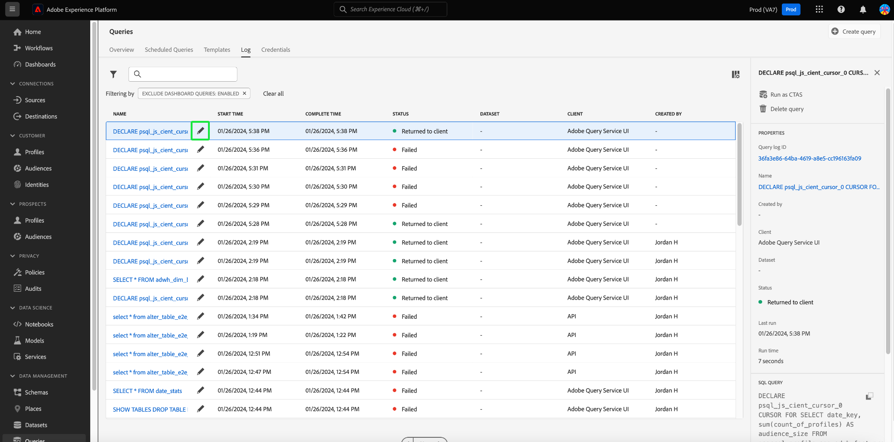

# 查询日志

>[!IMPORTANT]
>
>某些查询日志功能当前为有限版本，并非对所有客户都可用。 在没有编辑图标的情况下，您的UI可能会以略有不同的方式显示。 此外，选择查询名称的过程可能会导航到查询编辑器，而不是 [!UICONTROL 查询日志详细信息] 视图。

Adobe Experience Platform维护通过API和UI发生的所有查询事件的日志。 此信息可在查询服务UI中获取，网址为 [!UICONTROL 日志] 选项卡。

日志文件由任何查询事件自动生成，并包含所使用的SQL、查询状态、所用时间和上次运行时间等信息。 您可以使用查询日志数据作为功能强大的工具，来排查查询效率低下或存在问题的情况。 更全面的日志信息作为审核日志功能的一部分保留，并且可在以下位置找到： [审核日志文档](../../landing/governance-privacy-security/audit-logs/overview.md).

## 检查查询日志

要检查查询日志，请选择 [!UICONTROL 查询] 导航到查询服务工作区，然后选择 [!UICONTROL 日志] 从可用选项删除。

## 自定义和搜索 {#customize-and-search}

查询服务日志以可自定义的表格式提供。 要自定义表格列，请选择设置图标()。 A [!UICONTROL 自定义表] 此时会出现一个对话框，可在其中取消选择每一列。

您还可以通过在搜索字段中键入模板名称来搜索与特定查询模板相关的日志。

A [每个日志表列的说明](./overview.md#log) 可以在查询服务概述的日志部分找到。

## 发现日志数据

每一行表示与查询模板关联的查询运行的日志数据。 从表中选择任意行以使用运行日志数据填充右侧边栏。

在“日志详细信息”面板中，您可以选择新的输出数据集，并查看或复制运行中使用的完整SQL查询。

>[!IMPORTANT]
>
>某些查询日志功能当前为有限版本，并非对所有客户都可用。

您还可以从以下位置选择查询模板名称： [!UICONTROL 名称] 列直接导航到 [!UICONTROL 查询日志详细信息] 视图。

>[!NOTE]
>
>如果查询是使用API创建的，并且在初始化期间未提供模板名称，则会显示SQL查询的前几十个字符。

## 编辑日志 {#edit-logs}

每行的模板名称或SQL代码片段旁边是一个铅笔图标()，可用于导航到查询编辑器。 然后，在编辑器中预填充该查询以进行编辑。

## 筛选日志 {#filter-logs}

您可以根据各种设置筛选查询日志列表。 选择过滤器图标()，以在左边栏中打开一组过滤器选项。

此时将显示可用筛选器列表。

下表证明了每个过滤器的说明。

| 过滤器 | 描述 |
| ------ | ----------- |
| [!UICONTROL 排除仪表板查询] | 此复选框默认处于启用状态，它不包括用于生成分析的查询生成的日志。 这些查询是系统生成的，模糊了用户生成的日志的记录，而这些日志是监控、管理和故障排除所必需的。 要查看系统生成的日志，请取消选中复选框。 |
| [!UICONTROL 开始日期] | 要筛选在特定时间段内创建的查询的日志，请设置 [!UICONTROL 开始] 和 [!UICONTROL 结束] 中的日期 [!UICONTROL 开始日期] 部分。 |
| [!UICONTROL 完成日期] | 要筛选在特定时间段内完成的查询的日志，请设置 [!UICONTROL 开始] 和 [!UICONTROL 结束] 中的日期 [!UICONTROL 完成日期] 部分。 |
| [!UICONTROL 状态] | 要根据以下条件筛选日志 [!UICONTROL 状态] 在查询中，选择相应的单选按钮。 可用的选项包括 [!UICONTROL 已提交]， [!UICONTROL 进行中]， [!UICONTROL 成功]、和 [!UICONTROL 失败]. 您一次只能基于一个状态条件筛选日志。 |
| [!UICONTROL 客户] | 要根据使用的查询客户端筛选日志，请在自由文本字段中输入以下接受值之一： `API`， `Adobe Query Service UI`，或 `QsAccel`. |
| [!UICONTROL 我的查询] | 使用 [!UICONTROL 我的查询] 切换以筛选由您执行的查询的日志。 |
| [!UICONTROL 查询日志Id] | 要根据查询的唯一日志ID进行筛选，请在自由文本字段中输入日志ID。 此信息可在 [!UICONTROL 日志详细信息]. |

任何应用的过滤器都会显示在过滤的日志结果上方。

## 后续步骤

通过阅读本文档，您现在可以更好地了解如何在查询服务UI中访问和使用查询日志。

请参阅 [UI概述](./overview.md)，或 [查询服务API指南](../api/getting-started.md) 了解有关查询服务功能的更多信息。

请参阅 [监视查询文档](./monitor-queries.md) 以了解查询服务如何改善计划查询运行的可见性。
