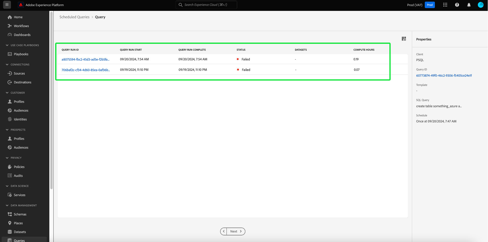

# 查询计划

您可以通过创建查询计划来自动运行查询。 计划的查询以自定义节奏运行，以根据频率、日期和时间管理您的数据。 如果需要，您还可以为结果选择输出数据集。 可以从“查询编辑器”安排已另存为模板的查询。

>[!IMPORTANT]
>
>您只能将计划添加到已创建和保存的查询中。

任何计划的查询都会添加到[!UICONTROL 计划查询]选项卡的列表中。 在该工作区中，您可以通过UI监控所有已计划查询作业的状态。 在[!UICONTROL 计划的查询]选项卡上，您可以找到有关查询运行的重要信息并订阅警报。 可用信息包括运行失败时的状态、计划详细信息和错误消息/代码。 有关详细信息，请参阅[监视计划查询文档](./monitor-queries.md)。

此工作流涵盖查询服务UI中的计划过程。 要了解如何使用API添加计划，请参阅[计划查询端点指南](../api/scheduled-queries.md)。

## 创建查询计划 {#create-schedule}

要计划查询，请从[!UICONTROL 计划查询]选项卡的[!UICONTROL 模板]选项卡或[!UICONTROL 模板]列中选择查询模板。 选择模板名称可将您导航到查询编辑器。

如果从“查询编辑器”访问已保存的查询，则可以为查询创建计划，或从详细信息面板查看查询计划。

>[!TIP]
>
>选择&#x200B;**[!UICONTROL 查看计划]**&#x200B;以导航到计划工作区，并快速查看任何计划的查询运行。

![查询编辑器突出显示[!UICONTROL 查看计划]和[!UICONTROL 添加计划]。](../images/ui/query-schedules/view-add-schedule.png)

选择&#x200B;**[!UICONTROL 添加计划]**&#x200B;以导航到[计划详细信息页面](#schedule-details)。

或者，选择查询名称下方的&#x200B;**[!UICONTROL 计划]**&#x200B;选项卡。

此时将显示计划工作区。 UI显示与模板关联的任何计划运行的列表。 选择&#x200B;**[!UICONTROL 添加计划]**&#x200B;以创建计划。

### 添加计划详细信息 {#schedule-details}

此时将显示“调度详细资料”页。 在此页上，可以编辑计划查询的各种详细信息。 详细信息包括计划查询](#scheduled-query-frequency)运行的[频率和工作日、开始和结束日期、要将结果导出到的数据集以及[查询状态警报](#alerts-for-query-status)。

>[!IMPORTANT]
>
>查询计划程序UI不支持无限期或永久计划。 必须指定结束日期。 结束日期没有上限。

#### 计划的查询频率 {#scheduled-query-frequency}

您可以为&#x200B;**[!UICONTROL 频率]**&#x200B;选择以下选项：

- **[!UICONTROL 小时]**：在您选择的日期期间，计划查询将每小时运行一次。
- **[!UICONTROL 每日]**：计划查询将在您选择的时间和日期时段每隔X天运行一次。 请注意，所选时间采用&#x200B;**UTC**，而不是您的本地时区。
- **[!UICONTROL 每周]**：选定的查询将在您选择的星期、时间和日期时段运行。 请注意，所选时间采用&#x200B;**UTC**，而不是您的本地时区。
- **[!UICONTROL 每月]**：选定的查询将在每个月的日期、时间和选定的日期时段运行。 请注意，所选时间采用&#x200B;**UTC**，而不是您的本地时区。
- **[!UICONTROL 每年]**：选定的查询将每年在您选择的日期、月、时间和日期时段运行。 请注意，所选时间采用&#x200B;**UTC**，而不是您的本地时区。

### 提供数据集详细信息 {#dataset-details}

通过将数据附加到现有数据集或创建新数据集并将数据附加到其中来管理查询结果。

选择&#x200B;**[!UICONTROL 创建并附加到新数据集]**&#x200B;中，以在首次执行查询时创建数据集。 后续执行继续将数据插入到该数据集中。 最后，提供数据集的名称和描述。

>[!IMPORTANT]
>
> 由于您使用的是现有数据集或创建新数据集，因此&#x200B;**不**&#x200B;需要将`INSERT INTO`或`CREATE TABLE AS SELECT`包含到查询中，因为数据集已设置。 将`INSERT INTO`或`CREATE TABLE AS SELECT`包含为计划查询的一部分将导致错误。

![计划详细信息面板，其中包含数据集详细信息以及[!UICONTROL 创建并附加到新数据集中的]选项，突出显示。](../images/ui/query-schedules/dataset-details-create-and-append.png)

或者，选择&#x200B;**[!UICONTROL 附加到现有数据集]**，后跟数据集图标（）。

出现&#x200B;**[!UICONTROL 选择输出数据集]**&#x200B;对话框。

接下来，浏览现有数据集或使用搜索字段筛选选项。 选择要使用的数据集的行。 数据集详细信息将显示在右侧的面板中。 选择&#x200B;**[!UICONTROL 完成]**&#x200B;以确认您的选择。

### 如果查询连续失败，则将其隔离 {#quarantine}

创建计划时，您可以在隔离功能中注册查询，以保护系统资源并防止出现潜在的中断情况。 隔离功能会自动识别和隔离通过将查询置于[!UICONTROL 隔离]状态而反复失败的查询。 通过在连续失败10次后隔离查询，您可以在允许进一步执行之前干预、查看和纠正问题。 这有助于保持您的操作效率和数据完整性。

![查询计划工作区高亮显示了[!UICONTROL 查询隔离]，并且选择了“是”。](../images/ui/query-schedules/quarantine-enroll.png)

在查询注册隔离功能后，您可以订阅此查询状态更改警报。 如果计划查询未注册隔离区，它将不会在[警报对话框](./monitor-queries.md#alert-subscription)中显示为选项。

您还可以通过[!UICONTROL 计划查询]选项卡的内联操作，将计划查询注册到隔离功能。 有关详细信息，请参阅[监视器查询文档](./monitor-queries.md#alert-subscription)。

### 为计划的查询状态设置警报 {#alerts-for-query-status}

您还可以订阅查询警报，作为计划查询设置的一部分。 您可以配置设置以接收各种情况的通知。 可以为隔离状态、查询处理延迟或查询状态更改设置警报。 可用的查询状态警报选项包括“开始”、“成功”和“失败”。 警报可作为弹出通知或电子邮件接收。 选中该复选框可订阅针对该计划查询状态的警报。

下表说明了支持的查询警报类型：

| 提醒类型 | 描述 |
|---|---|
| `start` | 此警报会在启动或开始处理计划的查询运行时通知您。 |
| `success` | 此警报会在计划的查询运行成功完成时通知您，指示查询在没有任何错误的情况下执行。 |
| `failed` | 当计划的查询运行遇到错误或无法成功执行时，将触发此警报。 它有助于您及时识别和处理问题。 |
| `quarantine` | 当计划的查询运行处于隔离状态时，将激活此警报。 在查询被[注册隔离功能](#quarantine)后，任何连续运行10次失败的计划查询将自动置于[!UICONTROL 隔离]状态。 然后，隔离的查询需要您的干预，然后才能执行任何进一步的执行。 注意：您必须为隔离功能注册查询，才能订阅隔离警报。 |
| `delay` | 此警报通知您计划查询执行的结果[延迟是否超过指定的阈值。 ](./monitor-queries.md#query-run-delay)您可以设置一个自定义时间，当查询在该持续时间内运行而不完成或失败时会触发警报。 默认行为会在查询开始处理后设置150分钟的警报。 |

>[!NOTE]
>
>如果您选择设置[!UICONTROL 查询运行延迟]警报，则必须在Experience Platform UI中设置所需的延迟时间（以分钟为单位）。 以分钟为单位输入持续时间。 最大延迟为24小时（1440分钟）。

有关Adobe Experience Platform中警报的概述，包括警报规则的定义结构，请参阅[警报概述](../../observability/alerts/overview.md)。 有关在Adobe Experience Platform UI中管理警报和警报规则的指导，请参阅[警报UI指南](../../observability/alerts/ui.md)。

### 为计划的参数化查询设置参数 {#set-parameters}

如果要为参数化查询创建计划查询，现在必须为这些查询运行设置参数值。

确认计划详细信息后，选择&#x200B;**[!UICONTROL 保存]**&#x200B;以创建计划。 您将返回到模板的“计划”选项卡。 此工作区显示新创建计划的详细信息，包括计划ID、计划本身以及计划的输出数据集。

## 查看计划的查询运行 {#scheduled-query-runs}

从模板的[!UICONTROL 计划]选项卡中，选择计划ID以导航到新计划查询的查询运行列表。

或者，要查看查询模板的计划运行列表，请导航到&#x200B;**[!UICONTROL 计划查询]**&#x200B;选项卡，并从可用列表中选择模板名称。

将显示该计划查询的查询运行列表。

### 计算作业级别的小时数 {#compute-hours}

跟踪CTAS/ITAS批处理查询的查询执行级别消耗的计算小时数。 此功能可提供计算使用情况的见解，帮助您优化资源分配并提高查询性能。

>[!AVAILABILITY]
>
>计算小时数功能专用于已购买[Data Distiller SKU](../data-distiller/overview.md)的用户。 有关更多信息，请与Adobe代表联系。

下表提供了详细资料部分中每个可用列的说明，这些列列出了计划的查询运行。

| 列标题 | 描述 |
|---------------------|----------------------------------|
| [!UICONTROL 查询运行ID] | 显示每个查询运行的唯一标识符，以便您跟踪和引用已计划查询的单独执行。 |
| [!UICONTROL 查询运行开始] | 指示查询运行的开始日期和时间，以帮助您监视每次执行的开始时间。 |
| [!UICONTROL 查询运行完成] | 显示查询运行的完成日期和时间，以深入了解执行持续时间和状态。 |
| [!UICONTROL 状态] | 显示查询运行的当前状态，如`Completed,` `Running,`或`Failed,`以快速评估结果。 |
| [!UICONTROL 数据集] | 列出查询运行中使用的数据集，以显示执行中涉及的数据源。 |
| [!UICONTROL 计算小时数] | 显示每次查询运行使用的计算时间（以小时为单位）。 这有助于跟踪资源使用情况并优化查询性能。 |

{style="table-layout:auto"}

>[!NOTE]
>
>计算小时数据可从2024年8月15日开始提供。 此日期之前的数据显示为“不可用”。

有关如何通过UI监视所有查询作业状态的完整信息，请参阅[监视器计划查询指南](./monitor-queries.md#inline-actions)。

从列表中选择&#x200B;**[!UICONTROL 查询运行ID]**&#x200B;以导航到查询运行概述。 有关[查询运行概述](./monitor-queries.md#query-run-overview)上可用信息的完整细目，请参阅监视器计划查询文档。

若要使用查询服务API监视计划的查询，请参阅[计划的查询运行端点指南](../api/runs-scheduled-queries.md)。

## 启用、禁用或删除计划 {#delete-schedule}

您可以从特定查询的计划工作区或列出所有计划查询的[!UICONTROL 计划查询]工作区中启用、禁用或删除计划。

要访问所选查询的[!UICONTROL 计划]选项卡，必须从[!UICONTROL 模板]选项卡或[!UICONTROL 计划查询]选项卡中选择查询模板的名称。 这将导航到该查询的查询编辑器。 从查询编辑器中，选择&#x200B;**[!UICONTROL 计划]**&#x200B;以访问计划工作区。

从可用计划的行中选择一个计划以填充详细信息面板。 使用切换可禁用（或启用）计划查询。

### 删除禁用的查询

>[!IMPORTANT]
>
>您必须先禁用计划，然后才能删除查询的计划。

将显示确认对话框。 选择&#x200B;**[!UICONTROL 禁用]**&#x200B;以确认操作。

选择&#x200B;**[!UICONTROL 删除计划]**&#x200B;以删除已禁用的计划。

或者，[!UICONTROL 计划查询]选项卡为每个计划查询提供内联操作集合。 可用的内联操作包括[!UICONTROL 禁用计划]或[!UICONTROL 启用计划]、[!UICONTROL 删除计划]和[!UICONTROL 订阅计划查询的警报]。 有关如何通过计划查询选项卡删除或禁用计划查询的完整说明，请参阅[监视器计划查询指南](./monitor-queries.md#inline-actions)。
