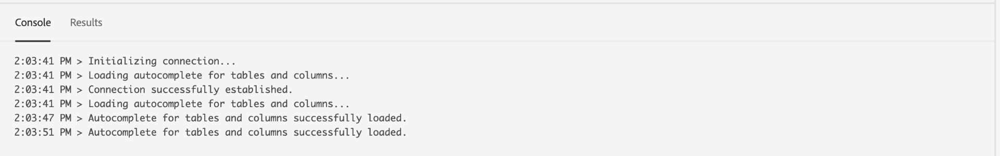
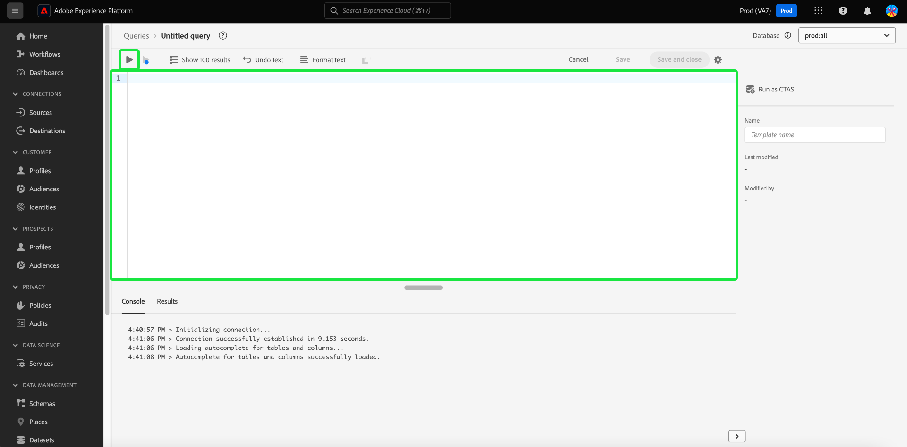

# 查询编辑器UI指南

查询编辑器是Adobe Experience Platform查询服务提供的交互式工具，允许您在[!DNL Experience Platform]用户界面中编写、验证和运行客户体验数据的查询。 查询编辑器支持开发用于分析和数据探索的查询，并允许您运行交互式查询以进行开发，以及运行非交互式查询以填充[!DNL Experience Platform]中的数据集。

有关查询服务的概念和功能的详细信息，请参阅[查询服务概述](../home.md)。 要了解有关如何在[!DNL Platform]上导航查询服务用户界面的详细信息，请参阅[查询服务UI概述](./overview.md)。

## 快速入门 {#getting-started}

查询编辑器通过连接到查询服务来提供灵活的查询执行，并且查询仅在此连接处于活动状态时运行。

## 访问查询编辑器 {#accessing-query-editor}

在[!DNL Experience Platform] UI中，从左侧导航菜单中选择&#x200B;**[!UICONTROL 查询]**&#x200B;以打开查询服务工作区。 接下来，要开始编写查询，请选择屏幕右上角的&#x200B;**[!UICONTROL 创建查询]**。 此链接可从查询服务工作区中的任何页面使用。

### 正在连接到查询服务 {#connecting-to-query-service}

查询编辑器需要几秒钟才能初始化，并在打开时连接到查询服务。 控制台将告诉您连接时间，如下所示。 如果在编辑器连接之前尝试运行查询，则会延迟执行，直到连接完成。

### 如何从查询编辑器运行查询 {#run-a-query}

从查询编辑器执行的查询以交互方式运行，这意味着如果关闭浏览器或离开浏览器，查询将被取消。 对于通过查询输出生成数据集的查询，也是如此。

## 使用增强型查询编辑器创作查询 {#query-authoring}

使用查询编辑器，您可以编写、执行和保存客户体验数据的查询。 在查询编辑器中执行或保存的所有查询都可供贵组织中有权访问查询服务的所有用户使用。

### 数据库选择器 {#database-selector}

从查询编辑器右上角的下拉菜单中选择要查询的数据库。 所选数据库将显示在下拉列表中。

### 设置 {#settings}

查询编辑器输入字段上方的设置图标包括用于启用/禁用深色主题或禁用/启用自动完成的选项。

>[!TIP]
>
>您可以在创作查询时[!UICONTROL 禁用语法自动完成]，而不会丢失进度。

要启用深色或浅色主题，请选择设置图标（)，其后显示下拉菜单中的选项。

#### 自动完成 {#auto-complete}

查询编辑器会在您编写查询时，自动为查询建议潜在的SQL关键字以及表或列详细信息。 默认情况下，自动完成功能处于启用状态，可以随时从查询编辑器设置中禁用或启用该功能。

自动完成配置设置针对每个用户，并在该用户的连续登录中被记住。 禁用此功能会阻止处理多个元数据命令，并提供通常有利于作者在编辑查询时提高速度的建议。

### 执行多个顺序查询 {#execute-multiple-sequential-queries}

使用增强型查询编辑器编写多个查询并按顺序执行所有查询。 按顺序执行多个查询，每个查询都会生成日志条目。 但是，查询编辑器控制台中只显示第一个查询的结果。 如果需要排除问题或确认已执行的查询，请查看查询日志。 有关详细信息，请参阅[查询日志文档](./query-logs.md)。

>[!NOTE]
> 
>如果在查询编辑器中的第一个查询之后执行CTAS查询，则仍会创建一个表，但查询编辑器控制台上没有输出。

### 执行选定的查询 {#execute-selected-query}

如果您已经编写了多个查询，但只需要执行一个查询，则可以突出显示所选的查询并选择
[!UICONTROL 运行选定的查询]图标。 默认情况下，此图标处于禁用状态，直到您在编辑器中选择查询语法。

![突出显示具有[!UICONTROL 运行选定查询]图标的查询编辑器。](../images/ui/query-editor/run-selected-query.png)

### 取消查询编辑器会话 {#cancel-query}

通过取消长时间运行的查询来控制查询执行并提高生产效率。 此操作在查询运行时清除查询编辑器。 请注意，查询将继续在后台执行。 如果它是CTAS查询，仍会生成输出数据集。 要在编辑器中取消运行并继续编写SQL语句，请在执行查询后选择&#x200B;**[!UICONTROL 取消查询]**。

![带有[!UICONTROL 取消查询]的查询编辑器已突出显示。](../images/ui/query-editor/cancel-query-run.png)

将显示确认对话框。 选择&#x200B;**[!UICONTROL 确认]**&#x200B;以取消查询运行。

### 结果计数 {#result-count}

查询编辑器的行输出最多为50,000个。 您可以选择在查询编辑器控制台中一次显示的行数。 要更改控制台中显示的行数，请选择&#x200B;**[!UICONTROL 结果计数]**&#x200B;下拉列表，并从50、100、150、300、500和1000选项中进行选择。

>[!NOTE]
>
>由于Platform UI最多可支持1000行，因此超过1000的LIMIT值将被忽略。

## 编写查询 {#writing-queries}

[!UICONTROL 查询编辑器]的组织方式使编写查询尽可能容易。 下面的屏幕截图显示了编辑器在UI中的显示方式，其中高亮显示了SQL输入字段和&#x200B;**Play**。

为了最大限度地缩短开发时间，建议您开发对返回行数具有限制的查询。 例如：`SELECT fields FROM table WHERE conditions LIMIT number_of_rows`。在验证您的查询产生了预期的输出后，请移除限制并运行包含`CREATE TABLE tablename AS SELECT`的查询以生成包含该输出的数据集。

## 在查询编辑器中编写工具 {#writing-tools}

使用查询编辑器的编写工具来增强查询创作过程。 这些功能包括设置文本格式、复制SQL、管理查询详细信息，以及保存或安排您正在进行的工作。

### 设置文本格式 {#format-text}

[!UICONTROL 格式文本]功能通过添加标准语法样式使您的查询更易读。 选择&#x200B;**[!UICONTROL 设置文本格式]**&#x200B;以标准化查询编辑器中的所有文本。

>[!NOTE]
>
>[!UICONTROL 格式文本]功能不适用于匿名块。 若要了解如何按顺序链接一个或多个SQL语句，请参阅[匿名块文档](../key-concepts/anonymous-block.md)。

![查询编辑器[!UICONTROL 格式文本]和突出显示的SQL语句。](../images/ui/query-editor/format-text.png)

<!-- ### Undo text {#undo-text}

If you format your SQL in the Query Editor, you can undo the formatting applied by the [!UICONTROL Format text] feature. To return your SQL back to its original form, select **[!UICONTROL Undo text]**.

![The Query Editor with [!UICONTROL Undo text] and the SQL statements highlighted.](../images/ui/query-editor/undo-text.png) -->

### 复制 SQL {#copy-sql}

选择复制图标以将SQL从查询编辑器复制到剪贴板。 此复制功能可用于查询模板和查询编辑器中新创建的查询。

### 查询详细信息 {#query-details}

要在查询编辑器中查看查询，请从[!UICONTROL 模板]选项卡中选择任何已保存的模板。 查询详细信息面板提供了更多信息和工具来管理所选查询。 它还显示有用的元数据，例如上次修改查询的时间以及修改查询的人员（如果适用）。

>[!NOTE]
>
>[!UICONTROL 查看计划]、[!UICONTROL 添加计划]和[!UICONTROL 删除查询]选项仅在将查询另存为模板后可用。 使用[!UICONTROL 添加计划]选项，您可以从查询编辑器直接转到计划生成器。 使用[!UICONTROL 查看计划]选项，您可以直接查看该查询的计划清单。 请参阅查询计划文档，了解如何在UI](./query-schedules.md#create-schedule)中[创建查询计划。

在详细信息面板中，您可以直接从UI生成输出数据集，删除或命名显示的查询，查看查询运行计划，并将查询添加到计划中。

要生成输出数据集，请选择&#x200B;**[!UICONTROL 以CTAS]**&#x200B;身份运行。 出现&#x200B;**[!UICONTROL 输入输出数据集详细信息]**&#x200B;对话框。 输入名称和说明，然后选择&#x200B;**[!UICONTROL 以CTAS身份运行]**。 新数据集显示在&#x200B;**[!UICONTROL 数据集]**&#x200B;浏览选项卡中。 请参阅[查看数据集文档](../../catalog/datasets/user-guide.md#view-datasets)，了解有关贵组织可用数据集的更多信息。

>[!NOTE]
>
>[!UICONTROL 作为CTAS运行]选项仅在查询有&#x200B;**未计划**&#x200B;时才可用。

![[!UICONTROL 输入输出数据集详细信息]对话框。](../images/ui/query-editor/output-dataset-details.png)

执行以CTAS ]**身份运行的**[!UICONTROL &#x200B;操作后，将弹出一条确认消息，通知您操作成功。 此弹出消息包含一个链接，为导航到查询日志工作区提供了一种便捷的方式。 有关查询日志的详细信息，请参阅[查询日志文档](./query-logs.md)。

### 保存查询 {#saving-queries}

查询编辑器提供保存功能，允许您保存查询并稍后处理。 要保存查询，请选择查询编辑器右上角的&#x200B;**[!UICONTROL 保存]**。 在保存查询之前，必须使用&#x200B;**[!UICONTROL 查询详细信息]**&#x200B;面板为查询提供一个名称。

>[!NOTE]
>
>使用查询编辑器命名并保存在中的查询可用作查询仪表板[!UICONTROL 模板]选项卡中的模板。 有关详细信息，请参阅[模板文档](./query-templates.md)。

在查询编辑器中保存查询时，将会弹出一条确认消息，通知您操作成功。 此弹出消息包含一个链接，为导航到查询计划工作区提供了一种便捷的方法。 请参阅[计划查询文档](./query-schedules.md)以了解如何以自定义节奏运行查询。

### 计划的查询 {#scheduled-queries}

可以从“查询编辑器”安排已另存为模板的查询。 计划查询允许您以自定义节奏自动运行查询。 您可以根据频率、日期和时间安排查询，还可以在必要时为结果选择输出数据集。 也可以通过UI禁用或删除查询计划。

在查询编辑器中设置计划。 使用查询编辑器时，您只能将计划添加到已创建和保存的查询中。 该限制不适用于查询服务API。

>[!NOTE]
>
>连续运行10次失败的已计划查询将自动置于[!UICONTROL 隔离]状态。 具有此状态的查询需要您的干预，然后才能进行任何进一步的执行。 有关更多详细信息，请参阅[隔离的查询](./monitor-queries.md#quarantined-queries)文档。

请参阅查询计划文档，了解如何在UI](./query-schedules.md)中[创建查询计划。 或者，要了解如何使用API添加计划，请阅读[计划查询端点指南](../api/scheduled-queries.md)。

任何计划的查询都会添加到[!UICONTROL 计划查询]选项卡的列表中。 在该工作区中，您可以通过UI监控所有已计划查询作业的状态。 在[!UICONTROL 计划的查询]选项卡上，您可以找到有关查询运行的重要信息并订阅警报。 可用信息包括状态、计划详细信息和运行失败时的错误消息/代码。 有关详细信息，请参阅[监视计划查询文档](./monitor-queries.md)。

### 如何查找以前的查询 {#previous-queries}

从“查询编辑器”执行的所有查询都在“日志”表中捕获。 您可以使用&#x200B;**[!UICONTROL 日志]**&#x200B;选项卡中的搜索功能来查找查询执行。 已保存的查询列在&#x200B;**[!UICONTROL 模板]**&#x200B;选项卡中。

如果已计划查询，则[!UICONTROL 计划查询]选项卡通过UI提高了这些查询作业的可见性。 有关详细信息，请参阅[查询监视文档](./monitor-queries.md)。

>[!NOTE]
>
>日志不会保存未执行的查询。 为了使查询在查询服务中可用，必须在查询编辑器中运行或保存查询。

### 对象浏览器 {#object-browser}

使用对象浏览器可轻松搜索和筛选数据集。 对象浏览器减少了在具有大量数据集的大型环境中搜索表和数据集所花费的时间。 通过简化对相关数据和元数据的访问，您可以将更多精力放在查询创作上，而较少精力放在导航上。

要使用对象浏览器浏览数据库，请在搜索字段中输入表名，或选择&#x200B;**[!UICONTROL 表]**&#x200B;以展开可用数据集和表的列表。 使用搜索字段时，会根据您的输入动态筛选可用表列表。

[所选数据库](#database-dropdown)中包含的每个数据集都列在查询编辑器左侧的导航边栏中。

对象浏览器中显示的方案是一个可观察的方案。 这意味着，您可以在更改立即可见的情况下使用它实时监视更改和更新。 可观察的架构有助于确保数据同步，并有助于调试或分析任务。

#### 当前限制 {#current-limitation}

系统按顺序处理查询，这意味着一次只能运行一个查询。 当查询正在进行时，无法在左侧导航中访问其他表。

#### 访问表元数据 {#table-metadata}

除了快速搜索之外，您现在还可以通过选择表名称旁边的“i”图标来轻松访问任何表的元数据。 这将为您提供有关所选表的详细信息，以帮助您在编写查询时做出明智的决策。

#### 浏览子表

要浏览子表或链接表，请选择列表中表名旁边的下拉箭头。 这将展开该表以显示任何关联的子表，并提供数据结构的清晰视图，并允许进行更复杂的查询构建。 字段名称旁边的图标表示列的数据类型，可帮助您在复杂查询期间识别它。

## 使用查询编辑器执行查询 {#executing-queries}

若要在查询编辑器中运行查询，您可以在编辑器中输入SQL，或者从&#x200B;**[!UICONTROL 日志]**&#x200B;或&#x200B;**[!UICONTROL 模板]**&#x200B;选项卡加载上一个查询，然后选择&#x200B;**播放**。 查询执行状态显示在下面的&#x200B;**[!UICONTROL 控制台]**&#x200B;选项卡中，输出数据显示在&#x200B;**[!UICONTROL 结果]**&#x200B;选项卡中。

### 控制台 {#console}

控制台提供有关查询服务的状态和操作的信息。 控制台显示与查询服务的连接状态、正在执行的查询操作以及这些查询产生的任何错误消息。

>[!NOTE]
>
>控制台仅显示执行查询导致的错误。 它不显示查询执行前发生的查询验证错误。

### 查询结果 {#query-results}

完成查询后，结果将显示在&#x200B;**[!UICONTROL 控制台]**&#x200B;选项卡旁边的&#x200B;**[!UICONTROL 结果]**&#x200B;选项卡中。 此视图显示查询的表格输出，根据您选择的[结果计数](#result-count)显示50到1000行结果。 此视图允许您验证查询是否生成预期的输出。 要使用您的查询生成数据集，请删除对返回行的限制，然后使用`CREATE TABLE tablename AS SELECT`运行查询以使用输出生成数据集。 有关如何从查询编辑器中的查询结果生成数据集的说明，请参阅[生成数据集教程](./create-datasets.md)。

## 示例 {#examples}

查询服务为跨行业和业务场景的各种用例提供解决方案。 这些示例显示了服务在满足各种需求方面的灵活性和影响。 要[揭示查询服务如何为您的特定业务需求带来价值](../use-cases/overview.md)，请探索使用案例文档的完整集合。 了解如何使用查询服务提供洞察信息和解决方案，以增强运营效率和业务成功。

<!-- This video is from 2019. The logic is sounds but the workflow is too outdated. -->

## 使用查询服务运行查询教程视频 {#query-tutorial-video}

以下视频介绍了如何在Adobe Experience Platform界面和PSQL客户端中运行查询。 此视频还演示了如何在XDM对象中使用各个属性、Adobe定义的函数，以及如何使用CREATE TABLE AS SELECT (CTAS)查询。

>[!NOTE]
>
>视频中描述的UI已过时，但在工作流中使用的逻辑保持不变。

>[!VIDEO](https://video.tv.adobe.com/v/29796?quality=12&learn=on)

## 后续步骤

现在您已经知道查询编辑器中提供了哪些功能以及如何导航应用程序，您可以开始直接在[!DNL Platform]中创作自己的查询。 有关对[!DNL Data Lake]中的数据集运行SQL查询的详细信息，请参阅[运行查询](../best-practices/writing-queries.md)指南。
