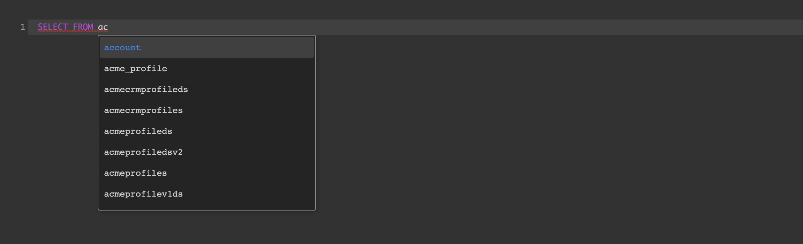
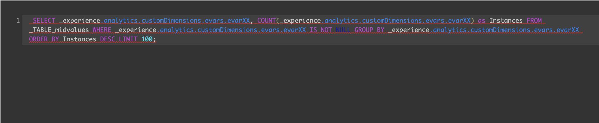
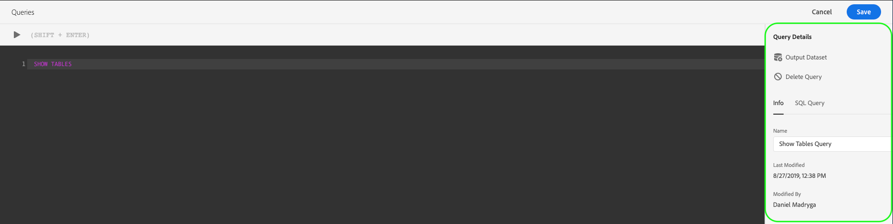

# 查询编辑器用户指南

查询编辑器是Adobe Experience Platform查询服务提供的交互式工具，它允许您在Experience Platform用户界面中为客户体验数据编写、验证和运行查询。 查询编辑器支持开发分析和数据的查询，并允许您运行交互式查询以用于开发目的，以及运行非交互式查询以填充Experience Platform集。

有关查询服务概念和功能的详细信息，请参阅查询 [服务概述][query-service-overview]。 要进一步了解如何在平台上导航查询服务用户界面，请参阅 [查询服务UI概述][query-service-ui]。

## 入门指南

查询编辑器通过连接到查询服务提供灵活的查询执行，并且查询仅在此连接处于活动状态时才会运行。

### 连接到查询服务

查询编辑器在打开时需要几秒钟时间来初始化并连接到查询服务。 控制台会告诉您何时连接，如下所示。 如果尝试在编辑器连接之前运行查询，则会延迟执行，直到连接完成。

### 如何从查询编辑器运行查询

从查询编辑器执行的查询以交互方式运行。 这意味着，如果您关闭浏览器或导航离开，查询将被取消。 对于从查询输出生成数据集的查询，也是如此。

## 查询创作(使用查询编辑器)

使用查询编辑器，您可以编写、执行和保存查询以获得客户体验数据。 在查询编辑器中执行或保存的所有查询对组织中有权访问查询服务的所有用户都可用。

### 访问查询编辑器

在Experience PlatformUI中，单击左 **侧导** 航菜单中的查询以打开查询服务工作区。 然后，单 **击屏幕右** 上方的“创建查询”以开始编写查询。 此链接可从查询服务工作区中的任意页面访问。

### 编写查询

查询编辑器的组织使编写查询尽可能简单。 下面的屏幕截图显示了编辑器在UI中的显示方式，并突 **出显示** “播放”按钮和SQL条目字段。

为最大限度地缩短开发时间，建议您开发具有返回行限制的查询。 例如：`SELECT fields FROM table WHERE conditions LIMIT number_of_rows`。验证查询生成预期输出后，请删除限制并运行查询以 `CREATE TABLE tablename AS SELECT` 生成包含输出的数据集。

### 在查询编辑器中编写工具

- **自动语法突出显示：** 使读取和组织SQL更简单。

- **SQL关键字自动完成：** 开始键入查询，然后使用箭头键导航到所需的词并按 **Enter**。

- **表和字段自动完成：** 开始键入要从的表名 `SELECT` 称，然后使用箭头键导航到要查找的表，然后按 **Enter**。 选择表后，自动完成将识别该表中的字段。

### 错误检测

查询编辑器在您编写查询时自动验证该数据，提供通用SQL验证和特定执行验证。 如果查询下方显示红色下划线（如下图所示），则表示查询内有错误。

检测到错误后，可以将鼠标悬停在SQL代码上，以视图特定的错误消息。

### 查询详细信息

在查询编辑器中查看查询时，“查询详 *细信息* ”面板提供用于管理选定查询的工具。

此面板允许您直接从UI中生成输出数据集，删除或命名显示的查询，并在SQL查询选项卡上以易于复制的格式视图 *SQL代码* 。 此面板还显示有用的元数据，如上次修改查询的时间以及修改者（如果适用）。 要生成数据集，请单击“ **输出数据集”**。 将显 *示“输出数据集* ”对话框。 输入名称和说明，然后单击“ **运行查询**”。 新数据集显示在平台上 *查询服* 务用户界面的“数据集”选项卡中。

### 保存查询

查询编辑器提供了一个保存功能，允许您保存查询并在以后处理它。 要保存查询，请 **单击** “查询编辑器”右上角的“保存”。 在保存查询之前，必须使用“查询详细信息”面板为查询提 *供名称* 。

### 如何查找以前的查询

从查询编辑器执行的所有查询都捕获在日志表中。 您可以使用“日志”选项卡中的 *搜索功* 能来查找查询执行。 保存的查询列在“浏 *览* ”选项卡中。

有关更 [多信息，请参阅查询][query-service-ui] 服务UI概述。

>[!NOTE]
>
>未执行的查询不会由日志保存。 要使查询在查询服务中可用，它必须在查询编辑器中运行或保存。

## 使用查询编辑器执行查询

要在查询编辑器中运行查询，可以在编辑器中输入SQL，或从“日志”或“浏览”选项卡 *加载**以前的查询,* 然后单击“ **播放**”。 查询执行状态显示在下面的 *控制台* 选项卡中，输出数据显示在结果 *选项卡中* 。

### 控制台

控制台提供有关查询服务的状态和操作的信息。 控制台显示与查询服务的连接状态、正在执行的查询操作以及这些查询产生的任何错误消息。

>[!NOTE]
>
>该控制台仅显示因执行查询而导致的错误。 在执行查询之前，它不显示查询验证错误。

### 查询结果

查询完成后，结果将显示在“结果”选 *项卡* (“控制台”选 *项卡旁* )。 此视图显示查询的表格输出，最多显示100行。 此视图允许您验证查询是否生成预期输出。 要使用查询生成数据集，请删除对返回行的限制，然后使用运行查询 `CREATE TABLE tablename AS SELECT` 生成带有输出的数据集。 有关如何 [在查询编辑器中][query-service-create-datasets] 从查询结果生成数据集的说明，请参阅生成数据集教程。

## 使用查询服务教程视频运行查询

以下视频演示如何在查询接口和PSQL客户端中运行Adobe Experience Platform。 此外，还演示了在XDM对象中使用单个属性、使用Adobe定义的函数以及使用CREATE TABLE AS SELECT(CTAS)。

>[!VIDEO](https://video.tv.adobe.com/v/29796?quality=12&learn=on)

## 后续步骤

现在，您已了解查询编辑器中提供哪些功能以及如何导航应用程序，您可以直接在平台中开始创作您自己的查询。 有关针对数据湖中的数据集运行SQL查询的详细信息，请参阅《运行查询 [指南》][query-service-running-queries]。 有关使用AdobeAnalytics和Adobe Target数据的示例SQL查询，请参阅示 [例查询参考][query-service-sample-queries]。

[query-service-overview]: ../home.md
[query-service-ui]: overview.md
[query-service-running-queries]: ../creating-queries/creating-queries.md
[query-service-sample-queries]: ../sample-queries/overview.md
[query-service-create-datasets]: ../creating-queries/create-datasets.md
