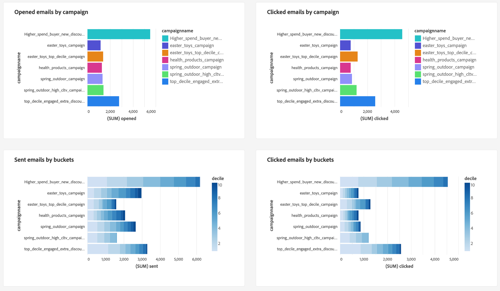

# 跟踪数据信号以生成客户存留期值

您可以使用Real-Time Customer Data Platform跟踪客户存留期值(CLV)，并通过用户定义的功能板可视化该指标。 通过使用Data Distiller和用户定义的功能板，您可以测量客户在您的整个关系中对您公司的价值。 了解CLV可以帮助您制定企业策略，在吸引新客户的同时保留现有客户并保持利润率。

以下信息图表描述了数据收集、操作、分析和操作的周期，可生成高性能数据以改进营销活动。

此端到端用例演示了如何捕获和修改数据信号以计算客户生命周期值派生的属性。 然后，可以将这些派生的数据集应用于您的Real-Time CDP配置文件数据，并可用于用户定义的功能板，以构建用于洞察分析的功能板。 通过Data Distiller，您可以扩展Real-Time CDP分析数据模型，并使用CLV派生的数据集和功能板分析来构建新受众，并将其激活到所需的目标。 然后，这些高性能受众可用于支持您的下一个营销活动。

本指南旨在通过测量推动CLV的关键接触点上的数据信号并在您的环境中实施类似用例，帮助您更好地了解您的客户体验。 下图概述了整个过程。

## 快速入门 {#getting-started}

本指南要求您实际了解Adobe Experience Platform的以下组件：

* [查询服务](../home.md)：提供用户界面和RESTful API，您可以在其中使用SQL查询分析和扩充数据。
* [分段服务](../../segmentation/home.md)：允许您根据实时客户个人资料数据生成受众。

## 先决条件

本指南要求您将[Data Distiller](../data-distiller/overview.md) SKU作为包产品的一部分。 如果您不确定您是否拥有此服务，请咨询您的Adobe服务代表。

## 创建派生的数据集 {#create-derived-dataset}

建立CLV的第一步是根据从用户操作捕获的数据信号创建派生的数据集。 此特定用例在关于航空忠诚度计划的单独文档中捕获。 请参阅指南，了解如何[使用查询服务创建基于十分位数的派生数据集以用于您的配置文件数据](./deciles-use-case.md)。 文档中提供了完整的示例和解释，其中说明了以下步骤：

* 创建架构以允许进行十分位数分段。
* 使用查询服务创建小数。
* 生成十进制数据集。
* 启用架构以便在Real-time Customer Profile中使用。
* 创建身份命名空间并将其标记为主要标识符。
* 创建查询以计算回顾期间的十分位数。

## 扩展分析数据模型和计划更新 {#extend-data-model-and-set-refresh-schedule}

接下来，您必须构建自定义数据模型或扩展现有Adobe Real-Time CDP数据模型以与CLV报表分析交互。 请参阅文档，了解如何通过Query Service [构建报告见解数据模型，以便与加速存储数据和用户定义的功能板](../data-distiller/sql-insights/reporting-insights-data-model.md#build-a-reporting-insights-data-model)一起使用。 本教程涵盖以下步骤：

* 使用Data Distiller创建用于报表分析的模型。
* 创建表、关系和填充数据。
* 查询报表分析数据模型。
* 使用Real-Time CDP分析数据模型扩展您的数据模型。
* 创建维度表以扩展您的报表分析模型。
* 查询您的扩展加速商店报告见解数据模型

请参阅Real-Time Customer Data Platform分析数据模型文档，了解如何[自定义您的SQL查询模板，以便为您的营销和关键绩效指标(KPI)用例创建Real-Time CDP报告](../../dashboards/data-models/cdp-insights-data-model-b2c.md)。

确保设置定期刷新自定义数据模型的计划。 这可确保根据需要将数据作为摄取管道的一部分返回，并填充用户定义的仪表板。 请参阅[计划查询指南](../ui/query-schedules.md#create-schedule)，了解如何设置计划。

## 构建用于捕获见解的功能板 {#build-a-custom-dashboard}

现在您已经创建了自定义数据模型，接下来可以使用自定义查询和用户定义的仪表板可视化您的数据。 有关如何[构建自定义仪表板](../../dashboards/standard-dashboards.md)的完整指导，请参阅用户定义的仪表板概述。 UI指南包括以下方面的详细信息：

* 如何创建构件。
* 如何使用构件编辑器。

下面显示了使用十进制存储桶的自定义CLV构件示例。

## 创建和激活高性能受众 {#create-and-activate-audiences}

下一步是构建区段定义，并根据实时客户档案数据生成受众。 请参阅区段生成器UI指南，了解如何[在Experience Platform](../../segmentation/ui/segment-builder.md)中创建和激活受众。 该指南提供了有关如何完成以下操作的部分：

* 将属性、事件和现有受众的组合用作构建块来创建区段定义。
* 使用规则生成器画布和容器可控制分段规则的执行顺序。
* 查看潜在受众的估计值，允许您根据需要调整区段定义。
* 为计划分段启用所有区段定义。
* 为流式分段启用指定的区段定义。

此外，还有一个[区段生成器视频教程](https://experienceleague.adobe.com/docs/platform-learn/tutorials/audiences/create-segments.html?lang=zh-Hans)可用于了解更多信息。

## 为电子邮件营销活动激活受众 {#activate-audience-for-campaign}

构建受众后，便可以将其激活到目标。 Experience Platform支持各种电子邮件服务提供商(ESP)，使您能够管理电子邮件营销活动，如发送促销电子邮件营销活动。

查看[电子邮件营销目标概述](../../destinations/catalog/email-marketing/overview.md#connect-destination)，以查看要将数据导出到的受支持目标的列表(例如[Oracle Eloqua](../../destinations/catalog/email-marketing/oracle-eloqua-api.md)页面)。

## 查看从营销活动返回的分析数据 {#post-campaign-data-analysis}

现在可以将[源中的数据增量处理](../key-concepts/incremental-load.md)，作为对加速数据存储中数据模型的计划刷新的一部分。 客户的任何响应事件都可以在发生时或批量摄取到Adobe Experience Platform中。 您的数据模型可能会刷新一次，或每天刷新多次，具体取决于您的设置或源连接器。 有关详细信息，请参阅[批量摄取API概述](../../ingestion/batch-ingestion/api-overview.md)或[流式摄取概述](../../ingestion/streaming-ingestion/overview.md)。

数据模型更新后，您的自定义仪表板小组件会提供有意义的信号，以便您衡量和可视化客户存留期值。

为您的自定义分析提供了各种可视化图表选项。

这些见解进而可以帮助您为后续活动制定业务策略。

## 后续步骤

通过阅读本文档，您应该更好地了解如何使用Real-Time Customer Data Platform跟踪和可视化客户存留期值(CLV)指标。 要了解有关通过查询服务和Experience Platform提供的许多业务用例的更多信息，建议您阅读以下文档：

* [一个关于已放弃的浏览用例的端到端示例，该示例演示了查询服务的通用性和好处。](./abandoned-browse.md)
* [如何使用查询服务和机器学习从真正的在线网站访客流量中确定并过滤机器人活动](./bot-filtering.md)
* [如何对Experience Platform数据执行匹配，该匹配方式通过大致匹配所选字符串来组合来自多个数据集的结果。](./fuzzy-match.md)

<!-- "Data signals are actions taken by consumers while online that offer clues about intent that can be acted upon. This includes anything from visiting a website to filling out a change of address or clicking an ad."  -->

<!-- "Customer touchpoints are your brand's points of customer contact, from start to finish." -->
