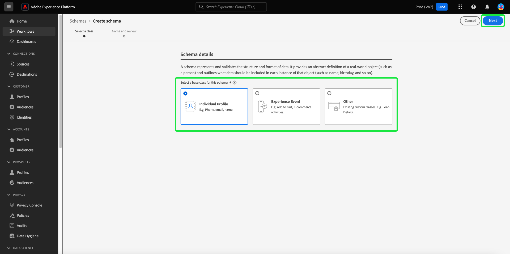

# Adobe Experience Platform 发行说明

**发行日期： 2023年9月28日**

Adobe Experience Platform 的新功能：

- [计算属性](#computed-attributes)

Experience Platform 中现有功能的更新：

- [警报](#alerts)
- [仪表板](#dashboards)
- [数据收集](#data-collection)
- [数据治理](#data-governance)
- [数据卫生](#hygiene)
- [目标](#destinations)
- [Experience Data Model (XDM)](#xdm)
- [身份标识服务](#identity-service)
- [查询服务](#query-service)
- [Segmentation Service](#segmentation)
- [源](#sources)

## 计算属性 {#computed-attributes}

计算属性启用通过直观UI将事件数据轻松总结为配置文件属性的功能，以增强基于行为的分段、个性化和激活。 借助此功能，您可以以自助方式创建计算属性，管理这些属性，并在分段、Real-Time CDP目标或Adobe Journey Optimizer中使用这些属性。 此外，计算属性可简化分段和历程工作流，以帮助您无缝地提供相关体验。 若要了解有关计算属性的更多信息，请阅读[计算属性概述](../../profile/computed-attributes/overview.md)。

## 警报 {#alerts}

通过Experience Platform，您可以为各种Experience Platform活动订阅基于事件的警报。 您可以通过Experience Platform用户界面中的[!UICONTROL 警报]选项卡订阅不同的警报规则，还可以选择在UI中或通过电子邮件通知接收警报消息。

**新增功能或更新后的功能**

| 功能 | 描述 |
| --- | --- |
| 警报历史记录选项卡 | 警报[!UICONTROL 历史记录]选项卡现在将包含所有事件，包括延迟、开始、成功和失败。 有关“历史记录”选项卡的详细信息，请阅读[警报UI文档](../../observability/alerts/ui.md)。 |

{style="table-layout:auto"}

若要了解有关警报的更多信息，请阅读[[!DNL Observability Insights] 概述](../../observability/home.md)。

## 仪表板 {#dashboards}

Adobe Experience Platform提供了多个[!DNL dashboards]，您可以通过它们查看有关您组织的数据的重要信息，如在每日快照期间捕获的数据。

| 功能 | 描述 |
| --- | --- |
| [许可证使用情况仪表板改进](../../dashboards/guides/license-usage.md) | 通过改进的有关您组织许可证使用的报告和关键量度可视化图表，维护对您的许可证协议的控制。 这些改进功能可让您针对已购买的所有Experience Platform产品的许可证使用量度实现高度精细化。 |

{style="table-layout:auto"}

若要了解有关许可证使用情况仪表板的详细信息，请参阅[许可证使用情况仪表板概述](../../dashboards/guides/destinations.md)。

## 数据收集 {#data-collection}

Adobe Experience Platform 提供一套技术，通过这些技术，可收集客户端客户体验数据，并将它发送到 Adobe Experience Platform Edge Network，从中可充实、转换数据和将数据分发到 Adobe 或非 Adobe 目标。

**新增功能或更新后的功能**

| 类型 | 功能 | 描述 |
| --- | --- | --- |
| 数据流 | 设备查找支持 | 在配置数据流时，您现在可以选择要收集的设备查找信息的级别。 设备查找信息包括有关用于与页面交互的设备、硬件、操作系统和浏览器的数据。  设备查找信息无法与用户代理和客户端提示一起收集。 选择收集设备信息将禁用用户代理和客户端提示的收集，反之亦然。 所有设备查找信息都存储在`xdm:device`字段组中。 从有关[配置数据流](../../datastreams/configure.md#geolocation-device-lookup)的文档了解详情。 |
| 扩展 | [!DNL TikTok] Web事件API扩展 | [[!DNL TikTok] Web事件API](https://exchange.adobe.com/apps/ec/109834/tiktok-web-events-api)扩展允许您利用Adobe Experience Platform Edge Network中捕获的数据，并使用[!DNL TikTok] Web事件API以服务器端事件的形式将其发送到[!DNL TikTok]。 |

{style="table-layout:auto"}

要详细了解数据收集，请阅读[数据收集概述](../../tags/home.md)。

## 数据治理 {#data-governance}

Adobe Experience Platform 数据治理是一系列策略和技术，用于管理客户数据并确保遵守适用于数据使用的法规、限制和政策。它在 Experience Platform 的各个层面中发挥着关键作用，包括编目、数据谱系、数据使用标记、数据访问策略和营销操作数据访问控制。

**新增功能**

| 功能 | 描述 |
| --- | --- |
| 适用于第三方数据的新合作伙伴生态系统标签 | 提供了用于第三方扩充和发现潜在客户的新数据使用标签。 有关详细信息，请参阅有关合作伙伴生态系统标签[&#128279;](../../data-governance/labels/reference.md#partner)的文档。 |

{style="table-layout:auto"}

要详细了解数据治理，请阅读[数据治理概述](../../data-governance/home.md)。

## 数据卫生 {#hygiene}

Experience Platform提供了一套数据卫生功能，允许您通过以编程方式删除消费者记录和数据集来管理存储的数据。 通过使用UI中的[!UICONTROL 数据生命周期]工作区，或通过调用数据卫生API，您可以有效地管理数据存储。 使用这些功能可确保信息按预期使用、在需要修复不正确的数据时进行更新以及在组织政策认为必要时进行删除。

**新增功能**

| 功能 | 描述 |
| --- | --- |
| [!BADGE Beta]{type=Informative}记录删除（限量发布） | 使用Adobe Experience Platform中的高级数据生命周期管理功能跨所有数据存储管理您的数据生命周期，以满足客户承诺和许可协议要求：自动数据集到期和记录删除。 通过自动数据集过期，您可以删除整个数据集，并设置要删除数据集的日期和时间。通过 记录删除，您可以通过定向个别消费者个人资料的主要身份来删除其个人资料。 您可以通过UI或CSV/JSON文件上传分别提供主身份。 有关详细信息，请参阅[记录删除文档](../../hygiene/ui/record-delete.md) |
| 数据集有效期限 | 通过自动数据集过期，最大程度地减少您的数据并控制您的许可协议。 通过删除整个数据集并设置要删除数据集的日期和时间来减少数据量。 有关详细信息，请参阅[数据集过期文档](../../hygiene/ui/dataset-expiration.md)。 |

{style="table-layout:auto"}

有关Experience Platform数据卫生功能的详细信息，请参阅[数据卫生概述](../../hygiene/home.md)。

## 目标 {#destinations}

[!DNL Destinations] 是预先构建的与目标平台的集成，可实现从 Adobe Experience Platform 无缝激活数据。您可以使用目标激活已知和未知的数据，用于跨渠道营销活动、电子邮件宣传、定向广告和许多其他用例。

**新增或更新目标**{#new-updated-destinations}

| 目标 | 新增还是更新 | 描述 |
| ----------- |----------------|----------- |
| [[!DNL LiveRamp - Distribution]](../../destinations/catalog/advertising/liveramp-distribution.md) | 新增 | 将之前载入[!DNL LiveRamp]的受众激活到移动设备、Web、显示和连接的电视媒体中的高级发布者。  通过[LiveRamp — 入门](../../destinations/catalog/advertising/liveramp-onboarding.md)连接将受众加入您的[!DNL LiveRamp]帐户后，使用新的[[!DNL LiveRamp - Distribution]](../../destinations/catalog/advertising/liveramp-distribution.md)连接将受众激活到下游目标。 |
| [[!DNL HubSpot]](../../destinations/catalog/crm/hubspot.md) | 新增 | [[!DNL HubSpot]](https://www.hubspot.com)是一个CRM平台，其中包含连接营销、销售、内容管理和客户服务所需的所有软件、集成和资源。 它允许您在一个CRM平台上连接数据、团队和客户。 |
| [[!DNL Microsoft Dynamics 365]](../../destinations/catalog/crm/microsoft-dynamics-365.md) | 更新 | 为自定义字段添加了[!DNL Dynamics 365]自定义字段前缀支持，这些前缀未在[!DNL Dynamics 365]的默认解决方案中创建。 已在[填写目标详细信息](#destination-details)步骤中添加了新的输入字段&#x200B;**[!UICONTROL 自定义前缀]**。 |
| [[!DNL Experience Cloud Audiences]](../../destinations/catalog/adobe/experience-cloud-audiences.md) | 更新 | Experience Cloud受众目标现已正式可用。 使用此目标可将受众从Real-Time CDP激活到Audience Manager和Adobe Analytics。 您需要Audience Manager许可证才能将受众发送到Adobe Analytics。 |

{style="table-layout:auto"}

<!-- 

Add these to release notes as they go out

| [[!DNL Qualtrics]] | New | Use the aggregation of multiple sources of operational data in Adobe Experience Platform as an input in Qualtrics Experience ID to better understand your customers and enable targeted outreach to close the gap when it comes to understanding intent, emotion and experience drivers. | 

-->

**新增或更新的功能**{#destinations-new-updated-functionality}

| 功能 | 描述 |
| ----------- | ----------- |
| Real-Time CDP中的数据导出 | [数据集导出](../../destinations/ui/export-datasets.md)功能现已正式可用。 查看可根据您购买的Experience Platform应用程序[&#128279;](../../destinations/ui/export-datasets.md#datasets-to-export)导出哪些数据集，并查看用于导出数据集的[护栏](/help/destinations/guardrails.md#dataset-exports)。 |
| (Beta)支持导出数组类型的对象 | 将原始值（字符串、int或布尔值）的数组作为平面架构文件导出到云存储目标。 有关[文档](../../destinations/ui/export-arrays-maps-objects.md)中功能的更多信息。 |
| Destination SDK中的动态下拉列表选择器 | 通过Destination SDK创建目标时，您现在可以使用[动态下拉选择器](../../destinations/destination-sdk/functionality/destination-configuration/customer-data-fields.md#dynamic-dropdown-selectors)使用从API检索的值填充下拉选择器的字段。 |

**修复和增强** {#destinations-fixes-and-enhancements}

- 利用数据流运行级别的企业目标([HTTP API](../../destinations/catalog/streaming/http-destination.md)、[Amazon Kinesis](../../destinations/catalog/cloud-storage/amazon-kinesis.md)和[Azure事件中心](../../destinations/catalog/cloud-storage/azure-event-hubs.md))现在提供的[监视透明度](../../dataflows/ui/monitor-destinations.md#dataflow-runs-for-streaming-destinations)，在[数据流详细信息视图](../../dataflows/ui/monitor-destinations.md#dataflow-run-details-page)中监视激活指标和状态，并通过错误代码和消息提供更多信息，以进行疑难解答。
- 当您更新映射到[Google广告管理器](../../destinations/catalog/advertising/google-ad-manager.md)、[Google显示和视频360](../../destinations/catalog/advertising/google-dv360.md)以及使用[受众更新模板](../../destinations/destination-sdk/metadata-api/update-audience-template.md)的其他目标的受众名称时，这些名称更改现在会反映到目标的下游位置。

有关目标的更多一般信息，请参阅[目标概述](../../destinations/home.md)。

## Experience Data Model (XDM) {#xdm}

XDM 是一种开源规范，可为导入 Adobe Experience Platform 的数据提供通用结构和定义（架构）。通过遵守 XDM 标准，所有客户体验数据都可以合并到一个通用的呈现中，以更快、更加集成的方式提供见解。您可以从客户行为中获得有价值的见解，通过区段定义客户受众，并使用客户属性实现个性化目的。

**新增功能**

| 功能 | 描述 |
| --- | --- |
| 已将快速操作添加到架构编辑器 | 新的快速操作已添加到架构编辑器的画布中。 您现在可以直接从编辑器中复制JSON结构或删除架构。 {width="100" zoomable="yes"} |
| 按自定义或标准创建者筛选XDM资源 | 可用架构、字段组、数据类型和类的列表现在会根据其创建方法进行预筛选。 这允许您根据资源是自定义的还是由Adobe创建的来筛选资源。 {width="100" zoomable="yes"}  有关详细信息，请参阅[创建和编辑资源文档](../../xdm/ui/resources/classes.md#filter.md)。 |

**更新的功能**

| 功能 | 描述 |
| --- | --- |
| 更新了架构创建工作流 | 已实施新的模式创建工作流以简化该流程。  {width="100" zoomable="yes"}  有关详细信息，请参阅[架构创建文档](../../xdm/ui/resources/schemas.md#create)。 |

**新的 XDM 组件**

| 组件类型 | 名称 | 描述 |
| --- | --- | --- |
| 数据类型 | [[!UICONTROL 返回]](https://github.com/adobe/xdm/pull/1773/files) | RMA（退货授权）已签发。 |
| 数据类型 | [[!UICONTROL 返回项]](https://github.com/adobe/xdm/pull/1773/files) | RMA（退货授权）中退回的项目信息。 |

{style="table-layout:auto"}

**更新的 XDM 组件**

| 组件类型 | 名称 | 更新描述 |
| --- | --- | --- |
| 扩展 | [!UICONTROL AJO实体字段] | 已将多变体[&#128279;](https://github.com/adobe/xdm/pull/1774/files)的标志添加到[!UICONTROL AJO实体字段]，以标识该变体是否为多变体。 |
| 数据类型 | [!UICONTROL 产品列表项] | 已添加[[!UICONTROL 退货项]](https://github.com/adobe/xdm/pull/1773/files)以包含退货商品授权信息。 |
| 数据类型 | 订单 | 已添加[[!UICONTROL 退货信息]](https://github.com/adobe/xdm/pull/1773/files)以包含颁发的RMA（退货商品授权）。 |

{style="table-layout:auto"}

有关Experience Platform中XDM的更多信息，请参阅[XDM系统概述](../../xdm/home.md)

## 身份标识服务 {#identity-service}

Adobe Experience Platform 身份标识服务通过跨设备和系统桥接身份标识，使您能够全面了解您的客户及其行为，助您实时提供有影响力的个人数字体验。

**新增功能或更新后的功能**

| 功能 | 描述 |
| --- | --- |
| Identity Service UI增强功能 | 使用Experience Platform UI中改进的自定义命名空间创建工具，更好地管理自定义命名空间及其相应的身份类型。 增强的Identity Service UI为您提供： <ul><li>上下文体验：视觉提示、清晰度，以及身份命名空间和身份类型的上下文。</li><li>准确性：更好地处理错误，不再有重复的标识名称。</li><li>可发现性：可在产品内对话框中访问文档。</li></ul> 有关详细信息，请阅读[创建自定义命名空间](../../identity-service/features/namespaces.md#create-namespaces)的指南。 |
| 身份标识图形限制的更改 | 标识图限制已从150个标识更改为50个标识。 将新身份摄取到完整图形中时，将删除基于摄取时间戳和身份类型的最旧身份。 Cookie标识类型按优先顺序删除。 Adobe如果您的生产沙盒包含： <ul><li>自定义命名空间，其中人员身份标识符（例如 CRM ID）会被配置为 cookie/设备身份标识类型。</li><li>自定义命名空间，其中 cookie/设备身份标识符会被配置为跨设备身份标识类型。</li></ul> Adobe 工程人员会手动处理这些请求。有关详细信息，请阅读[Identity Service数据的护栏](../../identity-service/guardrails.md)以及有关[数据管理许可证权利最佳实践](../../landing/license-usage-and-guardrails/data-management-best-practices.md)的指南。 |

{style="table-layout:auto"}

要了解有关身份标识服务的更多信息，请阅读[身份标识服务概述](../../identity-service/home.md)。

## 查询服务 {#query-service}

查询服务允许您使用标准 SQL 查询 Adobe Experience Platform [!DNL Data Lake] 中的数据。您可以加入来自 [!DNL Data Lake] 的任何任何数据集，并将查询结果捕获为新数据集，以用于报告、Data Science Workspace，或将数据摄取到实时客户轮廓。

**更新的功能**

| 功能 | 描述 |
| --- | --- |
| 日志筛选UI更新 | 改进的查询日志过滤改进了用户生成的用于监控、管理和故障排除的日志的可见性。 您可以根据各种设置筛选查询日志列表。  {width="100" zoomable="yes"}  有关详细信息，请参阅[查询日志文档](../../query-service/ui/query-logs.md#filter-logs)。 |
| 多个查询编辑器UI更新 | 现在，您可以在查询编辑器中执行多个顺序查询，或者编写多个查询并按顺序执行所有查询。 要增加查询执行的灵活性，您可以突出显示所选查询，并选择该特定查询独立于其他查询运行。 有关详细信息，请参阅[查询编辑器UI指南](../../query-service/ui/user-guide.md#execute-multiple-sequential-queries)。 |

{style="table-layout:auto"}

有关查询服务的详细信息，请参阅[查询服务概述](../../query-service/home.md)。

## Segmentation Service {#segmentation}

[!DNL Segmentation Service] 允许您对存储在 [!DNL Experience Platform] 中的与个人（例如客户、潜在客户、用户或组织）相关的数据划分到受众区段中。您可以通过区段定义或其他源从 [!DNL Real-Time Customer Profile] 数据创建受众。这些受众在 [!DNL Experience Platform] 上集中配置和维护，并且可以通过任何 Adobe 解决方案轻松访问。

**新增功能或更新后的功能**

| 功能 | 描述 |
| ------- | ----------- |
| 可自定义的列 | 您现在可以使用可缩放的列来自定义受众门户的布局。 有关此功能的详细信息，请阅读[受众门户概述](../../segmentation/ui/audience-portal.md#customize)。 |
| 更新频率细分 | 您现在可以查看组织中受众更新频率的细分。 有关此功能的详细信息，请参阅[分段UI指南](../../segmentation/ui/overview.md#browse)。 |

若要了解有关分段服务的更多信息，请阅读[分段服务概述](../../segmentation/home.md)。

## 源 {#sources}

Experience Platform 提供 RESTful API 和交互式 UI，可让您轻松为各种数据提供者设置源连接。这些源连接允许您验证并连接到外部存储系统和 CRM 服务、设置运行摄取操作的时间以及管理数据摄取吞吐量。

**新增功能或更新后的功能**

| 功能 | 描述 |
| --- | --- |
| 自助源(批处理SDK)中`offset`分页的新参数 | 使用`offset`分页时，您现在可以为源指定`endConditionName`和`endConditionValue`。 利用这些参数，可指示将在下一个HTTP请求中结束分页循环的条件。 有关详细信息，请参阅[自助源(批处理SDK)的分页指南](../../sources/sources-sdk/config/sourcespec.md#pagination)。 |

{style="table-layout:auto"}

若要了解有关源的更多信息，请阅读[源概述](../../sources/home.md)。
